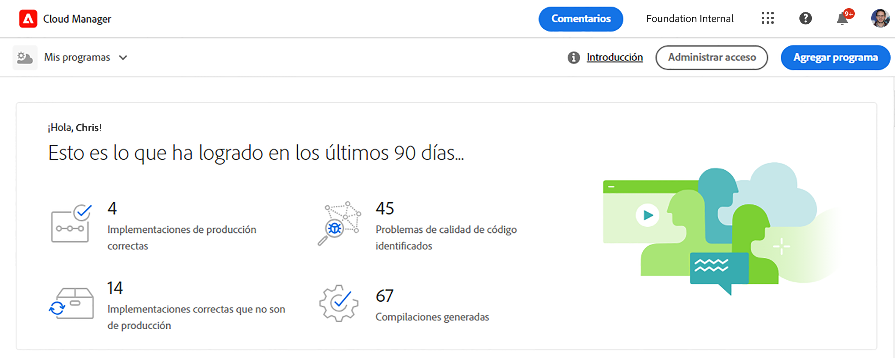
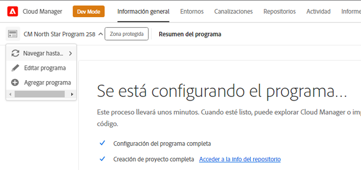

# Creación de programas de zona protegida {#create-sandbox-program}

Un programa de zona protegida suele crearse para servir a los fines de formación, ejecución de demostraciones, habilitación, POC o documentación, y no está diseñado para transportar tráfico en directo.

Obtenga más información sobre los tipos de programas en el documento [Explicación de los programas y sus tipos.](program-types.md)

## Creación de un programa de zona protegida {#create}

1. Inicie sesión en Cloud Manager en [my.cloudmanager.adobe.com](https://my.cloudmanager.adobe.com/) y seleccione la organización adecuada.

1. En la página de aterrizaje de Cloud Manager, cerca de la esquina superior derecha de la pantalla, haga clic en **Agregar programa**.

   

1. En el asistente Crear programa, seleccione **Configuración de una zona protegida** y proporcione un nombre de programa.

   

1. Si lo desea, puede agregar una imagen al programa arrastrando y soltando un archivo de imagen en el destino **Agregar una imagen de programa** o haciendo clic en él para seleccionar una imagen de un explorador de archivos. Haga clic o pulse **Continuar**.

   * La imagen solo sirve como mosaico en la ventana de información general del programa y ayuda a identificar el programa.

1. En el **Configurar la zona protegida** , elija qué soluciones desea habilitar en el programa de zona protegida marcando las opciones en la **Soluciones y complementos** tabla.

   * Utilice las comillas angulares junto a los nombres de las soluciones para poder ver complementos opcionales adicionales para las soluciones.

   * El **Sites** y **Assets** las soluciones de siempre se incluyen en los programas de zonas protegidas y no se pueden anular.

   

1. Una vez seleccionadas las soluciones y los complementos para su programa de zona protegida, haga clic en **Crear**.

Verá una nueva tarjeta de programa de zona protegida en la página de aterrizaje con un indicador de estado a medida que avance el proceso de configuración.

## Acceso a zona protegida {#access}

Puede ver los detalles de la configuración de la zona protegida y acceder al entorno (una vez disponible) en la página de información general del programa.

1. En la página de aterrizaje de Cloud Manager, haga clic en el botón de puntos suspensivos del programa recién creado.

   

1. Una vez completado el paso de creación del proyecto, puede acceder a las **Acceder a info del repositorio** para poder usar su repositorio de Git.

   

   >[!TIP]
   >
   >Para obtener más información sobre el acceso y la administración del repositorio de Git, consulte [Acceso a Git](/help/implementing/cloud-manager/managing-code/accessing-repos.md).

1. Una vez creado el entorno de desarrollo, puede usar el vínculo **Acceso a AEM** para iniciar sesión en AEM.

   

1. Una vez completada la implementación de la canalización de no producción en el desarrollo, el asistente le guía para acceder al entorno de desarrollo de AEM o para implementar código en el entorno de desarrollo.

   

Si debe cambiar a otro programa o volver a la página de información general para crear otro programa, haga clic en el nombre del programa en la parte superior izquierda de la pantalla para mostrar el **Vaya a** opción.

