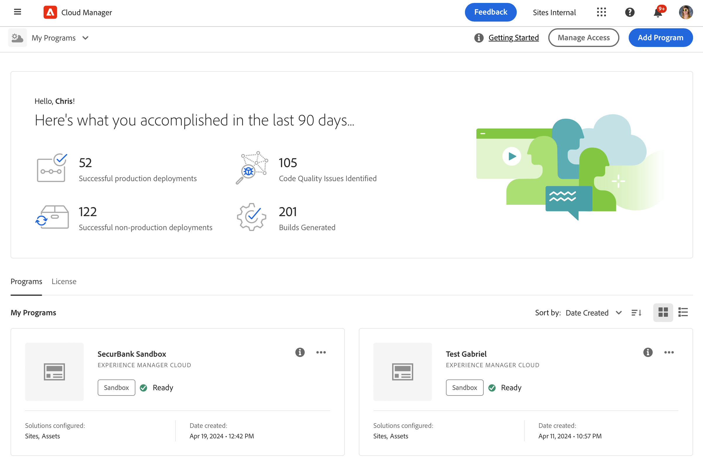
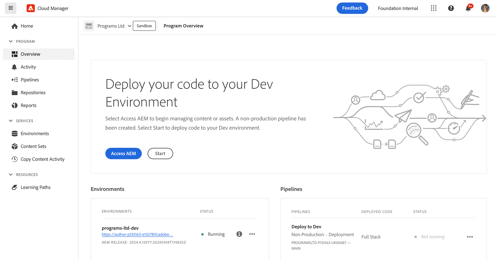

# Crear programas de zona protegida {#create-sandbox-program}

Un programa de zona protegida suele crearse para servir a los fines de formación, ejecución de demostraciones, habilitación, POC o documentación, y no está diseñado para transportar tráfico en directo. Consulte [Introducción a los programas de zonas protegidas](/help/implementing/cloud-manager/getting-access-to-aem-in-cloud/introduction-sandbox-programs.md).

Obtenga más información acerca de los tipos de programas en el documento [Explicación de los tipos de programas y programas](program-types.md).

## Creación de un programa de zona protegida {#create}

1. Inicie sesión en Cloud Manager en [my.cloudmanager.adobe.com](https://my.cloudmanager.adobe.com/) y seleccione la organización adecuada.

1. En la consola **[Mis programas](/help/implementing/cloud-manager/navigation.md#my-programs)**, cerca de la esquina superior derecha, haga clic en **Agregar programa**.

   

1. En el asistente *Vamos a crear su programa*, en el campo de texto **Nombre del programa**, escriba el nombre que desee para el programa.

1. En **Objetivo del programa**, seleccione  **Configurar una zona protegida**.

   

1. (Opcional) En la esquina inferior derecha del cuadro de diálogo del asistente, realice una de las siguientes acciones:

   * Arrastre y suelte un archivo de imagen en el  **Agregue un destino de imagen de programa**.
   * Haga clic en  **Agregar una imagen de programa** y, a continuación, seleccione una imagen de un explorador de archivos.
   * Haga clic en  para eliminar una imagen que haya agregado.

1. Haga clic en **Continuar**.

1. En el cuadro de lista **Soluciones y complementos**, seleccione una o varias soluciones para incluirlas en el programa.

   * Haga clic en las comillas angulares a la izquierda del nombre de una solución para mostrar los complementos opcionales disponibles que desee incluir en una solución seleccionada.
   * Las soluciones **Sites**, **Assets** y **Edge Delivery Services** siempre están seleccionadas de forma predeterminada al crear un programa de zona protegida. No puede anular su selección.

   

1. Haga clic en **Crear**. Cloud Manager crea el programa de zona protegida y lo muestra en la página de aterrizaje para su selección.

## Acceso a zona protegida {#access}

Una vez que se haya terminado de crear un nuevo programa de zona protegida, puede ver los detalles de su configuración de zona protegida y acceder al entorno en la página de información general del programa.

1. En la página de aterrizaje de Cloud Manager, en el programa de espacio aislado, haga clic en  en el programa de espacio aislado creado.

   

1. Cuando finalice el paso de creación del proyecto, puede hacer clic en el vínculo **Acceder a la info del repositorio** para poder usar su repositorio de Git.

   

   >[!TIP]
   >
   >Para obtener más información sobre cómo acceder y administrar su repositorio Git, consulte [Acceder a Git](/help/implementing/cloud-manager/managing-code/accessing-repos.md).

1. Una vez creado el entorno de desarrollo, puede hacer clic en **Acceder a AEM** e iniciar sesión en AEM.

   

1. Cuando se completa la implementación de la canalización que no es de producción en el desarrollo, el asistente de call-to-action le guía para acceder al entorno de desarrollo de AEM o para implementar código en el entorno de desarrollo.

   

>[!TIP]
>
>Consulte [Navegación por la interfaz de usuario de Cloud Manager](/help/implementing/cloud-manager/navigation.md) para obtener más información sobre cómo navegar por Cloud Manager y comprender la consola **Mis programas**.
