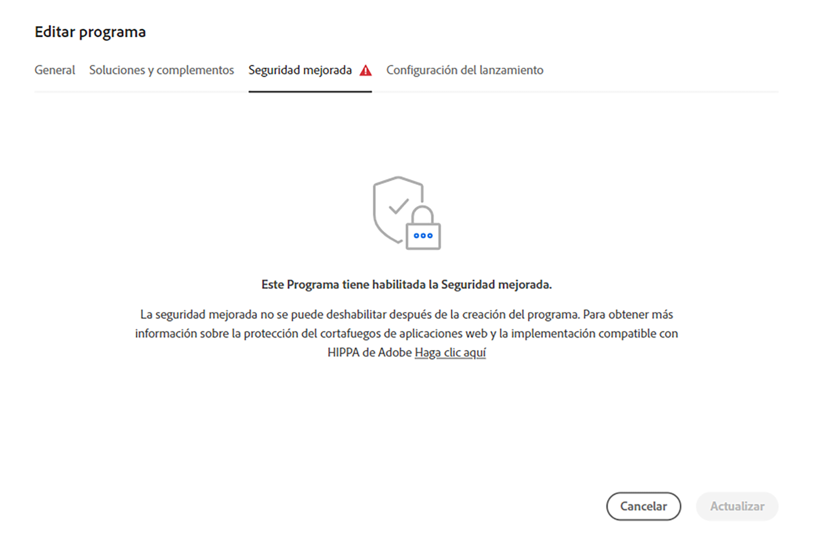

# Editar programas {#editing-programs}

Los usuarios con los permisos necesarios pueden editar [programas de producción,](creating-production-programs.md) así como [programas de zonas protegidas creados en su organización.](creating-sandbox-programs.md) Al editar un programa puede hacer lo siguiente:

* Agregar la solución Sites a un programa existente con Assets y viceversa.
* Eliminar Sites o Assets de un programa existente que incluya ambos.
* Agregar un segundo derecho de solución no utilizado a un programa existente o como nuevo programa.
* Eliminar programas de zona protegida.

## Permisos {#permissions}

Debe ser miembro del rol de **Propietario del negocio** para editar programas o eliminar programas de zona protegida.

## Edición de un programa {#editing}

Siga estos pasos para editar un programa.

1. Inicie sesión en Cloud Manager en [my.cloudmanager.adobe.com](https://my.cloudmanager.adobe.com/) y seleccione la organización adecuada.

1. Haga clic en el programa que desea editar para mostrar sus detalles.

1. Haga clic en el nombre del programa en la parte superior izquierda de la página y seleccione **Editar programa**.

   

1. Se abrirá la página **Editar programa**. En la pestaña **General**, edite el nombre y la descripción del programa.

   * Debe seleccionar al menos una solución para un programa.

   

1. En la pestaña **Soluciones y complementos**, modifique las soluciones para el programa.

   

1. Haga clic en el elemento adicional antes de los nombres de las soluciones para mostrar complementos opcionales, como seleccionar la opción de complemento **Comercio** en **Sites**.

   

1. En la pestaña **Configuración de Go live**, modifique la fecha de go-live planeada para el programa.

   

   * Esta fecha es solo para uso informativo y activa el widget Go Live en la página de descripción general del programa para proporcionar vínculos internos del producto a la documentación de prácticas recomendadas de AEM as a Cloud Service de forma oportuna para que se ajuste a su recorrido y que culmine en una experiencia Go Live correcta y sin problemas.

1. Haga clic en **Actualizar** para guardar los cambios en el programa.

Cada vez que se edita un programa, incluida la adición o eliminación de una solución o complemento, esos cambios surtirán efecto después de la siguiente implementación.

Si el programa de producción tiene habilitada la seguridad mejorada, aparece la pestaña adicional **Seguridad mejorada** en la ventana **Editar programa** para confirmar que la funcionalidad está activa para el programa.

Esta configuración no se puede modificar una vez creado el programa. Para obtener más información acerca de la opción de seguridad mejorada, consulte el documento [Creación de programas de producción](creating-production-programs.md).

## Eliminar programas de zona protegida {#delete-sandbox-program}

Al eliminar un programa de zona protegida se eliminarán todos los entornos y canalizaciones asociados a él.

>[!TIP]
>
>Los usuarios con el rol de **Propietario del negocio** o **Administrador de implementación** pueden eliminar sus entornos de producción y ensayo en lugar de todo el programa de zona protegida.

Siga estos pasos para eliminar un programa de zona protegida.

1. Inicie sesión en Cloud Manager en [my.cloudmanager.adobe.com](https://my.cloudmanager.adobe.com/) y seleccione la organización adecuada.

1. Haga clic en el programa que desea editar para mostrar sus detalles.

1. Haga clic en el nombre del programa en la parte superior izquierda de la página y seleccione **Eliminar programa**.

   

También puede hacer clic en el botón de los tres puntos de la tarjeta del programa desde la página de información general de Cloud Manager y seleccionar **Eliminar programa**.

>[!NOTE]
>
>Solo se pueden eliminar programas de zona protegida. Los programas de producción no se pueden eliminar.
