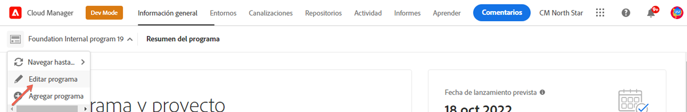
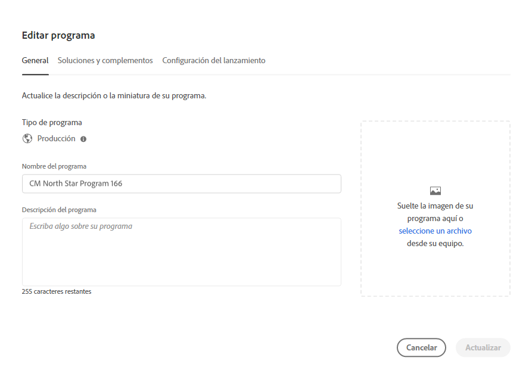
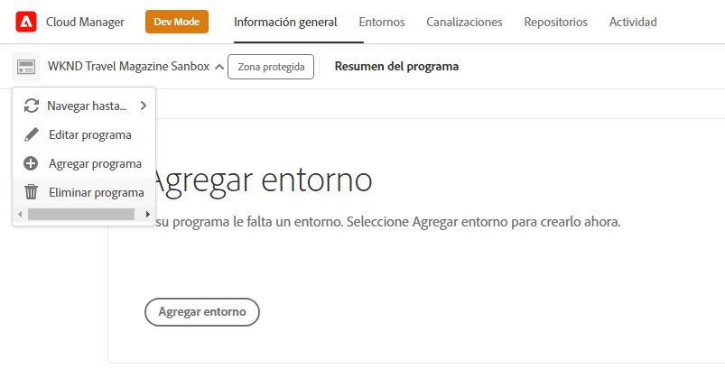
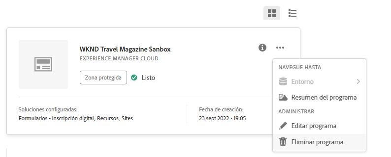

# Editar programas {#editing-programs}

Para administrar y editar programas, empieza en la consola [**Mis programas**](/help/implementing/cloud-manager/navigation.md). La página **Mis programas** proporciona una descripción general de todos los programas a los que tiene acceso. Al seleccionar un programa individual, la página **Resumen del programa** proporciona detalles del programa de un vistazo.

Desde la **Descripción general del programa**, los usuarios con los permisos necesarios pueden editar [programas de producción creados en su organización](creating-production-programs.md) y [programas de zonas protegidas creados en su organización](creating-sandbox-programs.md). Al editar un programa, puede:

* Agregar la solución Sites a un programa existente con Assets y a la inversa.
* Eliminar Sites o Assets de un programa existente que incluya ambos.
* Agregar un derecho de solución no utilizado a un programa existente o crear un nuevo programa.
* Eliminar programas de zona protegida.

## Permisos {#permissions}

Debe tener la función **Propietario del negocio** para editar programas, eliminar programas de zona protegida y acceder al tablero de licencias.

## Editar un programa {#editing}

Cada vez que se edita un programa, incluida la adición o eliminación de una solución o complemento, esos cambios surten efecto después de la siguiente implementación.

**Para editar un programa:**

1. Inicie sesión en Cloud Manager en [my.cloudmanager.adobe.com](https://my.cloudmanager.adobe.com/) y seleccione la organización adecuada.

1. En la página **[Mis programas](#my-programs)**, haga clic en el programa que desee editar para mostrar sus detalles.

1. Haga clic en el nombre del programa en la parte superior izquierda de la página y seleccione **Editar programa**.

   

1. La página **Editar programa** se abre en la ficha **General**.

   

1. Las opciones disponibles para editar el programa son las mismas para la creación de programas.
   * Consulte [Crear programas de producción](/help/implementing/cloud-manager/getting-access-to-aem-in-cloud/creating-production-programs.md) y [Crear programas de espacio aislado](/help/implementing/cloud-manager/getting-access-to-aem-in-cloud/creating-sandbox-programs.md) para obtener más información sobre las opciones individuales.
   * [Puede haber opciones adicionales](/help/implementing/cloud-manager/getting-access-to-aem-in-cloud/creating-production-programs.md#options) disponibles para su programa de producción en función de los derechos de su organización.

1. Haga clic en **Actualizar** para guardar los cambios en el programa.

## Eliminar un programa de zona protegida {#delete-sandbox-program}

Al eliminar un programa de zona protegida se eliminan todos los entornos y canalizaciones asociados a él.

>[!TIP]
>
>Los usuarios con el rol de **Propietario del negocio** o **Administrador de implementación** pueden eliminar sus entornos de producción y ensayo en lugar de todo el programa de zona protegida.

**Para eliminar un programa de zona protegida:**

1. Inicie sesión en Cloud Manager en [my.cloudmanager.adobe.com](https://my.cloudmanager.adobe.com/) y seleccione la organización adecuada.

1. En la página **[Mis programas](#my-programs)**, haga clic en el programa que desee editar para mostrar sus detalles.

1. Haga clic en el nombre del programa en la parte superior izquierda de la página y seleccione **Eliminar programa**.

   

También puede hacer clic en el  de la tarjeta del programa desde la página de información general de Cloud Manager y seleccionar **Eliminar programa**.

>[!NOTE]
>
>Solo se pueden eliminar programas de zona protegida. Los programas de producción no se pueden eliminar.
