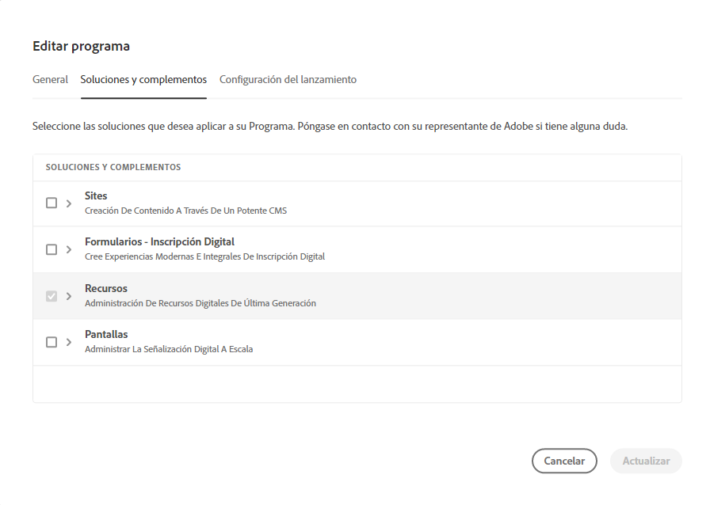
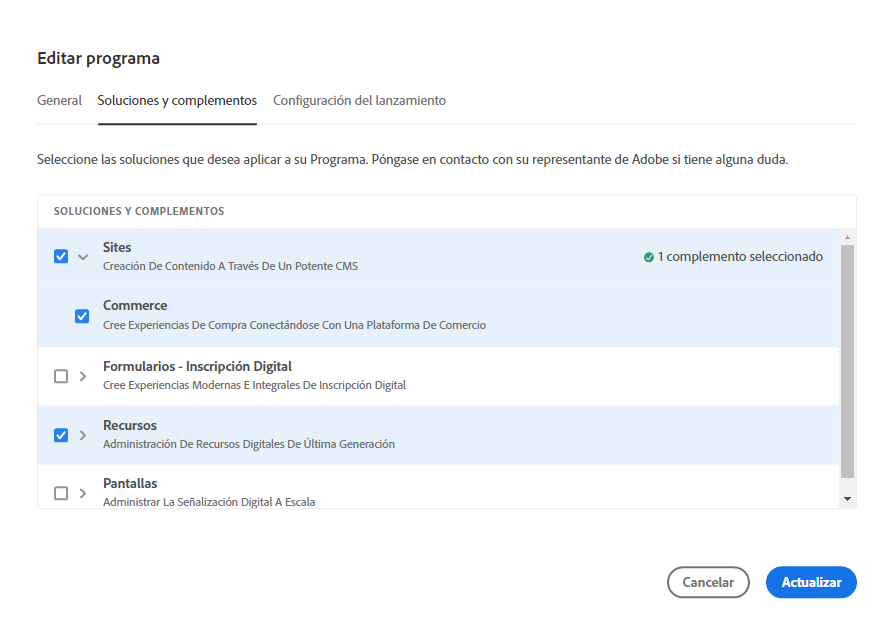
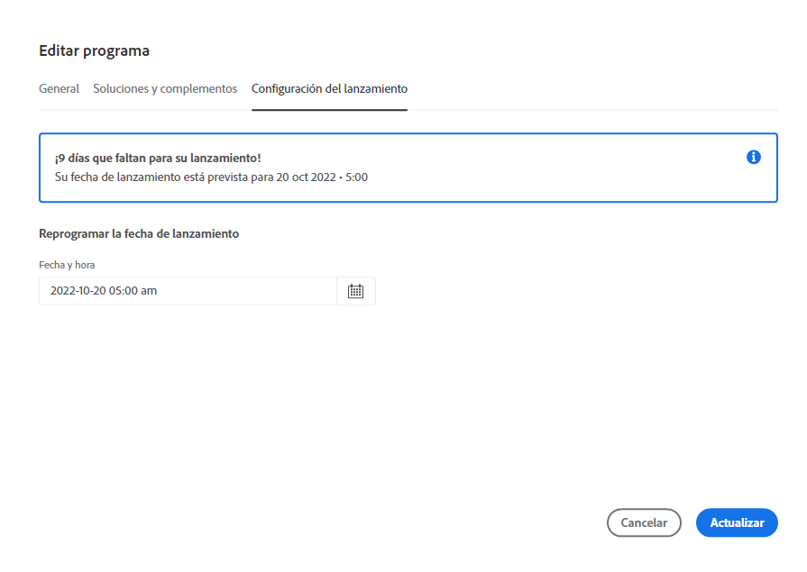

# Administración y edición de programas {#editing-programs}

El **Mis programas** Esta página proporciona información general de todos los programas a los que tiene acceso. Al seleccionar un programa individual, la variable **Resumen del programa** Esta página proporciona detalles del programa de un vistazo.

Desde el **Resumen del programa**, los usuarios con los permisos necesarios pueden editar [programas de producción creados en su organización](creating-production-programs.md) y [programas de zona protegida creados en su organización.](creating-sandbox-programs.md) Al editar un programa, puede:

* Agregar la solución Sites a un programa existente con Assets y a la inversa.
* Eliminar Sites o Assets de un programa existente que incluya ambos.
* Agregue un segundo derecho de solución no utilizado a un programa existente o como nuevo programa.
* Eliminar programas de zona protegida.

## Permisos {#permissions}

Debe ser miembro de la **Propietario del negocio** función para editar programas o eliminar programas de zona protegida, así como para acceder al Tablero de licencias.

## Mis programas {#my-programs}

1. Inicie sesión en Cloud Manager en [my.cloudmanager.adobe.com](https://my.cloudmanager.adobe.com/) y seleccione la organización adecuada.

1. El **Mis programas** Esta página muestra una lista de todos los programas a los que tiene acceso como mosaicos.

### Llamada a acción {#cta}

En la parte superior de la página hay una llamada a la acción relevante para el estado de la organización. Por ejemplo, si ha configurado correctamente sus programas, pueden mostrarse estadísticas de las actividades de los últimos 90 días, incluidas las siguientes:

* Número de [implementaciones](/help/implementing/cloud-manager/deploy-code.md)
* Número de [problemas de calidad del código](/help/implementing/cloud-manager/code-quality-testing.md) identificado
* Número de compilaciones

O si acaba de comenzar la configuración de su organización, puede haber sugerencias sobre los pasos siguientes o los recursos de documentación.

### Pestaña Programas {#programs-tab}

El **Programas** La pestaña enumera las tarjetas que representan cada programa al que tiene acceso. Toque o haga clic en una tarjeta para acceder a **Resumen del programa** del programa para obtener más información sobre el programa.

Utilice las opciones de clasificación para encontrar mejor el programa que necesita.

* Ordenar por
   * Fecha de creación (predeterminada)
   * Nombre del programa
   * Estado
* Ascendente (predeterminado) / Descendente
* Vista de cuadrícula (predeterminada)
* Vista de lista   

### Pestaña Licencia {#license-tab}

El **Licencia** le permite acceder rápidamente a la pestaña [Tablero de licencias.](/help/implementing/cloud-manager/license-dashboard.md)

## Resumen del programa {#program-overview}

Una vez que haya seleccionado un programa de la **[Mis programas](#my-programs)** , Cloud Manager abre la página **Resumen del programa** para el programa seleccionado.

Toque o haga clic en el nombre del programa en la esquina superior izquierda de la página para cambiar rápidamente a otro programa o volver a la página **[Mis programas](#my-programs)** página. También puede [editar el programa seleccionado](#editing) o [añada un programa.](/help/implementing/cloud-manager/getting-access-to-aem-in-cloud/creating-production-programs.md)

La llamada a acción en la parte superior le proporcionará información útil según el estado del programa. Para un programa nuevo, puede ver los pasos siguientes ofrecidos, así como un recordatorio de una fecha de lanzamiento, [se configura durante la creación del programa.](/help/implementing/cloud-manager/getting-access-to-aem-in-cloud/editing-programs.md)

Para un programa activo, el estado de la última implementación con vínculos para obtener más información e iniciar una nueva implementación.

**Entornos** y **Canalizaciones** Las tarjetas de ofrecen una descripción general rápida de ambos dentro del programa seleccionado.

El **Rendimiento** ofrece una descripción general de la **[Panel de CDN.](/help/implementing/cloud-manager/cdn-performance.md)**

## Edición de un programa {#editing}

1. Inicie sesión en Cloud Manager en [my.cloudmanager.adobe.com](https://my.cloudmanager.adobe.com/) y seleccione la organización adecuada.

1. En el **[Mis programas](#my-programs)** , haga clic en el programa que desee editar para mostrar sus detalles.

1. Haga clic en el nombre del programa en la parte superior izquierda de la página y seleccione **Editar programa**.

   

1. Se abrirá la página **Editar programa**. En la pestaña **General**, edite el nombre y la descripción del programa.

   * Debe seleccionar al menos una solución para un programa.

   

1. En la pestaña **Soluciones y complementos**, modifique las soluciones para el programa.

   

1. Haga clic en las comillas angulares antes del nombre de la solución para mostrar complementos opcionales, como seleccionar la opción **Comercio** opción de complemento en **Sites**.

   

1. En la pestaña **Configuración de Go live**, modifique la fecha de go-live planeada para el programa.

   

   * Esta fecha es solo para uso informativo. Almacena en déclencheur el widget Go Live en la página de información general del programa. A su vez, proporciona vínculos internos del producto a la documentación de prácticas recomendadas as a Cloud Service de Adobe Experience Manager AEM () para que se ajuste a su recorrido, lo que culmina en una experiencia de Go Live exitosa.
   * Esta pestaña no está disponible para programas de zonas protegidas.

1. Si los derechos requeridos están disponibles para el programa, la variable **Seguridad** La pestaña mostrará dónde puede modificar las opciones de seguridad del programa.

   

   * HIPAA no se puede habilitar o deshabilitar después de [creación de programas.](/help/implementing/cloud-manager/getting-access-to-aem-in-cloud/creating-production-programs.md)
      * [Más información](https://www.adobe.com/go/hipaa-ready_es) acerca de la implementación de la solución compatible con HIPAA de Adobe.
   * Una vez activada, la protección WAF-DDOS se puede configurar mediante la configuración de una [canalización que no sea de producción.](/help/implementing/cloud-manager/configuring-pipelines/configuring-non-production-pipelines.md)

1. Clic **Actualizar** para guardar los cambios en el programa.

Cada vez que se edita un programa, incluida la adición o eliminación de una solución o complemento, esos cambios surten efecto después de la siguiente implementación.

## Eliminar programas de zona protegida {#delete-sandbox-program}

Al eliminar un programa de zona protegida se eliminan todos los entornos y canalizaciones asociados a él.

>[!TIP]
>
>Los usuarios con el rol de **Propietario del negocio** o **Administrador de implementación** pueden eliminar sus entornos de producción y ensayo en lugar de todo el programa de zona protegida.

Para eliminar un programa de zona protegida, haga lo siguiente.

1. Inicie sesión en Cloud Manager en [my.cloudmanager.adobe.com](https://my.cloudmanager.adobe.com/) y seleccione la organización adecuada.

1. En el **[Mis programas](#my-programs)** , haga clic en el programa que desee editar para mostrar sus detalles.

1. Haga clic en el nombre del programa en la parte superior izquierda de la página y seleccione **Eliminar programa**.

   

También puede hacer clic en el botón de los tres puntos de la tarjeta del programa desde la página de información general de Cloud Manager y seleccionar **Eliminar programa**.

>[!NOTE]
>
>Solo se pueden eliminar programas de zona protegida. Los programas de producción no se pueden eliminar.
