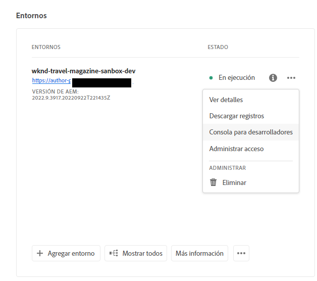

# Entornos de zona protegida en hibernación y dehibernación {#hibernating-introduction}

Los entornos de zona protegida entran en modo de hibernación si no se detecta ninguna actividad durante ocho horas.La hibernación es única para los entornos de programa de zona protegida. Los entornos de programas de producción no hibernan.

## Hibernación {#hibernation-introduction}

La hibernación puede producirse de forma automática o manual.

* **Automática**: Los entornos de programa de zona protegida hibernan automáticamente tras ocho horas de inactividad. La inactividad se define como que ni el servicio de autor ni la vista previa o los servicios de publicación reciban solicitudes.
* **Manual**: Como usuario, puede hacer hibernar manualmente un entorno de zona protegida. No es necesario hacerlo, ya que la hibernación se producirá automáticamente como se describió anteriormente.

Puede tardar hasta unos minutos en que los entornos de programa de zona protegida entren en modo de hibernación. Los datos se conservan durante la hibernación.

### Usar la hibernación manual {#using-manual-hibernation}

Puede hibernar manualmente el programa de zona protegida desde Developer Console. Cualquier usuario de Cloud Manager puede acceder a Developer Console para un programa de zona protegida.

Siga estos pasos para hibernar manualmente los entornos de programa de zona protegida.

1. Inicie sesión en Cloud Manager en [my.cloudmanager.adobe.com](https://my.cloudmanager.adobe.com/) y seleccione la organización adecuada.

1. Haga clic en el programa que desea hibernar para mostrar sus detalles.

1. En la tarjeta **Entornos**, haga clic en el botón de los tres puntos y seleccione **Developer Console**.

   * Consulte [Acceso a Developer Console](/help/implementing/cloud-manager/manage-environments.md#accessing-developer-console) para obtener más información sobre Developer Console.

   

1. En Developer Console, haga clic en **Hibernar**.

   

1. Haga clic en **Hibernar** para confirmar el paso.

   

Cuando la hibernación se realice correctamente, verá la notificación de finalización del proceso de hibernación para su entorno en la pantalla **Developer Console**.

En Developer Console también puede hacer clic en el vínculo **Entornos** en las rutas de exploración encima del menú desplegable **Pod** para ver una lista de entornos para hibernar.

## Deshibernación {#de-hibernation-introduction}

Puede hibernar manualmente el programa de zona protegida desde Developer Console.

>[!IMPORTANT]
>
>Un usuario con un rol de **Desarrollador** puede anular la hibernación de un entorno de programa de zona protegida.

1. Inicie sesión en Cloud Manager en [my.cloudmanager.adobe.com](https://my.cloudmanager.adobe.com/) y seleccione la organización adecuada.

1. Haga clic en el programa que desea hibernar para mostrar sus detalles.

1. En la tarjeta **Entornos**, haga clic en el botón de los tres puntos y seleccione **Developer Console**.

   * Consulte [Acceso a Developer Console](/help/implementing/cloud-manager/manage-environments.md#accessing-developer-console) para obtener más información sobre Developer Console.

1. Haga clic en **Deshibernar**.

   

1. Haga clic en **Deshibernar** para confirmar el paso.

   

1. Recibirá una notificación que le avisa de que el proceso de anulación de la hibernación se ha iniciado y se actualiza con el progreso.

   

1. Una vez finalizado el proceso, el entorno del programa de zona protegida vuelve a estar activo.

   

En Developer Console también puede hacer clic en el vínculo **Entornos** en las rutas de exploración de encima del menú desplegable **Pod** para ver una lista de entornos para anular la hibernación.

### Permisos para anular la hibernación {#permissions-de-hibernate}

Cualquier usuario con un perfil de producto que le permita acceder a AEM as a Cloud Service debe poder acceder a **Developer Console**, permitiéndole anular la hibernación del entorno.

## Acceder a un entorno en hibernación {#accessing-hibernated-environment}

Al realizar solicitudes de explorador contra el servicio de autor, vista previa o publicación de un entorno hibernado, el usuario se encontrará con una página de aterrizaje que describe el estado de hibernación del entorno junto con un vínculo a Developer Console donde el servicio se puede anular.

## Implementaciones y actualizaciones de AEM {#deployments-updates}

Los entornos en hibernación aún permiten implementaciones y actualizaciones manuales de AEM.

* Un usuario puede utilizar una canalización para implementar código personalizado en entornos en hibernación. El entorno permanecerá en hibernación y el nuevo código aparecerá en el entorno una vez que se haya deshibernado.

* Las actualizaciones de AEM se pueden aplicar a entornos hibernados y se pueden activar manualmente desde Cloud Manager. El entorno permanecerá en hibernación y la nueva versión aparecerá en el entorno una vez que se anule la hibernación.

## Hibernación y eliminación {#hibernation-deletion}

* Los entornos de un programa de zona protegida hibernan automáticamente tras ocho horas de inactividad.
   * La inactividad se define como que ni el servicio de autor ni la vista previa o los servicios de publicación reciban solicitudes.
   * Una vez hibernados, se puede cancelar [manualmente la hibernación.](#de-hibernation-introduction)
* Los programas de zona protegida se eliminarán después estar de seis meses en modo de hibernación continua, después de lo cual se podrán volver a crear.

>[!NOTE]
>
>Solo los entornos de zona protegida se eliminan automáticamente después de seis meses de hibernación continua. Se conserva el programa de zona protegida con su repositorio y código.
