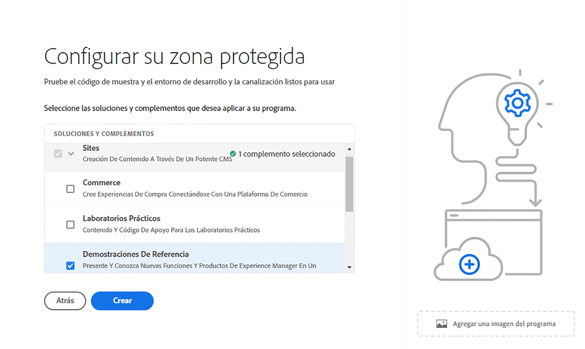

# Introducción a los programas de zona protegida {#sandbox-programs}

Descubra cuáles son los programas de zona protegida y en qué se diferencian de los programas de producción.

## Introducción {#introduction}

Un programa de zona protegida se suele crear para servir a los fines de formación, ejecución de demostraciones, habilitación o prueba de conceptos (POC) y, por lo tanto, no están pensados para transportar tráfico en directo.

Un programa de zona protegida es uno de los dos tipos de programas disponibles en AEM Cloud Service, el otro es un [programa de producción](introduction-production-programs.md). Consulte [Explicación de programas y tipos de programas](/help/implementing/cloud-manager/getting-access-to-aem-in-cloud/program-types.md) para obtener más información sobre los tipos de programas.

## Creación automática {#auto-creation}

Los programas de zona protegida incluyen la creación automática. Siempre que [cree un programa de zona protegida](/help/implementing/cloud-manager/getting-access-to-aem-in-cloud/creating-sandbox-programs.md), Cloud Manager hará lo siguiente automáticamente:

* Agrega AEM Sites, Assets y Edge Delivery Services como soluciones predeterminadas al programa.

  

* Configura un repositorio Git de proyecto con un proyecto de ejemplo basado en el [Arquetipo de proyecto de AEM](https://experienceleague.adobe.com/es/docs/experience-manager-core-components/using/developing/archetype/overview).
* Crear un entorno de desarrollo.
* Crear una canalización que no sea de producción y se implemente en el entorno de desarrollo.

Un programa de zona protegida solo tiene un entorno de desarrollo.

## Notas de uso y condiciones {#usage-notes-conditions}

Como no están pensados para el tráfico en directo, los programas de zonas protegidas tienen ciertas limitaciones y condiciones de uso, lo que los diferencia de los programas de producción.

| Limitación/condición | Descripción |
| --- | --- |
| Sin tráfico en directo | Los programas de zonas protegidas no están pensados para transportar tráfico en vivo y, por lo tanto, no están sujetos a [compromisos de AEM as a Cloud Service](https://www.adobe.com/es/legal/service-commitments.html). |
| Sin escalado automático | Los entornos creados en un programa de zona protegida no están configurados para el escalado automático. Por lo tanto, estos entornos no son adecuados para pruebas de carga o rendimiento. |
| Sin dominios personalizados ni Listas de permitidos IP | [Los dominios personalizados](/help/implementing/cloud-manager/custom-domain-names/introduction.md) y [Listas de permitidos IP](/help/implementing/cloud-manager/ip-allow-lists/introduction.md) no están disponibles en los programas de zonas protegidas. |
| No hay regiones de publicación adicionales | [Las regiones de publicación adicionales](/help/operations/additional-publish-regions.md) no están disponibles en los programas de zonas protegidas. |
| No 99.99% SLA | [99,99% SLA](/help/implementing/cloud-manager/getting-access-to-aem-in-cloud/creating-production-programs.md#sla) no se aplica a los programas de zonas protegidas. |
| Sin redes avanzadas | Las [Funciones de red avanzadas](/help/security/configuring-advanced-networking.md) (por ejemplo, el aprovisionamiento de autoservicio de VPN, puertos no estándar, direcciones IP de salida dedicadas, etc.) no están disponibles en los programas de zonas protegidas. |
| No hay actualizaciones automáticas de AEM | Las actualizaciones de AEM no se insertan automáticamente en los programas de zona protegida, pero se pueden aplicar manualmente a sus entornos. · Una actualización manual solo se puede ejecutar cuando el entorno de destino tiene una canalización configurada correctamente. · Una actualización manual de un entorno de ensayo o producción actualiza automáticamente el otro. El conjunto de entornos Producción+Fase debe estar en la misma versión de AEM. Vea [Actualizaciones de la versión de AEM](/help/implementing/deploying/aem-version-updates.md) para obtener más detalles. Consulte [Actualizar el entorno](/help/implementing/cloud-manager/manage-environments.md#updating-dev-environment) para obtener información sobre cómo actualizar un entorno. |
| Sin soporte técnico | Dado que un programa de zona protegida se suele crear para servir a los fines de formación, ejecución de demostraciones, habilitación o POC (prueba de conceptos), la asistencia técnica no está disponible para los problemas experimentados en un programa de zona protegida. Si tiene problemas al crear y administrar sus programas de zona protegida, estos problemas entran en el ámbito del soporte técnico. |
| Hibernación y eliminación | Los entornos de un programa de zona protegida hibernan automáticamente tras ocho horas de inactividad. Los entornos de zona protegida se eliminan después de seis meses continuos de hibernación. Consulte [Entornos de zona protegida en hibernación y dehibernación](/help/implementing/cloud-manager/getting-access-to-aem-in-cloud/hibernating-environments.md) para obtener más información sobre cómo anular la hibernación de entornos y eliminar la zona protegida automáticamente. |
