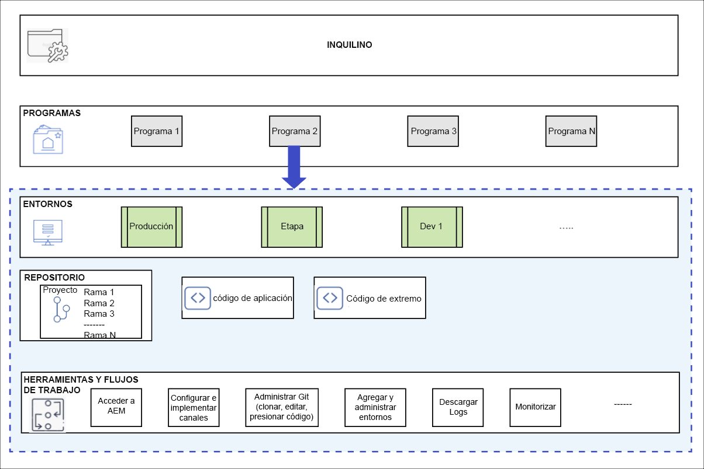

# Programas y tipos de programas {#understanding-programs}

Cloud Manager se basa en una jerarquía de entidades. Los detalles no son esenciales para su trabajo diario en Cloud Manager, pero una descripción general de él puede ayudarle a comprender los programas y a configurar los suyos propios.



* **INQUILINO** - La parte superior de la jerarquía. Cada cliente está aprovisionado con un inquilino.
* **PROGRAMAS**: cada inquilino tiene uno o más programas, [que a menudo reflejan las soluciones con licencia del cliente](introduction-production-programs.md).
* **ENTORNOS**: Cada programa tiene múltiples entornos, como producción para contenido en directo, uno para ensayo y otro para desarrollo.
   * Cada programa puede tener un solo entorno de producción, pero varios entornos que no sean de producción.
* **REPOSITORIO**: los programas tienen repositorios Git donde el código de la aplicación y del front-end se mantiene para los entornos.
* **HERRAMIENTAS Y FLUJOS DE TRABAJO**: Las canalizaciones administran la implementación de código desde los repositorios a los entornos, mientras que otras herramientas permiten el acceso a los registros, la monitorización y la administración del entorno.

Un ejemplo suele ser útil para contextualizar esta jerarquía.

* Las empresas de viajes y aventura de WKND pueden ser un **inquilino** que se centra en medios relacionados con viajes.
* El inquilino de empresas de viajes y aventura de WKND puede tener dos **programas**: un programa de Sites para la revista de WKND y uno de Assets para los medios de WKND.
* Los programas de revista de WKND y de medios de WKND tendrían **entornos** de desarrollo, ensayo y producción.

## Repositorio de códigos de origen {#source-code-repository}

Un programa de Cloud Manager viene aprovisionado automáticamente con su propio repositorio de Git.

Los usuarios pueden acceder al repositorio de Git de Cloud Manager mediante un cliente de Git con una herramienta de línea de comandos o un cliente de Git visual independiente. Alternativamente, pueden utilizar su entorno de desarrollo integrado (IDE) preferido, como Eclipse, IntelliJ o NetBeans.

Una vez configurado el cliente Git, puede administrar el repositorio Git desde la interfaz de usuario de Cloud Manager. Para obtener más información sobre cómo administrar Git mediante la interfaz de usuario de Cloud Manager, consulte [Acceder a Git](/help/implementing/cloud-manager/managing-code/accessing-repos.md).

Para empezar a desarrollar la aplicación de AEM Cloud, retire el código de la aplicación del repositorio de Cloud Manager a su equipo local.

```java
$ git clone {URL}
```

El flujo de trabajo sigue un proceso Git estándar:

1. Un usuario clona el repositorio remoto de Git localmente.
1. El usuario realiza cambios en el repositorio local.
1. Cuando está listo, el usuario vuelve a enviar los cambios al repositorio remoto de Git.

La única diferencia es que el repositorio remoto de Git forma parte de Cloud Manager, que es transparente para el desarrollador.

## Tipos de programas {#program-types}

Un usuario puede crear un programa de **producción** o un programa de **espacio aislado**.

* Un **programa de producción** se crea para habilitar el tráfico en directo para el sitio.
   * Consulte [Introducción a los programas de producción](/help/implementing/cloud-manager/getting-access-to-aem-in-cloud/introduction-production-programs.md) para obtener más información.
* Un **programa de zona protegida** normalmente se crea para servir los propósitos de formación, ejecución de demostraciones, habilitación, POC o documentación.
   * Un entorno de zona protegida no está diseñado para transportar tráfico en directo y tiene restricciones que un programa de producción no.
   * Incluye Sites, Assets y Edge Delivery Services, y viene rellenado previamente con una rama Git que contiene código de muestra, un entorno de desarrollo y una canalización que no es de producción.
   * Consulte [Introducción a los programas de zona protegida](/help/implementing/cloud-manager/getting-access-to-aem-in-cloud/introduction-sandbox-programs.md) para obtener más información.
