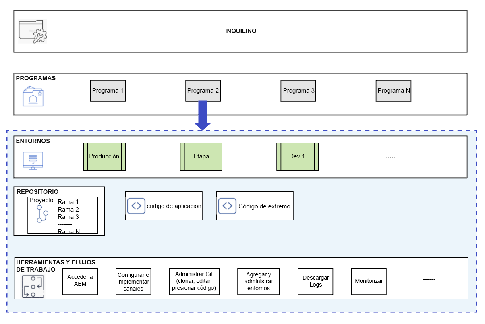

# Explicación de programas y tipos de programas {#understanding-programs}

En Cloud Manager, tiene la entidad inquilina en la parte superior, que puede tener varios Programas dentro de ella. Cada programa no puede contener más de un entorno de producción y varios entornos que no sean de producción.

El diagrama siguiente muestra la jerarquía de entidades en Cloud Manager.



## Repositorio de códigos de origen {#source-code-repository}

El programa de Cloud Manager se aprovisionará automáticamente con su propio repositorio de Git.

Para que un usuario pueda acceder al repositorio de Git de Cloud Manager, los usuarios deberán utilizar un cliente Git con una herramienta de línea de comandos, un cliente Git visual independiente o el IDE del usuario, como Eclipse, IntelliJ o NetBeans.

Una vez configurado un cliente Git, puede administrar el repositorio de Git desde la interfaz de usuario de Cloud Manager. Para obtener información sobre cómo administrar Git mediante la interfaz de usuario de Cloud Manager, consulte [Acceso a Git](/help/implementing/cloud-manager/accessing-repos.md).

Para comenzar a desarrollar la aplicación de AEM Cloud, se debe realizar una copia local del código de la aplicación comprobándolo desde el repositorio de Cloud Manager a una ubicación de su equipo local en la que deseen crear su repositorio.

```java
$ git clone {URL}
```

>[!NOTE]
>Un usuario puede extraer una copia de su código y realizar cambios en el repositorio de código local. Cuando esté listo, el usuario puede devolver los cambios de código al repositorio de código remoto en Cloud Manager.

## Tipos de programas {#program-types}

Un usuario puede crear un **Simulador para pruebas** o un programa **Producción**.

* Se crea un *Programa de producción* para habilitar el tráfico en directo en el momento adecuado en el futuro.
Consulte Introducción a los programas de producción para obtener más información.


* Generalmente, se crea un *Programa de espacio aislado* para que sirva a los fines de formación, ejecución de demostración, habilitación, POC o documentación. No está pensado para transportar tráfico en directo y tendrá restricciones que un programa de Producción no tendrá. Incluirá Sites y Assets y se entregará rellenando automáticamente con una rama de Git que incluya código de muestra, un entorno de desarrollo y una canalización que no sea de producción.
Consulte Introducción a los programas de espacio aislado para obtener más información.
