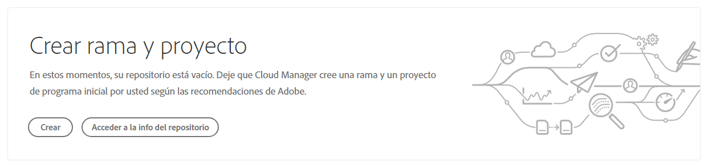
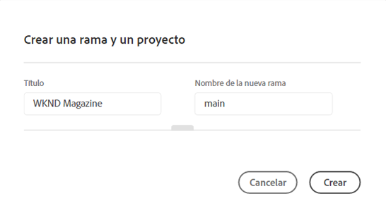
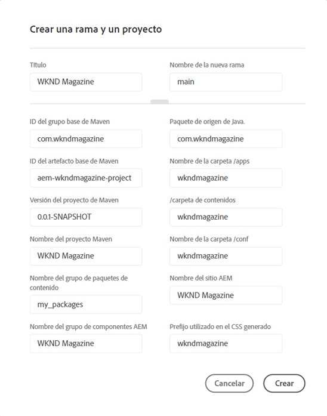
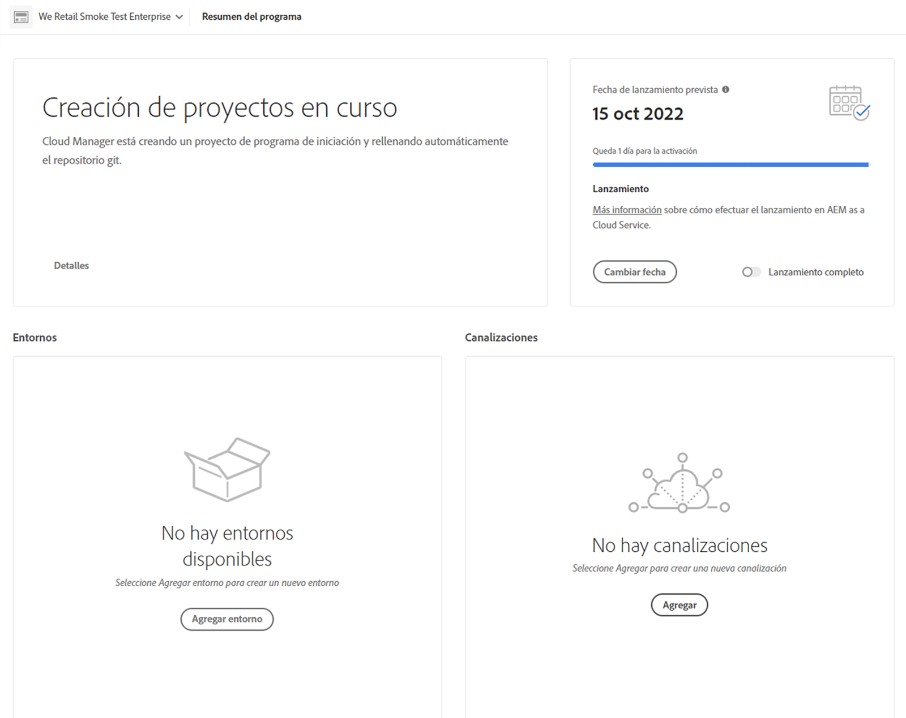
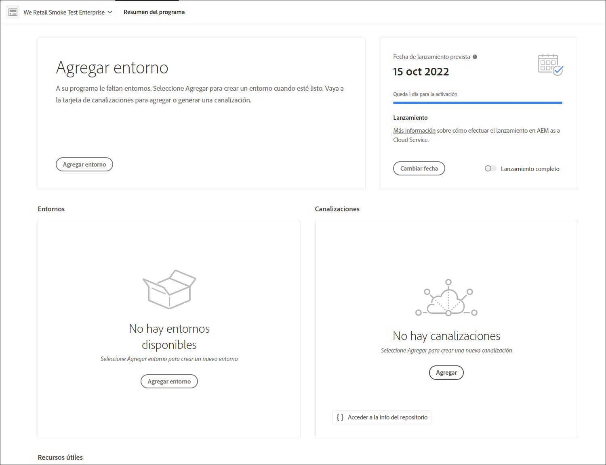

# Asistente para la creación de proyectos {#project-creation-wizard}

Después de crear el programa de producción, Cloud Manager ofrece un asistente para crear un proyecto AEM mínimo basado en el [Arquetipo del proyecto AEM](https://experienceleague.adobe.com/docs/experience-manager-core-components/using/developing/archetype/overview.html?lang=es) para empezar rápidamente.

Siga estos pasos para crear un proyecto de aplicación de AEM en Cloud Manager mediante el asistente.

1. Cree un programa de producción mediante los pasos del documento [Crear programas de producción](creating-production-programs.md)

1. Una vez completada la configuración del programa, acceda a la pantalla **Información general** de su programa y consulte la tarjeta **Crear ramas y proyectos** de la parte superior.

   

1. Haga clic en **Crear** para iniciar el asistente y confirmar el **Título** de su proyecto y el **Nuevo nombre de la rama** en la ventana **Crear una rama y un proyecto**.

   

1. Si lo desea, haga clic en el divisor para mostrar los parámetros adicionales del proyecto. Los valores predeterminados los proporciona el arquetipo del proyecto AEM y, por lo general, no es necesario cambiarlos.

   

1. Haga clic en **Crear** para iniciar el proceso de creación del proyecto.

La tarjeta **Creación de proyecto en curso** ahora reemplaza a la tarjeta **Crear ramas y proyectos** como parte superior de la pantalla **Información general del programa**.

Una vez completada la creación del programa, la tarjeta **Agregar entorno** sustituirá a la tarjeta **Creación de proyecto en curso** en la parte superior de la pantalla **Información general del programa**.

Ahora tiene un proyecto AEM basado en el arquetipo de AEM agregado al repositorio de Git para servir como base para el desarrollo de su propio proyecto. A continuación, puede crear los entornos en los que puede implementar el código del proyecto.

Consulte [Administración de entornos](/help/implementing/cloud-manager/manage-environments.md) para aprender a añadir o administrar entornos.

>[!NOTE]
>
>El asistente solo está disponible para programas de producción. Como los [programas de zonas protegidas](introduction-sandbox-programs.md#auto-creation) incluyen la creación automática de proyectos, no es necesario el asistente.