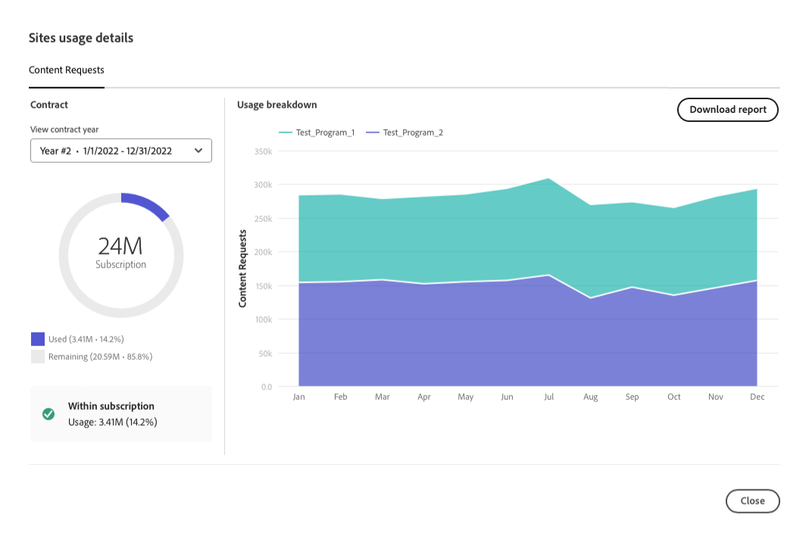

# Tablero de licencias {#license-dashboard}

Cloud Manager proporciona un tablero para facilitar la visualización de las autorizaciones de productos de AEMaaCS disponibles para su organización o inquilino.

>[!IMPORTANT]
>
>El tablero de licencias solo se aplica a los programas de AEM as a Cloud Service. [Los programas de AMS](https://experienceleague.adobe.com/es/docs/experience-manager-cloud-manager/content/introduction) no se incluyen en el panel de licencias.
>
>Para determinar el tipo de servicio que tiene su programa (AMS o AEMaaCS), consulte [Navegación por la interfaz de usuario de Cloud Manager](/help/implementing/cloud-manager/navigation.md#program-cards).

## Información general {#overview}

El panel de licencias de Cloud Manager proporciona un acceso fácil a las autorizaciones de la solución disponibles en todos sus programas, incluidos los que se utilizan y los que están disponibles. Además, las métricas de consumo de solicitud de contenido marcaron la tendencia por mes para la solución Sites.

## Acceso al tablero de licencias {#using-dashboard}

>[!NOTE]
>
>Un usuario con el rol **Propietario del negocio** debe iniciar sesión para ver el panel de licencias.

1. Inicie sesión en Cloud Manager en [my.cloudmanager.adobe.com](https://my.cloudmanager.adobe.com/) y seleccione la organización adecuada.
1. En la consola **[Mis programas](/help/implementing/cloud-manager/navigation.md#my-programs)**, haga clic en  en el [encabezado de Cloud Manager](/help/implementing/cloud-manager/navigation.md#cloud-manager-header). Esta acción revela las pestañas.
1. Haga clic en la opción **Licencia** en la pestaña.

El tablero se divide en tres secciones que le muestran lo siguiente:

* **Soluciones** - Qué soluciones tiene licencia.
* **Complementos**: qué complementos de las soluciones con licencia tiene disponibles.
* **Otros derechos** - Qué zona protegida y entorno de desarrollo y otros derechos se pueden consumir dentro de su inquilino.

Cada sección resume lo que está disponible y cómo se utiliza, si es que lo está. Actualmente solo se muestran las soluciones de Sites y Assets, aunque existan otras soluciones en el inquilino.

* La columna **Estado** muestra el número de derechos no utilizados en comparación con el total disponible para el inquilino.
* La columna **Configurado en** indica los programas en los que se ha aplicado la asignación de derechos de solución.
   * Una asignación de derechos se considera utilizada solo cuando se crea un entorno de producción. O, si existe, si se ha ejecutado una canalización de actualización en ella.
   * En la columna solo se enumera un número limitado de programas por separado; el resto se representa mediante una entrada `+x`.
   * Pase el ratón sobre la entrada `+x` para ver una ventana emergente con detalles de todos los programas.
* La columna **Uso** muestra un botón **[Ver detalles de uso](#view-usage-details)** para mostrar las estadísticas de uso de la solución.

>[!TIP]
>
>Para obtener información sobre cómo administrar los derechos de Adobe en toda la organización desde Admin Console, consulte la [descripción general del Admin Console](https://helpx.adobe.com/es/enterprise/using/admin-console.html).

## Visualización de detalles de uso {#view-usage-details}

<!--
The **View usage details** button gives access to the chosen solution's **Usage Details** window. This window gives a detailed breakdown including charts to show your solution's usage. How that usage is measured depends on the chosen solution. -->

El botón **Ver detalles de uso** del área de Licencias de Cloud Manager proporciona un desglose detallado del uso actual de los recursos. Al hacer clic en esta opción, se abre un informe o un tablero que muestra métricas importantes relacionadas con la licencia. <!-- ADD THIS SENTENCE IF ASSETS USAGE DETAILS GETS REINSTATED ", such as the number of users, storage consumption, or bandwidth usage, depending on the type of services you're using." --> Esta funcionalidad le ayuda a supervisar y asegurarse de que se mantiene dentro de los límites del contrato y, al mismo tiempo, le ofrece perspectivas para una mejor planificación y optimización de los recursos.

### Detalles de uso de sitios {#sites-usage-details}

La ventana **Detalles de uso de sitios** presenta gráficos que ofrecen una descripción general del uso de las licencias de sitios en función de [solicitudes de contenido](#what-is-a-content-request).

La parte izquierda de la ventana presenta un gráfico circular que muestra el desglose del contrato para el año de contrato seleccionado en el menú desplegable **Ver año de contrato**.

El lado derecho de la ventana presenta un gráfico de áreas que muestra el uso desglosado por programa a lo largo del tiempo para el año de contrato seleccionado. Al pasar el ratón por encima, aparece una ventana emergente con detalles por programa para el momento seleccionado.

<!-- REMOVED AS PER CQDOC-21983
### Assets usage details {#assets-usage-details}

The **Assets usage details** window, presents graphs giving an overview of the usage of your Assets licenses based on [storage](#storage) and [standard users](#standard-users). Select the appropriate tab to toggle between the views.

For both storage and standard users views, you can use the **Environment Type** dropdown to toggle the view between production, stage, and development environments.

#### Storage {#storage}

The left side of the window presents a pie chart showing the contract breakdown for the contract year selected in the **View contract year** dropdown.

The right side of the window presents an area chart showing the usage broken down by program over time for the selected contract year. A hover reveals a popup with details per program for the selected point in time.

#### Standard Users {#standard-users}

The left side of the window presents a pie chart showing the contract breakdown for the contract year selected in the **View contract year** dropdown.

The right side of the window presents an area chart showing the usage broken down by program over time for the selected contract year. A hover reveals a popup with details per program for the selected point in time. -->

## Preguntas frecuentes {#faq}

+++**¿Qué es una solicitud de contenido?** {#what-is-a-content-request}

Una solicitud de contenido es cualquier solicitud dirigida a AEM Sites o a un sistema de almacenamiento en caché proporcionado por el cliente, como una red de entrega de contenido. Recupera contenido o datos en formato de HTML para vistas de página. O bien, en formato JSON para llamadas a la API.

Se cuenta una solicitud de contenido por cada vista de página o por cada cinco llamadas a la API, se miden a la entrada del primer sistema de almacenamiento en la memoria caché que recibe una solicitud de contenido. Las solicitudes de contenido se cuentan únicamente en los entornos de producción.

Las solicitudes de contenido excluyen las solicitudes o actividades iniciadas por o en representación del Adobe con el único propósito de proporcionar productos y servicios. También se excluye el tráfico de agentes de usuario identificados por Adobe de bots, rastreadores y arañas relacionadas con motores de búsqueda y servicios de medios sociales comunes.

Consulte también [Comprender las solicitudes de contenido de Cloud Service](/help/implementing/cloud-manager/content-requests.md).
+++

+++**¿Cómo mide Adobe Experience Manager las solicitudes de contenido?** {#how-are-content-requests-measured}

Las solicitudes de contenido se rastrean en los servidores Edge de AEM as a Cloud Service. El tráfico de origen no se cuenta para las solicitudes de contenido. La red de distribución de contenido (CDN) integrada en AEM as a Cloud Service rastrea solicitudes de HTML y JSON válidas.

AEM también dispone de reglas para excluir bots conocidos, incluidos servicios bien conocidos que visitan el sitio regularmente para actualizar su índice de búsqueda o servicio.

Consulte también [Explicación de las solicitudes de contenido de Cloud Service](/help/implementing/cloud-manager/content-requests.md).
+++

+++AEM **¿Por qué en mi informe de Analytics se muestran resultados diferentes a los de las solicitudes de contenido de la?** {#why-are-reports-different}

Las solicitudes de contenido pueden tener variaciones con las herramientas de informes de Analytics de una organización. Para obtener más información, consulte [Explicación de las solicitudes de contenido de Cloud Service](/help/implementing/cloud-manager/content-requests.md).
+++

+++**¿Qué sucede si quisiera obtener más información acerca de mi volumen de solicitud de contenido?** {#current-request-volumes}

Si desea obtener información adicional sobre el volumen de solicitud de contenido que se muestra en el panel de licencias, su equipo de Adobe puede proporcionarle un informe que muestre los controladores de mayor volumen de las solicitudes de contenido. Póngase en contacto con el equipo de Adobe o con Asistencia al cliente de Adobe para solicitar un informe de uso superior.
+++

+++**¿Qué sucede si utilizo mi propia CDN?** {#using-own-cdn}

El panel de licencias solo muestra datos rastreados por la CDN del Cloud Service. Si opta por traer su propia CDN (BYOCDN), informará de su volumen de solicitud de contenido a los Adobes anualmente, tal y como se indica en su contrato.
+++

