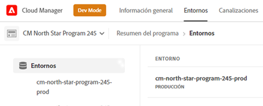
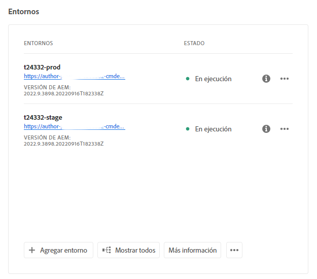
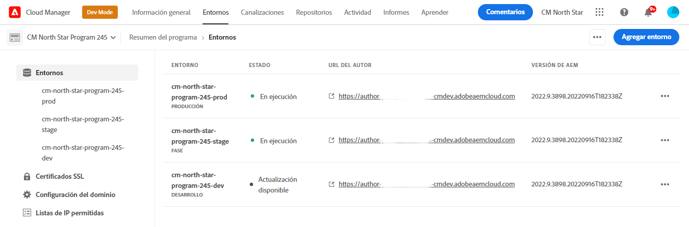
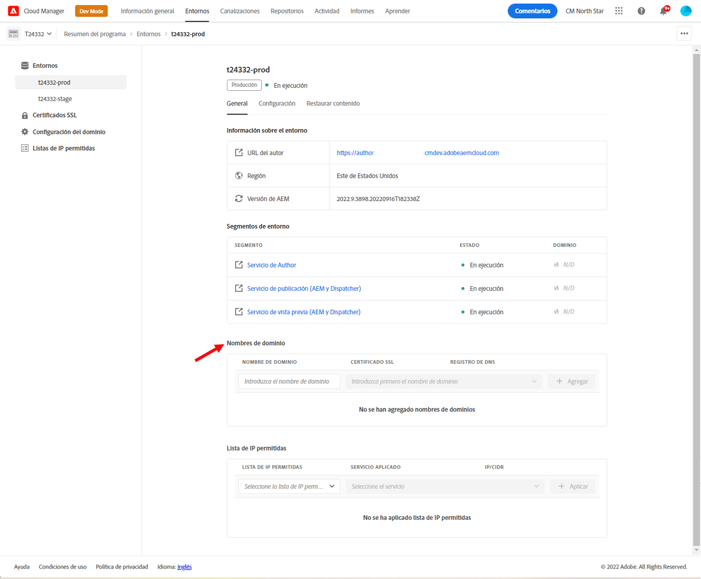

# Administración de entornos {#managing-environments}

Obtenga información sobre los tipos de entornos que puede crear y cómo crearlos para su proyecto de Cloud Manager.

## Tipos de entornos {#environment-types}

Un usuario con los permisos necesarios puede crear los siguientes tipos de entornos (dentro de los límites de lo que está disponible para el inquilino específico).

* **Producción + Fase**: los entornos de producción y ensayo están disponibles en pareja y se utilizan para fines de producción y prueba, respectivamente.

* **Desarrollo**: se puede crear un entorno de desarrollo para fines de desarrollo y prueba, y solo se puede asociar con canalizaciones que no sean de producción.

* **Desarrollo rápido**: Un entorno de desarrollo rápido (RDE) permite al desarrollador implementar y revisar cambios rápidamente, minimizando la cantidad de tiempo necesario para probar funciones que han demostrado funcionar en un entorno de desarrollo local. Consulte [la documentación del entorno de desarrollo rápido](/help/implementing/developing/introduction/rapid-development-environments.md) para obtener detalles acerca de cómo utilizar un RDE.

Las funcionalidades de los entornos individuales dependen de las soluciones habilitadas en el [programa](/help/implementing/cloud-manager/getting-access-to-aem-in-cloud/program-types.md) del entorno.

* [Sites](/help/sites-cloud/home.md)
* [Assets](/help/assets/home.md)
* [Forms](/help/forms/home.md)
* [Screens](/help/screens-cloud/home.md)

>[!NOTE]
>
>Los entornos de producción y ensayo solo se crean como un par. No puede crear solo un entorno de ensayo o de producción.

## Agregar un entorno {#adding-environments}

1. Inicie sesión en Cloud Manager en [my.cloudmanager.adobe.com](https://my.cloudmanager.adobe.com/) y seleccione la organización adecuada.

1. Haga clic en el programa para el que desea agregar un entorno.

1. En la página **Información general del programa**, haga clic en **Agregar entorno** en la tarjeta **Entornos** para agregar un entorno.

   

   * La opción **Agregar entorno** también está disponible en la pestaña **Entornos**.

     

   * La opción **Agregar entorno** se puede desactivar debido a la falta de permisos o dependiendo de los recursos con licencia.

1. En el cuadro de diálogo **Agregar entorno** que aparece:

   * Seleccione un [**tipo de entorno**.](#environment-types)
      * El número de entornos disponibles/utilizados se muestra entre paréntesis detrás del nombre de tipo de entorno.
   * Proporcione un **Nombre** del entorno.
   * Proporcione una **Descripción** del entorno.
   * Si va a agregar un **Producción + Fase** entorno, debe proporcionar un nombre de entorno y una descripción para los entornos de producción y ensayo.
   * Seleccione una **Región principal** de la lista desplegable.
      * Tenga en cuenta que esto no se puede cambiar después de la creación.
      * En función de los derechos disponibles, puede configurar lo siguiente [varias regiones.](#multiple-regions)

   

1. Haga clic en **Guardar** para agregar el entorno especificado.

La pantalla **Información general** ahora muestra el nuevo entorno en la tarjeta **Entornos**. Ahora puede configurar canalizaciones para su nuevo entorno.

## Varias regiones de publicación {#multiple-regions}

Un usuario con **Propietario del negocio** La función puede configurar entornos de producción y ensayo para incluir hasta tres regiones de publicación adicionales además de la región principal. Las regiones de publicación adicionales pueden mejorar la disponibilidad. Consulte la [Documentación adicional de regiones de publicación](/help/operations/additional-publish-regions.md) para obtener más información.

>[!TIP]
>
>Puede usar el complemento [API de Cloud Manager](https://developer.adobe.com/experience-cloud/cloud-manager/guides/api-usage/creating-programs-and-environments/#creating-aem-cloud-service-environments) para consultar una lista actual de regiones disponibles.

### Adición de varias regiones de publicación en un entorno nuevo {#add-regions}

Al añadir un entorno nuevo, puede elegir configurar regiones adicionales además de la región principal.

1. Seleccione el **Región principal**.
   * Tenga en cuenta que esto no se puede cambiar después de la creación del entorno.
1. Seleccione la opción **Agregar regiones de publicación adicionales** y un nuevo **Regiones de publicación adicionales** aparece una lista desplegable.
1. En el **Regiones de publicación adicionales** , seleccione una región adicional.
1. La región seleccionada se añade debajo de la lista desplegable para indicar su selección.
   * Pulse o haga clic en la X situada junto a la región seleccionada para anular su selección.
1. Seleccione otra región de la lista **Regiones de publicación adicionales** desplegable para añadir otra región.
1. Haga clic o pulse **Guardar** cuando esté listo para crear su entorno.

Las regiones seleccionadas se aplicarán a los entornos de producción y ensayo.

Si no especifica ninguna región adicional, [puede hacerlo más adelante después de crear los entornos.](#edit-regions)

Si desea aprovisionar [redes avanzadas](/help/security/configuring-advanced-networking.md) para el programa, se recomienda hacerlo antes de agregar regiones de publicación adicionales a los entornos mediante la API de Cloud Manager. De lo contrario, el tráfico de las regiones de publicación adicionales pasará a través del proxy de la región principal.

### Edición de varias regiones de publicación {#edit-regions}

Si no ha especificado ninguna región adicional inicialmente, puede hacerlo después de crear los entornos si tiene los derechos necesarios.

También puede quitar regiones de publicación adicionales. Sin embargo, solo puede agregar o eliminar regiones en una transacción. Si necesita agregar una región y quitar una región, primero agregue, guarde el cambio y, a continuación, elimine (o viceversa).

1. En la consola Información general del programa de su programa, haga clic en el botón de puntos suspensivos del entorno de producción y seleccione **Editar** en el menú.

   

1. En el **Editar entorno de producción** , realice los cambios necesarios en las regiones de publicación adicionales.
   * Utilice el **Regiones de publicación adicionales** para seleccionar regiones adicionales.
   * Haga clic en la X situada junto a las regiones de publicación adicionales seleccionadas para anular su selección.

   

1. Haga clic o pulse **Guardar** para guardar los cambios.

Los cambios realizados en el entorno de producción se aplicarán tanto a los entornos de producción como de ensayo. Los cambios en varias regiones de publicación solo se pueden editar en el entorno de producción.

Si desea aprovisionar [redes avanzadas](/help/security/configuring-advanced-networking.md) para el programa, se recomienda hacerlo antes de agregar regiones de publicación adicionales a los entornos. De lo contrario, el tráfico de las regiones de publicación adicionales pasará a través del proxy de la región principal.

## Detalles del entorno {#viewing-environment}

Puede usar la tarjeta **Entornos** en la página de información general para acceder a los detalles de un entorno de dos formas.

1. En la página **Información general**, haga clic en la pestaña **Entornos** en la parte superior de la pantalla.

   

   * También puede hacer clic en el botón **Mostrar todo** en la tarjeta **Entornos** para saltar directamente a la pestaña **Entornos**.

     

1. Los **Entornos** se abrirán y enumerarán todos los entornos del programa.

   

1. Haga clic en un entorno de la lista para mostrar sus detalles.

   

También puede hacer clic en el botón de los tres puntos del entorno que desee y seleccionar **Ver detalles**.

>[!NOTE]
>
>La tarjeta **Entornos** solo enumera tres entornos. Haga clic en el botón **Mostrar todo** como se describió anteriormente para ver todos los entornos del programa.

### Acceso al servicio Vista previa {#access-preview-service}

Cloud Manager proporciona un servicio de vista previa (entregado como servicio de publicación adicional) para cada entorno de AEM as a Cloud Service.

Con el servicio puede obtener una vista previa de la experiencia final de un sitio web antes de que llegue al entorno de publicación real y de que esté disponible públicamente.

Una vez creado, el servicio de vista previa tendrá aplicada una lista de IP predeterminadas permitidas, etiquetada como `Preview Default [<envId>]`, que bloqueará todo el tráfico en el servicio de vista previa. Debe anular la aplicación de la lista de permitidos IP predeterminada del servicio de vista previa para habilitar el acceso.

Un usuario con los permisos necesarios debe completar los siguientes pasos antes de compartir la URL del servicio de vista previa para garantizar el acceso a él.

1. Cree una lista de IP permitidas adecuada, aplíquela al servicio de vista previa y cancele inmediatamente la aplicación de la lista de permitidos `Preview Default [<envId>]`.

   * Consulte el documento [Aplicar y cancelar la aplicación de listas de IP permitidas](/help/implementing/cloud-manager/ip-allow-lists/apply-allow-list.md) para obtener más información.

1. Use la actualización del flujo de trabajo **Lista de IP permitidas** para eliminar la IP predeterminada y agregar direcciones IP según corresponda. Consulte [Administrar listas de IP permitidas](/help/implementing/cloud-manager/ip-allow-lists/managing-ip-allow-lists.md) para obtener más información.

Una vez desbloqueado el acceso al servicio de vista previa, ya no se mostrará el icono de bloqueo antes del nombre del servicio de vista previa.

Una vez activado, puede publicar contenido en el servicio de vista previa mediante la IU Administrar publicación dentro de AEM. Consulte el documento [Vista previa del contenido](/help/sites-cloud/authoring/fundamentals/previewing-content.md) para obtener más información.

>[!NOTE]
>
>Su entorno debe estar en la versión `2021.05.5368.20210529T101701Z` de AEM o más reciente para utilizar el servicio de vista previa. Asegúrese de que una canalización de actualización se haya ejecutado correctamente en su entorno para hacerlo.

## Actualizar entornos {#updating-dev-environment}

Como servicio nativo de la nube, las actualizaciones de los entornos de ensayo y producción dentro de los programas de producción se administran automáticamente mediante Adobe.

Sin embargo, las actualizaciones de los entornos de desarrollo, así como de los entornos de los programas de zonas protegidas, se administran dentro de los programas. Cuando un entorno de este tipo no ejecuta la última versión de AEM disponible públicamente, el estado de la tarjeta **Entornos** en la pantalla **Información general** del programa se mostrará **Actualización disponible**.

### Actualizaciones y canalizaciones {#updates-pipelines}

Las canalizaciones son la única manera de [implementar código en los entornos de AEM as a Cloud Service.](deploy-code.md) Por este motivo, cada canalización está asociada a una versión de AEM particular.

Si Cloud Manager detecta que hay una versión de AEM disponible más reciente que la implementada por última vez con la canalización, mostrará el estado **Actualización disponible** para el entorno.

Por lo tanto, el proceso de actualización consta de dos pasos:

1. Actualización de la canalización con la última versión AEM
1. Ejecución de la canalización para implementar la nueva versión de AEM en un entorno

### Actualizar entornos {#updating-your-environments}

La opción **Actualizar** está disponible en la tarjeta **Entornos** para entornos de desarrollo en programas de zona protegida al hacer clic en el botón de los tres puntos del entorno.

Esta opción también está disponible si hace clic en la pestaña **Entornos** del programa y, a continuación, selecciona el botón de los tres puntos del entorno.

Un usuario con el rol de **Administrador de implementación** puede utilizar esta opción para actualizar la canalización asociada con este entorno a la última versión de AEM.

Una vez que la versión de la canalización se actualice a la última versión de AEM disponible públicamente, se solicitará al usuario que ejecute la canalización asociada para implementar la última versión en el entorno.

El comportamiento de la opción **Actualizar** varía según la configuración y el estado actual del programa.

* Si la canalización ya se ha actualizado, la opción **Actualizar** solicitará al usuario que ejecute la canalización.
* Si la canalización ya se está actualizando, la opción **Actualizar** informará al usuario de que ya se está ejecutando una actualización.
* Si no existe una canalización adecuada, la opción **Actualizar** solicitará al usuario que cree una.

## Eliminar entornos de desarrollo {#deleting-environment}

Un usuario con el permiso necesario puede eliminar un entorno de desarrollo.

En la pantalla **Información general** del programa, en la tarjeta **Entornos**, haga clic en el botón de los tres puntos del entorno de desarrollo que desee eliminar.

La opción Eliminar también está disponible en la pestaña **Entornos** de la ventana **Información general** del programa. Haga clic en el botón de los tres puntos del entorno y seleccione **Eliminar**.

>[!NOTE]
>
>* Los entornos de producción y ensayo creados en un programa de producción no se pueden eliminar.
>* Se pueden eliminar los entornos de producción y ensayo de un programa de zona protegida.

## Administrar el acceso {#managing-access}

Seleccione **Administrar el acceso** del menú de los tres puntos del entorno en la tarjeta **Entornos**. Puede navegar hasta la instancia de autor directamente y administrar el acceso para su entorno.

>[!TIP]
>
>Ver el documento [AEM Perfiles de equipo y producto as a Cloud Service](/help/onboarding/aem-cs-team-product-profiles.md) AEM para obtener información sobre cómo los perfiles de equipo y producto as a Cloud Service pueden conceder y limitar el acceso a las soluciones de Adobe con licencia.

## Acceder a la consola de desarrollador {#accessing-developer-console}

Seleccione **Consola de desarrollador** del menú de los tres puntos del entorno en la tarjeta **Entornos**. Se abrirá una nueva pestaña en el explorador con la página de inicio de sesión en la **Consola de desarrollador**.

Solo un usuario con el rol de **Desarrollador** tendrá acceso a la **Consola de desarrollador**. Sin embargo, para los programas de zonas protegidas, cualquier usuario con acceso a la zona protegida tendrá acceso a la **Consola de desarrollador**.

Consulte el documento [Entornos de zona protegida en hibernación y dehibernación](https://experienceleague.adobe.com/docs/experience-manager-cloud-service/onboarding/getting-access/cloud-service-programs/sandbox-programs.html?lang=es#hibernating-introduction) para obtener más información.

Esta opción también está disponible en la pestaña **Entorno** de la ventana **Información general** al hacer clic en el menú de los tres puntos de un entorno individual.

## Iniciar sesión localmente {#login-locally}

Seleccione **Iniciar sesión localmente** del menú de los tres puntos del entorno en la tarjeta **Entornos** para iniciar sesión localmente en Adobe Experience Manager.

Además, puede iniciar sesión localmente desde la pestaña **Entornos** de la página **Información general**.

## Administrar los nombres de dominio personalizados {#manage-cdn}

Los nombres de dominio personalizados se admiten en los programas de Cloud Manager para los programas de Sites, tanto para los servicios de publicación como para los de vista previa. Cada entorno de Cloud Manager puede alojar hasta un máximo de 250 dominios personalizados.

Para configurar los nombres de dominio personalizados, navegue hasta la pestaña **Entornos** y haga clic en un entorno para ver los detalles del mismo.

Se pueden realizar las siguientes acciones en el servicio de publicación de su entorno.

* [Agregar un nombre de dominio personalizado](/help/implementing/cloud-manager/custom-domain-names/add-custom-domain-name.md)

* [Administrar los nombres de dominio personalizados](/help/implementing/cloud-manager/custom-domain-names/managing-custom-domain-names.md)

* [Comprobar el estado del nombre de dominio personalizado](/help/implementing/cloud-manager/custom-domain-names/check-domain-name-status.md#pre-existing-cdn) o un [Certificado SSL](/help/implementing/cloud-manager/managing-ssl-certifications/managing-certificates.md#pre-existing-cdn).

* [Administrar listas de IP permitidas](/help/implementing/cloud-manager/ip-allow-lists/managing-ip-allow-lists.md#pre-existing-cdn)

## Administrar listas de IP permitidas {#manage-ip-allow-lists}

Las listas de IP permitidas son compatibles con Cloud Manager para los servicios de creación, publicación y vista previa de los programas de Sites.

Para administrar las listas de IP permitidas, navegue hasta la pestaña **Entornos** de la página **Información general** del programa. Haga clic en un entorno individual para administrar sus detalles.

### Aplicar una lista de IP permitidas {#apply-ip-allow-list}

La aplicación de una lista de IP permitidas asocia todos los rangos de IP incluidos en la definición de la lista de permitidos con un servicio de autor o publicación en un entorno. Un usuario en la **Propietario del negocio** o **Administrador de implementación** La función debe haber iniciado sesión para poder aplicar una lista de permitidos IP.

La lista de permitidos IP debe existir en Cloud Manager para aplicarla a un entorno. Para obtener más información sobre las listas de IP permitidas en Cloud Manager, consulte el documento [Introducción a las listas de IP permitidas en Cloud Manager.](/help/implementing/cloud-manager/ip-allow-lists/introduction.md)

Siga estos pasos para aplicar una lista de IP permitidas.

1. Vaya al entorno específico desde la pestaña **Entornos** de la pantalla del programa **Información general** y navegue hasta la tabla **Listas de IP permitidas**.
1. Utilice los campos de entrada de la parte superior de la tabla de lista de IP permitidas para seleccionar la lista de IP permitidas y el servicio de autor o publicación al que desee aplicarla.
1. Haga clic en **Aplicar** y confirme su envío.

### Anular la aplicación de una lista de IP permitidas {#unapply-ip-allow-list}

Al anular la aplicación de una lista de IP permitidas, se desasocian todos los rangos de IP incluidos en la definición de la lista de permitidos de un servicio de autor o editor de un entorno. Un usuario en la **Propietario del negocio** o **Administrador de implementación** La función debe haber iniciado sesión para poder anular la aplicación de una lista de permitidos IP.

Siga estos pasos para anular la aplicación de una lista de IP permitidas.

1. Vaya al entorno específico desde la pestaña **Entornos** de la pantalla del programa **Información general** y navegue hasta la tabla **Listas de IP permitidas**.
1. Identifique la fila en la que aparece la regla de la lista de IP permitidas que desea anular.
1. Seleccione el botón de los tres puntos del final de la fila.
1. Seleccione **No aplicar** y confirme su envío.
