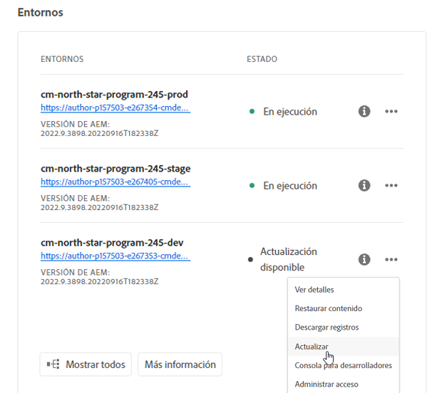
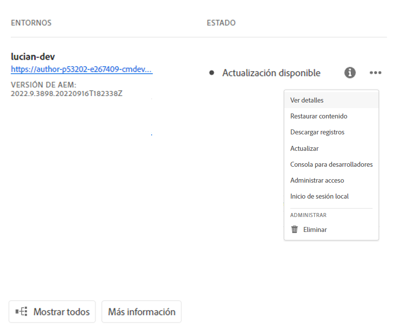
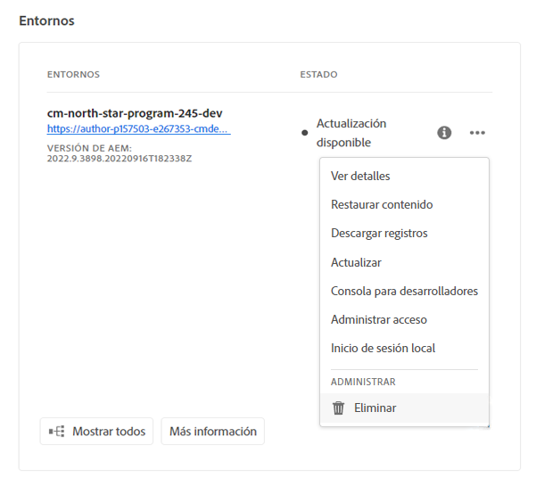

# Administrar entornos {#manage-environments}

En la sección siguiente se describen los tipos de entornos que puede crear un usuario y la forma en que puede crear un entorno.

## Tipos de Entornos {#environment-types}

Un usuario con los permisos necesarios puede crear los siguientes tipos de entornos (dentro de los límites de lo que está disponible para el inquilino específico).

* **Entorno**de producción y etapa:
La producción y la fase están disponibles como dúo y se utilizan con fines de prueba y producción.

* **Desarrollo**: Se puede crear un entorno de desarrollo con fines de desarrollo y ensayo y se asociará únicamente a los oleoductos que no sean de producción.

   >[!NOTE]
   >Se configurará un entorno de desarrollo que se crea automáticamente en un programa de Simulador para pruebas para que incluya las soluciones Sitios y Recursos.

   La siguiente tabla resume los tipos de Entornos y sus atributos:

   | Nombre | Nivel de autor | Publicar nivel | El usuario puede crear | El usuario puede eliminar | Canalización que puede asociarse con entorno |
   |--- |--- |--- |--- |---|---|
   | Producción | Sí | Sí si los sitios están incluidos | Sí | No | Canalización de producción |
   | Escenario | Sí | Sí si los sitios están incluidos | Sí | No | Canalización de producción |
   | Desarrollo | Sí | Sí si los sitios están incluidos | Sí | Sí | Canalización sin producción |

   >[!NOTE]
   >La producción y la fase están disponibles como dúo y se utilizan con fines de prueba y producción.  El usuario no podrá crear solo la fase o solo el entorno de producción.

## Añadir un Entorno {#adding-environments}

1. Haga clic en **Añadir Entorno** para agregar un entorno. Se puede acceder a este botón desde la pantalla **Entornos** .
   

   La opción **Añadir Entorno** también estará disponible en la tarjeta de **Entornos** cuando no haya ningún entorno en el programa.

   

   >[!NOTE]
   >La opción **Añadir Entorno** se desactivará por falta de permisos o por lo que se pueda contratar.

1. Aparece el cuadro de diálogo **Agregar entorno**. El usuario debe enviar detalles como **Tipo de entorno**, **Nombre de entorno** y **Descripción de entorno** (según el objetivo del usuario al crear el entorno dentro de los límites de lo que está disponible para el inquilino específico).

   

   >[!NOTE]
   >Al crear un entorno, se crean una o más *integraciones* en Adobe I/O. Son visibles para los usuarios clientes que tienen acceso a la consola de Adobe I/O y no deben eliminarse. Esto se rechaza en la descripción de la consola de Adobe I/O.

   

1. Haga clic en **Guardar** para agregar un entorno con los criterios rellenados.  Ahora, la pantalla *Información general* muestra la tarjeta desde la que puede configurar la canalización.

   >[!NOTE]
   >En caso de que aún no haya configurado la canalización sin producción, la pantalla *Información general* muestra la tarjeta desde la que puede crear la canalización sin producción.

## Actualizando Entorno {#updating-dev-environment}

Adobe administra automáticamente las actualizaciones de los entornos de fase y producción.

Los usuarios del programa administran las actualizaciones de los entornos de desarrollo. Cuando un entorno no está ejecutando la última versión de AEM disponible para el público, el estado de la tarjeta de Entornos en la pantalla de inicio mostrará **ACTUALIZACIÓN DISPONIBLE**.

)

Cuando se muestra este estado, la opción **Actualizar** estará disponible en el menú desplegable, tanto en la Tarjeta de entorno como en el menú **Administrar** si hace clic en **Detalles** en la tarjeta **ENTORNOS**.

Si selecciona esta opción en el menú desplegable, un administrador de implementación podrá actualizar la canalización asociada con este entorno a la última versión y, a continuación, ejecutar la canalización.

Si la canalización ya se ha actualizado, se solicita al usuario que ejecute la canalización.

## Eliminación de Entorno {#deleting-environment}

El usuario con los permisos necesarios podrá eliminar un entorno de desarrollo.

Delete option will be available from the dropdown menu, both on the **Environments** Card and the **Manage** menu if you click on Details from the **ENVIRONMENTS** card.

>[!NOTE]
Esta función no está disponible para el entorno de producción/fase definido en un programa normal configurado para fines de producción. Sin embargo, la función está disponible para entornos de producción/fase en un programa de Simulador para pruebas.

