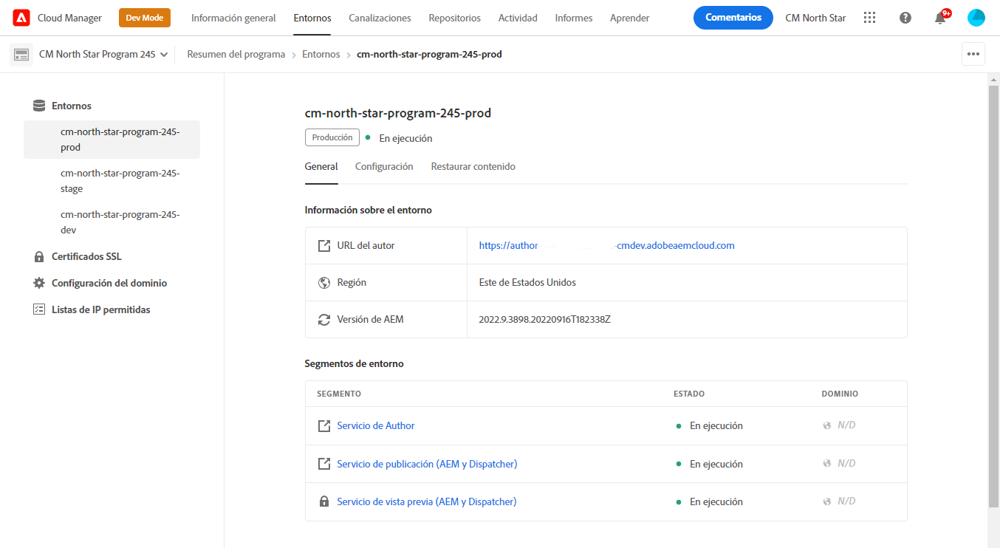

# Administración de entornos {#manage-environments}

En la sección siguiente se describen los tipos de entornos que puede crear un usuario y la forma en que puede crear un entorno.

## Tipos de entornos {#environment-types}

Un usuario con los permisos necesarios puede crear los siguientes tipos de entornos (dentro de los límites de lo que está disponible para el inquilino específico).

* **Entorno**de producción y etapa:
La producción y la fase están disponibles como dúo y se utilizan con fines de prueba y producción.

* **Desarrollo**: Se puede crear un entorno de desarrollo con fines de desarrollo y ensayo y se asociará únicamente a los oleoductos que no sean de producción.

   >[!NOTE]
   >Se configurará un entorno de desarrollo que se crea automáticamente en un programa de Simulador para pruebas para que incluya las soluciones Sitios y Recursos.

   La siguiente tabla resume los tipos de Entornos y sus atributos:

   | Nombre | Nivel de Author | Publicar nivel | El usuario puede crear | El usuario puede eliminar | Canalización que puede asociarse con entorno |
   |--- |--- |--- |--- |---|---|
   | Producción | Sí | Sí si los sitios están incluidos | Sí | No | Canalización de producción |
   | Escenario | Sí | Sí si los sitios están incluidos | Sí | No | Canalización de producción |
   | Desarrollo | Sí | Sí si los sitios están incluidos | Sí | Sí | Canalización sin producción |

   >[!NOTE]
   >La producción y la fase están disponibles como dúo y se utilizan con fines de prueba y producción.  El usuario no podrá crear solo la fase o solo el entorno de producción.

## Añadir Entorno {#adding-environments}

1. Haga clic en **Añadir Entorno** para agregar un entorno. Se puede acceder a este botón desde la pantalla **Entornos** .
   

   La opción **Añadir Entorno** también está disponible en la tarjeta de **Entornos** cuando hay cero entornos en el programa.

   

   >[!NOTE]
   >La opción **Añadir Entorno** se desactivará por falta de permisos o por lo que se pueda contratar.

1. Aparece el cuadro de diálogo **Agregar entorno**. El usuario debe enviar detalles como **Tipo de entorno**, **Nombre de entorno** y **Descripción de entorno** (según el objetivo del usuario al crear el entorno dentro de los límites de lo que está disponible para el inquilino específico).

   

   >[!NOTE]
   >Al crear un entorno, se crean una o más *integraciones* en E/S de Adobe. Son visibles para los usuarios clientes que tienen acceso a la consola de E/S de Adobe y no deben eliminarse. Esto se rechaza en la descripción de la consola de E/S de Adobe.

   

1. Haga clic en **Guardar** para agregar un entorno con los criterios rellenados.  Ahora, la pantalla *Información general* muestra la tarjeta desde la que puede configurar la canalización.

   >[!NOTE]
   >En caso de que aún no haya configurado la canalización sin producción, la pantalla *Información general* muestra la tarjeta desde la que puede crear la canalización sin producción.

## Ver Entorno {#viewing-environment}

La tarjeta de **Entornos** de la página Información general lista hasta tres entornos.

1. Seleccione el botón **Mostrar todo** para desplazarse a la página de resumen de **Entorno** y realizar la vista de una tabla con una lista completa de entornos.

   

1. La página **Entornos** muestra la lista de todos los entornos existentes.

   

1. Seleccione cualquiera de los entornos de la lista para vista de los detalles del entorno.

   

## Actualizando Entorno {#updating-dev-environment}

Las actualizaciones de entornos de fase y producción se administran automáticamente mediante Adobe.

Los usuarios del programa administran las actualizaciones de los entornos de desarrollo. Cuando un entorno no está ejecutando la última versión de AEM disponible al público, el estado de la tarjeta de Entornos en la pantalla principal mostrará la **ACTUALIZACIÓN DISPONIBLE**.

La opción **Actualizar** está disponible en la tarjeta de **Entornos** .
Esta opción también está disponible si hace clic en **Detalles** desde la tarjeta de **Entornos** . Se abre la página **Entornos** y una vez seleccionado el entorno de desarrollo, haga clic en **...** y seleccione **Actualizar**, como se muestra en la figura siguiente:

Al seleccionar esta opción, un administrador de implementación podrá actualizar la canalización asociada con este entorno a la versión más reciente y, a continuación, ejecutar la canalización.

Si la canalización ya se ha actualizado, se solicita al usuario que ejecute la canalización.

## Eliminación de Entorno {#deleting-environment}

El usuario con los permisos necesarios podrá eliminar un entorno de desarrollo.

La opción **Eliminar** está disponible en el menú desplegable de la tarjeta de **Entornos** . Haga clic en **...** para un entorno de desarrollo que desee eliminar.

La opción Eliminar también está disponible si hace clic en **Detalles** en la tarjeta de **Entornos** . Se abre la página **Entornos** y una vez seleccionado el entorno de desarrollo, haga clic en **...** y seleccione **Eliminar**, como se muestra en la figura siguiente:

>[!NOTE]
>
>Esta función no está disponible para el entorno de producción/fase definido en un programa normal configurado para fines de producción. Sin embargo, la función está disponible para entornos de producción/fase en un programa de Simulador para pruebas.

## Administración del acceso {#managing-access}

Seleccione **Administrar acceso** en el menú desplegable de la tarjeta de **Entornos** . Puede desplazarse directamente a la instancia de creación y administrar el acceso del entorno.

Consulte [Administración del acceso a la instancia](/help/onboarding/getting-access-to-aem-in-cloud/navigation.md#manage-access-aem) de autor para obtener más información.

## Acceso a Developer Console {#accessing-developer-console}

Seleccione **Developer Console** en el menú desplegable de la tarjeta de **Entornos** . Se abrirá una nueva ficha en el navegador con la página de inicio de sesión en **Developer Console**.

Solo un usuario de la función de desarrollador tendrá acceso a **Developer Console**. Excepción para los Programas de Simulador para pruebas, en los que cualquier usuario con acceso al Programa de Simulador para pruebas de Cloud Manager tendrá acceso a **Developer Console**.

Consulte Entornos [de Simulador para pruebas de](https://docs.adobe.com/content/help/en/experience-manager-cloud-service/onboarding/getting-access/cloud-service-programs/sandbox-programs.html#hibernating-introduction) hibernación y deshibernación para obtener más detalles.

Esta opción también está disponible si hace clic en **Detalles** desde la tarjeta de **Entornos** . Se abre la página **Entornos** y una vez seleccionado un entorno, haga clic en **...** y seleccione **Developer Console**.

## Iniciar sesión localmente {#login-locally}

Seleccione Inicio de sesión **** local en el menú desplegable de la tarjeta de **Entornos** para iniciar sesión localmente en Adobe Experience Manager.

Además, puede iniciar sesión localmente desde la página de resumen de **Entornos** .

