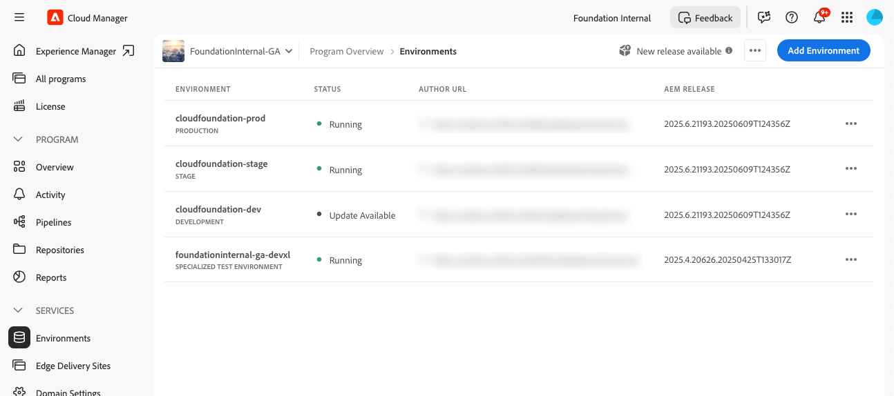
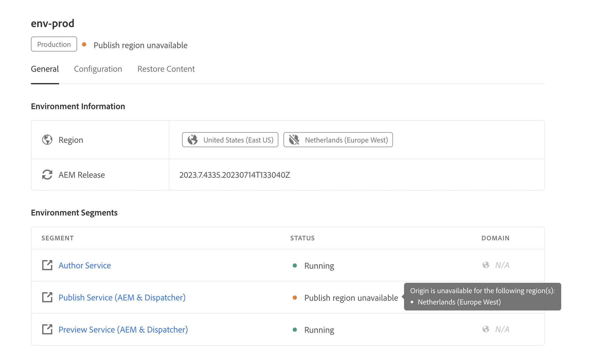

# Administrar entornos {#managing-environments}

Obtenga información sobre los tipos de entornos que puede crear y cómo para su proyecto de Cloud Manager.

## Tipos de entorno {#environment-types}

Un usuario con los permisos necesarios puede crear los siguientes tipos de entornos (dentro de los límites de lo que está disponible para el inquilino específico).

| Tipo de entorno | Descripción |
| --- | --- |
| **Producción + Fase** | Los entornos de producción y ensayo están disponibles en pareja y se utilizan para fines de producción y prueba, respectivamente. Realizar pruebas de rendimiento y seguridad en el entorno de ensayo. Tiene el mismo tamaño que la producción. |
| **Desarrollo** | Se puede crear un entorno de desarrollo con fines de desarrollo y prueba, y solo se puede asociar con canalizaciones que no sean de producción. Los entornos de desarrollo no tienen el mismo tamaño que los de fase y producción, y no deben utilizarse para realizar pruebas de rendimiento y seguridad. |
| **Desarrollo rápido** | Un entorno de desarrollo rápido (RDE) permite a los desarrolladores implementar y revisar cambios rápidamente. Esta capacidad reduce el tiempo necesario para probar características que ya se han validado en un entorno de desarrollo local. Consulte [la documentación del entorno de desarrollo rápido](/help/implementing/developing/introduction/rapid-development-environments.md) para obtener detalles acerca de cómo utilizar un RDE. |
| **Entorno de prueba especializado** | Los entornos de prueba especializados proporcionan un espacio dedicado para validar funciones en condiciones próximas a la producción, lo que resulta ideal para pruebas de resistencia y comprobaciones avanzadas previas a la implementación. Ver [Agregar un entorno de prueba especializado](/help/implementing/cloud-manager/specialized-test-environment.md) |

>[!NOTE]
>
>Actualmente, la característica **Entorno de prueba especializado** solo está disponible a través del programa beta privado. Para registrarse en la versión beta privada, consulte [Entorno de prueba especializado](/help/implementing/cloud-manager/release-notes/current.md#specialized-test-environment).

Las capacidades de los entornos individuales dependen de las soluciones habilitadas en el [programa](/help/implementing/cloud-manager/getting-access-to-aem-in-cloud/program-types.md) del entorno.

* [Sites](/help/overview/introduction.md)
* [Assets](/help/assets/overview.md)
* [Forms](/help/forms/home.md)
* [Screens](/help/screens-cloud/introduction/introduction.md)

>[!NOTE]
>
>Los entornos de producción y ensayo solo se crean como un par. No se puede crear un entorno de solo producción o de solo ensayo.

## Añadir un entorno {#adding-environments}

Para agregar o editar un entorno, un usuario debe ser miembro del rol **Propietario del negocio**.

**Para agregar un entorno:**

1. Inicie sesión en Cloud Manager en [my.cloudmanager.adobe.com](https://my.cloudmanager.adobe.com/) y seleccione la organización adecuada.

1. En la consola **[Mis programas](/help/implementing/cloud-manager/navigation.md#my-programs)**, haga clic en el programa para el que desea agregar un entorno.

1. Realice una de las siguientes acciones:

   Si la opción **Agregar entorno** está atenuada (deshabilitada), puede deberse a la falta de permisos o a que depende de los recursos con licencia.

   * En la consola **[Mis programas](/help/implementing/cloud-manager/navigation.md#my-programs)**, en la tarjeta **Entornos**, haga clic en **Agregar entorno**.

   

   * En el panel lateral izquierdo, haga clic en  **Entornos** y luego, en la página Entornos, cerca de la esquina superior derecha, haga clic en **Agregar entorno**.

     

1. En el cuadro de diálogo **Agregar entorno**, haga lo siguiente:

   * Seleccione un [**tipo de entorno**](#environment-types). El número de entornos disponibles/utilizados se muestra entre paréntesis detrás del nombre de tipo de entorno.
   * Proporcione un entorno **Name**. El nombre del entorno no se puede cambiar una vez creado el entorno.
   * Proporcione una **descripción** opcional para el entorno.
   * Si va a agregar un entorno de **Producción + Fase**, debe proporcionar un nombre de entorno y una descripción tanto para los entornos de producción como de ensayo.
   * Seleccione una **región principal** en la lista desplegable. La región principal no se puede cambiar después de crearse. Además, según los derechos disponibles, es posible que pueda configurar [varias regiones](#multiple-regions).

   

1. Haga clic en **Guardar**.

La página **Información general** ahora muestra su nuevo entorno en la tarjeta **Entornos**. Ahora puede configurar canalizaciones para su nuevo entorno.

## Varias regiones de publicación {#multiple-regions}

Un usuario con la función de **Propietario de empresa** puede configurar entornos de producción y ensayo para incluir hasta tres regiones de publicación adicionales, además de la región principal. Las regiones de publicación adicionales pueden mejorar la disponibilidad. Consulte la [Documentación adicional de regiones de publicación](/help/operations/additional-publish-regions.md) para obtener más información.

>[!TIP]
>
>Puede usar el complemento [API de Cloud Manager](https://developer.adobe.com/experience-cloud/cloud-manager/guides/api-usage/creating-programs-and-environments/#creating-aem-cloud-service-environments) para consultar una lista actual de regiones disponibles.

### Agregar varias regiones de publicación a un entorno nuevo {#add-regions}

Al añadir un entorno nuevo, puede elegir configurar regiones adicionales además de la principal.

1. Seleccione la **Región principal**.
   * La región principal no se puede cambiar después de la creación del entorno.
1. Seleccione la opción **Agregar regiones de publicación adicionales** y aparecerá una nueva **lista desplegable de Regiones de publicación adicionales**. 
1. En el menú desplegable **Regiones de publicación adicionales**, seleccione una región adicional.
1. La región seleccionada se añade debajo del menú desplegable para indicar su selección.
   * Seleccione el(la) `X` que se encuentra junto a la región seleccionada para que pueda anular su selección.
1. Seleccione otra región en el menú desplegable **Regiones de publicación adicionales** para añadir otra región.
1. Seleccione **Guardar** cuando esté listo para crear su entorno.

Las regiones seleccionadas se aplican a los entornos de producción y ensayo.

Si no especifica ninguna región adicional, [puede hacerlo más tarde después de crear los entornos](#edit-regions).

Si desea proporcionar [redes avanzadas](/help/security/configuring-advanced-networking.md) para el programa, se recomienda hacerlo antes de añadir regiones de publicación adicionales a los entornos mediante la API de Cloud Manager. De lo contrario, el tráfico de las regiones de publicación adicionales pasará a través del proxy de la región principal.

### Editar varias regiones de publicación {#edit-regions}

Si no ha especificado ninguna región adicional al principio, puede hacerlo después de crear el entorno y de tener los derechos necesarios.

También puede quitar regiones de publicación adicionales. Sin embargo, sólo puede agregar o quitar regiones en una transacción. Si necesita añadir una región y quitar una región, primero añádala, guarde el cambio y, a continuación, quítela (o viceversa).

1. En la consola Información general del programa de tu programa, haz clic en  para tu entorno de producción y selecciona **Editar** en el menú.

   

1. En el cuadro de diálogo **Editar entorno de producción**, realice los cambios necesarios en las regiones de publicación adicionales.
   * Utilice el menú desplegable **Regiones de publicación adicionales** para seleccionar regiones adicionales.
   * Haga clic en la X situada junto a las regiones de publicación adicionales seleccionadas para anular su selección.

   

1. Seleccione **Guardar** para guardar los cambios.

Los cambios realizados en el entorno de producción se aplican tanto a los entornos de producción como a los de ensayo. Los cambios en varias regiones de publicación solo se pueden editar en el entorno de producción.

Si desea proporcionar [redes avanzadas](/help/security/configuring-advanced-networking.md) para el programa, se recomienda hacerlo antes de añadir regiones de publicación adicionales a los entornos. De lo contrario, el tráfico de las regiones de publicación adicionales pasará a través del proxy de la región principal.

## Ver detalles de un entorno {#viewing-environment}

1. Inicie sesión en Cloud Manager en [my.cloudmanager.adobe.com](https://my.cloudmanager.adobe.com/) y seleccione la organización adecuada.

1. En la consola **[Mis programas](/help/implementing/cloud-manager/navigation.md#my-programs)**, haga clic en el programa para el que desee ver los detalles de un entorno.

1. Enumere todos los entornos para el programa mediante uno de los procedimientos siguientes:

   * En el menú del lado izquierdo, debajo de **Servicios**, haga clic en  **Entornos**.

   

   * En el menú del lado izquierdo, debajo de **Programa**, haga clic en **Información general** y, a continuación, en la tarjeta **Entornos**, haga clic en  **Mostrar todo**.

     

   >[!NOTE]
   >
   >La tarjeta **Entornos** solo enumera tres entornos. Haga clic en **Mostrar todo** en la tarjeta para ver *todos* los entornos del programa.

1. En la página Entornos, realice una de las siguientes acciones:

   * Haga clic en un entorno de la lista para ver sus detalles.

   

   * Haga clic en el  del entorno que desee y, a continuación, haga clic en **Ver detalles**.

   

## Restaurar contenido de un entorno (Alpha) {#restore-environment}

Ver [Restauración de contenido en AEM as a Cloud Service](/help/operations/restore.md).

### Acceso al servicio de vista previa {#access-preview-service}

Cloud Manager proporciona un servicio de vista previa (ofrecido como un servicio de publicación adicional) para cada entorno de AEM as a Cloud Service.

Con el servicio puede obtener una vista previa de la experiencia final de un sitio web antes de que llegue al entorno de publicación real y de que esté disponible públicamente.

Una vez creado, al servicio de vista previa se le aplica la lista de IP permitidas predeterminadas, etiquetada como `Preview Default [<envId>]`, que bloquea todo el tráfico en el servicio de vista previa. Anule la aplicación de la lista de IP permitidas predeterminadas del servicio de vista previa para poder habilitar el acceso.

Un usuario con los permisos necesarios debe completar los siguientes pasos antes de compartir la URL del servicio de vista previa para garantizar el acceso a él.

1. Cree una Lista de permitidos IP adecuada, aplíquela al servicio de vista previa y cancele inmediatamente la aplicación de la lista de permitidos `Preview Default [<envId>]`.

   Consulte [Aplicar y anular la aplicación de Listas de permitidos IP](/help/implementing/cloud-manager/ip-allow-lists/apply-allow-list.md) para obtener más información.

1. Use el flujo de trabajo de actualización de la Lista de permitidos IP **IP** para quitar la IP predeterminada y agregar las IP necesarias. Consulte [Administrar Listas de permitidos IP](/help/implementing/cloud-manager/ip-allow-lists/managing-ip-allow-lists.md) para obtener más información.

Una vez desbloqueado el acceso al servicio de vista previa, ya no se muestra el icono de bloqueo delante del nombre del servicio de vista previa.

Una vez activado, puede publicar contenido en el servicio de vista previa mediante la interfaz de usuario **`Manage Publication`** en AEM. Consulte [Previsualizar contenido](/help/sites-cloud/authoring/sites-console/previewing-content.md) para obtener más información.

>[!NOTE]
>
>Su entorno debe estar en la versión `2021.05.5368.20210529T101701Z` de AEM o más reciente para utilizar el servicio de vista previa. Asegúrese de que la canalización de actualización se haya ejecutado correctamente en su entorno para que pueda utilizar el servicio de vista previa.

### Estado de las regiones de publicación adicionales {#additional-region-status}

Si ha activado regiones de publicación adicionales, puede comprobar el estado de estas regiones desde la tarjeta **Entornos**.

1. En la página **Información general**, busque la tarjeta **Entornos**.

1. En la tarjeta **Entornos**, la columna **Estado** indica si hay algún problema con las regiones de publicación adicionales configuradas. Haga clic en el icono **Información** para ver los detalles de las regiones.

   

También puede obtener acceso a la misma información desde la ficha **Entornos**.

1. En la página **Información general**, haga clic en  **Entornos**.

1. En la página **Entornos**, seleccione el entorno que desee consultar en el menú del lado izquierdo.

1. Después de seleccionar un entorno:

   * La tabla **Información del entorno** muestra qué regiones están configuradas para el entorno seleccionado.
   * La columna **Estado** de la tabla **Segmentos de entorno** indica si hay algún problema con las regiones de publicación adicionales configuradas. Pase el ratón sobre el estado para ver los detalles de cualquier problema.

   

Si hay algún problema notificado con regiones de publicación adicionales, tenga paciencia. Cloud Manager intenta continuamente recuperar la región y puede estar disponible en cualquier momento. Si el problema persiste después de varias horas, puede quitar la región de publicación adicional y volver a agregarla (en la misma región u otra región) para almacenar en déclencheur una implementación completa.

El tiempo que espera a que el sistema se recupere por sí solo antes de realizar acciones adicionales depende del impacto que el fallo de esa región tenga en sus sistemas.

Independientemente, el tráfico de [siempre se enruta a la región más cercana que esté en línea](/help/operations/additional-publish-regions.md). Si sigue teniendo problemas, póngase en contacto con el Servicio de atención al cliente de Adobe.

## Actualizar entornos {#updating-dev-environment}

Como servicio nativo de la nube, Adobe administra automáticamente las actualizaciones para los entornos de desarrollo, ensayo y producción dentro de los programas de producción.

Sin embargo, las actualizaciones de los entornos de los programas de zonas protegidas se administran dentro de los programas. Cuando un entorno de este tipo no ejecuta la última versión de AEM disponible públicamente, el estado de la tarjeta **Entornos** en la pantalla **Información general** del programa muestra **Actualización disponible**.

### Actualizaciones y canalizaciones {#updates-pipelines}

Las canalizaciones son la única manera de [implementar código en los entornos de AEM as a Cloud Service](deploy-code.md). Por este motivo, cada canalización está asociada a una versión de AEM determinada.

Cuando Cloud Manager detecta una versión de AEM más reciente que la implementada por última vez con la canalización, muestra el estado de **Actualización disponible** para el entorno.

Por lo tanto, el proceso de actualización consta de dos pasos:

1. Actualización de la canalización con la última versión AEM
1. Ejecución de la canalización para implementar la nueva versión de AEM en un entorno

### Actualizar los entornos {#updating-your-environments}

>[!NOTE]
> A partir de 2024, las instancias de desarrollo y algunos programas de zonas protegidas ya se actualizan automáticamente, por lo que no es necesario administrar las actualizaciones para ellos manualmente. Como resultado de esta transición, es posible que la opción de Actualizar el entorno manualmente para instancias de desarrollo no esté disponible para _algunos_ de sus programas.

La opción **Actualizar** está disponible en la tarjeta **Entornos** para entornos de desarrollo y zona protegida específicos. Haga clic en  junto al entorno para acceder a **Actualizar**.

Esta opción también está disponible si hace clic en la ficha **Entornos** del programa y, a continuación, hace clic en el  del entorno.

Un usuario con el rol **Administrador de implementación** o **Propietario del negocio** puede usar esta opción para actualizar la canalización asociada con este entorno a la última versión de AEM.

Una vez que la versión de la canalización se actualice a la última versión de AEM disponible públicamente, se solicitará al usuario que ejecute la canalización asociada para implementar la última versión en el entorno.

El comportamiento de la opción **Actualizar** varía según la configuración y el estado actual del programa.

| Estado | La opción Actualizar... |
| --- | --- |
| La canalización ya se ha actualizado | solicita al usuario que ejecute la canalización. |
| La canalización ya se está actualizando | informa al usuario de que ya se está ejecutando una actualización. |
| La canalización no existe | solicita al usuario que cree uno. |

## Eliminar entornos de desarrollo {#deleting-environment}

Un usuario con el rol **Administrador de implementación** o **Propietario del negocio** puede eliminar un entorno de desarrollo.

En la pantalla **Información general** del programa que se encuentra en la tarjeta **Entornos**, haga clic en el  del entorno de desarrollo que desee eliminar.

La opción **Delete** también está disponible en la ficha **Entornos** de la ventana **Información general** del programa. Haga clic en el  del entorno y seleccione **Eliminar**.

>[!NOTE]
>
>* Los entornos de producción y ensayo creados en un programa de producción no se pueden eliminar.
>* Se pueden eliminar los entornos de producción y ensayo de un programa de zona protegida.

## Administrar acceso {#managing-access}

Seleccione **Administrar el acceso** del menú de los tres puntos del entorno en la tarjeta **Entornos**. Puede navegar hasta la instancia de autor directamente y administrar el acceso para su entorno.

>[!TIP]
>
>Consulte [Perfiles de equipo y producto de AEM as a Cloud Service](/help/onboarding/aem-cs-team-product-profiles.md) para obtener información sobre cómo los perfiles de equipo y producto de AEM as a Cloud Service pueden conceder y limitar el acceso a sus soluciones de Adobe con licencia.

## Acceso a la consola de desarrollador {#accessing-developer-console}

1. En la tarjeta **Entorno**, haga clic en  y, a continuación, haga clic en **Developer Console**.

Se abre una nueva pestaña en el explorador con la página de inicio de sesión en **Developer Console**.

Solo un usuario con la función **Desarrollador** tendrá acceso a la **Consola de desarrollador**. Sin embargo, para los programas de zonas protegidas, cualquier usuario con acceso a la zona protegida tiene acceso a **Developer Console**.

Consulte [Entornos de zona protegida en hibernación y cancelación de la hibernación](https://experienceleague.adobe.com/en/docs/experience-manager-cloud-service/content/implementing/using-cloud-manager/programs/introduction-sandbox-programs#hibernation) para obtener más información.

Esta opción también está disponible en la ficha **Entorno** de la ventana **Información general** al hacer clic en el  de un entorno individual.

## Iniciar sesión localmente {#login-locally}

1. Realice una de las siguientes acciones:

   * En la tarjeta **Entorno**, haga clic en  y, a continuación, haga clic en **Inicio de sesión local**.

     

   * En el panel lateral izquierdo, haga clic en  **Entornos**. En la página **Entornos**, haga clic en  y, a continuación, haga clic en **Inicio de sesión local**.

     

## Administrar nombres de dominio personalizados {#manage-cdn}

Los nombres de dominio personalizados se admiten en los programas de Cloud Manager para Sites tanto para los servicios de publicación como de vista previa.

>[!TIP]
>
>Para obtener más información, vea [Introducción a los nombres de dominio personalizados](/help/implementing/cloud-manager/custom-domain-names/introduction.md).

## Administrar listas de IP permitidas {#manage-ip-allow-lists}

Cloud Manager admite una Lista de permitidos IP para los servicios de creación, publicación y vista previa de los programas de Sites.

Para administrar Listas de permitidos IP, vaya a la página  **Entornos** de la página **Información general** de su programa. Haga clic en un entorno individual para poder administrar sus detalles.

### Aplicar una Lista de permitidos IP {#apply-ip-allow-list}

La aplicación de una Lista de permitidos IP vincula todos los intervalos de IP definidos a un servicio de autor o publicación del entorno.

>[!TIP]
>
>Para obtener más información, vea [Introducción a las Listas de permitidos IP](/help/implementing/cloud-manager/ip-allow-lists/introduction.md).
