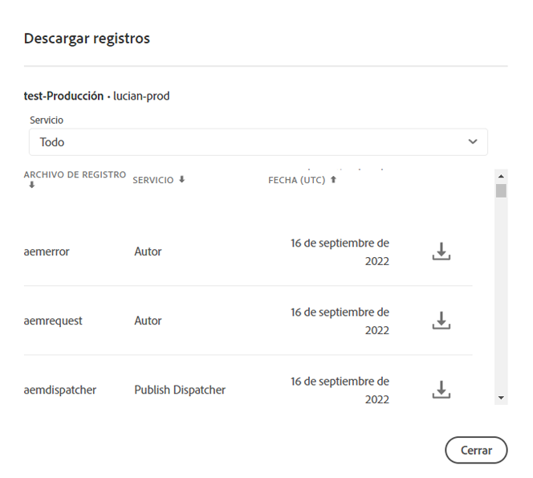

# Acceder y administrar registros {#manage-logs}

Los usuarios pueden acceder a una lista de archivos de registro disponibles para el entorno seleccionado mediante la tarjeta de entorno. Los usuarios pueden acceder a una lista de archivos de registro para el entorno seleccionado.

## Descarga de registros {#download-logs}

Estos archivos se pueden descargar a través de la interfaz de usuario desde la tarjeta **Environments** de la página **Overview**:


O bien, desde la página Detalles del entorno :


>[!NOTE]
>Independientemente de dónde se abra, aparece el mismo cuadro de diálogo y permite descargar un archivo de registro individual.



## Descarga de registros para el servicio de vista previa {#download-preview-service}

Siga los pasos a continuación para descargar los registros del servicio de vista previa

1. Vaya a la tarjeta **Environments** desde la página **Overview** de Cloud Manager.

1. Seleccione **Download Logs** de **...**.

1. En el menú desplegable **Service**, seleccione **Preview** o **Preview Dispatcher**, seguido de hacer clic en el icono de descarga.

   >[!NOTE]
   >Esta acción también se puede realizar desde la página de detalles del entorno.

   


## Registros a través de la API {#logs-through-api}

Además de descargar registros a través de la interfaz de usuario, los registros estarán disponibles a través de la API y la interfaz de la línea de comandos.

Por ejemplo, para descargar los archivos de registro de un entorno específico, el comando sería algo más que las líneas de

```java
$ aio cloudmanager:download-logs --programId 5 1884 author aemerror
```

El siguiente comando permite adaptar los registros:

```java
$ aio cloudmanager:tail-log --programId 5 1884 author aemerror
```

Para obtener el ID de entorno (1884 en este caso) y las opciones de servicio o nombre de registro disponibles, puede utilizar:

```java
$ aio cloudmanager:list-environments
Environment Id Name                     Type  Description                          
1884           FoundationInternal_dev   dev   Foundation Internal Dev environment  
1884           FoundationInternal_stage stage Foundation Internal STAGE environment
1884           FoundationInternal_prod  prod  Foundation Internal Prod environment
 
 
$ aio cloudmanager:list-available-log-options 1884
Environment Id Service    Name         
1884           author     aemerror     
1884           author     aemrequest   
1884           author     aemaccess    
1884           publish    aemerror     
1884           publish    aemrequest   
1884           publish    aemaccess    
1884           dispatcher httpderror   
1884           dispatcher aemdispatcher
1884           dispatcher httpdaccess
```

>[!NOTE]
>Mientras que las **descargas de registro** estarán disponibles a través de la interfaz de usuario y la API, el **Seguimiento de registros** es solo API/CLI.

### Recursos adicionales {#resources}

Consulte los siguientes recursos adicionales para obtener más información sobre la API de Cloud Manager y la CLI de Adobe I/O:

* [Documentación de la API de Cloud Manager](https://www.adobe.io/apis/experiencecloud/cloud-manager/docs.html)
* [CLI de Adobe I/O](https://github.com/adobe/aio-cli-plugin-cloudmanager)
