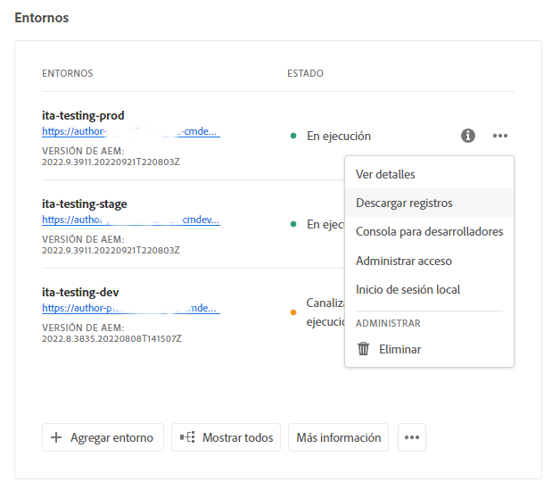
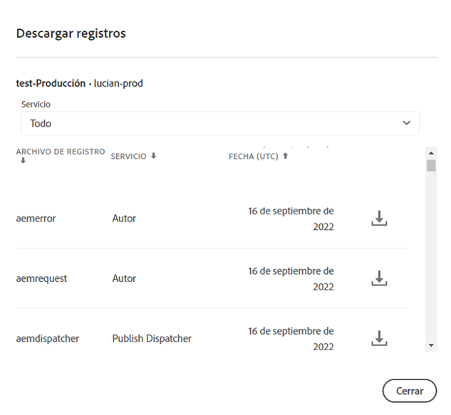
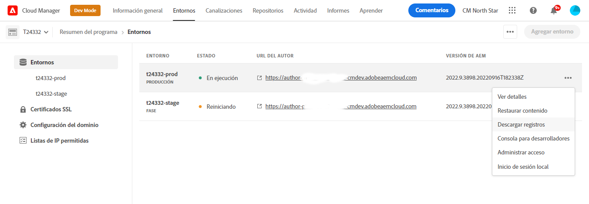

# Acceder y administrar registros {#manage-logs}

Obtenga información sobre cómo acceder y administrar registros para ayudarle en el proceso de desarrollo en AEM as a Cloud Service.

Puede acceder a una lista de archivos de registro disponibles para el entorno seleccionado mediante la tarjeta **Entornos** de la página **Información general** o de la página Detalles del entorno.

Los registros se conservan durante siete días.

## Descargar registros {#download-logs}

Para descargar registros, haga lo siguiente:

1. Inicie sesión en Cloud Manager en [my.cloudmanager.adobe.com](https://my.cloudmanager.adobe.com/) y seleccione la organización adecuada.

1. En la consola **[Mis programas](/help/implementing/cloud-manager/navigation.md#my-programs)**, seleccione el programa.

1. Navegue hasta la tarjeta **Entornos** de la página **Información general**.

1. Seleccione **Descargar registros** en el menú de los tres puntos.

   

1. En el cuadro de diálogo **Descargar registros**, seleccione el **Servicio** apropiado del menú desplegable

   

   En caso de que [se habiliten más regiones de publicación](/help/operations/additional-publish-regions.md) para su entorno, puede seleccionar cada región y descargar sus registros por separado, como se muestra a continuación:

   

1. Una vez seleccionado el servicio, haga clic en el icono de descarga situado junto al registro que desea recuperar.

También puede acceder a sus registros desde la página **Entornos**.



## Registros a través de la API {#logs-through-api}

Además de descargar registros a través de la interfaz de usuario, también están disponibles a través de la API y la interfaz de la línea de comandos.

Para descargar los archivos de registro para un entorno específico, el comando sería similar al siguiente.

```shell
$ aio cloudmanager:download-logs --programId 5 1884 author aemerror
```

Además, puede poner en cola los registros a través de la interfaz de línea de comandos.

```shell
$ aio cloudmanager:tail-log --programId 5 1884 author aemerror
```

Para obtener el ID de entorno (1884 en este ejemplo) y las opciones de servicio o nombre de registro disponibles, puede utilizar los siguientes comandos.

```shell
$ aio cloudmanager:list-environments
Environment Id Name                     Type  Description                          
1884           FoundationInternal_dev   dev   Foundation Internal Dev environment  
1884           FoundationInternal_stage stage Foundation Internal STAGE environment
1884           FoundationInternal_prod  prod  Foundation Internal Prod environment
 
 
$ aio cloudmanager:list-available-log-options 1884
Environment Id Service    Name         
1884           author     aemerror     
1884           author     aemrequest   
1884           author     aemaccess    
1884           publish    aemerror     
1884           publish    aemrequest   
1884           publish    aemaccess    
1884           dispatcher httpderror   
1884           dispatcher aemdispatcher
1884           dispatcher httpdaccess
```

### Recursos adicionales {#resources}

>[!TIP]
>
>Consulte [este recurso de vídeo](https://app.frame.io/reviews/28cdf463-b7fc-443b-a54a-93cb7da6567e/dbf158f1-568b-4efc-8fbc-3b241561cbab) para obtener más información sobre la depuración de AEM as a Cloud Service.

Consulte los siguientes recursos adicionales para obtener más información sobre la API de Cloud Manager y la CLI de Adobe I/O:

* [ Documentación de la API de Cloud Manager](https://developer.adobe.com/experience-cloud/cloud-manager/)
* [CLI de Adobe I/O](https://github.com/adobe/aio-cli-plugin-cloudmanager)

Consulte los siguientes recursos adicionales para obtener más información sobre los archivos de registro en AEM as a Cloud Service:

* [Archivos de registro de AEM de Cloud 5](https://experienceleague.adobe.com/en/docs/experience-manager-learn/cloud-service/expert-resources/cloud-5/cloud5-aem-log-files#)
* [Depuración de AEM as a Cloud Service mediante registros](https://experienceleague.adobe.com/en/docs/experience-manager-learn/cloud-service/debugging/debugging-aem-as-a-cloud-service/logs#)
