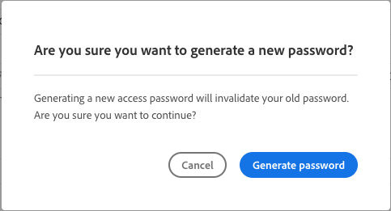

# Información de acceso al repositorio {#accessing-repos}

Obtenga información sobre cómo acceder y gestionar sus repositorios de Git administrados por Adobe mediante la administración de cuentas de Git de autoservicio desde Cloud Manager.

## Acceder a la información del repositorio desde la página Información general {#overview-page}

Cloud Manager facilita la recuperación de la información de acceso al repositorio para repositorios administrados por Adobe mediante **Acceder a la info del repositorio** desde la tarjeta **Canalizaciones**.

El cuadro de diálogo **Información del repositorio** le permite ver la siguiente información de acceso para los repositorios administrados por el Adobe:

* El nombre de usuario de Git.
* La contraseña de Git.
* La dirección URL del repositorio de Git de Cloud Manager.
* Comandos de Git prediseñados para añadir rápidamente un remoto a su repositorio Git y enviar códigos.

La información de acceso de los [repositorios privados](private-repositories.md) no está disponible en Cloud Manager.

La característica **Acceder a la info del repositorio** es visible para los usuarios con los roles **Desarrollador** o **Administrador de implementación**.

**Para tener acceso a la información del repositorio desde la página Información general:**

1. Inicie sesión en Cloud Manager en [my.cloudmanager.adobe.com](https://my.cloudmanager.adobe.com/) y seleccione la organización y programa adecuados.

1. En la página **Resumen del programa**, en la tarjeta **Canalizaciones**, haga clic en **Acceder a la info del repositorio**.

   

1. Para acceder a la contraseña, debe generar una nueva. En el cuadro de diálogo **Información del repositorio**, seleccione **Generar contraseña**.

1. En el cuadro de diálogo de confirmación, seleccione **Generar contraseña**.

   

1. A la derecha del campo **Contraseña**, haga clic en  para copiar la contraseña en el portapapeles.

   * La generación de la contraseña invalida la anterior.
   * Cloud Manager no guarda la contraseña. Es su responsabilidad guardar la contraseña de forma segura.
   * Como Cloud Manager no guarda la contraseña, si la pierde, debe volver a generar una nueva.

   

Con estas credenciales, puede clonar una copia local del repositorio, realizar cambios en ese repositorio local y, luego, confirmar cualquier cambio de código en el repositorio remoto de códigos en Cloud Manager.

## Acceder a la información del repositorio desde la página Repositorios {#repositories-window}

La característica **Acceder a la info del repositorio** también está disponible en la página [**Repositorios**](managing-repositories.md). Muestra la misma información sobre el acceso a los repositorios administrados por Adobe.

## Revocar una contraseña de acceso {#revoke-password}

Puede revocar una contraseña de acceso en cualquier momento.

Para ello, [cree un vale de soporte técnico para esta solicitud](https://experienceleague.adobe.com/es?support-solution=Experience+Manager&support-tab=home&lang=es#support). El billete se trata con alta prioridad y se suele revocar en el plazo de un día.
