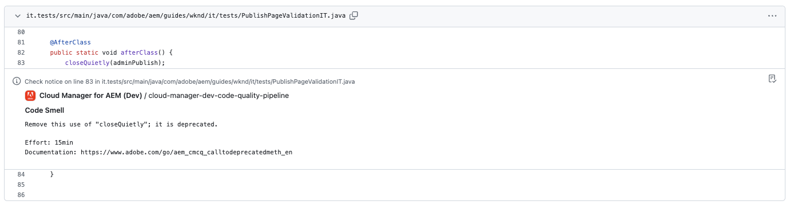

# Anotaciones de comprobación de GitHub {#github-annotations}

Descubra cómo GitHub comprueba las PR de anotación de sus repositorios privados para proporcionarle comentarios útiles.

## Información general {#overview}

Si está utilizando [repositorios privados](private-repositories.md) para su programa de Cloud Manager, las comprobaciones en GitHub se ejecutan automáticamente para cada solicitud de extracción. Estos se anotan con información útil para ayudarle a comprender cualquier problema con su código lo antes posible.

[Calidad de código](/help/implementing/cloud-manager/code-quality-testing.md) problemas detectados por [SonarQube](/help/implementing/cloud-manager/custom-code-quality-rules.md) se enumeran claramente.

Se proporciona la línea exacta de código con el problema y puede hacer clic en él para mostrar el código correspondiente. Estas anotaciones se proporcionan para todos los problemas de código, no solo los modificados en la solicitud de extracción.

Todas las líneas anotadas se agregan en la **Archivos cambiados** en la solicitud de extracción de GitHub. Las anotaciones para archivos que no se cambiaron en la solicitud de extracción aparecen en su propia sección.

## Canalizaciones de calidad de código {#code-quality-pipelines}

El [calidad del código](/help/implementing/cloud-manager/code-quality-testing.md) Los resultados también son visibles en la canalización, que Cloud Manager activa automáticamente en la parte inferior de la **Cheques** pestaña. También se puede acceder a él desde el **Detalles** de la comprobación de la solicitud de extracción.

También puede visualizar los problemas en forma de CSV. Esto lo puede recuperar [ver los detalles de la ejecución de la canalización en Cloud Manager.](/help/implementing/cloud-manager/configuring-pipelines/managing-pipelines.md#view-details)
