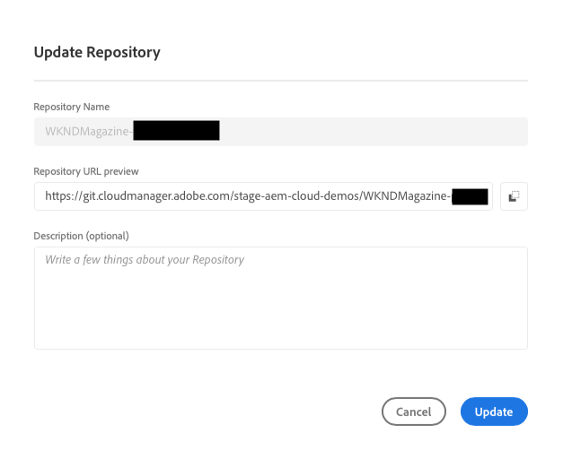

# Administración de repositorios en Cloud Manager {#managing-repos}

Obtenga información sobre cómo crear, ver y eliminar repositorios de Git en Cloud Manager.

## Información general {#overview}

Los repositorios se utilizan para almacenar y administrar el código del proyecto mediante Git. Cada programa que crea en Cloud Manager tiene un repositorio administrado por Adobe creado para él.

Puede elegir crear repositorios adicionales para administrar Adobes y también agregar sus propios repositorios privados. Todos los repositorios asociados con su programa se pueden ver en la **Repositorios** ventana.

Los repositorios creados en Cloud Manager también estarán disponibles para su selección al añadir o editar canalizaciones. Consulte [Canalizaciones de CI-CD](/help/implementing/cloud-manager/configuring-pipelines/introduction-ci-cd-pipelines.md) para obtener más información.

Hay un único repositorio principal o una rama para una canalización determinada. Con [compatibilidad con el submódulo git,](git-submodules.md) se pueden incluir muchas ramas secundarias en el momento de la compilación.

## Ventana Repositorios {#repositories-window}

1. Inicie sesión en Cloud Manager en [my.cloudmanager.adobe.com](https://my.cloudmanager.adobe.com/) y seleccione la organización y programa adecuados.

1. Desde el **Resumen del programa** , seleccione la **Repositorios** para cambiar a la pestaña **Repositorios** página.

1. El **Repositorios** La ventana muestra todos los repositorios asociados a su programa.

   

El **Repositorios** Esta ventana proporciona detalles sobre los repositorios:

* El tipo de repositorio
   * **Adobe** indica repositorios administrados por Adobe
   * **GitHub** indica los repositorios privados de GitHub que administra
* Cuando se creó
* Canalizaciones asociadas al repositorio de

Puede seleccionar el repositorio en la ventana y hacer clic en el botón de puntos suspensivos para realizar una acción en el repositorio seleccionado.

* **[Comprobar ramas / Crear proyecto](#check-branches)** (solo disponible para repositorios de Adobe)
* **[Copiar URL del repositorio](#copy-url)**
* **[Ver y actualizar](#view-update)**
* **[Eliminar](#delete)**

## Adición de repositorios {#adding-repositories}

Haga clic o pulse en **Añadir repositorio** botón en el **Repositorios** para iniciar la **Añadir repositorio** asistente.

Cloud Manager admite ambos repositorios administrados por el Adobe (**Repositorio de Adobe**), así como sus propios repositorios autoadministrados (**Repositorio privado**). Los campos obligatorios difieren según el tipo de repositorio que decida añadir. Consulte los siguientes documentos para obtener más información.

* [Adición de repositorios de Adobe en Cloud Manager](adobe-repositories.md)
* [Adición de repositorios privados en Cloud Manager](private-repositories.md)

>[!NOTE]
>
>* Un usuario debe tener la función **Administrador de implementación** o **Propietario empresarial** para poder añadir un repositorio.
>* Hay un límite de 300 repositorios en todos los programas de cualquier empresa u organización de IMS.

## Acceder a la info del repositorio {#repo-info}

Cuando vea sus repositorios en la **Repositorios** , puede ver los detalles sobre cómo acceder a los repositorios administrados por Adobe mediante programación tocando o haciendo clic en el botón **Acceder a info del repositorio** en la barra de herramientas.

El **Información del repositorio** se abre con los detalles. Para obtener más información sobre el acceso a la información del repositorio, consulte el documento [Acceder a Información de repositorio.](accessing-repos.md)

## Comprobar ramas/Crear proyecto {#check-branches}

El **Comprobar ramas / Crear proyecto** La acción realiza dos funciones según el estado del repositorio.

* Si el repositorio es de nueva creación, la acción crea un proyecto de ejemplo basado en [AEM el arquetipo del proyecto de la.](https://experienceleague.adobe.com/es/docs/experience-manager-core-components/using/developing/archetype/overview)
* Si el repositorio ya ha creado el proyecto de muestra, comprueba el estado del repositorio y sus ramas e informa de nuevo si el proyecto de muestra ya existe.

## Copiar la URL del repositorio {#copy-url}

El **Copiar URL del repositorio** La acción copia la URL del repositorio seleccionado en la **Repositorios** al portapapeles para utilizarlo en otra parte.

## Ver y actualizar {#view-update}

El **Ver y actualizar** La acción abre el **Actualizar repositorio** diálogo. Si lo utiliza, puede ver las **Nombre** y **Previsualización de URL del repositorio** así como actualizar el **Descripción** del repositorio.

## Eliminar {#delete}

El **Eliminar** esta acción elimina el repositorio del proyecto. Un repositorio no se puede eliminar si está asociado a una canalización.

Al eliminar un repositorio:

* Se impide que el nombre del repositorio eliminado se pueda utilizar para nuevos repositorios que se puedan crear en el futuro.
   * El mensaje de error `Repository name should be unique within organization.` aparece en estos casos.
* Se hace que el repositorio eliminado no esté disponible en Cloud Manager y no esté disponible para vincularlo a una canalización.
