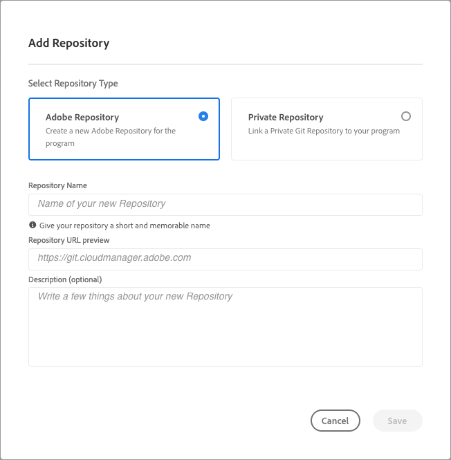

# Administración de repositorios en Cloud Manager {#managing-repos}

Obtenga información sobre cómo ver, agregar y eliminar repositorios de Git en Cloud Manager.

## Acerca de los repositorios en Cloud Manager {#overview}

Los repositorios de Cloud Manager se utilizan para almacenar y administrar el código del proyecto mediante Git. Por cada *programa* que añada, se creará automáticamente un repositorio administrado por Adobe.

Además, tiene la opción de crear más repositorios administrados por Adobe o añadir sus propios repositorios privados. Todos los repositorios vinculados con su programa se pueden ver en la página **Repositorios**.

Los repositorios creados en Cloud Manager también se pueden seleccionar al añadir o editar canalizaciones. Para obtener más información sobre la configuración de canalizaciones, consulte [Canalizaciones de CI-CD](/help/implementing/cloud-manager/configuring-pipelines/introduction-ci-cd-pipelines.md).

Cada canalización está vinculada a un repositorio o rama principal. Sin embargo, la [compatibilidad con el submódulo Git](git-submodules.md) permite incluir múltiples ramas secundarias durante el proceso de compilación.

## Ver la página Repositorios {#repositories-window}

En la página **Repositorios** puede ver los detalles del repositorio seleccionado. Esta información incluye el tipo de repositorio en uso. Si el repositorio está marcado como **Adobe**, esto significa que se trata de un repositorio administrado por Adobe. Si está etiquetado como **GitHub**, hace referencia a un repositorio privado de GitHub administrado por usted. Además, la página proporciona detalles como cuándo se creó el repositorio y las canalizaciones asociadas a él.

Para llevar a cabo acciones en un repositorio seleccionado, puede hacer clic en el repositorio y usar el icono  para abrir un menú desplegable. Para los repositorios administrados por Adobe, puede **[Comprobar ramas/Crear proyecto](#check-branches)**.

*Menú desplegable en la página Repositorios.*

Otras acciones disponibles en el menú desplegable incluyen **[Copiar la URL del repositorio](#copy-url)**, **[Ver y actualizar](#view-update)** y **[Eliminar](#delete)** el repositorio.

**Para ver la página Repositorios:**

1. Inicie sesión en Cloud Manager en [my.cloudmanager.adobe.com](https://my.cloudmanager.adobe.com/) y seleccione la organización y programa adecuados.

1. En la página **Resumen del programa**, en el menú lateral, haga clic en el icono  **Repositorios**.

1. La página **Repositorios** muestra todos los repositorios asociados con el programa seleccionado.

   
   *Página Repositorios en Cloud Manager.*

## Añadir un repositorio {#adding-repositories}

Un usuario debe tener la función **Administrador de implementación** o **Propietario del negocio** para poder añadir un repositorio.

En la página **Repositorios**, junto a la esquina superior derecha, haga clic en **Agregar repositorio**

*Cuadro de diálogo Agregar repositorio.*

Cloud Manager admite dos tipos de repositorios: repositorios administrados por Adobe (**Repositorio de Adobe**) y repositorios autoadministrados (**Repositorio privado**). Los campos obligatorios para la configuración difieren según el tipo de repositorio que decida añadir. Para obtener más información, consulte lo siguiente:

* [Adición de repositorios de Adobe en Cloud Manager](adobe-repositories.md)
* [Adición de repositorios privados en Cloud Manager](private-repositories.md)

Hay un límite de 300 repositorios en todos los programas de cualquier compañía u organización de IMS.

## Acceder a la información del repositorio {#repo-info}

Cuando vea sus repositorios en la ventana **Repositorios**, puede ver los detalles sobre cómo acceder programáticamente a los repositorios administrados por Adobe pulsando o haciendo clic en el botón **Acceder a la info del repositorio** en la barra de herramientas.

La ventana **Información del repositorio** se abre con los detalles. Para obtener más información sobre el acceso a la información del repositorio, consulte el documento [Acceso a la información del repositorio](/help/implementing/cloud-manager/managing-code/accessing-repos.md).

## Comprobar ramas/Crear proyecto {#check-branches}

En **AEM Cloud Manager**, la acción **Comprobar ramas/Crear proyecto** tiene dos propósitos, según el estado actual del repositorio.

* Si el repositorio es de nueva creación, esta acción crea un proyecto de muestra usando [el tipo de archivo del proyecto AEM](https://experienceleague.adobe.com/es/docs/experience-manager-core-components/using/developing/archetype/overview).
* Si el proyecto de muestra ya está creado en el repositorio, la acción comprueba el estado del repositorio y sus ramas, y proporciona comentarios sobre si el proyecto de muestra ya existe.

  

## Copiar la URL del repositorio {#copy-url}

La acción **Copiar la URL del repositorio** copia la URL del repositorio seleccionado en la página **Repositorios** en el portapapeles para utilizarla en otro lugar.

## Ver y actualizar un repositorio {#view-update}

La acción **Ver y actualizar** abre el cuadro de diálogo **Actualizar repositorio**, en el que puede ver el **Nombre** y la **Vista previa de la URL del repositorio** del repositorio en cuestión. Además, le permite actualizar la **Descripción** del repositorio.

## Eliminar un repositorio {#delete}

La acción **Eliminar** elimina el repositorio del proyecto. Un repositorio no se puede eliminar si está asociado con una canalización.

Al eliminar un repositorio, su nombre no se puede utilizar para ningún repositorio nuevo creado en el futuro. Si intenta agregar un repositorio con el mismo nombre de un repositorio eliminado, aparecerá el siguiente mensaje de error:

`Repository name should be unique within organization.`

Además, el repositorio eliminado ya no está disponible en Cloud Manager y no se puede vincular a ninguna canalización.

