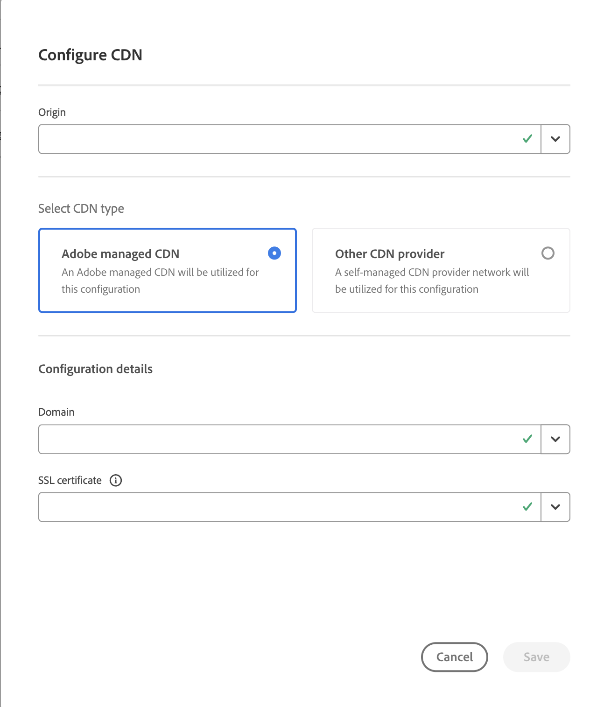

# Certificados validados por dominio (DV) {#domain-validated-certificates}

Obtenga información sobre cómo administrar certificados validados por dominio (DV) en Cloud Manager.

>[!NOTE]
>
>Esta funcionalidad solo está disponible para [el programa de clientes pioneros.](/help/implementing/cloud-manager/release-notes/current.md#early-adoption)

## Introducción {#introduction}

Cloud Manager le permite generar y administrar de autoservicio un certificado SSL validado por el dominio (DV). Esto le proporciona la solución más rápida, sencilla y rentable para crear un sitio web seguro para su negocio en línea.

Los certificados validados por dominio están disponibles para ambos [programas de producción y de zonas protegidas.](/help/implementing/cloud-manager/getting-access-to-aem-in-cloud/program-types.md)

## Adición de un dominio personalizado {#adding-domain}

Para agregar un certificado validado por un dominio (DV), primero debe configurar el dominio personalizado. El proceso es básicamente el mismo que se detalla en el documento [Introducción a los nombres de dominio personalizados.](/help/implementing/cloud-manager/custom-domain-names/introduction.md) Sin embargo, esa funcionalidad se ha ampliado ligeramente.

1. Al comprobar el dominio, puede elegir utilizar certificados administrados por Adobe o autoadministrados con el dominio. Elegir **certificado administrado de Adobe** para añadir un certificado DV más adelante.

   

1. Para utilizar un certificado administrado por Adobe, debe agregar un registro CNAME a su DNS como se describe en la **Verificar dominio** diálogo.

   

1. Una vez creado el dominio, toque o haga clic en el botón de puntos suspensivos en la lista de dominios y seleccione **Verificar** para verificar el dominio.

   

## Añadir un certificado DV {#adding}

Una vez configurado correctamente el dominio, para agregar un certificado DV, toque o haga clic en **Añadir certificado SSL** en la ventana Certificados SSL.

1. Seleccione la opción **Gestión de Adobe (DV)**.
1. Especifique el nombre de dominio en la variable **Seleccionar dominios** desplegable.
1. Haga clic o pulse **Guardar**.

Una vez añadido correctamente, el certificado tendrá un estado pendiente con un signo de advertencia amarillo en su nombre en la variable **Certificados SSL** ventana.

Una vez emitido correctamente, el certificado tendrá una marca de verificación verde en su nombre en la **Certificados SSL** ventana.

Para obtener más información sobre cómo agregar certificados SSL y la ventana Certificados SSL, consulte el documento [Agregar un certificado SSL.](add-ssl-certificate.md)

## Añadir configuración de CDN {#add-cdn}

Este paso debe completarse para configurar un dominio con un SSL mediante Fastly CDN.

Siga estos pasos para agregar una configuración de CDN con Cloud Manager.

1. Inicie sesión en Cloud Manager en [my.cloudmanager.adobe.com](https://my.cloudmanager.adobe.com/) y seleccione la organización adecuada.

1. Seleccione el **Configuraciones de CDN** y toque o haga clic en **Añadir** en la barra de herramientas.

1. En el **Configurar CDN** diálogo, proporcione la información necesaria.

   * Seleccione el **Origen**. Esto puede ser lo siguiente:
      * Un entorno Cloud Service
      * Un sitio de Edge Delivery Services
   * Seleccione el tipo de CDN.
   * Seleccione el dominio.
   * Seleccione el certificado SSL.
      * Solo es necesario para CDN administradas por Adobe.

   

>
>
>En el caso de las CDN administradas por Adobe, al utilizar certificados DV, solo se permiten sitios con validación ACME.
