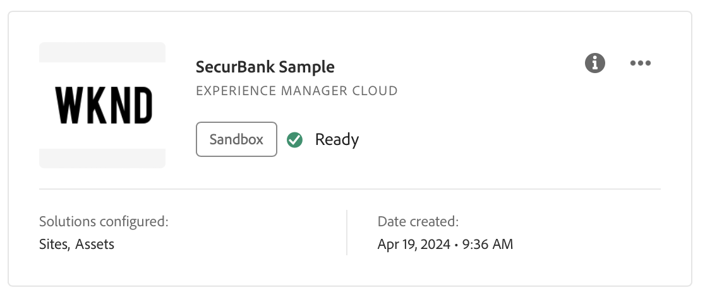

# Navegar por la IU de Cloud Manager {#navigation}

Descubra cómo está organizada la IU de Cloud Manager y cómo navegar para administrar sus programas y entornos.

La IU de Cloud Manager está compuesta principalmente por dos interfaces gráficas:

* [La consola Mis programas](#my-programs-console) es donde puede ver y administrar todos los programas.
* [La ventana Información general del programa](#program-overview) es donde puede ver los detalles de un programa individual y administrarlo.

>[!TIP]
>
>Consulte también el [recorrido de documentación de incorporación](/help/journey-onboarding/overview.md) para obtener una descripción general completa de cómo ponerse en marcha con AEM as a Cloud Service mediante Cloud Manager.

## Asistente de IA en AEM

Para los clientes que han [completado criterios de requisitos previos](/help/implementing/cloud-manager/ai-assistant-in-aem.md#get-access), el Asistente de IA en AEM está disponible para los usuarios de su organización. Ver [Asistente de IA en AEM](/help/implementing/cloud-manager/ai-assistant-in-aem.md).

## Consola Mis programas {#my-programs-console}

Al iniciar sesión en Cloud Manager en [my.cloudmanager.adobe.com](https://my.cloudmanager.adobe.com/) y seleccionar la organización adecuada, se llega a la consola **Mis programas**.

La consola Mis programas proporciona información general de todos los programas a los que tiene acceso en la organización seleccionada. Se compone de partes.

1. [Barras de herramientas](#toolbars-my-programs-toolbars) para la selección de organizaciones, alertas y configuración de la cuenta.
1. Pestañas que permiten alternar la vista actual de los programas.
   * Vista **Inicio** (predeterminada) que selecciona la vista **Mis programas** con información general de todos los programas
   * **Licencia** que accede al [Panel de licencias](/help/implementing/cloud-manager/license-dashboard.md).
   * Tenga en cuenta que las pestañas se cierran de forma predeterminada y se pueden mostrar con  en el [encabezado de Cloud Manager](#cloud-manager-header).
1. [Estadísticas y llamada a la acción](#statistics) para obtener una descripción general de su actividad reciente
1. [**Sección Mis programas**](#my-programs-section) con información general de todos sus programas
1. [Vínculos rápidos](#quick-links-section) para acceder fácilmente a recursos relacionados.

>[!TIP]
>
>Consulte el documento [Programas y tipos de programas](/help/implementing/cloud-manager/getting-access-to-aem-in-cloud/program-types.md) para obtener más información sobre los programas.

### Barras de herramientas {#my-programs-toolbars}

Hay dos barras de herramientas una encima de la otra.

#### Encabezado de Cloud Manager {#cloud-manager-header}

El primero es el encabezado de Cloud Manager, que es persistente mientras navega por Cloud Manager. Es un anclaje que le permite acceder a la configuración y a la información que se aplican a todos los programas de Cloud Manager.

1. Haga clic en  (mostrar u ocultar menú lateral) para que tenga acceso a una variedad de fichas que pueden llevarlo a partes específicas de un programa individual. O bien, puede cambiar entre el [Tablero de licencias](/help/implementing/cloud-manager/license-dashboard.md) y la consola **[Mis programas](#my-programs-console)** en función del contexto.
1. Haga clic en el botón Adobe Cloud Manager que le lleva de nuevo a la consola Mis programas de Cloud Manager, independientemente de dónde se encuentre en Cloud Manager.
1. Haga clic en **Comentarios** para proporcionar comentarios a Adobe sobre Cloud Manager.
1. Haga clic en el selector de organización para mostrar la organización en la que está conectado actualmente (en este ejemplo, Foundation Internal). Haga clic para cambiar a otra organización si su Adobe ID está asociado a varias.
1. Haga clic en  (conmutador de soluciones) para ir rápidamente a otras soluciones de Experience Cloud.
1. Haga clic en  para obtener acceso rápido a los recursos de aprendizaje y asistencia.
1. Haz clic en  ([Notificaciones](/help/implementing/cloud-manager/notifications.md)) para ver notificaciones y anuncios, entre otras cosas.
1. Haga clic en el icono que representa el acceso del usuario a la configuración de usuario. Si no tiene una imagen de usuario configurada, se le asigna un icono de forma aleatoria.

#### Barra de herramientas del programa {#program-toolbar}

La barra de herramientas del programa proporciona vínculos para cambiar entre los programas de Cloud Manager y las acciones apropiadas para el contexto.

1. El selector **Mis programas** abre una lista desplegable donde puede seleccionar otros programas rápidamente o realizar acciones según el contexto, como crear un nuevo programa
1. El vínculo **Introducción** le proporciona acceso al [recorrido de documentación de incorporación](/help/journey-onboarding/overview.md) para que pueda ponerse en marcha con Cloud Manager.
1. El botón de acción ofrece acciones adecuadas al contexto, como agregar un programa.

### Estadísticas y llamadas a la acción {#statistics}

La sección de estadísticas y call-to-action proporciona datos acumulados para su organización. Por ejemplo, si ha configurado correctamente sus programas, pueden mostrarse estadísticas de las actividades de los últimos 90 días, incluidas las siguientes:

* Número de [implementaciones](/help/implementing/cloud-manager/deploy-code.md)
* Número de [problemas de calidad del código](/help/implementing/cloud-manager/code-quality-testing.md) identificados
* Número de compilaciones

O si acaba de comenzar la configuración de su organización, puede haber sugerencias sobre los pasos siguientes o los recursos de documentación.

### Sección Mis programas {#my-programs-section}

El contenido principal de la consola **Mis programas** es la lista de programas de la sección **Mis programas**.

La sección **Mis programas** enumera las tarjetas que representan cada programa. Toque o haga clic en una tarjeta para acceder a la página **información general del programa** para obtener más información sobre el programa.

>[!NOTE]
>
>Según sus privilegios, es posible que no pueda seleccionar determinados programas.

Para encontrar el programa que necesita más fácilmente, utilice las opciones de clasificación.

* Ordenar por:
   * **Fecha de creación** (predeterminada)
   * **Nombre de programa**
   * **Estado**
*  ascendente (predeterminado) /  descendente
*  Vista de cuadrícula (predeterminado)
*  Vista de lista

#### Tarjetas de programa {#program-cards}

Una tarjeta (o fila en una tabla) representa cada programa, lo que proporciona una descripción general del programa y vínculos rápidos para realizar acciones.

* Imagen asociada al programa, si se ha configurado. La imagen de arriba es &quot;WKND&quot;.
* Nombre asignado al programa. La imagen anterior muestra &quot;Ejemplo de SecurBank&quot; como nombre del programa.
* Tipo de servicio:
   * **Experience Manager Cloud** para programas de AEM as a Cloud Service
   * **Experience Manager** — para [programas de AMS (Adobe Managed Services)](https://experienceleague.adobe.com/en/docs/experience-manager-cloud-manager/content/introduction)
* [Tipo de programa](/help/implementing/cloud-manager/getting-access-to-aem-in-cloud/program-types.md):
   * Zona protegida
   * Producción
* Estado. En la imagen anterior, el estado es Listo con una marca de verificación.
* Soluciones configuradas. En la imagen anterior, Sites y Assets son las soluciones configuradas.
* Fecha de creación.

Un programa de producción puede tener un distintivo para mostrar las funciones adicionales que eligió en el momento en que lo agregó, como las siguientes:

*  [HIPAA](/help/implementing/cloud-manager/getting-access-to-aem-in-cloud/creating-production-programs.md#security)

*  [Protección WAF-DDOS](/help/implementing/cloud-manager/getting-access-to-aem-in-cloud/creating-production-programs.md#security)

* [99,99 % SLA (Service level agreement)](/help/implementing/cloud-manager/getting-access-to-aem-in-cloud/creating-production-programs.md#sla)

El icono de información también permite acceder rápidamente a la información adicional sobre el programa (útil en la vista de listas).

El icono  te da acceso a acciones adicionales que puedes realizar en el programa.

* Vaya a un  [Entorno](/help/implementing/cloud-manager/manage-environments.md) particular del programa
* Abra el  [Información general del programa](#program-overview)
*  [Editar el programa](/help/implementing/cloud-manager/getting-access-to-aem-in-cloud/editing-programs.md#editing)
* [Eliminar un programa de zona protegida](/help/implementing/cloud-manager/getting-access-to-aem-in-cloud/editing-programs.md#delete-sandbox-program)

>[!TIP]
>
>Para obtener más información acerca de los programas y la adición y administración de programas, vea los temas siguientes:
>
>* [Programas y tipos de programas](/help/implementing/cloud-manager/getting-access-to-aem-in-cloud/program-types.md)
>* [Crear programas de producción](/help/implementing/cloud-manager/getting-access-to-aem-in-cloud/creating-production-programs.md)
>* [Crear programas de zona protegida](/help/implementing/cloud-manager/getting-access-to-aem-in-cloud/creating-sandbox-programs.md)

### Sección de vínculos rápidos {#quick-links-section}

La sección de vínculos rápidos le permite acceder a recursos utilizados con frecuencia relacionados.

## Página de información general del programa {#program-overview}

Cuando se selecciona un programa en la consola **[Mis programas](#my-programs-console)**, se le redirige a la página **Información general del programa**.

La descripción general del programa le permite acceder a todos los detalles de un programa de Cloud Manager. Al igual que la consola **Mis programas**, consta de varias partes.

1. [Barras de herramientas](#program-overview-toolbar) para volver rápidamente a la consola Mis programas y navegar por el programa
1. [Pestañas](#program-tabs) para cambiar entre los diferentes aspectos del programa
1. Una [llamada a la acción](#cta) basada en las últimas acciones del programa
1. Una [descripción general de los entornos](#environments) del programa
1. Una [descripción general de las canalizaciones](#pipelines) del programa
1. Una [descripción general del rendimiento](#performance) del programa
1. Vínculos a [recursos útiles](#useful-resources)

### Barras de herramientas {#program-overview-toolbar}

Las barras de herramientas de la descripción general del programa son similares a las barras de herramientas de [Mis programas](#my-programs-toolbars). Aquí solo se ilustran las diferencias.

#### Encabezado de Cloud Manager {#cloud-manager-header-2}

En la esquina superior izquierda de la página se encuentra el encabezado Cloud Manager de Adobe. Puede hacer clic en  para mostrar u ocultar el menú lateral de pestañas a otras áreas del software.

Haga clic en Adobe Cloud Manager para volver a Inicio.

#### Barra de herramientas del programa {#program-toolbar-2}

La barra de herramientas de programas le permite cambiar rápidamente a otros programas, pero además le da acceso a acciones apropiadas para el contexto, como agregar y editar el programa.

La barra de herramientas siempre muestra la ficha en la que se encuentra, incluso si ha ocultado las fichas mediante .

### Pestañas del programa {#program-tabs}

Cada programa tiene muchas opciones y datos asociados. Estas opciones y datos se recopilan en pestañas para facilitar la navegación por el programa. Las pestañas le permiten acceder a lo siguiente:

**Programa**

*  Información general: la descripción general del programa tal como se describe en el documento actual
*  [Actividad](/help/implementing/cloud-manager/configuring-pipelines/managing-pipelines.md#activity): el historial de ejecuciones de canalización del programa
*  [Canalizaciones](/help/implementing/cloud-manager/configuring-pipelines/managing-pipelines.md#pipelines): todas las canalizaciones configuradas para el programa
*  [Repositorios](/help/implementing/cloud-manager/managing-code/managing-repositories.md): todos los repositorios configurados para el programa
*  [Informes](/help/implementing/cloud-manager/sla-reporting.md): métricas como datos de SLA

**Servicios**

*  [Entornos](/help/implementing/cloud-manager/manage-environments.md): todos los entornos configurados para el programa
*  [Sitios Edge Delivery](/help/implementing/cloud-manager/edge-delivery/introduction-to-edge-delivery-services.md) - Administrar sitios Edge Delivery
*  [Configuración de dominio](/help/implementing/cloud-manager/custom-domain-names/introduction.md) - Administrar nombres de dominio personalizados para el programa
*  [Certificados SSL](/help/implementing/cloud-manager/managing-ssl-certifications/introduction-to-ssl-certificates.md): administre los certificados SSL para el programa
*  [Asignaciones de dominio](/help/implementing/cloud-manager/custom-domain-names/introduction.md) - Administrar asignaciones de dominio
*  [Listas de permitidos IP](/help/implementing/cloud-manager/ip-allow-lists/introduction.md): defina listas de permitidos para determinadas direcciones IP
*  [Conjuntos de contenido](/help/implementing/developing/tools/content-copy.md) - Conjuntos de contenido creados con fines de copia
*  [Copiar actividad de contenido](/help/implementing/developing/tools/content-copy.md) - Actividades de copia de contenido
*  [Infraestructura de red](/help/security/configuring-advanced-networking.md) - Administrar las opciones avanzadas de red para el programa

**Recursos**

*  Rutas de aprendizaje - Recursos de aprendizaje adicionales acerca de Cloud Manager

De forma predeterminada, al abrir un programa, llega a la pestaña **Información general**. La pestaña actual está resaltada. Seleccione otra pestaña para mostrar sus detalles.

En la esquina superior izquierda del [encabezado de Cloud Manager](#cloud-manager-header-2), haga clic en  para mostrar u ocultar el menú lateral de las pestañas.

### Llamada a la acción {#cta}

La sección de llamada a la acción le proporciona información útil según el estado del programa. Para un programa nuevo, es posible que vea los pasos siguientes dados y un recordatorio de una fecha de lanzamiento, [establecida durante la creación del programa](/help/implementing/cloud-manager/getting-access-to-aem-in-cloud/editing-programs.md).

Para un programa activo, el estado de la última implementación con vínculos para obtener más información e iniciar una nueva implementación.

### Tarjeta Entornos {#environments}

La tarjeta **Entornos** le ofrece una descripción general de sus entornos, así como vínculos para acciones rápidas.

La tarjeta **Entornos** solo enumera tres entornos. Haga clic en  **Mostrar todo** para ver todos los entornos del programa.

Consulte también [Administrar entornos](/help/implementing/cloud-manager/manage-environments.md).

### Tarjeta de canalizaciones {#pipelines}

La tarjeta de **Canalizaciones** le ofrece una descripción general de sus canalizaciones, así como vínculos para acciones rápidas.

La tarjeta **Canalizaciones** solo enumera tres canalizaciones. Haga clic en  **Mostrar todo** para ver todas las canalizaciones del programa.

Consulte también [Administrar canalizaciones](/help/implementing/cloud-manager/configuring-pipelines/managing-pipelines.md) para obtener detalles sobre cómo administrar sus canalizaciones.

### Tarjeta de rendimiento {#performance}

La tarjeta **Rendimiento** proporciona información general sobre el **[panel de CDN](/help/implementing/cloud-manager/cdn-performance.md)**.

### Recursos útiles {#useful-resources}

La sección **Recursos útiles** proporciona vínculos a recursos de aprendizaje adicionales para Cloud Manager.
