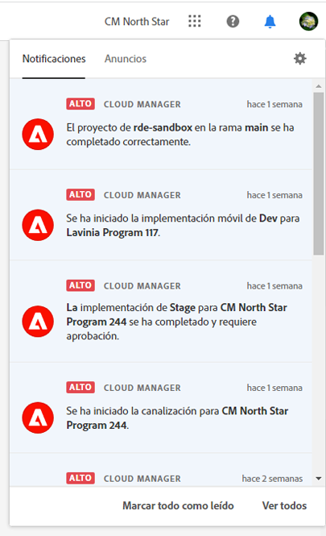
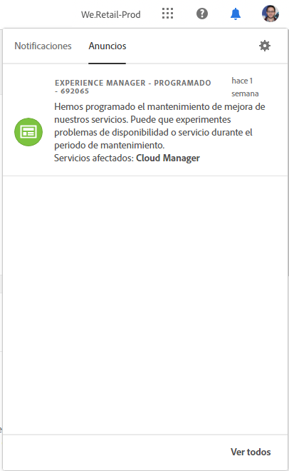
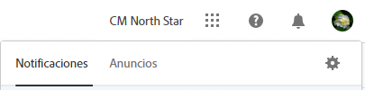
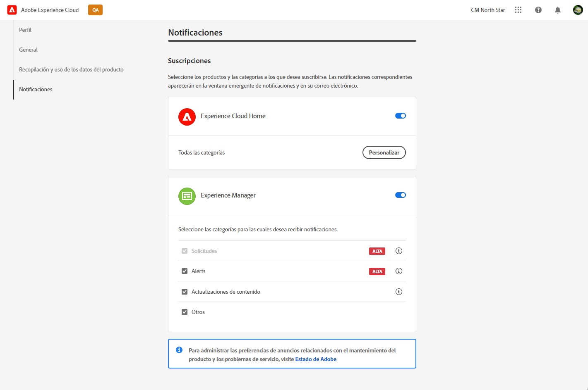
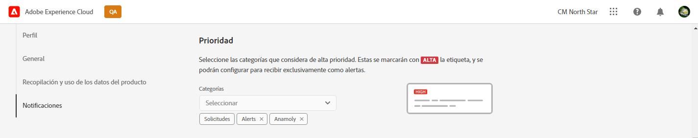
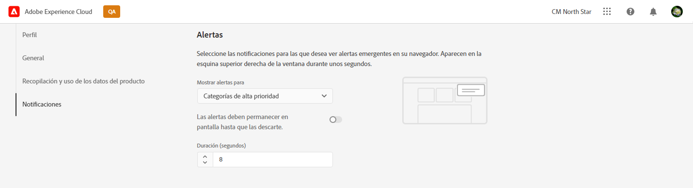
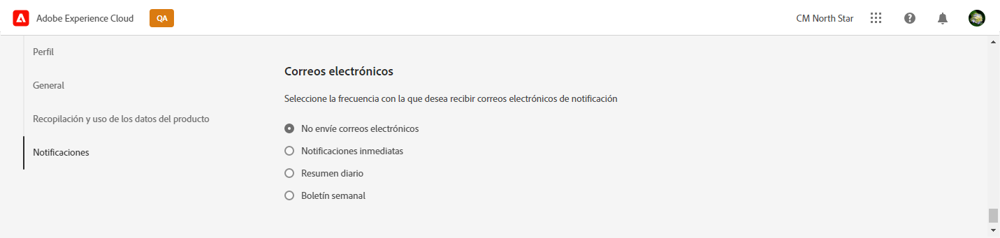

# Notificaciones {#notifications}

Descubra cómo Cloud Manager le notifica de los eventos importantes.

## Notificaciones en Cloud Manager {#cloud-manager-notifications}

[!UICONTROL Cloud Manager] le envía notificaciones cuando se inicia y finaliza una canalización de producción (con o sin éxito) al inicio de una implementación de producción.

Estas notificaciones se envían a través del sistema de notificación de [!UICONTROL Experience Cloud] a los usuarios con los roles de **Propietario del negocio**, **Administrador de programa** y **Administrador de implementación**.

Las notificaciones aparecen en una barra lateral dentro de [!UICONTROL Cloud Manager] y en todo Adobe [!UICONTROL Experience Cloud]. El icono de campana del encabezado se señala cuando tiene nuevas notificaciones.

Haga clic en el icono de campana para abrir la barra lateral y ver las notificaciones. La pestaña **Notificaciones** en la barra lateral muestran las notificaciones más recientes, como las confirmaciones de implementación. Las notificaciones corresponden a sus entornos.

La pestaña **Anuncios** incluye anuncios de productos de Adobe. Los anuncios hacen referencia al producto.

Haga clic en una notificación o un anuncio para ver los detalles. Las notificaciones vinculadas a actividades como las implementaciones de canalización le llevan a los detalles de esa actividad, como la ventana de ejecución de canalización.

Haga clic en la opción **Ver todos** en la parte inferior del panel para ver todos los anuncios de la bandeja de entrada.

Haga clic en la opción **Marcar todo como leído** en la parte inferior del panel para marcar todas las notificaciones no leídas como leídas y borrar el distintivo del icono de la campana.

## Configuración de notificaciones {#configuration}

Puede personalizar cómo recibe las notificaciones y cuáles.

Haga clic en el icono de engranaje en la parte superior de la barra lateral de notificaciones para abrir la ventana **preferencias de Experience Cloud**. Desde aquí, puede definir las suscripciones de notificación y cómo recibe las notificaciones.

### Suscripciones {#subscriptions}

Las suscripciones definen para qué productos recibe notificaciones y cuáles.

De forma predeterminada, recibe todas las notificaciones de todos los productos, tanto de la aplicación como por correo electrónico. Haga clic en las comillas angulares junto al nombre de un producto para mostrar las opciones detalladas y definir los tipos de notificaciones que recibe de ese producto. O bien, marque o desmarque las opciones en el nivel de producto para seleccionar o deseleccionar todas las opciones del producto.

### Prioridad {#priority}

Las alertas de prioridad están marcadas con la etiqueta **HIGH**. Puede configurarlas para que se reciban exclusivamente como alertas. En la sección **Prioridad**, puede definir qué categorías se clasifican como notificaciones prioritarias.

Utilice la lista desplegable para añadir a la lista de categorías que cumplen los requisitos de prioridad. Haga clic en la X situada junto a los nombres de las categorías para quitarlas.

### Alertas {#alerts}

Las alertas aparecen en la esquina superior derecha de la ventana durante unos segundos. Utilice la sección **Alertas** para definir para qué notificaciones recibe alertas.

Puede definir el comportamiento de las alertas.

* **Mostrar alertas para**: define los tipos de notificaciones que activan alertas
* **Las alertas deben permanecer en la pantalla hasta que las descarte**: controla si las alertas deben persistir a menos que las descarte activamente
* **Duración**: define cuánto tiempo debe permanecer la alerta en la pantalla si no ha elegido que permanezcan en ella.

### Correo electrónico {#emails}

Las notificaciones están disponibles en la interfaz de usuario web en todas las soluciones de Adobe [!UICONTROL Experience Cloud]. También puede optar por que estas notificaciones se envíen por correo electrónico en la sección **Correos electrónicos**.

De forma predeterminada, no se envían correos electrónicos. Puede optar por recibir correos electrónicos como los siguientes:

* Instantáneamente
* Cada día
* Cada semana

Al elegir **Notificaciones inmediatas**, los mensajes de correo electrónico se envían inmediatamente para cada notificación. Para **Resumen diario** y **Resumen semanal**, puede elegir cuándo se envía el resumen diario y en qué día y cuándo se envía el resumen semanal.