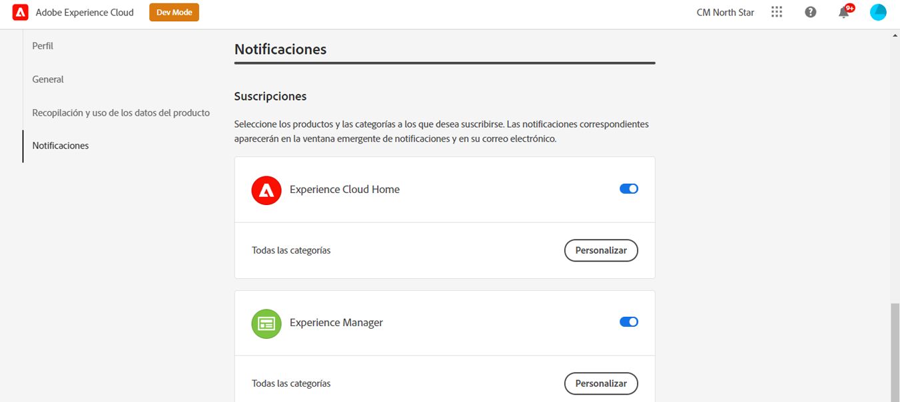
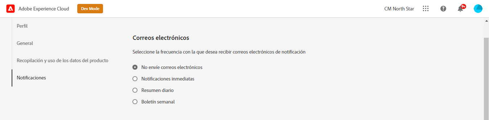

# Notificaciones {#notifications}

[!UICONTROL Cloud Manager] permite al usuario recibir notificaciones cuando la canalización de producción se inicia y finaliza (con éxito o sin éxito), durante una implementación de producción.

Estas notificaciones se envían a través del Adobe [!UICONTROL Experience Cloud] sistema de notificación a los usuarios con funciones **Propietario empresarial**, **Administrador de programas** y **Administrador de implementación**.

Las notificaciones aparecen en el extremo derecho de la barra de menús de la sección [!UICONTROL Cloud Manager] IU y a lo largo del Adobe [!UICONTROL Experience Cloud].

El icono de campana se marca cuando hay nuevas notificaciones. Haga clic en él para abrir un panel para ver las notificaciones.

El panel solo enumera las notificaciones más recientes. Haga clic en **Ver todo** en la parte inferior del panel para ver todas las notificaciones.

## Notificaciones por correo electrónico {#email-notifications}

De forma predeterminada, las notificaciones están disponibles en la interfaz de usuario en todo el Adobe [!UICONTROL Experience Cloud] soluciones. Los usuarios individuales también pueden optar por que estas notificaciones se envíen por correo electrónico siguiendo estos pasos.

1. Haga clic en el icono de la campana para mostrar las notificaciones.
1. Haga clic en el **Editar preferencias** en la parte superior del panel de notificaciones.
1. En la ventana que se abre, haga clic en **Notificaciones** en el panel de navegación izquierdo.
   
1. Desplácese hacia abajo hasta el **Correo electrónico** encabezado.
   
1. Seleccione cómo desea recibir sus correos electrónicos.
   * No enviar correos electrónicos (predeterminado)
   * Notificaciones instantáneas
   * Resumen diario
   * Resumen semanal

Una vez que haya realizado la selección, la selección se guardará automáticamente sin necesidad de hacer clic en un botón de guardar o aplicar.
