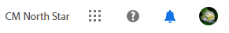
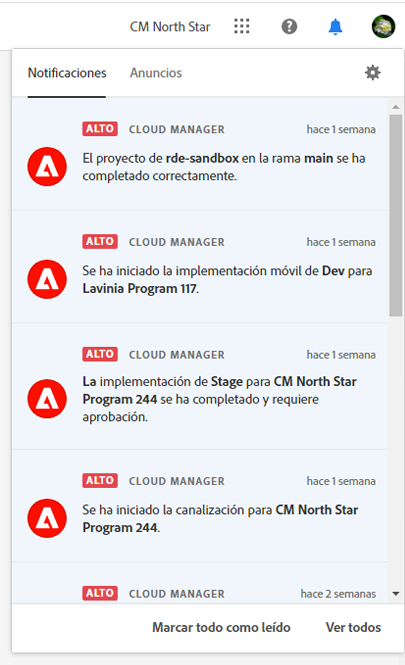
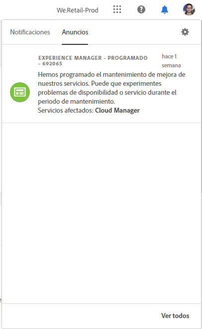
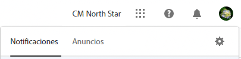
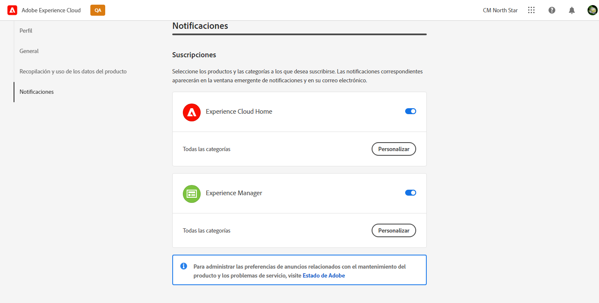
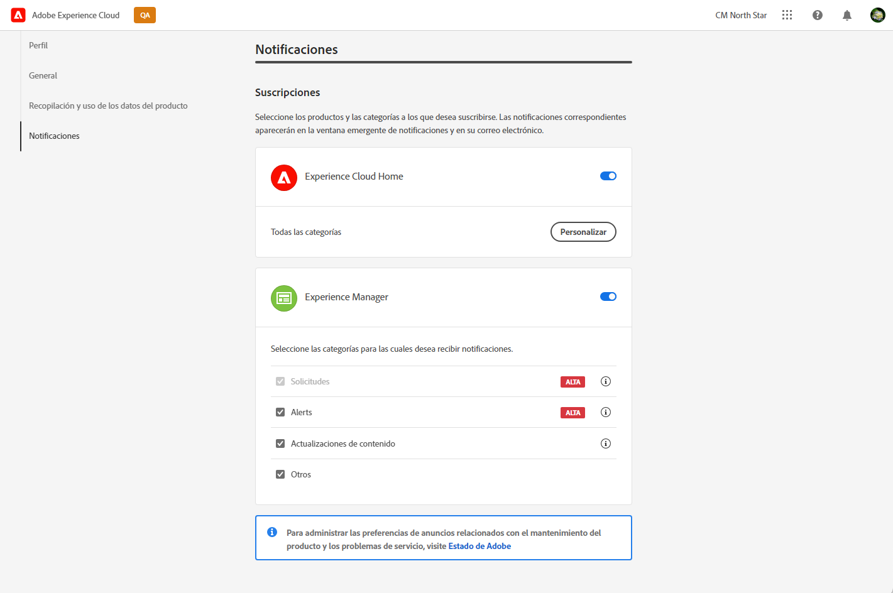
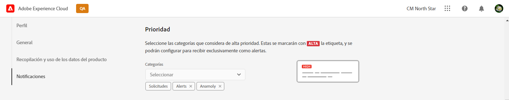
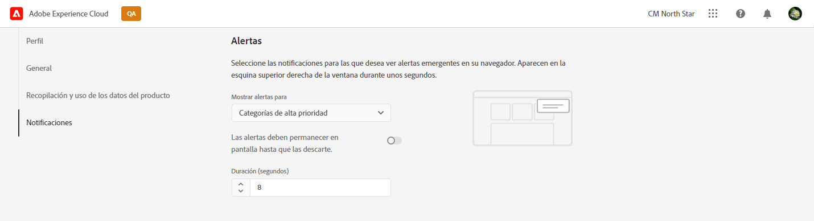
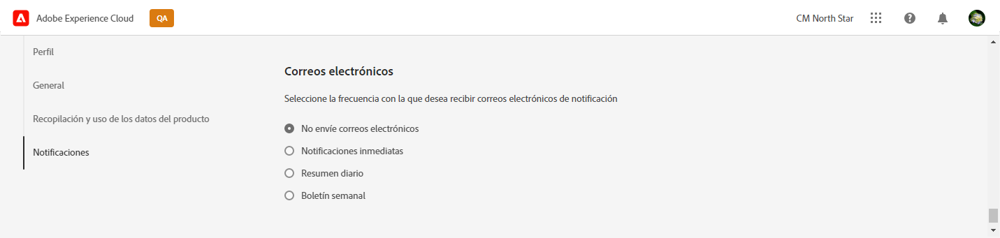

# Notificaciones {#notifications}

Descubra cómo Cloud Manager le notifica de los eventos importantes.

## Notificaciones en Cloud Manager {#cloud-manager-notifications}

[!UICONTROL Cloud Manager] proporciona notificaciones cuando una canalización de producción se inicia y finaliza (con o sin éxito) durante una implementación de producción.

Estas notificaciones se envían a través del sistema de notificación [!UICONTROL CX Enterprise] a los usuarios con los roles de **Propietario del negocio**, **Administrador de programas** y **Administrador de implementación**.

Las notificaciones aparecen en una barra lateral dentro de [!UICONTROL Cloud Manager] y en toda la [!UICONTROL CX Enterprise] de Adobe. El icono de campana del encabezado muestra un distintivo cuando tiene nuevas notificaciones.

Haga clic en el icono de campana para abrir la barra lateral y ver las notificaciones. La pestaña **Notificaciones** en la barra lateral muestran las notificaciones más recientes, como las confirmaciones de implementación. Las notificaciones corresponden a sus entornos.

La pestaña **Anuncios** incluye anuncios de productos de Adobe. Los anuncios hacen referencia al producto.

Haga clic en una notificación o un anuncio para ver los detalles. Las notificaciones vinculadas a actividades como las implementaciones de canalización le llevan a los detalles de esa actividad, como la ventana de ejecución de la canalización.

Haga clic en la opción **Ver todos** en la parte inferior del panel para ver todos los anuncios de la bandeja de entrada.

Haga clic en la opción **Marcar todo como leído** en la parte inferior del panel para marcar todas las notificaciones no leídas como leídas y borrar el distintivo del icono de la campana.

## Configuración de notificaciones {#configuration}

Puede personalizar cómo recibe las notificaciones y cuáles.

Haga clic en el icono de configuración en la parte superior de la barra lateral de notificaciones para abrir la ventana **Preferencias de CX Enterprise**. Desde aquí puede definir las suscripciones de notificación y cómo recibe las notificaciones.

### Suscripciones {#subscriptions}

Las suscripciones definen los productos para los que recibe notificaciones y los tipos de notificaciones que recibe.

De forma predeterminada, recibe todas las notificaciones de todos los productos, tanto en la aplicación como por correo electrónico. Haga clic en las comillas angulares junto al nombre de un producto para mostrar las opciones detalladas y definir los tipos de notificaciones que recibe de ese producto. O bien, marque o desmarque las opciones en el nivel de producto para seleccionar o deseleccionar todas las opciones del producto.

### Prioridad {#priority}

Las alertas de prioridad están marcadas con la etiqueta **HIGH**. Puede configurarlos para que se reciban como alertas. En la sección **Prioridad**, puede definir qué categorías se clasifican como notificaciones prioritarias.

Utilice el menú desplegable para añadir a la lista de categorías que cumplen los requisitos de prioridad. Haga clic en el icono Eliminar situado junto a los nombres de las categorías para eliminarlas.

### Alertas {#alerts}

Las alertas aparecen en la esquina superior derecha de la ventana durante unos segundos. Utilice la sección **Alertas** para definir las notificaciones para las que recibirá alertas.

Puede definir el comportamiento de las alertas.

* **Mostrar alertas para**: define los tipos de notificaciones que almacenan en déclencheur las alertas.
* **Las alertas permanecen en pantalla hasta que las descarta**: controla si las alertas persisten a menos que las descarte activamente.
* **Duración**: define cuánto tiempo permanece la alerta en la pantalla si no la ha configurado para que persistan.

### Correo electrónico {#emails}

Las notificaciones están disponibles en la interfaz de usuario web en todas las soluciones de Adobe [!UICONTROL CX Enterprise]. Para optar por que estas notificaciones se envíen por correo electrónico, utilice la sección **Correos electrónicos**.

De forma predeterminada, no se envían correos electrónicos. Puede optar por recibir correos electrónicos como los siguientes:

* Instantáneamente
* Cada día
* Cada semana

Al elegir **Notificaciones inmediatas**, los mensajes de correo electrónico se envían inmediatamente para cada notificación. Para **Resumen diario** y **Resumen semanal**, puede elegir cuándo se enviará el compendio diario y en qué día y cuándo se enviará el compendio semanal.