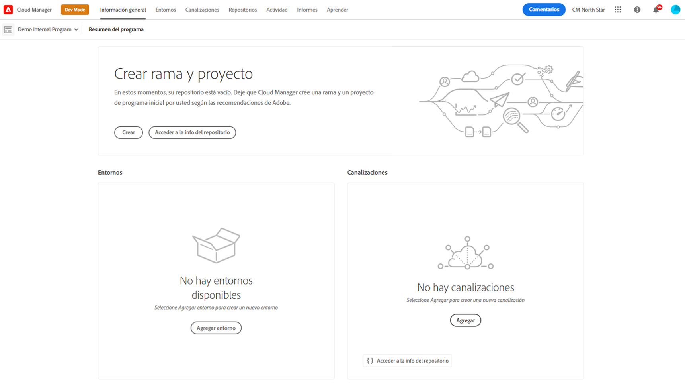
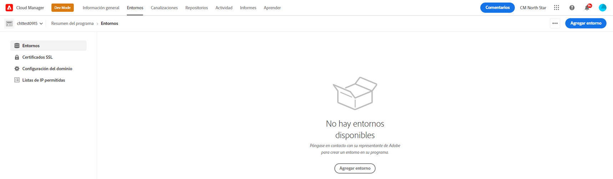

# Añadir un entorno de prueba especializado{#add-special-test-enviro}

>[!NOTE]
>
>&#x200B;>La función descrita en este artículo solo está disponible a través del programa beta privado. Para registrarse en la versión beta privada, consulte [Entorno de prueba especializado](/help/implementing/cloud-manager/release-notes/current.md#specialized-test-environment).

El Entorno de prueba especializado, o DevXL, es un nuevo tipo de entorno de Cloud Manager que puede crear. Está diseñado para admitir casos de uso avanzados, como las Pruebas de aceptación de usuarios (UAT) y la validación de rendimiento. A diferencia de los entornos tradicionales de desarrollo, desarrollo rápido o ensayo, los entornos DevXL funcionan fuera de la canalización de implementación de producción. Por lo tanto, ofrecen una mayor flexibilidad a la vez que mantienen un aislamiento estricto para evitar interferencias con los flujos de trabajo de producción.

DevXL está diseñado para reflejar el tamaño, la escalabilidad y las configuraciones de un entorno de ensayo típico. Este enfoque garantiza que las pruebas realizadas en DevXL puedan proporcionar una perspectiva realista sobre cómo funcionan el código y el contenido en condiciones similares a la producción. El entorno también admite la copia directa de contenido desde Producción o Ensayo. También mantiene la paridad con los entornos de desarrollo en términos de flujos de trabajo de implementación, controles de acceso y configuraciones de red.

## Características y configuraciones clave {#key-features}

| Categoría | Comportamiento de DevXL |
| --- | --- |
| Función | UAT y pruebas de rendimiento. |
| Tipo de canalización | No está en la canalización de producción. |
| Tamaño del entorno | Coincide con el entorno de ensayo. |
| Aislamiento | Totalmente aislado de otros entornos. |
| Canalizaciones de código | Igual que el entorno de desarrollo (validación, compilación, implementación). |
| Copiar contenido | Permitido desde producción, fase o un entorno de prueba especializado. |
| Restauración de contenido | Igual que el entorno de desarrollo. |
| Registros de acceso | Igual que el entorno de desarrollo. |
| Developer Console | Igual que el entorno de desarrollo. |
| Lista de IP permitidas | Igual que el entorno de desarrollo. |
| Redes | Igual que el entorno de desarrollo (servicios, nombre de dominio, certificados SSL, red avanzada). |

Ver también [Administrar entornos](/help/implementing/cloud-manager/manage-environments.md)

## Añadir un entorno de prueba especializado {#add-specialized-testing-environment}

Para agregar o editar un entorno, un usuario debe ser miembro del rol **Propietario del negocio**.

**Para agregar un entorno de prueba especializado:**

1. Inicie sesión en Cloud Manager en [my.cloudmanager.adobe.com](https://my.cloudmanager.adobe.com/) y seleccione la organización adecuada.

1. En la consola **[Mis programas](/help/implementing/cloud-manager/navigation.md#my-programs)**, haga clic en el programa para el que desea agregar un entorno.

1. Realice una de las siguientes acciones:

   * En la consola **[Mis programas](/help/implementing/cloud-manager/navigation.md#my-programs)**, en la tarjeta **Entornos**, haga clic en **Agregar entorno**.
Si la opción **Agregar entorno** está atenuada (deshabilitada), puede deberse a la falta de permisos o a que depende de los recursos con licencia.

   

   * En el panel lateral izquierdo, haga clic en  **Entornos** y luego, en la página Entornos, cerca de la esquina superior derecha, haga clic en **Agregar entorno**.

     

1. En el cuadro de diálogo **Agregar entorno**, haga lo siguiente:

   * Haga clic en **Entorno de prueba especializado**.
   * Proporcione un entorno **Name**. El nombre del entorno no se puede cambiar una vez creado el entorno.
   * (Opcional) Proporcione una **Descripción** para el entorno.
   * Seleccione una **región principal** en la lista desplegable. Una vez creada, la región principal del entorno DevXL (por ejemplo, *Estados Unidos (oeste de EE. UU.)*) está bloqueada y no se puede cambiar.

   

1. Haga clic en **Guardar**.

   La página **Información general** ahora muestra su nuevo entorno en la tarjeta **Entornos**. Ahora puede configurar canalizaciones para su nuevo entorno.
