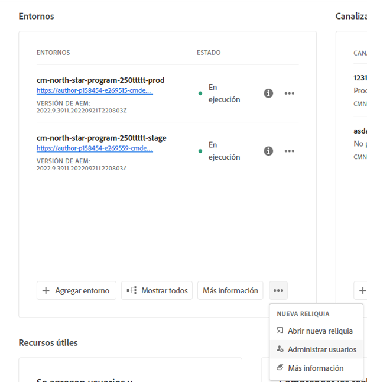
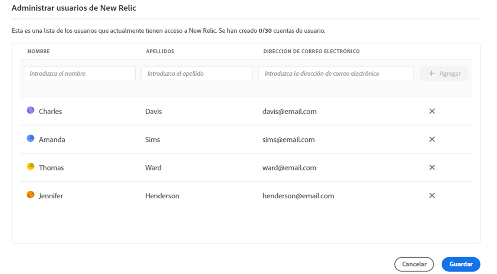
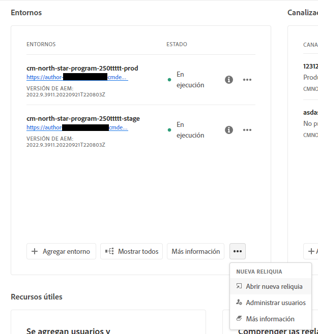

# New Relic One {#user-access}

Obtenga información sobre el servicio de supervisión del rendimiento de la aplicación (APM) de New Relic One para AEM as a Cloud Service y cómo puede acceder a él.

## Acerca de New Relic One {#introduction}

Adobe pone un gran énfasis en la monitorización, la disponibilidad y el rendimiento de su aplicación. AEM as a Cloud Service incluye acceso a la monitorización de New Relic One, lo que proporciona a los equipos una visibilidad completa de las métricas de rendimiento del sistema y del entorno como parte de la oferta de productos estándar.

Este documento describe cómo administrar el acceso a las funciones de monitorización del rendimiento de las aplicaciones (APM) de New Relic One en entornos de AEM as a Cloud Service. La administración eficaz de estas funciones ofrece un rendimiento óptimo y maximiza las ventajas de AEM as a Cloud Service.

Cuando se crea un nuevo programa de producción, se crea automáticamente la cuenta secundaria de New Relic One asociada a su programa de AEM as a Cloud Service. [Se debe activar esta subcuenta](#activate-sub-account) para comenzar a ingerir datos.

## Características {#transaction-monitoring}

New Relic One APM para AEM as a Cloud Service tiene muchas características.

* Acceso directo a una cuenta específica de New Relic One

* Agente de APM de New Relic One que muestra llamadas de método exactas con números de línea, incluidas dependencias externas y bases de datos

* Optimización del rendimiento integral mediante la combinación de métricas clave de la monitorización a nivel de infraestructura y la monitorización de aplicaciones (Adobe Experience Manager)

* AEM as a Cloud Service expone los MBeans y las comprobaciones de estado de las Extensiones de administración de Java (JMX) directamente en New Relic Insights, lo que permite inspeccionar a fondo las métricas de estado y rendimiento de las aplicaciones.

## Activar la subcuenta de New Relic One {#activate-sub-account}

Para un programa recién creado, se crea una cuenta secundaria de New Relic One. Sin embargo, debe activarlo para que pueda introducir datos. Esta activación no es automática. Siga estos pasos para activar su subcuenta.

>[!NOTE]
>
>Un usuario con el rol **Propietario del negocio** debe iniciar sesión para administrar la subcuenta de New Relic One.

1. Inicie sesión en Cloud Manager en [my.cloudmanager.adobe.com](https://my.cloudmanager.adobe.com/) y seleccione la organización adecuada.

1. En la consola **[Mis programas](/help/implementing/cloud-manager/navigation.md#my-programs)**, haga clic en el programa para el que desea administrar a los usuarios de New Relic One.

1. En la parte inferior de la tarjeta **Entornos** en la página de información general del programa, haga clic en  y seleccione **Activar New Relic**.

   

   * También puedes acceder a la opción **Administrar usuarios**. En la parte superior de la pantalla de **Entornos** de tu programa, haz clic en .

1. [Ejecute una canalización](/help/implementing/cloud-manager/configuring-pipelines/managing-pipelines.md#running-pipelines) para el mismo entorno para completar correctamente la activación de la subcuenta.

Cuando se desactiva la subcuenta, no se realiza ninguna ingesta de datos.

## Administrar usuarios de New Relic One {#manage-users}

Siga los siguientes pasos para definir los usuarios de la cuenta secundaria de New Relic One asociada a su programa de AEM as a Cloud Service.

>[!NOTE]
>
>Un usuario con el rol **Propietario del negocio** o **Administrador de implementación** debe iniciar sesión para administrar usuarios de New Relic One.

1. Inicie sesión en Cloud Manager en [my.cloudmanager.adobe.com](https://my.cloudmanager.adobe.com/) y seleccione la organización adecuada.

1. Haga clic en el programa para el que desee administrar los usuarios de New Relic One.

1. En la parte inferior de la tarjeta **Entornos** en la página de información general del programa, haga clic en  y seleccione **Administrar usuarios**.

   

   * También puedes acceder a la opción **Administrar usuarios**. En la parte superior de la pantalla de **Entornos** de tu programa, haz clic en .

1. En el cuadro de diálogo **Administrar usuarios de New Relic**, escriba el nombre y los apellidos del usuario que desea agregar y haga clic en el botón **Agregar**. Repita este paso para todos los usuarios que desee agregar.

   

1. Para eliminar un usuario de New Relic One, haga clic en el botón eliminar situado en el extremo derecho de la fila que representa al usuario.

1. Haga clic en **Guardar** para crear los usuarios.

Una vez definidos los usuarios, New Relic enviará un correo electrónico de confirmación a cada usuario al que se haya concedido el acceso para que pueda completar el proceso de configuración e iniciar sesión.

>[!NOTE]
>
>Si está administrando los usuarios de New Relic One, también debe agregarse como usuario para tener acceso a sí mismo. Ser el **Propietario del negocio** o el **Administrador de implementación** no es suficiente para tener acceso a New Relic One. También debe crearse como usuario.

## Activar la cuenta de usuario de New Relic One {#activate-user-account}

Una vez que cree una cuenta de usuario de New Relic One como se describe en la sección [Administrar usuarios de New Relic One](#manage-users), New Relic enviará a esos usuarios un correo electrónico de confirmación a la dirección proporcionada. Para utilizar esas cuentas, los usuarios deben activarlas primero con New Relic y restablecer sus contraseñas.

**Para activar su cuenta de usuario de New Relic One:**

1. Haga clic en el vínculo proporcionado en el correo electrónico desde New Relic.

1. En la página de inicio de sesión de New Relic, haga clic en **Olvidó su contraseña?**

   

1. Introduzca la dirección de correo electrónico donde recibió el correo de confirmación y seleccione **Enviar mi vínculo de restablecimiento**.

   

1. New Relic le envía un correo electrónico con un vínculo para confirmar la cuenta.

Si no recibe un correo electrónico de confirmación de New Relic, consulte la [sección de solución de problemas](#troubshooting).

## Acceso a New Relic One {#accessing-new-relic}

Una vez que haya [activado su cuenta de New Relic](#activate-account), podrá acceder a New Relic One a través de Cloud Manager o directamente.

**Para tener acceso a New Relic One mediante Cloud Manager:**

1. Inicie sesión en Cloud Manager en [my.cloudmanager.adobe.com](https://my.cloudmanager.adobe.com/) y seleccione la organización adecuada.

1. Haga clic en el programa para el que desea acceder a New Relic One.

1. En la parte inferior de la tarjeta **Entornos** en la página de información general del programa, haga clic en  y seleccione **Abrir New Relic**.

   

   * También puede acceder a New Relic. En la parte superior de la pantalla de **Entornos** de tu programa, haz clic en .

1. En la nueva pestaña del explorador que se abre, inicie sesión en New Relic One.

**Para tener acceso directo a New Relic One:**

1. Navegue hasta la página de inicio de sesión de New Relic en [`https://login.newrelic.com/login`](https://login.newrelic.com/login)

1. Inicie sesión en New Relic One.

### Verifique su correo electrónico {#verify-email}

Si se le solicita que compruebe su correo electrónico durante el inicio de sesión en New Relic One, significa que su correo electrónico está asociado a varias cuentas. Puede elegir a qué cuenta acceder.

Si no verifica su dirección de correo electrónico, New Relic intentará iniciar sesión con el registro de usuario creado más recientemente y asociado a su dirección de correo electrónico. Para evitar verificar el correo electrónico durante cada inicio de sesión, haga clic en la casilla de verificación **Recordarme** de la pantalla de inicio de sesión.

Para obtener más ayuda, abra un ticket de asistencia a través del [Portal de asistencia de AEM](https://helpx.adobe.com/es/enterprise/using/support-for-experience-cloud.html).

## Solucionar problemas de acceso de usuarios de New Relic One {#troubleshooting}

Si se le agregó como usuario de New Relic One, tal como se describe en [Administrar usuarios de New Relic One](#manage-users), y no puede encontrar el correo electrónico de confirmación de la cuenta original, puede realizar los siguientes pasos para solucionar problemas.

**Para solucionar problemas de acceso de usuarios de New Relic One:**

1. Navegue hasta la página de inicio de sesión de New Relic en [`login.newrelic.com/login`](https://login.newrelic.com/login).

1. Haga clic en **[!UICONTROL ¿Olvidó su contraseña?]**.

   

1. Escriba la dirección de correo electrónico que utilizó para crear la cuenta y seleccione **Enviar mi vínculo de restablecimiento**.

   

1. New Relic le envía un correo electrónico con un vínculo para confirmar la cuenta.

Si completa el proceso de registro y no puede iniciar sesión en su cuenta debido a mensajes de error de correo electrónico o contraseña, registre un ticket de asistencia a través de [Admin Console](https://adminconsole.adobe.com/).

Si no recibe un correo electrónico de New Relic, haga lo siguiente:

* Compruebe sus [filtros de correo no deseado](https://docs.newrelic.com/docs/accounts/accounts-billing/account-setup/create-your-new-relic-account/).
* Si corresponde, [agregue New Relic a su lista de permitidos de correo electrónico](https://docs.newrelic.com/docs/accounts/accounts/account-maintenance/account-email-settings/#email-whitelist).
* Si ninguna de estas sugerencias ayuda, proporcione comentarios sobre el ticket de asistencia.

## Notas de uso {#usage-notes}

* Se puede agregar un máximo de 30 usuarios. Si se ha alcanzado el número máximo de usuarios, elimine algunos para poder añadir nuevos.
* Los usuarios agregados a New Relic son del tipo **Básico**. Consulte la [documentación de New Relic para obtener detalles](https://docs.newrelic.com/docs/accounts/accounts-billing/new-relic-one-user-management/user-type/).
* AEM as a Cloud Service solo ofrece la solución de APM New Relic One y no proporciona soporte para alertas, registros o integraciones de la API.

>[!NOTE]
>
>Si no se detecta ninguna actividad **user login** en su subcuenta de New Relic One durante 30 días o más, se detendrá el agente de APM. No se envían datos de AEM Cloud Service a New Relic. *No se volverán a enviar los datos hasta que se reactive su cuenta secundaria.*
>
>Siga los mismos pasos en la sección [Activar la subcuenta de New Relic One](#activate-sub-account) de este documento para reactivar la subcuenta de New Relic One.

Para obtener más ayuda o instrucciones adicionales sobre las ofertas de New Relic One para su programa de AEM as a Cloud Service, abra un ticket de asistencia a través del [Portal de asistencia de AEM](https://helpx.adobe.com/es/enterprise/using/support-for-experience-cloud.html).

## Preguntas frecuentes {#faqs}

+++**¿Qué monitoriza Adobe con New Relic One?**

Adobe monitoriza los servicios de autor, publicación y vista previa (cuando están disponibles) de AEM as a Cloud Service de a través del complemento Java de New Relic One. Adobe permite la telemetría y monitorización personalizada de APM New Relic One en entornos de AEM as a Cloud Service que sean de producción y de no producción.

La cuenta de New Relic One se adjunta a una cuenta principal mantenida por Adobe y tiene varias aplicaciones; tres por entorno de AEM as a Cloud Service.

* Una aplicación para el servicio de creación por entorno
* Una aplicación para el servicio `Publish` por entorno (incluido Golden Publish)
* Una aplicación para el servicio Vista previa por entorno

Nota:

* Cada aplicación utiliza una clave de licencia.
* Los entornos de AEM as a Cloud Service solo informan a una cuenta de New Relic One.
* Las métricas y los eventos de monitorización completos para New Relic One se conservan durante tres meses.

+++

+++**¿Adobe envía notificaciones de alerta desde New Relic One?**

Adobe proporciona acceso a New Relic One únicamente para fines de observación y no lo utiliza para alertas de cliente o alertas operativas internas. Las notificaciones de cualquier incidente se envían usando [perfiles de notificación de usuario](/help/journey-onboarding/notification-profiles.md).
+++

+++**¿Quién puede acceder a los datos del servicio en la nube de New Relic One?**

Se concede acceso de lectura completo hasta 30 miembros de su equipo. El acceso de lectura incluye todas las métricas de APM recopiladas por el agente de New Relic One.
+++

+++**¿Se admite la configuración de SSO personalizada?**

La configuración de SSO personalizada no es compatible con la cuenta de New Relic One aprovisionada por Adobe.
+++

+++**¿Qué sucede si ya tengo una suscripción a New Relic local?**

New Relic One es la nueva plataforma de observabilidad de New Relic y permite al soporte de Adobe y a sus equipos observar, monitorear y ver métricas y eventos, todo en un solo lugar.

New Relic One ofrece a los usuarios la capacidad de buscar en todas las cuentas donde tengan acceso y visualizar los datos de todos los servicios y hosts de un solo vistazo.

La compatibilidad con Adobe supervisa AEM as a Cloud Service con New Relic One y otras herramientas, mientras que sus equipos pueden seguir utilizando New Relic para servicios e infraestructura locales. Pueden visualizar los datos tanto de la cuenta de Adobe New Relic One como de las cuentas de New Relic administradas por el cliente.

>[!NOTE]
>
>Para ver ambos conjuntos de datos dentro de New Relic One, un usuario debe tener los permisos adecuados y utilizar la misma metodología de inicio de sesión para ambas cuentas (Adobe New Relic One y las cuentas de New Relic administradas por el cliente).

+++

+++**El agente de APM para mi cuenta de New Relic One está detenido. ¿Qué ha sucedido?**

[Los agentes de APM se detienen](#limitations) si no se detecta ninguna actividad durante 30 días o más. Siga los mismos pasos en la sección [Activar la subcuenta de New Relic One](#activate-sub-account) de este documento para reactivar la subcuenta de New Relic One.
+++
