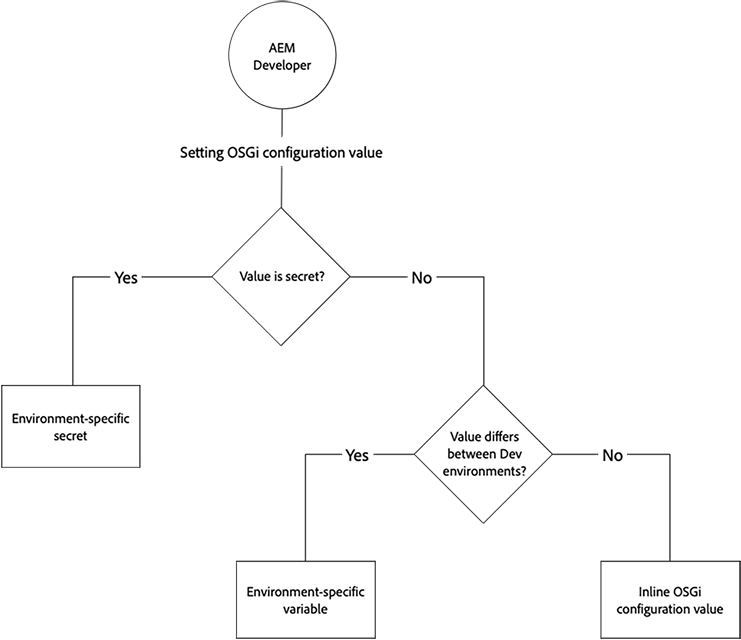

# Configurar OSGi para Adobe Experience Manager as a Cloud Service {#configuring-osgi-for-aem-as-a-cloud-service}

[OSGi](https://www.osgi.org/) es un elemento fundamental de la pila tecnológica de Adobe Experience Manager AEM (). AEM Se utiliza para controlar los paquetes compuestos de y sus configuraciones de la.

OSGi proporciona las primitivas estandarizadas que permiten construir aplicaciones a partir de componentes pequeños, reutilizables y de colaboración. Estos componentes se pueden componer en una aplicación e implementarse. Esto permite administrar fácilmente los paquetes OSGi, ya que se pueden detener, instalar e iniciar individualmente. Las interdependencias se gestionan automáticamente. Cada componente OSGi está contenido en uno de los distintos paquetes. Para obtener más información, consulte la [Especificación OSGi](https://help.eclipse.org/latest/index.jsp).

AEM Puede administrar las opciones de configuración de los componentes de OSGi a través de archivos de configuración que forman parte de un proyecto de código de.

>[!TIP]
>
>Puede utilizar Cloud Manager para configurar variables de entorno. Para obtener más información, consulte la documentación [aquí.](/help/implementing/cloud-manager/environment-variables.md)

## Archivos de configuración de OSGi {#osgi-configuration-files}

AEM Los cambios de configuración se definen en los paquetes de código del proyecto de la (`ui.config`) como archivos de configuración (`.cfg.json`) en las carpetas de configuración específicas del modo de ejecución:

`/apps/example/config.<runmode>`

El formato de los archivos de configuración de OSGi se basa en JSON usando la variable `.cfg.json` definido por el proyecto Apache Sling.

Las configuraciones de OSGi se dirigen a los componentes de OSGi a través de su identidad persistente (PID), que toma el valor predeterminado del nombre de clase Java™ del componente OSGi. Por ejemplo, para proporcionar la configuración OSGi para un servicio OSGi implementado por:

`com.example.workflow.impl.ApprovalWorkflow.java`

se define un archivo de configuración OSGi en:

`/apps/example/config/com.example.workflow.impl.ApprovalWorkflow.cfg.json`

siguiendo los `cfg.json` Formato de configuración OSGi.

>[!NOTE]
>
>AEM Versiones anteriores de archivos de configuración OSGi compatibles con el uso de diferentes formatos de archivo, como `.cfg`, `.config` y como XML `sling:OsgiConfig` definiciones de recursos. Estos formatos están reemplazados por el `.cfg.json` Formato de configuración OSGi.

>[!NOTE]
>
>AEM Las configuraciones de OSGi no se almacenan en /apps como las instancias de típicas en la nube, sino en una ubicación externa. Proteger Cloud Manager [Developer Console](https://experienceleague.adobe.com/en/docs/experience-manager-learn/cloud-service/debugging/debugging-aem-as-a-cloud-service/developer-console#configurations) para ver las configuraciones de OSGi.

## Resolución de modo de ejecución {#runmode-resolution}

>[!TIP]
>
>AEM AEM 6.x admite modos de ejecución personalizados, aunque no admite los modos de ejecución as a Cloud Service de la. AEM Soporte as a Cloud Service de y [conjunto exacto de modos de ejecución](./overview.md#runmodes). AEM Cualquier variación en las configuraciones de OSGi entre entornos as a Cloud Service de la aplicación debe gestionarse mediante [Variables de entorno de configuración OSGi](#environment-specific-configuration-values).

AEM Las configuraciones específicas de OSGi se pueden dirigir a instancias de específicas mediante modos de ejecución. Para utilizar el modo de ejecución, cree carpetas de configuración en `/apps/example` (donde ejemplo es el nombre del proyecto), con el formato:

`/apps/example/config.<author|publish>.<dev|stage|prod>/`

AEM Cualquier configuración OSGi en estas carpetas se utiliza si los modos de ejecución definidos en el nombre de la carpeta de configuración coinciden con los modos de ejecución utilizados por los.

AEM Por ejemplo, si está utilizando los modos de ejecución author y dev, los nodos de configuración en `/apps/example/config.author/` y `/apps/example/config.author.dev/` se aplican, mientras que los nodos de configuración de `/apps/example/config.publish/` y `/apps/example/config.author.stage/` no se aplican.

Si se aplican varias configuraciones para el mismo PID, se aplica la configuración con el número más alto de modos de ejecución coincidentes.

La granularidad de esta regla es de nivel PID. Esto significa que no se pueden definir algunas propiedades para el mismo PID en `/apps/example/config.author/` y más específicos en `/apps/example/config.author.dev/` para el mismo PID. La configuración con el mayor número de modos de ejecución coincidentes es efectiva para todo el PID.

>[!NOTE]
>
>A `config.preview` Carpeta de configuración OSGi **no puede** se declararán del mismo modo que `config.publish` se puede declarar en la carpeta. En su lugar, el nivel de vista previa hereda su configuración OSGi de los valores del nivel de publicación.

Al desarrollar localmente, un parámetro de inicio de modo de ejecución, `-r`, se utiliza para especificar la configuración OSGI del modo de ejecución.

```shell
$ java -jar aem-sdk-quickstart-xxxx.x.xxx.xxxx-xxxx.jar -r publish,dev
```

### Verificación de modos de ejecución

AEM Los modos de ejecución as a Cloud Service están bien definidos en función del tipo de entorno y el servicio. Revise la [AEM lista completa de los modos de ejecución as a Cloud Service de la disponibles](./overview.md#runmodes).

Los valores de configuración OSGi especificados por el modo de ejecución se pueden comprobar mediante:

1. AEM Abrir la como entorno de Cloud Service de [Developer Console](https://experienceleague.adobe.com/docs/experience-manager-learn/cloud-service/debugging/debugging-aem-as-a-cloud-service/developer-console.html?lang=es)
1. Selección de los niveles de servicio que se van a inspeccionar mediante el __Pod__ lista desplegable
1. Selección de la __Estado__ pestaña
1. Seleccionar __Configuraciones__ desde el __Volcado de estado__ lista desplegable
1. Selección de la __Obtener estado__ botón

La vista resultante muestra todas las configuraciones de componentes OSGi para los niveles seleccionados con sus valores de configuración OSGi aplicables. AEM Se puede hacer referencia a estos valores con los valores de configuración OSGi en el código fuente del proyecto de en `/apps/example/osgiconfig/config.<runmode(s)>`.


Para verificar que se aplican los valores de configuración OSGi adecuados:

1. En la salida de configuración de Developer Console
1. Busque el `pid` AEM que representa la configuración OSGi que se va a comprobar; es el nombre del archivo de configuración OSGi que se encuentra en el código fuente del proyecto de.
1. Inspect el `properties` lista para la `pid` AEM y compruebe que la clave y los valores coinciden con el archivo de configuración OSGi en el código fuente del proyecto de la aplicación para el modo de ejecución que se está comprobando.=


## Tipos de valores de configuración de OSGi {#types-of-osgi-configuration-values}

Existen tres variedades de valores de configuración OSGi que se pueden utilizar con Adobe Experience Manager as a Cloud Service.

1. **Valores en línea**, que son valores codificados en la configuración OSGi y almacenados en Git. Por ejemplo:

   ```json
   {
      "connection.timeout": 1000
   }
   ```

1. **Valores secretos**, que son valores que no deben almacenarse en Git por motivos de seguridad. Por ejemplo:

   ```json
   {
   "api-key": "$[secret:server-api-key]"
   } 
   ```

1. **Valores específicos del entorno**, que son valores que varían entre entornos de desarrollo y que, por lo tanto, no se pueden segmentar con precisión mediante el modo de ejecución (ya que hay un único `dev` runmode en Adobe Experience Manager as a Cloud Service). Por ejemplo:

   ```json
   {
    "url": "$[env:server-url]"
   }
   ```

   Un solo archivo de configuración OSGi puede utilizar cualquier combinación de estos tipos de valores de configuración junto con. Por ejemplo:

   ```json
   {
   "connection.timeout": 1000,
   "api-key": "$[secret:server-api-key]",
   "url": "$[env:server-url]"
   }
   ```

## Cómo elegir el tipo de valor de configuración OSGi adecuado {#how-to-choose-the-appropriate-osgi-configuration-value-type}

El caso común de OSGi utiliza valores de configuración OSGi en línea. Las configuraciones específicas del entorno solo se utilizan en casos de uso específicos en los que un valor difiere entre entornos de desarrollo.



Las configuraciones específicas del entorno amplían las configuraciones de OSGi tradicionales definidas estáticamente que contienen valores en línea, lo que permite administrar los valores de configuración de OSGi de forma externa mediante la API de Cloud Manager. Es importante comprender cuándo se debe utilizar el enfoque común y tradicional de definir valores en línea y almacenarlos en Git, en lugar de abstraer los valores en configuraciones específicas del entorno.

La siguiente guía indica cuándo utilizar configuraciones específicas de entorno no secretas y secretas:

### Cuándo utilizar valores de configuración en línea {#when-to-use-inline-configuration-values}

Los valores de las configuraciones en línea se consideran el método estándar y deben utilizarse siempre que sea posible. Las configuraciones en línea proporcionan las ventajas de:

* Se mantienen, con gobierno e historial de versiones en Git
* Los valores están implícitamente vinculados a implementaciones de código
* No requieren consideraciones de implementación ni coordinación adicionales

Siempre que defina un valor de configuración de OSGi, comience con valores en línea y solo seleccione configuraciones secretas o específicas del entorno si es necesario para el caso de uso.

### Cuándo utilizar valores de configuración específicos de entorno no secretos {#when-to-use-non-secret-environment-specific-configuration-values}

Usar solo configuraciones específicas del entorno (`$[env:ENV_VAR_NAME]`) para valores de configuración no secretos cuando los valores varían para el nivel de vista previa o varían entre entornos de desarrollo. Esto incluye instancias de desarrollo local y cualquier entorno de desarrollo de Adobe Experience Manager as a Cloud Service. Aparte de para establecer valores únicos para el nivel de vista previa, evite utilizar configuraciones específicas de entorno no secretas para entornos de ensayo o producción de Adobe Experience Manager as a Cloud Service.

* Utilice únicamente configuraciones específicas del entorno no secretas para valores de configuración que difieran entre los niveles de publicación y vista previa, o para valores que difieran entre entornos de desarrollo, incluidas instancias de desarrollo local.
* Además del escenario en el que el nivel de vista previa debe variar del de publicación, utilice los valores en línea estándar en las configuraciones OSGi para los valores no secretos de Fase y Producción. En relación con esto, no se recomienda utilizar configuraciones específicas del entorno para facilitar la realización de cambios de configuración en el tiempo de ejecución en los entornos de ensayo y producción; estos cambios deben introducirse mediante la administración del código fuente.

### Cuándo utilizar valores de configuración secretos específicos del entorno {#when-to-use-secret-environment-specific-configuration-values}

Adobe Experience Manager as a Cloud Service requiere el uso de configuraciones específicas del entorno (`$[secret:SECRET_VAR_NAME]`) para cualquier valor secreto de configuración de OSGi, como contraseñas, claves API privadas o cualquier otro valor que no se pueda almacenar en Git por motivos de seguridad.

Utilice configuraciones específicas del entorno secretas para almacenar el valor de los secretos en todos los entornos de Adobe Experience Manager as a Cloud Service, incluidos Fase y Producción.

## Creación de configuraciones de OSGi {#creating-osgi-configurations}

Existen dos formas de crear configuraciones de OSGi, como se describe a continuación. AEM El primer método se utiliza generalmente para configurar componentes OSGi personalizados que tienen propiedades y valores OSGi conocidos por el desarrollador, y el último para componentes OSGi proporcionados por el desarrollador y que se proporcionan por el usuario.

### Escribir configuraciones de OSGi {#writing-osgi-configurations}

AEM Los archivos de configuración OSGi con formato JSON se pueden escribir a mano directamente en el proyecto de. Esta suele ser la forma más rápida de crear configuraciones de OSGi para componentes OSGi conocidos, y especialmente componentes OSGi personalizados que han sido diseñados y desarrollados por el mismo desarrollador que define las configuraciones. Este método también se puede utilizar para copiar/pegar y actualizar configuraciones para el mismo componente OSGi en varias carpetas de modo de ejecución.

1. En su IDE, abra el `ui.apps` , busque o cree la carpeta de configuración (`/apps/.../config.<runmode>`), que identifica los modos de ejecución que debe aplicar la nueva configuración OSGi
1. En esta carpeta de configuración, cree un `<PID>.cfg.json` archivo. El PID es la identidad persistente del componente OSGi. Normalmente es el nombre de clase completo de la implementación del componente OSGi. Por ejemplo:
   `/apps/.../config/com.example.workflow.impl.ApprovalWorkflow.cfg.json`
Los nombres de archivo de fábrica de configuración OSGi utilizan el `<factoryPID>-<name>.cfg.json` convención de nomenclatura
1. Abra el nuevo `.cfg.json` y defina las combinaciones de clave y valor para los pares de propiedad y valor OSGi, siguiendo el [Formato de configuración OSGi de JSON](https://sling.apache.org/documentation/bundles/configuration-installer-factory.html#configuration-files-cfgjson-1).
1. Guarde los cambios en el nuevo `.cfg.json` archivo
1. Añada y confirme su nuevo archivo de configuración OSGi en Git

### AEM Generación de configuraciones de OSGi mediante el inicio rápido del SDK de {#generating-osgi-configurations-using-the-aem-sdk-quickstart}

AEM AEM La consola web del Jar de inicio rápido de SDK de la se puede utilizar para configurar componentes OSGi y exportar configuraciones OSGi como JSON. AEM AEM Esto resulta útil para configurar los componentes OSGi proporcionados por el administrador del proyecto, cuyas propiedades OSGi y sus formatos de valor pueden no ser bien entendidos por el desarrollador que define las configuraciones OSGi en el proyecto de.

>[!NOTE]
>
>AEM La interfaz de usuario de configuración de la consola web de sí escribe `.cfg.json` archivos en el repositorio. AEM Por lo tanto, tenga en cuenta este flujo de trabajo para evitar posibles comportamientos inesperados durante el desarrollo local, cuando las configuraciones de OSGi definidas por el proyecto pueden diferir de las configuraciones generadas.

1. AEM AEM Inicie sesión en la consola web de inicio rápido de Jar de la aplicación de inicio de sesión de la aplicación de en `https://<host>:<port>/system/console` como usuario administrador
1. Vaya a **OSGi** > **Configuración**
1. Para configurarlo, busque el componente OSGi y seleccione el título que desea editar
   
1. Edite los valores de las propiedades de configuración de OSGi mediante la interfaz de usuario web según sea necesario
1. Registre la identidad persistente (PID) en un lugar seguro. Esto se utiliza más adelante para generar el JSON de configuración de OSGi
1. Seleccione Guardar
1. Vaya a OSGi > Impresora de configuración del instalador OSGi
1. Pegue el PID copiado en el paso 5 y asegúrese de que el formato de serialización está establecido en &quot;OSGi Configurator JSON&quot;.
1. Seleccione Imprimir
1. La configuración de OSGi en formato JSON se mostrará en la sección Propiedades de configuración serializadas
   
1. En su IDE, abra el `ui.apps` , busque o cree la carpeta de configuración (`/apps/.../config.<runmode>`), que identifica los modos de ejecución que debe aplicar la nueva configuración OSGi.
1. En esta carpeta de configuración, cree un `<PID>.cfg.json` archivo. El PID es el mismo valor del paso 5.
1. Pegue las propiedades de configuración serializadas del paso 10 en la `.cfg.json` archivo.
1. Guarde los cambios en el nuevo `.cfg.json` archivo.
1. Añada y confirme su nuevo archivo de configuración OSGi en Git.


## Formatos de propiedad de configuración OSGi {#osgi-configuration-property-formats}

### Valores en línea {#inline-values}

Los valores en línea tienen el formato de pares de nombre-valor estándar, según la sintaxis JSON estándar. Por ejemplo:

```json
{
   "my_var1": "val",
   "my_var2": [ "abc", "def" ],
   "my_var3": 500
}
```

### Valores de configuración específicos del entorno {#environment-specific-configuration-values}

La configuración de OSGi debe asignar un marcador de posición para la variable que se pretende definir por entorno:

```
use $[env:ENV_VAR_NAME]
```

Los clientes solo deben utilizar esta técnica para las propiedades de configuración OSGi relacionadas con su código personalizado; no debe utilizarse para anular la configuración OSGi definida por el Adobe.

>[!NOTE]
>
>Los marcadores de posición no se pueden usar en [instrucciones repoinit](/help/implementing/deploying/overview.md#repoinit).

### Valores de configuración secretos {#secret-configuration-values}

La configuración de OSGi debe asignar un marcador de posición para el secreto que se pretende definir por entorno:

```
use $[secret:SECRET_VAR_NAME]
```

### Nombres de variables {#variable-naming}

Lo siguiente se aplica a los valores de configuración específicos del entorno y secretos.

Los nombres de las variables deben seguir las siguientes reglas:

* Longitud mínima: 2
* Longitud máxima: 100
* Debe coincidir con regex: `[a-zA-Z_][a-zA-Z_0-9]*`

Los valores de las variables no deben superar los 2048 caracteres.

>[!CAUTION]
>
>Existen reglas relacionadas con el uso de ciertos prefijos para nombres de variables:
>
>1. Nombres de variables con el prefijo `INTERNAL_`, `ADOBE_`, o `CONST_` están reservadas por Adobe. Se ignorará cualquier variable establecida por el cliente que comience con estos prefijos.
>
>1. Los clientes no deben hacer referencia a variables con el prefijo `INTERNAL_` o `ADOBE_` ya sea.
>
>1. Variables de entorno con el prefijo `AEM_` están definidos por el producto como API pública que deben utilizar y configurar los clientes.
>   Mientras que los clientes pueden utilizar y establecer variables de entorno que empiecen por el prefijo `AEM_` no deben definir sus propias variables con este prefijo.

### Valores predeterminados {#default-values}

Lo siguiente se aplica a los valores de configuración específicos del entorno y secretos.

Si no se establece ningún valor por entorno, en tiempo de ejecución el marcador de posición no se reemplaza y se deja en su lugar porque no se produjo ninguna interpolación. Para evitarlo, se puede proporcionar un valor predeterminado como parte del marcador de posición con la siguiente sintaxis:

```
$[env:ENV_VAR_NAME;default=<value>]
```

Con un valor predeterminado proporcionado, el marcador de posición se reemplaza por el valor predeterminado por entorno si se proporciona o por el valor predeterminado proporcionado.

### Desarrollo local {#local-development}

Lo siguiente se aplica a los valores de configuración específicos del entorno y secretos.

AEM Las variables se pueden definir en el entorno local para que las recoja el usuario local en el tiempo de ejecución de la. Por ejemplo, en Linux®:

```bash
export ENV_VAR_NAME=my_value
```

AEM Se recomienda escribir una secuencia de comandos bash simple que establezca las variables de entorno utilizadas en las configuraciones y ejecutarlas antes de iniciar la ejecución de la secuencia de comandos de la secuencia de comandos Herramientas como [https://direnv.net/](https://direnv.net/) ayudar a simplificar este enfoque. Según el tipo de valores, se podrían registrar en la administración del código fuente si todos pueden compartirlos.

Los valores de los secretos se leen desde archivos. Por lo tanto, para cada marcador de posición que utilice un secreto, se debe crear un archivo de texto que contenga el valor secreto.

Por ejemplo, si `$[secret:server_password]` se utiliza, un archivo de texto denominado **server_password** se debe crear. Todos estos archivos secretos deben almacenarse en el mismo directorio y en la propiedad framework `org.apache.felix.configadmin.plugin.interpolation.secretsdir` debe configurarse con ese directorio local.

>[!CAUTION]
>
>No se permiten extensiones para el archivo de texto.
>
>Por lo tanto, para el ejemplo anterior, el archivo de texto debe llamarse **server_password** - sin extensión de archivo.

El `org.apache.felix.configadmin.plugin.interpolation.secretsdir` es una propiedad de marco de trabajo de Sling; por lo tanto, esta propiedad no se establece en la consola felix (/system/console), sino en el archivo sling.properties que se utiliza cuando se inicia el sistema. Este archivo se puede encontrar en el subdirectorio /conf de la carpeta Jar/install extraída (crx-quickstart/conf).

ejemplo: añada esta línea al final del archivo &quot;crx-quickstart/conf/sling.properties&quot; para configurar &quot;crx-quickstart/secretsdir&quot; como carpeta secreta:

```
org.apache.felix.configadmin.plugin.interpolation.secretsdir=${sling.home}/secretsdir
```

### Configuración de autor frente a publicación {#author-vs-publish-configuration}

Si una propiedad OSGi requiere valores diferentes para autor y para publicación:

* Separar `config.author` y `config.publish` Las carpetas OSGi deben usarse, tal como se describe en la sección [Sección Resolución de modo de ejecución](#runmode-resolution).
* Existen dos opciones para crear los nombres de variables independientes que se deben utilizar:
   * la primera opción, que se recomienda: en todas las carpetas OSGi (como `config.author` y `config.publish`) declarado para definir valores diferentes, utilice el mismo nombre de variable. Por ejemplo
     `$[env:ENV_VAR_NAME;default=<value>]`, donde el valor predeterminado corresponde al valor predeterminado para ese nivel (autor o publicación). Al configurar la variable de entorno mediante [API de Cloud Manager](#cloud-manager-api-format-for-setting-properties) o a través de un cliente, diferencie entre los niveles utilizando el parámetro &quot;service&quot; como se describe en esta sección [Documentación de referencia del API](https://developer.adobe.com/experience-cloud/cloud-manager/api-reference/). El parámetro &quot;service&quot; enlazará el valor de la variable al nivel OSGi adecuado. Puede ser &quot;author&quot;, &quot;publish&quot; o &quot;preview&quot;.
   * la segunda opción, que es declarar distintas variables utilizando un prefijo como `author_<samevariablename>` y `publish_<samevariablename>`

### Ejemplos de configuración {#configuration-examples}

En los ejemplos siguientes, se supone que hay tres entornos de desarrollo, además de los entornos de ensayo y producción.

**Ejemplo 1**

La intención es para el valor de la propiedad OSGi `my_var1` debe ser el mismo para stage y prod, pero diferente para cada uno de los tres entornos de desarrollo.

<table>
<tr>
<td>
<b>Carpeta</b>
</td>
<td>
<b>Contenido de myfile.cfg.json</b>
</td>
</tr>
<tr>
<td>
Configuración
</td>
<td>
<pre>
{ "my_var1": "val", "my_var2": "abc", "my_var3": 500 }
</pre>
</td>
</tr>
<tr>
<td>
config.dev
</td>
<td>
<pre>
{ "my_var1" : "$[env:my_var1]" "my_var2": "abc", "my_var3": 500 }
</pre>
</td>
</tr>
</table>

**Ejemplo 2**

La intención es para el valor de la propiedad OSGi `my_var1` para diferir para stage, prod y para cada uno de los tres entornos de desarrollo. Por lo tanto, se debe llamar a la API de Cloud Manager para establecer el valor de `my_var1` para cada entorno de desarrollo.

<table>
<tr>
<td>
<b>Carpeta</b>
</td>
<td>
<b>Contenido de myfile.cfg.json</b>
</td>
</tr>
<tr>
<td>
config.stage
</td>
<td>
<pre>
{ "my_var1": "val1", "my_var2": "abc", "my_var3": 500 }
</pre>
</td>
</tr>
<tr>
<td>
config.prod
</td>
<td>
<pre>
{ "my_var1": "val2", "my_var2": "abc", "my_var3": 500 }
</pre>
</td>
</tr>
<tr>
<td>
config.dev
</td>
<td>
<pre>
{ "my_var1" : "$[env:my_var1]" "my_var2": "abc", "my_var3": 500 }
</pre>
</td>
</tr>
</table>

**Ejemplo 3**

La intención es para el valor de la propiedad OSGi `my_var1` que sea lo mismo para la fase, la producción y solo uno de los entornos de desarrollo, pero que difiera para los otros dos entornos de desarrollo. En este caso, se debe llamar a la API de Cloud Manager para establecer el valor de `my_var1` para cada uno de los entornos de desarrollo, incluido el entorno de desarrollo, que debe tener el mismo valor que fase y producción. No heredará el valor establecido en la carpeta **config**.

<table>
<tr>
<td>
<b>Carpeta</b>
</td>
<td>
<b>Contenido de myfile.cfg.json</b>
</td>
</tr>
<tr>
<td>
Configuración
</td>
<td>
<pre>
{ "my_var1": "val1", "my_var2": "abc", "my_var3": 500 }
</pre>
</td>
</tr>
<tr>
<td>
config.dev
</td>
<td>
<pre>
{ "my_var1" : "$[env:my_var1]" "my_var2": "abc", "my_var3": 500 }
</pre>
</td>
</tr>
</table>

Otra manera de lograr esto sería establecer un valor predeterminado para el token de reemplazo en la carpeta config.dev de modo que sea el mismo valor que en la **config** carpeta.

<table>
<tr>
<td>
<b>Carpeta</b>
</td>
<td>
<b>Contenido de myfile.cfg.json</b>
</td>
</tr>
<tr>
<td>
Configuración
</td>
<td>
<pre>
{ "my_var1": "val1", "my_var2": "abc", "my_var3": 500 }
</pre>
</td>
</tr>
<tr>
<td>
config.dev
</td>
<td>
<pre>
{ "my_var1": "$[env:my_var1;default=val1]" "my_var2": "abc", "my_var3": 500 }
</pre>
</td>
</tr>
</table>

## Formato de API de Cloud Manager para establecer propiedades {#cloud-manager-api-format-for-setting-properties}

Consulte [esta página](https://developer.adobe.com/experience-cloud/cloud-manager/docs/) sobre cómo se debe configurar la API.
>[!NOTE]
>
>Asegúrese de que la API de Cloud Manager utilizada tenga asignada la función &quot;Administrador de implementación: Cloud Service&quot;. Otros roles no pueden ejecutar todos los comandos siguientes.

>[!TIP]
>
>También puede utilizar Cloud Manager para configurar variables de entorno. Para obtener más información, consulte la documentación [aquí.](/help/implementing/cloud-manager/environment-variables.md)

### Configuración de valores mediante API {#setting-values-via-api}

Al llamar a la API, se implementan las nuevas variables y los nuevos valores en un entorno de nube, de forma similar a una canalización de implementación de código de cliente típica. Los servicios de autor y publicación se reinician y hacen referencia a los nuevos valores, lo que generalmente tarda unos minutos.

```
PATCH /program/{programId}/environment/{environmentId}/variables
```

```json
[
        {
                "name" : "MY_VAR1",
                "value" : "plaintext value",
                "type" : "string"  <---default
        },
        {
                "name" : "MY_VAR2",
                "value" : "<secret value>",
                "type" : "secretString"
        }
]
```

>[!NOTE]
>Las variables predeterminadas no se establecen mediante API sino en la propia propiedad OSGi.
>
>Consulte [esta página](https://developer.adobe.com/experience-cloud/cloud-manager/api-reference/) para obtener más información.

### Obtención de valores mediante API {#getting-values-via-api}

```
GET /program/{programId}/environment/{environmentId}/variables
```

Consulte [esta página](https://developer.adobe.com/experience-cloud/cloud-manager/api-reference/) para obtener más información.

### Eliminación de valores mediante API {#deleting-values-via-api}

```
PATCH /program/{programId}/environment/{environmentId}/variables
```

Para eliminar una variable, inclúyala con un valor vacío.

Consulte [esta página](https://developer.adobe.com/experience-cloud/cloud-manager/api-reference/) para obtener más información.

### Obtención de valores mediante la línea de comandos {#getting-values-via-cli}

```bash
$ aio cloudmanager:list-environment-variables ENVIRONMENT_ID
Name     Type         Value
MY_VAR1  string       plaintext value 
MY_VAR2  secretString ****
```


### Configuración de valores mediante la línea de comandos {#setting-values-via-cli}

```bash
$ aio cloudmanager:set-environment-variables ENVIRONMENT_ID --variable MY_VAR1 "plaintext value" --secret MY_VAR2 "some secret value"
```

### Eliminación de valores mediante la línea de comandos {#deleting-values-via-cli}

```bash
$ aio cloudmanager:set-environment-variables ENVIRONMENT_ID --delete MY_VAR1 MY_VAR2
```

>[!NOTE]
>
>Consulte [esta página](https://github.com/adobe/aio-cli-plugin-cloudmanager#aio-cloudmanagerset-environment-variables-environmentid) para obtener más información sobre cómo configurar valores mediante el complemento Cloud Manager para CLI de Adobe I/O.

### Número de variables {#number-of-variables}

Se pueden declarar hasta 200 variables por entorno.

## Consideraciones de implementación para valores de configuración secretos y específicos del entorno {#deployment-considerations-for-secret-and-environment-specific-configuration-values}

Dado que los valores de configuración secretos y específicos del entorno viven fuera de Git y, por lo tanto, no forman parte de los mecanismos de implementación formales de Adobe Experience Manager as a Cloud Service, el cliente debe administrar, gobernar e integrar en el proceso de implementación de Adobe Experience Manager as a Cloud Service.

Como se ha mencionado anteriormente, llamar a la API implementa las nuevas variables y valores en entornos en la nube, de forma similar a una canalización de implementación de código de cliente típica. Los servicios de autor y publicación se reinician y hacen referencia a los nuevos valores, lo que generalmente tarda unos minutos. Las puertas de calidad y las pruebas que ejecuta Cloud Manager durante una implementación de código normal no se realizan durante este proceso.

Normalmente, los clientes llamarían a la API para establecer variables de entorno antes de implementar el código que se basa en ellas en Cloud Manager. En algunas situaciones, es posible que se desee modificar una variable existente después de haber implementado el código.

>[!NOTE]
>
>AEM Es posible que la API no se ejecute correctamente cuando una canalización está en uso, ya sea una actualización de la o una implementación del cliente, según qué parte de la canalización de extremo a extremo se esté ejecutando en ese momento. La respuesta de error indicará que la solicitud no se realizó correctamente, aunque no indicará el motivo específico.

Puede haber casos en los que una implementación programada de código de cliente dependa de variables existentes para tener nuevos valores, lo que no sería apropiado con el código actual. Si esto le preocupa, se recomienda realizar modificaciones de variables de forma aditiva. Para ello, cree nuevos nombres de variables en lugar de solo cambiar el valor de las variables antiguas, de modo que el código antiguo nunca haga referencia al nuevo valor. A continuación, cuando la nueva versión del cliente parezca estable, se puede optar por eliminar los valores más antiguos.

Del mismo modo, como los valores de una variable no están versionados, una reversión del código podría hacer que haga referencia a valores más recientes que causen problemas. La estrategia de variables aditivas mencionada anteriormente también ayudaría en este caso.

Esta estrategia de variables aditivas también es útil en casos de recuperación ante desastres en los que si es necesario volver a implementar el código de varios días antes, los nombres y valores de las variables a los que hace referencia seguirán intactos. Esto se basa en una estrategia en la que un cliente espera unos días antes de eliminar esas variables antiguas; de lo contrario, el código anterior no tendría variables adecuadas a las que hacer referencia.
