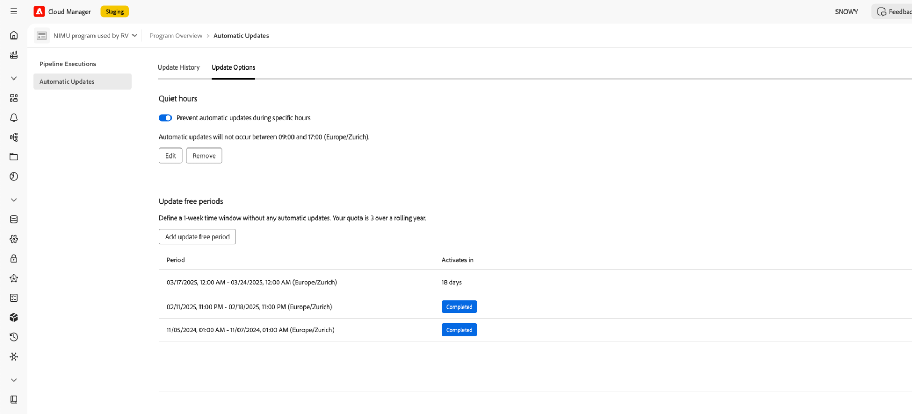

# Horas tranquilas y períodos libres de actualización {#quiet-hours-update-free-periods}

>[!NOTE]
>Esta característica estará disponible como característica de **disponibilidad limitada** a partir del 29 de septiembre. Envíe un correo electrónico a [aemcs-update-free@adobe.com](mailto:aemcs-update-free@adobe.com) para activar la función en sus programas.

Las [actualizaciones automáticas de mantenimiento](/help/implementing/deploying/aem-version-updates.md) de AEM as a Cloud Service garantizan que las instancias estén seguras y actualizadas con las últimas versiones de mantenimiento. Dicho esto, en algunos casos (como los eventos de go-live) es posible que tenga que &quot;proteger&quot; esas horas de trabajo críticas de cualquier interrupción potencial. Como tal, AEM as a Cloud Service ofrece la opción de establecer un intervalo de tiempo en el que no se produzcan actualizaciones automáticas para los programas en curso.

Puede configurar estos lapsos de tiempo mediante dos opciones de programación:

* **Horas tranquilas**: puede definir un intervalo de tiempo diario (hasta 8 horas) en el que no se producirán actualizaciones.
* **Actualizar períodos libres**: puede definir un período de tiempo de 7 días en el que no se producirán actualizaciones. Puede tener hasta tres períodos libres de actualización dentro de un lapso de tiempo de 12 meses.

Las funciones de actualizar los periodos libres y las horas de inactividad se configuran por programa.

Además, para obtener información sobre los períodos de mantenimiento automático programados de AEM as a Cloud Service, consulte la página [Plan de lanzamiento de Experience Manager](https://experienceleague.adobe.com/es/docs/experience-manager-release-information/aem-release-updates/update-releases-roadmap).

## Horas de silencio {#quiet-hours}

Mediante la función de horas tranquilas puede definir una ventana de tiempo durante el día sin ninguna actualización automática. Todas las actualizaciones de mantenimiento se desplazarán para que se produzcan fuera de la ventana de tiempo configurada. Si, por ejemplo, se programa una actualización durante las horas de inactividad especificadas, se iniciará automáticamente después de que finalice el intervalo de hora de inactividad. El intervalo de tiempo configurado no puede superar las 8 horas para que las actualizaciones puedan seguir produciéndose a diario.

Puede definir estas horas tranquilas **por programa**, usando su zona horaria local.

### Cómo configurar el intervalo de horas silenciosas {#configure-quiet-hours}

El intervalo de horas de inactividad se puede configurar mediante la interfaz de AEM Cloud Manager de la siguiente manera:

Vaya a **Actividades>Actualizaciones automáticas>Opciones de actualización**.

1. Asegúrese de que la opción **Impedir actualizaciones automáticas durante horas específicas** esté activada.
2. Haga clic en **Editar**.
3. Establezca el intervalo de horas silenciosas en la ventana de configuración.

Una vez establecidas, las horas de inicio y finalización especificadas se aplicarán a cada día del calendario a partir de ahora. Puede deshabilitar o volver a configurar el valor de las horas de silencio según sea necesario.

## Actualizar períodos libres {#update-free-periods}

Mediante el uso de la función de periodos libres de actualización puede definir un lapso de tiempo de 7 días en el que no se producirán actualizaciones. Una vez configuradas, todas las actualizaciones de mantenimiento se desplazarán automáticamente para producirse fuera del lapso de tiempo definido. Puede tener hasta tres períodos libres de actualización dentro de un intervalo de 12 meses. Además, los periodos libres de actualización se pueden designar con hasta un año de anticipación.

Tenga en cuenta al configurar esta opción que (al menos) es obligatorio un intervalo de tiempo de una semana entre periodos para facilitar las actualizaciones automáticas. Como tal, este intervalo de tiempo de una semana se aplica automáticamente y se agregará al calendario entre los periodos libres de actualización que configuró. Esto puede hacer que algunos días del calendario no estén disponibles para su selección.

Puede definir los periodos libres de actualización **por programa**.

### Configuración de los periodos libres de actualización {#configure-update-free-periods}

La función de periodos libres de actualización se puede configurar mediante la interfaz de AEM Cloud Manager de la siguiente manera:

Vaya a **Actividades>Actualizaciones automáticas>Opciones de actualización**.

1. Vaya a la sección Actualización de periodos libres.
2. Haga clic en **Agregar período libre de actualización**.
3. Seleccione un período libre de actualización de una semana en el calendario.

Se mostrará un icono **Activo** cerca del período libre de actualización activo y un icono **Completar** cerca de los períodos libres de actualización completados.
