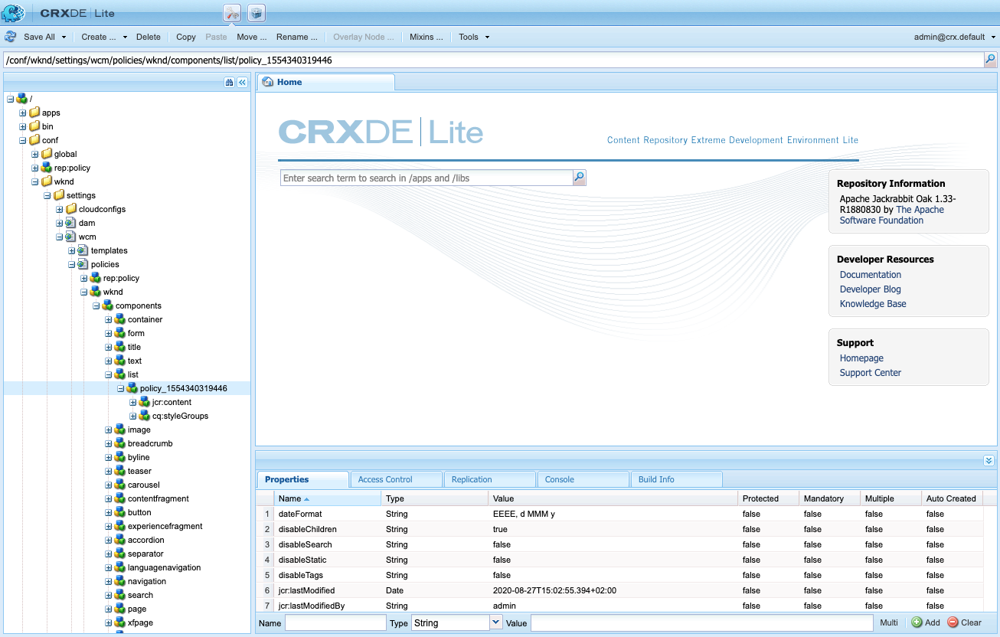
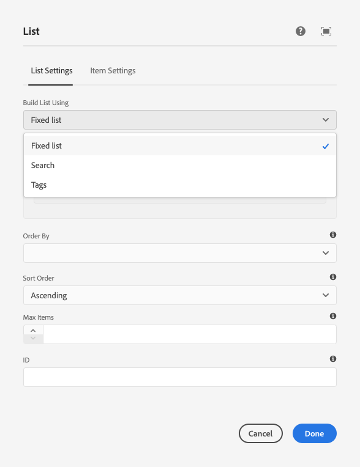

# Uso de Ocultar condiciones {#using-hide-conditions}

Ocultar condiciones se puede utilizar para determinar si un recurso de componente se procesa o no. Un ejemplo de esto sería cuando un autor de plantillas configure el componente principal [componente de lista](https://experienceleague.adobe.com/docs/experience-manager-core-components/using/components/list.html?lang=es) en el [editor de plantillas](/help/sites-cloud/authoring/page-editor/templates.md) y decida deshabilitar las opciones para generar la lista basada en páginas secundarias. Al deshabilitar esta opción en el cuadro de diálogo de diseño, se establece una propiedad de modo que cuando se procese el componente de lista, se evalúe la condición de ocultar y no se muestre la opción para mostrar páginas secundarias.

## Información general {#overview}

Los diálogos pueden llegar a ser muy complejos con numerosas opciones para el usuario, que solo puede utilizar una fracción de las opciones que están a su disposición. Esto puede generar experiencias de interfaz de usuario abrumadoras para los usuarios.

Al utilizar las condiciones de ocultación, los administradores, los desarrolladores y los superusuarios tienen una forma de ocultar los recursos en función de un conjunto de reglas. Esta función les permite decidir qué recursos se deben mostrar cuando un autor edita el contenido.

>[!NOTE]
>
>Al ocultar un recurso basado en una expresión, no se reemplazan los permisos ACL. El contenido sigue siendo editable, pero simplemente no se muestra.

## Detalles de implementación y uso {#implementation-and-usage-details}

`com.adobe.granite.ui.components.FilteringResourceWrapper` es responsable de filtrar los recursos en función de la existencia y el valor de la propiedad `granite:hide`, ubicada en el campo que se va a filtrar. La implementación de `/libs/cq/gui/components/authoring/dialog/dialog.jsp` incluye una instancia de `FilteringResourceWrapper.`

La implementación utiliza la API [ELResolver de Granite](https://helpx.adobe.com/experience-manager/6-5/sites/developing/using/reference-materials/granite-ui/api/jcr_root/libs/granite/ui/docs/server/el.html) y agrega una variable personalizada `cqDesign` a través de ExpressionCustomizer.

A continuación se muestran algunos ejemplos de ocultar condiciones en un nodo de diseño ubicado en `etc/design` o como directiva de contenido.

```
${cqDesign.myProperty}
${!cqDesign.myProperty}
${cqDesign.myProperty == 'someText'}
${cqDesign.myProperty != 'someText'}
${cqDesign.myProperty == true}
${cqDesign.myProperty == true}
${cqDesign.property1 == 'someText' && cqDesign.property2 || cqDesign.property3 != 1 || header.myHeader}
```

Al definir la expresión Hide, tenga en cuenta:

* Para ser válido, el ámbito en el que se encuentra la propiedad debe expresarse (por ejemplo, `cqDesign.myProperty`).
* Los valores son de solo lectura.
* Las funciones (si es necesario) deben limitarse a un conjunto determinado proporcionado por el servicio.

## Ejemplo {#example}

Se pueden encontrar ejemplos de condiciones de ocultación en AEM y en los [componentes principales](https://experienceleague.adobe.com/docs/experience-manager-core-components/using/introduction.html?lang=es) en particular. Por ejemplo, considere el [componente principal de lista](https://experienceleague.adobe.com/docs/experience-manager-core-components/using/components/list.html?lang=es) tal como se implementó en el [tutorial de WKND](/help/implementing/developing/introduction/develop-wknd-tutorial.md).

[Con el editor de plantillas](/help/sites-cloud/authoring/page-editor/templates.md), el autor de la plantilla puede definir en el cuadro de diálogo de diseño qué opciones del componente de lista están disponibles para el autor de la página. Pueden habilitarse o deshabilitarse opciones como permitir que la lista sea una lista estática, una lista de páginas secundarias, una lista de páginas etiquetadas, etc.

Si un autor de una plantilla decide deshabilitar la opción de páginas secundarias, se establece una propiedad de diseño y se evalúa una condición de ocultación con respecto a ella, lo que hace que la opción no se procese para el autor de la página.

1. De forma predeterminada, el autor de la página puede utilizar el componente principal de la lista para crear una lista con páginas secundarias eligiendo la opción **Páginas secundarias**.

   

1. En el cuadro de diálogo de diseño del componente principal de lista, el autor de la plantilla puede elegir la opción **Deshabilitar elementos secundarios** para evitar que se muestre al autor de la página la opción de generar una lista basada en páginas secundarias.

   

1. Se crea un nodo de directiva en `/conf/wknd/settings/wcm/policies/wknd/components/list` con una propiedad `disableChildren` establecida en `true`.

   

1. La condición de ocultar se define como el valor de una propiedad `granite:hide` en el nodo de propiedad de diálogo `/libs/core/wcm/components/list/v2/list/cq:dialog/content/items/tabs/items/listSettings/items/columns/items/column/items/listFrom/items/children`

   

1. El valor de `disableChildren` se extrae de la configuración de diseño y la expresión `${cqDesign.disableChildren}` se evalúa como `false`, lo que significa que la opción no se representará como parte del componente.

1. La opción **Páginas secundarias** ya no se representa para el autor de la página al usar el componente de lista.

   
