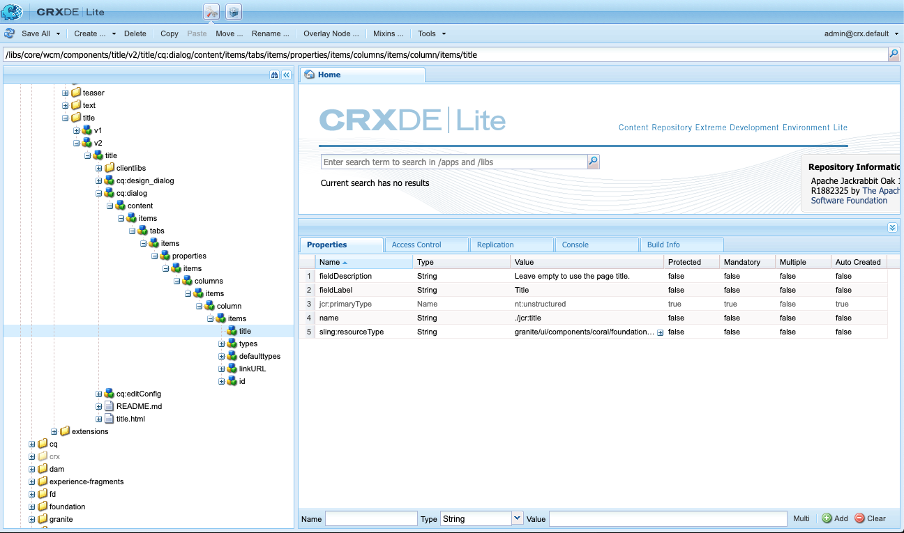

# Guía de referencia de componentes {#components-reference-guide}

AEM Los componentes son el núcleo de la creación de una experiencia en la. AEM Los [componentes principales](https://experienceleague.adobe.com/docs/experience-manager-core-components/using/introduction.html?lang=es) y el [tipo de archivo del proyecto de](https://experienceleague.adobe.com/docs/experience-manager-core-components/using/developing/archetype/overview.html?lang=es) facilitan la introducción a un conjunto de herramientas de componentes sólidos y listos para usar. AEM El [Tutorial WKND](/help/implementing/developing/introduction/develop-wknd-tutorial.md) guía al desarrollador sobre cómo usar estas herramientas y cómo crear componentes personalizados para crear un sitio de la.

>[!TIP]
>
>AEM Antes de hacer referencia a este documento, asegúrese de haber completado el [Tutorial de WKND](/help/implementing/developing/introduction/develop-wknd-tutorial.md) y, por lo tanto, de estar familiarizado con los [componentes principales](https://experienceleague.adobe.com/docs/experience-manager-core-components/using/introduction.html?lang=es) y el [Arquetipo de proyecto de](https://experienceleague.adobe.com/docs/experience-manager-core-components/using/developing/archetype/overview.html?lang=es).

Dado que el tutorial de WKND cubre la mayoría de los casos de uso, este documento está diseñado únicamente como complemento de esos recursos. AEM Ofrece detalles técnicos detallados sobre cómo se estructuran y configuran los componentes en los componentes de y no está diseñado como guía de introducción a la configuración de los componentes de.

## Información general {#overview}

Esta sección abarca conceptos y problemas clave como introducción a los detalles necesarios al desarrollar sus propios componentes.

### Planificación {#planning}

Antes de empezar a configurar o codificar el componente, debe preguntar lo siguiente:

* ¿Qué debe hacer exactamente el nuevo componente?
* ¿Necesita crear el componente desde cero o puede heredar los conceptos básicos de un componente existente?
* ¿Requerirá su componente lógica para seleccionar o manipular el contenido?
   * La lógica debe mantenerse separada de la capa de interfaz de usuario. HTL está diseñado para ayudar a garantizar que esto suceda.
* ¿Necesitará el componente formato CSS?
   * El formato CSS debe mantenerse separado de las definiciones de componentes. Defina convenciones para asignar un nombre a los elementos del HTML para que pueda modificarlos a través de archivos CSS externos.
* ¿Qué implicaciones de seguridad puede introducir su nuevo componente?

### Reutilización de componentes existentes {#reusing-components}

Antes de invertir tiempo en crear un componente completamente nuevo, considere la posibilidad de personalizar o ampliar los componentes existentes. [Los componentes principales](https://experienceleague.adobe.com/docs/experience-manager-core-components/using/introduction.html?lang=es) ofrecen un conjunto de componentes flexibles, sólidos y probados para la producción.

#### Ampliación de componentes principales {#extending-core-components}

Los componentes principales también ofrecen [patrones de personalización claros](https://experienceleague.adobe.com/docs/experience-manager-core-components/using/developing/customizing.html?lang=es) que puede usar para adaptarlos a las necesidades de su propio proyecto.

#### Superposición de componentes {#overlying-components}

Los componentes también se pueden redefinir con una [superposición](/help/implementing/developing/introduction/overlays.md) basada en la lógica de ruta de búsqueda. Sin embargo, en ese caso, la [fusión de recursos de Sling](/help/implementing/developing/introduction/sling-resource-merger.md) no se activará y `/apps` debe definir toda la superposición.

#### Ampliación de cuadros de diálogo de componentes {#extending-component-dialogs}

También es posible anular un cuadro de diálogo de componentes mediante la fusión de recursos de Sling y definiendo la propiedad `sling:resourceSuperType`.

Esto significa que solo necesita redefinir las diferencias necesarias, en lugar de redefinir todo el cuadro de diálogo.

### Lógica de contenido y marcado de procesamiento  {#content-logic-and-rendering-markup}

El componente se procesó con [HTML](https://www.w3schools.com/htmL/html_intro.asp). El componente debe definir el HTML necesario para tomar el contenido necesario y luego procesarlo según sea necesario, en los entornos de creación y publicación.

Se recomienda mantener el código responsable del marcado y el procesamiento separado del código que controla la lógica utilizada para seleccionar el contenido del componente.

Esta filosofía es compatible con [HTL](https://experienceleague.adobe.com/docs/experience-manager-htl/content/overview.html?lang=es), un lenguaje de creación de plantillas que está limitado a propósito para garantizar que se use un lenguaje de programación real para definir la lógica empresarial subyacente. Este mecanismo resalta el código que se llama para una vista determinada y, si es necesario, permite una lógica específica para diferentes vistas del mismo componente.

Esta lógica (opcional) se puede implementar de diferentes maneras y se invoca desde HTL con comandos específicos:

* Uso de Java: [La API para uso de Java de HTL](https://experienceleague.adobe.com/docs/experience-manager-htl/content/java-use-api.html?lang=es) permite que un archivo HTL acceda a los métodos de ayuda en una clase Java personalizada. Esto permite utilizar código Java para implementar la lógica de selección y configuración del contenido del componente.
* Uso de JavaScript: [La API de uso de JavaScript de HTL](https://experienceleague.adobe.com/docs/experience-manager-htl/using/htl/use-api-javascript.html?lang=es) permite que un archivo HTL acceda al código de ayuda escrito en JavaScript. Esto permite utilizar código JavaScript para implementar la lógica de selección y configuración del contenido del componente.
* Uso de bibliotecas del lado del cliente: los sitios web modernos dependen en gran medida del procesamiento del lado del cliente impulsado por código CSS y JavaScript complejo. Consulte el documento [Uso de bibliotecas del lado del cliente en AEM as a Cloud Service](/help/implementing/developing/introduction/clientlibs.md) para obtener más información.

## Estructura del componente {#structure}

AEM La estructura de un componente de es potente y flexible. Las partes principales son:

* [Tipo de medio](#resource-type)
* [Definición de componente](#component-definition)
* [Propiedades y nodos secundarios de un componente](#properties-and-child-nodes-of-a-component)
* [Cuadros de diálogo](#dialogs)
* [Cuadros de diálogo de diseño](#design-dialogs)

### Tipo de medio {#resource-type}

Un elemento clave de la estructura es el tipo de recurso.

* La estructura de contenido declara intenciones.
* El tipo de recurso los implementa.

Esta es una abstracción que ayuda a garantizar que incluso cuando la apariencia cambia con el tiempo, la intención se mantiene en el tiempo.

### Definición de componente {#component-definition}

La definición de un componente se puede desglosar de la siguiente manera:

* AEM Los componentes de la se basan en [Sling](https://sling.apache.org/documentation.html).
* AEM Los componentes de la se encuentran en `/libs/core/wcm/components`.
* Los componentes específicos del proyecto o sitio se encuentran en `/apps/<myApp>/components`.
* AEM Los componentes estándar de la se definen como `cq:Component` y tienen los elementos clave:
   * Propiedades de jcr: una lista de propiedades de jcr. Son variables y algunas pueden ser opcionales a través de la estructura básica de un nodo de componente, sus propiedades y subnodos están definidos por la definición `cq:Component`.
   * Recursos: definen los elementos estáticos utilizados por el componente.
   * Scripts: se utilizan para implementar el comportamiento de la instancia resultante del componente.

#### Propiedades vitales {#vital-properties}

* **Nodo raíz**:
   * `<mycomponent> (cq:Component)`: nodo de jerarquía del componente.
* **Propiedades vitales**:
   * `jcr:title`: título de componente; por ejemplo, se usa como etiqueta cuando el componente aparece en la lista en [Explorador de componentes](/help/sites-cloud/authoring/page-editor/editor-side-panel.md#components-browser) y [Consola de componentes](/help/sites-cloud/authoring/components-console.md).
   * `jcr:description`: descripción del componente; se usa como sugerencia para pasar el ratón en el Explorador de componentes y la Consola de componentes.
   * Consulte la sección [Icono de componente](#component-icon) para obtener más información.
* **Nodos secundarios vitales**:
   * `cq:editConfig (cq:EditConfig)`: define las propiedades de edición del componente y permite que este aparezca en el Explorador de componentes.
      * Si el componente tiene un cuadro de diálogo, aparecerá automáticamente en el explorador o Sidekick de componentes, aunque cq:editConfig no exista.
   * `cq:childEditConfig (cq:EditConfig)`: controla los aspectos de la interfaz de usuario del autor para los componentes secundarios que no definen sus propios `cq:editConfig`.
   * `cq:dialog (nt:unstructured)` - Cuadro de diálogo para este componente. Define la interfaz que permite al usuario configurar el componente o editar contenido.
   * `cq:design_dialog (nt:unstructured)`: edición de diseño para este componente.

#### Icono de componente {#component-icon}

El icono o la abreviatura del componente se define mediante las propiedades JCR del componente cuando el desarrollador lo crea. Estas propiedades se evalúan en el siguiente orden y se utiliza la primera propiedad válida encontrada.

1. `cq:icon`: propiedad de cadena que señala a un icono estándar en la [biblioteca de la interfaz de usuario de Coral](https://opensource.adobe.com/coral-spectrum/examples/#icon) que se mostrará en el explorador de componentes.
   * Utilice el valor del atributo HTML del icono Coral.
1. `abbreviation`: propiedad de cadena para personalizar la abreviatura del nombre del componente en el explorador de componentes.
   * La abreviatura debe estar limitada a dos caracteres.
   * Si se proporciona una cadena vacía, se creará la abreviatura a partir de los dos primeros caracteres de la propiedad `jcr:title`.
      * Por ejemplo, &quot;Im&quot; para &quot;Image&quot;.
      * El título localizado se utiliza para crear la abreviatura.
   * La abreviatura solo se traduce si el componente tiene una propiedad `abbreviation_commentI18n`, que luego se utiliza como sugerencia de traducción.
1. `cq:icon.png` o `cq:icon.svg`: icono de este componente, que se muestra en el Explorador de componentes.
   * 20 x 20 píxeles es el tamaño de los iconos de los componentes estándar.
      * Los iconos más grandes se reducen (del lado del cliente).
   * El color recomendado es rgb(112, 112, 112) > #707070.
   * El fondo de los iconos de componentes estándar es transparente.
   * Solo se admiten `.png` y `.svg` archivos.
   * Si se realiza la importación desde el sistema de archivos a través del complemento Eclipse, los nombres de archivo deben evitarse como `_cq_icon.png` o `_cq_icon.svg`, por ejemplo.
   * `.png` tiene precedentes sobre `.svg` si ambos están presentes.

Si no se encuentra ninguna de las propiedades anteriores (`cq:icon`, `abbreviation`, `cq:icon.png` o `cq:icon.svg`) en el componente:

* El sistema buscará las mismas propiedades en los supercomponentes siguiendo la propiedad `sling:resourceSuperType`.
* Si no se encuentra nada o una abreviatura vacía en el nivel de supercomponente, el sistema creará la abreviatura a partir de las primeras letras de la propiedad `jcr:title` del componente actual.

Para cancelar la herencia de los iconos de los supercomponentes, al establecer una propiedad `abbreviation` vacía en el componente, se volverá al comportamiento predeterminado.

La [Consola de componentes](/help/sites-cloud/authoring/components-console.md#component-details) muestra cómo se define el icono de un componente en particular.

#### Ejemplo de icono de SVG {#svg-icon-example}

```xml
<?xml version="1.0" encoding="utf-8"?>
<!DOCTYPE svg PUBLIC "-//W3C//DTD SVG 1.1//EN" "https://www.w3.org/Graphics/SVG/1.1/DTD/svg11.dtd">
<svg version="1.1" id="Layer_1" xmlns="https://www.w3.org/2000/svg" xmlns:xlink="https://www.w3.org/1999/xlink" x="0px" y="0px"
     width="20px" height="20px" viewBox="0 0 20 20" enable-background="new 0 0 20 20" xml:space="preserve">
    <ellipse cx="5" cy="5" rx="3" ry="3" fill="#707070"/>
    <ellipse cx="15" cy="5" rx="4" ry="4" fill="#707070"/>
    <ellipse cx="5" cy="15" rx="5" ry="5" fill="#707070"/>
    <ellipse cx="15" cy="15" rx="4" ry="4" fill="#707070"/>
</svg>
```

### Propiedades y nodos secundarios de un componente {#properties-and-child-nodes-of-a-component}

Muchos de los nodos o propiedades necesarios para definir un componente son comunes a ambas IU, y las diferencias permanecen independientes para que el componente pueda trabajar en ambos entornos.

Un componente es un nodo de tipo `cq:Component` y tiene las siguientes propiedades y nodos secundarios:

| Nombre | Tipo | Descripción |
|---|---|---|
| `.` | `cq:Component` | Representa el componente actual. Un componente es del tipo de nodo `cq:Component`. |
| `componentGroup` | `String` | Representa el grupo en el cual se puede seleccionar el componente en el [Explorador de componentes](/help/sites-cloud/authoring/page-editor/editor-side-panel.md#components-browser). Se utiliza un valor que comienza por `.` para los componentes que no están disponibles para su selección en la interfaz de usuario, como los componentes base de los que heredan otros componentes. |
| `cq:isContainer` | `Boolean` | Esto indica si el componente es un componente contenedor y, por lo tanto, puede contener otros componentes, como un sistema de párrafos. |
| `cq:dialog` | `nt:unstructured` | Esta es la definición del cuadro de diálogo de edición para el componente. |
| `cq:design_dialog` | `nt:unstructured` | Esta es la definición del cuadro de diálogo de diseño para el componente. |
| `cq:editConfig` | `cq:EditConfig` | Define la configuración de [edición del componente](#edit-behavior). |
| `cq:htmlTag` | `nt:unstructured` | Esto devuelve atributos de etiquetas adicionales que se añaden a la etiqueta de HTML adyacente. Permite añadir atributos a los divs generados automáticamente. |
| `cq:noDecoration` | `Boolean` | Si es true, el componente no se procesa con clases div y css generadas automáticamente. |
| `cq:template` | `nt:unstructured` | Si se encuentra, este nodo se utiliza como plantilla de contenido cuando se agrega el componente desde el Explorador de componentes. |
| `jcr:created` | `Date` | Es la fecha de creación del componente. |
| `jcr:description` | `String` | Esta es la descripción del componente. |
| `jcr:title` | `String` | Este es el título del componente. |
| `sling:resourceSuperType` | `String` | Cuando se establece, el componente hereda de este componente. |
| `component.html` | `nt:file` | Este es el archivo de script HTL del componente. |
| `cq:icon` | `String` | Este valor apunta al icono [del componente](#component-icon) y aparece en el explorador de componentes. |

Si observa el componente **Texto**, verá varios de estos elementos:


Las propiedades de interés particular incluyen:

* `jcr:title`: título del componente utilizado para identificar el componente en el navegador de componentes.
* `jcr:description`: esta es la descripción del componente.
* `sling:resourceSuperType`: esto indica la ruta de acceso de la herencia al ampliar un componente (al anular una definición).

Los nodos secundarios de interés particular incluyen:

* `cq:editConfig`: controla los aspectos visuales del componente al editarlo.
* `cq:dialog`: define el cuadro de diálogo para editar el contenido de este componente.
* `cq:design_dialog`: esto especifica las opciones de edición de diseño para este componente.

### Cuadros de diálogo {#dialogs}

Los cuadros de diálogo son un elemento clave del componente, ya que proporcionan una interfaz para que los autores configuren el componente en una página de contenido y proporcionen entradas para ese componente. Consulte la [documentación de creación](/help/sites-cloud/authoring/page-editor/edit-content.md) para obtener detalles sobre cómo los autores de contenido interactúan con los componentes.

Según la complejidad del componente, el cuadro de diálogo puede necesitar una o más pestañas.

AEM Cuadros de diálogo para componentes de la:

* Son `cq:dialog` nodos de tipo `nt:unstructured`.
* Se encuentran debajo de sus nodos `cq:Component` y junto a sus definiciones de componentes.
* Defina el cuadro de diálogo para editar el contenido de este componente.
* Se definen con los componentes de la interfaz de usuario de Granite.
* Se representan en el lado del servidor (como componentes de Sling), según su estructura de contenido y la propiedad `sling:resourceType`.
* Contiene una estructura de nodos que describe los campos del cuadro de diálogo
   * Estos nodos son `nt:unstructured` con la propiedad `sling:resourceType` requerida.


En el cuadro de diálogo, se definen campos individuales:



### Cuadros de diálogo de diseño {#design-dialogs}

Los cuadros de diálogo de diseño son similares a los utilizados para editar y configurar contenido, pero proporcionan la interfaz para que los autores de plantillas preconfiguren y proporcionen detalles de diseño para ese componente en una plantilla de página. Los autores de contenido utilizan las plantillas de página para crear páginas de contenido. Consulte la [documentación de la plantilla](/help/sites-cloud/authoring/page-editor/templates.md) para obtener detalles sobre cómo se crean las plantillas.

[Los cuadros de diálogo de diseño se utilizan al editar una plantilla de página](/help/sites-cloud/authoring/page-editor/templates.md), aunque no son necesarios para todos los componentes. Por ejemplo, los **componentes Título** e **Imagen** tienen cuadros de diálogo de diseño, mientras que el **componente Compartir en redes sociales** no.

### IU de Coral e IU de Granite {#coral-and-granite}

AEM La interfaz de usuario de Coral y la interfaz de usuario de Granite definen la apariencia de los recursos de la interfaz de usuario de.

* [La interfaz de usuario de Coral](https://opensource.adobe.com/coral-spectrum/documentation/) proporciona una interfaz de usuario uniforme en todas las soluciones de la nube.
* [Granite UI](https://helpx.adobe.com/experience-manager/6-5/sites/developing/using/reference-materials/granite-ui/api/jcr_root/libs/granite/ui/index.html) proporciona marcado de la interfaz de usuario de Coral envuelto en componentes de Sling para crear consolas y cuadros de diálogo de interfaz de usuario.

La interfaz de usuario de Granite proporciona una amplia gama de widgets básicos necesarios para crear el cuadro de diálogo en el entorno de creación. Si es necesario, puede ampliar esta selección y crear su propio widget.

Para obtener más información, consulte los siguientes recursos:

* [Estructura de la IU de AEM](/help/implementing/developing/introduction/ui-structure.md)

### Personalización de campos de diálogo {#customizing-dialog-fields}

<!--
Content not found

>[!TIP]
>
>See the [AEM Gems session](https://docs.adobe.com/content/ddc/en/gems/customizing-dialog-fields-in-touch-ui.html) on customizing dialog fields.
-->

Para crear un widget para utilizarlo en un cuadro de diálogo de componentes, es necesario crear un componente de campo de interfaz de usuario de Granite.

Si considera el cuadro de diálogo como un contenedor simple para un elemento de formulario, también puede ver el contenido principal del cuadro de diálogo como campos de formulario. La creación de un nuevo campo de formulario requiere la creación de un tipo de recurso; esto equivale a la creación de un componente. Para ayudarle en esa tarea, la interfaz de usuario de Granite ofrece un componente de campo genérico del que heredar (con `sling:resourceSuperType`):

`/libs/granite/ui/components/coral/foundation/form/field`

Más específicamente, la interfaz de usuario de Granite proporciona una amplia gama de componentes de campo que son adecuados para su uso en cuadros de diálogo o, más en general, en [formularios](https://helpx.adobe.com/experience-manager/6-5/sites/developing/using/reference-materials/granite-ui/api/jcr_root/libs/granite/ui/components/foundation/form/index.html).

Una vez creado el tipo de recurso, puede crear una instancia del campo agregando un nuevo nodo en el cuadro de diálogo, con la propiedad `sling:resourceType` que hace referencia al tipo de recurso que acaba de introducir.

#### Acceso a campos de diálogo {#access-to-dialog-fields}

También puede usar condiciones de procesamiento (`rendercondition`) para controlar quién tiene acceso a fichas/campos específicos del cuadro de diálogo; por ejemplo:

```text
+ mybutton
  - sling:resourceType = granite/ui/components/coral/foundation/button
  + rendercondition
    - sling:resourceType = myapp/components/renderconditions/group
    - groups = ["administrators"]
```

## Uso de componentes {#using-components}

Una vez creado un componente, debe habilitarlo para utilizarlo. Su uso muestra cómo se relaciona la estructura del componente con la estructura del contenido resultante en el repositorio.

### Adición del componente a la plantilla {#adding-your-component-to-the-template}

Una vez definido un componente, debe estar disponible para su uso. Para que un componente esté disponible para utilizarlo en una plantilla, debe habilitarlo en la directiva del contenedor de diseño de la plantilla.

Consulte la [documentación de la plantilla](/help/sites-cloud/authoring/page-editor/templates.md) para obtener detalles sobre cómo se crean las plantillas.

### Componentes y el contenido que crean {#components-and-the-content-they-create}

Si creamos y configuramos una instancia del componente **Title** en la página: `/content/wknd/language-masters/en/adventures/extreme-ironing.html`


A continuación, podemos ver la estructura del contenido creado dentro del repositorio:


En particular, si observa el texto real de un **componente Título**:

* El contenido contiene una propiedad `jcr:title` que contiene el texto real del título que el autor escribió.
* También contiene una referencia `sling:resourceType` a la definición del componente.

Las propiedades definidas dependen de las definiciones individuales. Aunque pueden ser más complejos que los anteriores, siguen los mismos principios básicos.

## Jerarquía y herencia de componentes {#component-hierarchy-and-inheritance}

AEM Los componentes dentro de los recursos están sujetos a la **Jerarquía de tipos de recursos**. Se usa para ampliar componentes con la propiedad `sling:resourceSuperType`. Esto permite que el componente herede de otro componente.

Consulte la sección [Reutilización de componentes](#reusing-components) para obtener más información.

## Editar comportamiento {#edit-behavior}

En esta sección se explica cómo configurar el comportamiento de edición de un componente. Esto incluye atributos como las acciones disponibles para el componente, las características del editor in.situ y los oyentes relacionados con los eventos del componente.

El comportamiento de edición de un componente se configura agregando un nodo `cq:editConfig` de tipo `cq:EditConfig` debajo del nodo de componente (de tipo `cq:Component`) y agregando propiedades específicas y nodos secundarios. Están disponibles las siguientes propiedades y nodos secundarios:

* Propiedades del nodo `cq:editConfig`
* [`cq:editConfig` nodos secundarios](#configuring-with-cq-editconfig-child-nodes):
   * `cq:dropTargets` (tipo de nodo `nt:unstructured`): define una lista de destinos de colocación que pueden aceptar una colocación desde un recurso del buscador de contenido (se permite un solo destino de colocación)
   * `cq:inplaceEditing` (tipo de nodo `cq:InplaceEditingConfig`): define una configuración de edición in situ para el componente
   * `cq:listeners` (tipo de nodo `cq:EditListenersConfig`): define lo que sucede antes o después de que se produzca una acción en el componente

AEM Hay muchas configuraciones existentes en la. Puede buscar fácilmente propiedades específicas o nodos secundarios mediante la herramienta Consulta en **CRXDE Lite**.

### Marcadores de posición de componentes {#component-placeholders}

Los componentes siempre deben procesar algún HTML visible para el autor, incluso cuando el componente no tenga contenido. De lo contrario, podría desaparecer visualmente de la interfaz del editor, lo que lo haría técnicamente presente, pero invisible en la página y en el editor. En tal caso, los autores no podrán seleccionar e interactuar con el componente vacío.

Por este motivo, los componentes deben representar un marcador de posición siempre que no representen ningún resultado visible cuando la página se procese en el editor de páginas (cuando el modo WCM sea `edit` o `preview`).
El marcado de HTML típico para un marcador de posición es el siguiente:

```HTML
<div class="cq-placeholder" data-emptytext="Component Name"></div>
```

La secuencia de comandos HTL típica que procesa el HTML de marcador de posición anterior es la siguiente:

```HTML
<div class="cq-placeholder" data-emptytext="${component.properties.jcr:title}"
     data-sly-test="${(wcmmode.edit || wcmmode.preview) && isEmpty}"></div>
```

En el ejemplo anterior, `isEmpty` es una variable que es verdadera solamente cuando el componente no tiene contenido y es invisible para el autor.

Para evitar la repetición, Adobe recomienda que los implementadores de componentes utilicen una plantilla HTL para estos marcadores de posición, [como la proporcionada por los componentes principales](https://github.com/adobe/aem-core-wcm-components/blob/master/content/src/content/jcr_root/apps/core/wcm/components/commons/v1/templates.html).

El uso de la plantilla en el vínculo anterior se realiza con la siguiente línea de HTL:

```HTML
<sly data-sly-use.template="core/wcm/components/commons/v1/templates.html"
     data-sly-call="${template.placeholder @ isEmpty=!model.text}"></sly>
```

En el ejemplo anterior, `model.text` es la variable que es verdadera solamente cuando el contenido tiene contenido y es visible.

Se puede ver un ejemplo de uso de esta plantilla en los componentes principales, [como en el componente Título](https://github.com/adobe/aem-core-wcm-components/blob/master/content/src/content/jcr_root/apps/core/wcm/components/title/v2/title/title.html#L27).

### Configurar con nodos secundarios cq:EditConfig {#configuring-with-cq-editconfig-child-nodes}

#### Colocar Assets en un cuadro de diálogo: cq:dropTargets {#cq-droptargets}

El nodo `cq:dropTargets` (tipo de nodo `nt:unstructured`) define el destino de colocación que puede aceptar una colocación de un recurso arrastrado desde el buscador de contenido. Es un nodo de tipo `cq:DropTargetConfig`.

El nodo secundario de tipo `cq:DropTargetConfig` define un destino de colocación en el componente.

### Edición in situ: cq:inplaceEditing {#cq-inplaceediting}

Un editor in situ permite al usuario editar contenido directamente en el flujo de contenido, sin necesidad de abrir un cuadro de diálogo. Por ejemplo, los componentes estándar **Text** y **Title** tienen un editor local.

Un editor in situ no es necesario ni significativo para cada tipo de componente.

El nodo `cq:inplaceEditing` (tipo de nodo `cq:InplaceEditingConfig`) define una configuración de edición in situ para el componente. Puede tener las siguientes propiedades:

| Nombre de la propiedad | Tipo de propiedad | Valor de propiedad |
|---|---|---|
| `active` | `Boolean` | `true` para habilitar la edición in situ del componente. |
| `configPath` | `String` | Ruta de la configuración del editor, que puede especificar un nodo de configuración |
| `editorType` | `String` | Los tipos disponibles son: `plaintext` para el contenido que no es de HTML, `title` convierte los títulos gráficos en texto sin formato antes de que comience la edición y `text` utiliza el Editor de texto enriquecido |

La siguiente configuración habilita la edición in situ del componente y define `plaintext` como el tipo de editor:

```text
    <cq:inplaceEditing
        jcr:primaryType="cq:InplaceEditingConfig"
        active="{Boolean}true"
        editorType="plaintext"/>
```

### Gestión de eventos de campo - cq:listeners {#cq-listeners}

El método de administrar eventos en campos de diálogo se realiza con oyentes en una [biblioteca de cliente](/help/implementing/developing/introduction/clientlibs.md) personalizada.

Para introducir lógica en el campo, debe:

* Marque el campo con una clase CSS determinada (el vínculo ).
* Defina en la biblioteca de cliente un oyente JS conectado a ese nombre de clase CSS (esto garantiza que la lógica personalizada solo esté vinculada al campo y no afecte a otros campos del mismo tipo).

Para conseguirlo, debe conocer la biblioteca de widgets subyacente con la que desea interactuar. [Consulte la documentación de la interfaz de usuario de Coral](https://opensource.adobe.com/coral-spectrum/documentation/) para identificar a qué evento desea reaccionar.

El nodo `cq:listeners` (tipo de nodo `cq:EditListenersConfig`) define lo que sucede antes o después de una acción en el componente. La siguiente tabla define sus posibles propiedades.

| Nombre de la propiedad | Valor de propiedad |
|---|---|
| `beforedelete` | El controlador se activa antes de que se elimine el componente. |
| `beforeedit` | El controlador se activa antes de editar el componente. |
| `beforecopy` | El controlador se activa antes de copiar el componente. |
| `beforeremove` | El controlador se activa antes de mover el componente. |
| `beforeinsert` | El controlador se activa antes de insertar el componente. |
| `beforechildinsert` | El controlador se activa antes de que el componente se inserte dentro de otro componente (solo contenedores). |
| `afterdelete` | El controlador se activa después de eliminar el componente. |
| `afteredit` | El controlador se activa después de editar el componente. |
| `aftercopy` | El controlador se activa después de copiar el componente. |
| `afterinsert` | El controlador se activa después de insertar el componente. |
| `aftermove` | El controlador se activa después de mover el componente. |
| `afterchildinsert` | El controlador se activa después de que el componente se inserte dentro de otro componente (solo contenedores). |

>[!NOTE]
>
>En el caso de los componentes anidados, existen ciertas restricciones en las acciones definidas como propiedades en el nodo `cq:listeners`. Para los componentes anidados, los valores de las siguientes propiedades **deben** ser `REFRESH_PAGE`:
>
>* `aftermove`
>* `aftercopy`

El controlador de eventos se puede implementar con una implementación personalizada. Por ejemplo, (donde `project.customerAction` es un método estático):

`afteredit = "project.customerAction"`

El siguiente ejemplo equivale a la configuración de `REFRESH_INSERTED`:

`afterinsert="function(path, definition) { this.refreshCreated(path, definition); }"`

Con la siguiente configuración, la página se actualiza después de eliminar, editar, insertar o mover el componente:

```text
    <cq:listeners
        jcr:primaryType="cq:EditListenersConfig"
        afterdelete="REFRESH_PAGE"
        afteredit="REFRESH_PAGE"
        afterinsert="REFRESH_PAGE"
        afterMove="REFRESH_PAGE"/>
```

### Validación de campos {#field-validation}

La validación de campos en la interfaz de usuario de Granite y en los widgets de la interfaz de usuario de Granite se realiza mediante la API `foundation-validation`. Consulte la [`foundation-valdiation` documentación de Granite](https://helpx.adobe.com/experience-manager/6-5/sites/developing/using/reference-materials/granite-ui/api/jcr_root/libs/granite/ui/components/coral/foundation/clientlibs/foundation/js/validation/index.html) para obtener más información.

### Detectar la disponibilidad del cuadro de diálogo {#dialog-ready}

Si tiene un JavaScript personalizado que debe ejecutarse solo cuando el cuadro de diálogo esté disponible y listo, debe escuchar el evento `dialog-ready`.

Este evento se activa cada vez que se carga el cuadro de diálogo (o se vuelve a cargar) y está listo para usarse, lo que significa que siempre que haya un cambio (crear/actualizar) en el DOM del cuadro de diálogo.

`dialog-ready` se puede usar para vincular código personalizado de JavaScript que realice personalizaciones en los campos de un cuadro de diálogo o tareas similares.

## Comportamiento de previsualización {#preview-behavior}

La cookie [WCM Mode](https://www.adobe.io/experience-manager/reference-materials/cloud-service/javadoc/com/day/cq/wcm/api/WCMMode.html) se establece al cambiar al modo de vista previa aunque la página no se haya actualizado.

Para los componentes con una renderización sensible al modo WCM, deben definirse para actualizarse específicamente y, a continuación, basarse en el valor de la cookie.

## Documentación de componentes {#documenting-components}

Como desarrollador, desea acceder fácilmente a la documentación de los componentes para comprender rápidamente sus características:

* Descripción
* Uso previsto
* Estructura y propiedades del contenido
* API y puntos de extensión expuestos
* Etc

Por este motivo, es bastante fácil hacer que cualquier Markdown de documentación existente que tenga disponible dentro del propio componente.

Todo lo que debe hacer es colocar un archivo de `README.md` en la estructura del componente.


Este marcado se mostrará en la [consola de componentes](/help/sites-cloud/authoring/components-console.md).


El markdown admitido es el mismo que para [Fragmentos de contenido](/help/sites-cloud/administering/content-fragments/overview.md).
