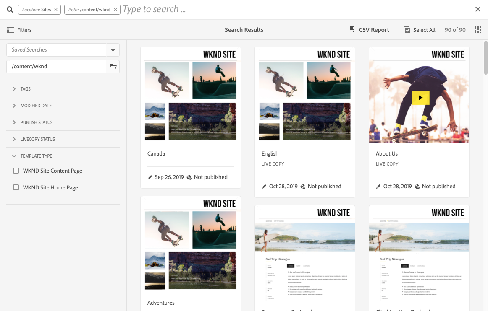

# Configurar formularios de búsqueda {#configuring-search-forms}

Adobe Experience Manager as a Cloud Service incluye un potente [Buscar](/help/sites-cloud/authoring/getting-started/search.md) mecanismo.

En combinación con esto, también hay un conjunto de opciones predefinidas para ayudarle a filtrar su contenido. Contienen facetas predefinidas como **Fecha de modificación**, **Estado de publicación**, o **Estado de Livecopy** para ayudarle a explorar en profundidad rápidamente los recursos que necesita.

Juntos, estos objetivos le ayudan a localizar su contenido de forma rápida y sencilla desde:

* [Buscar y filtrar](/help/sites-cloud/authoring/getting-started/search.md#search-and-filter)
* [Selector de carril](/help/sites-cloud/authoring/getting-started/basic-handling.md#rail-selector)
* el [Explorador de recursos](/help/sites-cloud/authoring/fundamentals/environment-tools.md#assets-browser) (al editar páginas)

>[!NOTE]
>
>Puede configurar el subyacente [Búsqueda de contenido e indexación](/help/operations/indexing.md) servicio.

Uso de **Buscar Forms**, puede personalizar y ampliar estos paneles según sus necesidades específicas.

El **Buscar Forms** proporciona una selección de forma predeterminada de [predicados](#predicates-and-their-settings) que puede combinar y definir. El [cuadros de diálogo para configurar estos formularios](#configuring-your-search-forms) se puede acceder a través de:

* **Herramientas**
   * **General**
      * **Formularios de búsqueda**

## Forms predeterminado {#default-forms}

La primera vez que acceda al **Buscar Forms** consola puede ver que todas las configuraciones tienen un símbolo de candado. Esto indica que la configuración correspondiente es la predeterminada (predeterminada) y no se puede eliminar. Una vez que haya personalizado y guardado una configuración, el bloqueo desaparecerá. Volverá a aparecer cuando [elimine la configuración personalizada](#deleting-a-configuration-to-reinstate-the-default), en cuyo caso se restablecerá el valor predeterminado (y el indicador de candado).

Las configuraciones predeterminadas disponibles (enumeradas alfabéticamente) son las siguientes:

* **Carril de búsqueda de administración de recursos**
* **Editor de páginas (búsqueda de documentos)**
* **Editor de página (búsqueda de fragmentos de experiencias)**
* **Editor de páginas (búsqueda de imágenes)**
* **Editor de páginas (búsqueda de manuscritos)**
* **Editor de páginas (búsqueda de páginas)**
* **Editor de páginas (búsqueda de párrafos)**
* **Editor de páginas (búsqueda de productos)**
* **Editor de páginas (búsqueda de Scene7)**
* **Editor de páginas (búsqueda de vídeos)**
* **Carril de búsqueda de administración de proyecto**
* **Carril de búsqueda de traducción del proyecto**
* **Carril de búsqueda de administración de sitios**
* **Carril de búsqueda de administración de fragmentos de código**
* **Carril de búsqueda de administración de Stock**
* **Carril de búsqueda de modelos de fragmentos de contenido**
* **Carril de búsqueda de administración de proyecto**
* **Carril de búsqueda de traducción del proyecto**

>[!NOTE]
>
>Para obtener más información sobre los formularios de búsqueda relacionados con recursos, consulte [Recursos - Facetas de búsqueda](/help/assets/search-facets.md)

## Predicados y su configuración {#predicates-and-their-settings}

### Predicados {#predicates}

Los siguientes predicados están disponibles, según la configuración:

<table>
 <tbody>
  <tr>
   <th>Predicado</th>
   <th>Función</th>
   <th>Configuración</th>
  </tr>
  <tr>
   <td>Análisis</td>
   <td>Funciones de búsqueda y filtrado en el explorador de sitios al mostrar datos con análisis. Los filtros de búsqueda de Analytics se cargan para coincidir con las columnas de Analytics personalizadas asignadas.</td>
   <td>
    <ul>
     <li>Etiqueta de campo</li>
     <li>Descripción</li>
    </ul> </td>
  </tr>
  <tr>
   <td>Estado de aprobación</td>
   <td>Buscar según el estado de aprobación.</td>
   <td>
    <ul>
     <li>Etiqueta de campo</li>
     <li>Nombre de propiedad*</li>
     <li>Descripción</li>
    </ul> 
   </td>
  </tr>
  <tr>
   <td>Autor</td>
   <td>Buscar según el autor.</td>
   <td>
    <ul>
     <li>Marcador de posición</li>
     <li>Nombre de propiedad*</li>
     <li>Descripción</li>
    </ul> 
   </td>
  </tr>
  <tr>
   <td>Extraído por</td>
   <td>Buscar recursos desprotegidos por un usuario específico.</td>
   <td>
    <ul>
     <li>Etiqueta de campo</li>
     <li>Marcador de posición</li>
     <li>Descripción</li>
    </ul> 
   </td>
  </tr>
  <tr>
   <td>Estado de extracción</td>
   <td>Busque recursos con un estado de cierre de compra específico.</td>
   <td>
    <ul>
     <li>Etiqueta de campo</li>
     <li>Nombre de propiedad*</li>
     <li>Descripción</li>
    </ul> 
   </td>
  </tr>
  <tr>
   <td>Componentes</td>
   <td>Permite a un autor buscar/filtrar páginas que tienen un componente específico en él. Por ejemplo, una galería de imágenes.  </td>
   <td>
    <ul>
     <li>Marcador de posición</li>
     <li>Nombre de propiedad*</li>
     <li>Profundidad de la propiedad</li>
     <li>Descripción</li>
    </ul> </td>
  </tr>
  <tr>
   <td>Intervalo de fechas</td>
   <td>Busque recursos creados dentro de un intervalo especificado para una propiedad de fecha. En el panel Buscar, puede especificar las fechas de inicio y finalización.</td>
   <td>
    <ul>
     <li>Etiqueta de campo</li>
     <li>Marcador de posición</li>
     <li>Nombre de propiedad*</li>
     <li>Texto de intervalo (desde)*</li>
     <li>Texto de intervalo (hasta)*</li>
     <li>Descripción</li>
    </ul> </td>
  </tr>
  <tr>
   <td>Estado de caducidad</td>
   <td>Buscar recursos en función del estado de caducidad.</td>
   <td>
    <ul>
     <li>Etiqueta de campo</li>
     <li>Nombre de propiedad*</li>
     <li>Descripción</li>
    </ul> </td>
  </tr>
  <tr>
   <td>Tamaño del archivo</td>
   <td>Filtre los recursos en función de su tamaño.</td>
   <td>
    <ul>
     <li>Etiqueta de campo</li>
     <li>Nombre de propiedad*</li>
     <li>Ruta de opción</li>
     <li>Descripción</li>
    </ul> </td>
  </tr>
  <tr>
   <td>Tipo de archivo</td>
   <td>Busque recursos en función del tipo de archivo/mime.</td>
   <td>
    <ul>
     <li>Etiqueta de campo</li> 
     <li>Nombre de propiedad*</li>
     <li>Ruta de tipo MIME</li>
     <li>Descripción</li>
    </ul> 
   </td>
  </tr>
  <tr>
   <td>Texto completo</td>
   <td>Predicado de búsqueda para búsquedas de texto completo. Se asigna con el operador "jcr:contains".</td>
   <td>
    <ul>
     <li>Marcador de posición</li>
     <li>Nombre de propiedad</li>
     <li>Descripción</li>
    </ul> </td>
  </tr>
  <tr>
   <td>Grupo</td>
   <td>Predicado de búsqueda de grupo (solo se usa dentro del Predicado de perspectivas).</td>
   <td>
    <ul>
     <li>Etiqueta de campo</li>
     <li>Descripción</li>
    </ul> </td>
  </tr>
  <tr>
   <td>Filtro oculto</td>
   <td>Un filtro de propiedad y valor, no visible para el usuario.</td>
   <td>
    <ul>
     <li>Nombre de propiedad*</li>
     <li>Valor de propiedad*</li>
     <li>Descripción</li>
    </ul> </td>
  </tr>
  <tr>
   <td>Perspectivas</td>
   <td>Busque según una selección de parámetros de Insights.</td>
   <td>Este es un predicado complejo compuesto por varios predicados:
    <ul>
     <li>Grupo</li>
     <li>Intervalo</li>
     <li>Opciones</li>
    </ul> 
   </td>
  </tr>
  <tr>
   <td>Miembro de colección</td>
   <td>Buscar recursos que sean miembros de una colección</td>
   <td>
    <ul>
     <li>Descripción</li>
    </ul> 
   </td>
  </tr>
  <tr>
   <td>Propiedad con valores múltiples</td>
   <td>Buscar en varios valores de una propiedad especificada.</td>
   <td>
    <ul>
     <li>Etiqueta de campo</li>
     <li>Marcador de posición</li>
     <li>Nombre de propiedad*</li>
     <li>Compatibilidad con el delimitador</li>
     <li>Delimitadores de entrada</li>
     <li>Ignorar mayúsculas y minúsculas</li>
     <li>Descripción</li>
    </ul> 
   </td>
  </tr>
  <tr>
   <td>Opciones</td>
   <td>
Las opciones son nodos de contenido creados por el usuario.
 
Consulte <a href="#addinganoptionspredicate">Adición de un predicado de opciones</a> para obtener más información.
 </td>
   <td>
    <ul>
     <li>Etiqueta de campo</li>
     <li>Nombre de propiedad*</li>
     <li>Una sola selección</li>
     <li>Agregar opciones</li>
     <li>Manual</li>
     <li>Descripción</li>
    </ul> </td>
  </tr>
  <tr>
   <td>Propiedad Options</td>
   <td>Busque una o más propiedades de la opción.</td>
   <td>
    <ul>
     <li>Etiqueta de campo</li>
     <li>Nombre de propiedad*</li>
     <li>Ruta del nodo de opciones</li>
     <li>Profundidad de la propiedad</li>
     <li>Una sola selección</li>
     <li>Descripción</li>
    </ul> </td>
  </tr>
  <tr>
   <td>Estado de la página</td>
   <td>Filtrar páginas según su estado.</td>
   <td>
    <ul>
     <li>Etiqueta de campo</li>
     <li>Nombre de la propiedad de publicación*</li>
     <li>Nombre de la propiedad de páginas bloqueadas*</li>
     <li>Descripción</li>
    </ul> </td>
  </tr>
  <tr>
   <td>Ruta </td>
   <td>Filtre según una ruta específica. Puede especificar varias rutas como opciones.</td>
   <td>
    <ul>
     <li>Etiqueta de campo</li>
     <li>Añadir rutas de búsqueda</li>
     <li>Descripción</li>
    </ul> </td>
  </tr>
  <tr>
   <td>Navegador de rutas</td>
   <td>Proporcione un navegador de rutas para buscar en una ruta raíz predefinida.</td>
   <td>
    <ul>
     <li>Marcador de posición</li>
     <li>Ruta raíz</li>
     <li>Descripción</li>
    </ul> 
   </td>
  </tr>
  <tr>
   <td>Ruta oculta</td>
   <td>Un filtro en la ruta, no visible para el usuario.</td>
   <td>
    <ul>
     <li>Nombre de propiedad (`path`)</li>
     <li>Valor de propiedad (`/content/dam`)</li>
    </ul> 
   </td>
  </tr>
  <tr>
   <td>Propiedad</td>
   <td>Busque en una propiedad especificada.</td>
   <td>
    <ul>
     <li>Etiqueta de campo</li>
     <li>Marcador de posición</li>
     <li>Nombre de propiedad</li>
     <li>Búsqueda parcial</li>
     <li>Ignorar mayúsculas y minúsculas</li>
     <li>Descripción</li>
    </ul> 
   </td>
  </tr>
  <tr>
   <td>Estado de publicación</td>
   <td>Filtre los recursos en función de su estado de publicación.</td>
   <td>
    <ul>
     <li>Etiqueta de campo</li>
     <li>Nombre de propiedad*</li>
     <li>Descripción</li>
    </ul> </td>
  </tr>
  <tr>
   <td>Intervalo</td>
   <td>Busque recursos que se encuentren dentro de un rango especificado. En el panel Buscar, puede especificar los valores mínimo y máximo del rango.</td>
   <td>
    <ul>
     <li>Etiqueta de campo</li>
     <li>Nombre de propiedad*</li>
     <li>Descripción</li>
    </ul> </td>
  </tr>
  <tr>
   <td>Clasificación</td>
   <td>Busque recursos según su clasificación promedio.  </td>
   <td>
    <ul>
     <li>Etiqueta de campo</li>
     <li>Nombre de propiedad*</li>
     <li>Ruta de opción</li>
     <li>Descripción</li>
    </ul> </td>
  </tr>
  <tr>
   <td>Fecha relativa</td>
   <td>Filtre los recursos en función de la fecha relativa de su creación. Por ejemplo, hace 1 semana, hace 1 mes.</td>
   <td>
    <ul>
     <li>Etiqueta de campo</li>
     <li>Nombre de propiedad*</li>
     <li>Fecha relativa</li>
     <li>Descripción</li>
    </ul> </td>
  </tr>
  <tr>
   <td>Intervalo del regulador</td>
   <td>Un predicado de búsqueda común que amplía el predicado de intervalo con la capacidad del control deslizante. El valor de la propiedad buscada debe estar entre los límites del control deslizante.</td>
   <td>
    <ul>
     <li>Etiqueta de campo</li>
     <li>Nombre de propiedad*</li>
     <li>Ruta del nodo de opciones</li>
     <li>Descripción</li>
    </ul> </td>
  </tr>
  <tr>
   <td>Estado</td>
   <td>Busque según el estado de aprobación y cierre de compra.</td>
   <td>Este es un predicado complejo compuesto por varios predicados:
    <ul>
     <li>Estado de aprobación</li>
     <li>Estado de extracción</li>
    </ul> 
   </td>
  </tr>
  <tr>
   <td>Etiquetas</td>
   <td>Busque en función de las etiquetas.</td>
   <td>
    <ul>
     <li>Lavel de campo</li>
     <li>Marcador de posición</li>
     <li>Nombre de propiedad*</li>
     <li>Mostrar la opción de hacer coincidir todas las etiquetas</li>
     <li>Ruta de etiquetas raíz</li>
     <li>Descripción</li>
    </ul> </td>
  </tr>
  <tr>
   <td>Plantillas</td>
   <td>Busque según la plantilla seleccionada.</td>
   <td>
    <ul>
     <li>Marcador de posición</li>
     <li>Nombre de propiedad*</li>
     <li>Descripción</li>
    </ul> 
   </td>
  </tr>
  <tr>
   <td>Estado de traducción</td>
   <td>Busque según el estado de traducción.</td>
   <td>
    <ul>
     <li>Etiqueta de campo</li>
    </ul> 
   </td>
  </tr>
 </tbody>
</table>

<!--
  <tr>
   <td>Date ???</td>
   <td>Slider-based search of assets based on a date property.</td>
   <td>
    <ul>
     <li>Field Label</li>
     <li>Property Name*</li>
     <li>Description</li>
    </ul> </td>
  </tr>
  <tr>
   <td>Asset Last Modified ?????</td>
   <td>Date the asset was last modified.  </td>
   <td>A customized predicate, based on the Date Predicate.</td>
  </tr>
  <tr>
   <td>Range Options ???</td>
   <td>A specific search predicate for Assets and the same as common Slider Predicate. Is still available due to backward compatibilty issues.</td>
   <td>
    <ul>
     <li>Field Label</li>
     <li>Property Name*</li>
     <li>Option Path</li>
     <li>Description</li>
    </ul> </td>
  </tr>
  <tr>
   <td>Tag </td>
   <td>Search assets based on tags. You can configure the Path property to populate various tags in the Tags list.</td>
   <td>
    <ul>
     <li>Field Label</li>
     <li>Property Name*</li>
     <li>Option Path</li>
     <li>Description</li>
    </ul> </td>
  </tr>
-->

>[!NOTE]
>
>Los predicados de búsqueda comunes se definen en:
>  `/libs/cq/gui/components/common/admin/customsearch/searchpredicates`
>
>Esta información es solo para referencia, no debe realizar cambios en `/libs`.

<!--
>* Search predicates related only to siteadmin (classic UI) are located under:
> `/libs/cq/gui/components/siteadmin/admin/searchpanel/searchpredicates`
>   * These are deprecated and only available for backward compatibility.
>
-->

### Configuración de predicado {#predicate-settings}

En función del predicado, hay una selección de opciones disponibles para la configuración, entre las que se incluyen:

* **Etiqueta de campo**

   La etiqueta que aparecerá como encabezado contraíble o como etiqueta de campo del predicado.

* **Descripción**

   Detalles descriptivos del usuario.

* **Marcador de posición**

   Texto vacío o el marcador de posición del predicado en caso de que no se introduzca ningún texto de filtrado.

* **Nombre de propiedad**

   Propiedad en la que se va a buscar. Utiliza una ruta relativa y los comodines `*/*/*` especifique la profundidad de la propiedad en relación con `jcr:content` nodo (cada asterisco representa un nivel de nodo).

   Si desea buscar únicamente en un nodo secundario de primer nivel del recurso que tiene la variable `x` propiedad en el `jcr:content` uso de nodo `*/jcr:content/x`

* **Profundidad de la propiedad**

   Profundidad máxima para buscar esa propiedad dentro de los recursos. Por lo tanto, se puede realizar una búsqueda de esa propiedad en un recurso y en elementos secundarios recursivos hasta que el nivel de los elementos secundarios sea igual a la profundidad especificada.

* **Valor de propiedad**

   El valor de la propiedad como cadena absoluta o como lenguaje de expresión; por ejemplo, `cq:Page` o

   `${empty requestPathInfo.suffix ? "/content" : requestPathInfo.suffix}`.

* **Texto de intervalo**

   La etiqueta del campo de rango en la variable **Intervalo de fechas** predicado.

* **Ruta de opción**

   El usuario puede seleccionar la ruta mediante el Explorador de rutas en la pestaña de configuración de predicado. Después de seleccionar el **+** se utiliza para añadir la selección a la lista de opciones válidas (a continuación, el icono **-** para eliminar si es necesario).

   Las opciones son nodos de contenido creados por el usuario que tienen la siguiente estructura:

   `(jcr:primaryType = nt:unstructured, value (String), jcr:title (String))`

* **Ruta del nodo de opciones**
Efectivamente igual que el 
**Ruta de opciones**, solo esto se encuentra en el campo de predicado común, el otro es específico para los recursos.

* **Selección única**
Si se selecciona, las opciones se representan como casillas de verificación que permiten solo una selección. Si se selecciona por error, se puede anular la selección de una casilla de verificación.

* **Publicar y nombres de propiedades de Live Copy**
Las etiquetas de las casillas de verificación de publicación y Live Copy para el predicado específico de Sites.

* &amp;ast; en las etiquetas de campo de la **Configuración** La pestaña significa que los campos son obligatorios y que, si se deja en blanco, aparecerá un mensaje de error.

## Configuración de Search Forms {#configuring-your-search-forms}

### Creación/apertura de una configuración personalizada {#creating-opening-a-customized-configuration}

1. Vaya a **Herramientas**, **General**, **Buscar Forms**.

1. Seleccione la configuración que desee personalizar.
1. Utilice el **Editar** para abrir la configuración y actualizarla.
1. Si necesita una nueva personalización, probablemente quiera [añada nuevos campos de predicado y defina la configuración](#add-edit-a-predicate-field-and-define-field-settings) según sea necesario. Si una personalización existente, puede seleccionar un campo existente y [actualizar la configuración](#add-edit-a-predicate-field-and-define-field-settings).
1. Seleccionar **Listo** para guardar la configuración. Los cambios se podrán ver la próxima vez que se utilice la configuración.

   >[!NOTE]
   >
   >Las configuraciones personalizadas se almacenan (según corresponda) en:
   >
   >* `/apps/cq/gui/content/facets/<option>`
   >* `/apps/commerce/gui/content/facets/<option>`

### Adición o edición de un campo de predicado y definición de la configuración del campo {#add-edit-a-predicate-field-and-define-field-settings}

Puede añadir o editar campos y definir o actualizar su configuración:

1. [Abra la configuración personalizada](#creating-opening-a-customized-configuration) para actualizar.
1. Si desea agregar un nuevo campo, abra el **Seleccionar predicado** y arrastre el predicado necesario a la ubicación requerida. Por ejemplo, la variable **Predicado de intervalo de fechas**:

   

1. En función de si:

   * Va a añadir un nuevo campo:

      Después de agregar el predicado, **Configuración** se abrirá y mostrará las propiedades que se pueden definir.

   * Desea actualizar un predicado existente:

      Seleccione el campo de predicado (a la derecha) y abra la variable **Configuración** pestaña.
   Por ejemplo, la configuración de **Predicado de intervalo de fechas**:

   

1. Realice los cambios necesarios y confirme con **Listo**. Los cambios se podrán ver la próxima vez que se utilice la configuración.

### Previsualización de la configuración de búsqueda {#previewing-the-search-configuration}

1. Seleccione el icono Vista previa:

   

1. Esto mostrará los formularios de búsqueda tal como se mostrarán (completamente expandidos) en la columna Buscar de la consola adecuada.

   

1. **Cerrar** Seleccione la previsualización para devolver y finalizar la configuración.

### Eliminación de un campo de predicado {#deleting-a-predicate-field}

1. [Abra la configuración personalizada](#creating-opening-a-customized-configuration) para actualizar.
1. Seleccione el campo de predicado (a la derecha) y abra el **Configuración** y, a continuación, seleccione **Eliminar** (abajo a la izquierda).

   

1. Un cuadro de diálogo solicitará confirmación de la acción de eliminación.

1. Confirme este y cualquier otro cambio con **Listo**.

### Eliminación de una configuración (para restablecer los valores predeterminados) {#deleting-a-configuration-to-reinstate-the-default}

Una vez que haya personalizado una configuración, esto anulará los valores predeterminados. Puede restablecer la configuración predeterminada eliminando la configuración personalizada.

>[!NOTE]
>
>No puede eliminar las configuraciones predeterminadas.

La eliminación de una configuración personalizada se realiza desde la consola:

1. Seleccione la configuración necesaria (por ejemplo, **Editor de páginas (búsqueda de párrafos)**) y luego el **Eliminar** en la barra de herramientas:

   

1. La configuración personalizada se eliminará y se restablecerá la predeterminada (esto se indica con la reaparición del símbolo de candado en la consola).

### Adición de predicados de opciones {#adding-options-predicates}

Los predicados de opciones (Options, Options, Property) permiten configurar un elemento para buscarlo. Normalmente se utilizan para buscar algo directamente debajo de la página; por ejemplo, una propiedad en el nodo de la página.

El siguiente ejemplo (para buscar según la plantilla utilizada para crear una página), ilustra los pasos involucrados:

1. Cree el nodo que define la propiedad en la que se va a buscar.

   Necesitará un nodo raíz que contenga definiciones de las opciones individuales que deben estar disponibles para el usuario.

   Los nodos de las opciones individuales necesitan las propiedades:

   * `jcr:title` - la etiqueta del campo que se mostrará en el carril de búsqueda
   * `value` : el valor de propiedad en el que se va a buscar

   

   >[!NOTE]
   >
   >Usted ***debe*** no cambie nada en el `/libs` ruta.
   >
   >Esto se debe al contenido de `/libs` se sobrescribe la próxima vez que actualice la instancia (y es posible que se sobrescriba al aplicar una revisión o un paquete de funciones).
   >
   >El método recomendado para la configuración y otros cambios es:
   >
   >1. Vuelva a crear el elemento necesario, tal como existe en `/libs`, en `/apps`. En este caso de:
   >1. `/libs/cq/gui/content/common/options/predicates`
   >1. Realice cualquier cambio en `/apps.`

1. Abra el **Buscar Forms** y seleccione la configuración que desee actualizar. Por ejemplo, **Carril de búsqueda de administración de sitios**. A continuación seleccione **Editar**.

1. Según la configuración, agregue una **Opciones** o **Propiedad Options** a la configuración.
1. Actualice los campos, en particular:

   * **Nombre de propiedad**

      Especifica la propiedad del nodo que se va a buscar en los nodos de destino. Por ejemplo:

      `jcr:content/cq:template`

   * **Ruta del nodo de opción**

      Seleccione la ruta donde se guardan las opciones. Por ejemplo:

      `/apps/cq/gui/content/common/options/predicates/templatetype`
   

1. Seleccionar **Listo** para guardar la configuración.
1. Vaya a la consola adecuada (en este ejemplo, **Sites**) y abra el **Buscar: filtros** carril. Los formularios de búsqueda recién definidos, junto con las distintas opciones, serán visibles. Seleccione la opción necesaria para ver los resultados de búsqueda.

   

## Permisos de usuario {#user-permissions}

En la tabla siguiente se enumeran los permisos necesarios para realizar acciones de edición, eliminación y vista previa en formularios de búsqueda.

<table>
 <thead>
  <tr>
   <td><strong>Acción</strong></td>
   <td><strong>Permisos</strong></td>
  </tr>
 </thead>
 <tbody>
  <tr>
   <td>Editar </td>
   <td>Permisos de lectura y escritura en <code>/apps </code>nodo.</td>
  </tr>
  <tr>
   <td>Eliminar</td>
   <td>Permisos de lectura, escritura y eliminación en <code>/apps</code> nodo</td>
  </tr>
  <tr>
   <td>Vista previa</td>
   <td>Permisos de lectura, escritura y eliminación en <code>/var/dam/content</code> nodo.  Permisos de lectura y escritura en <code>/apps</code> nodo.</td>
  </tr>
 </tbody>
</table>
