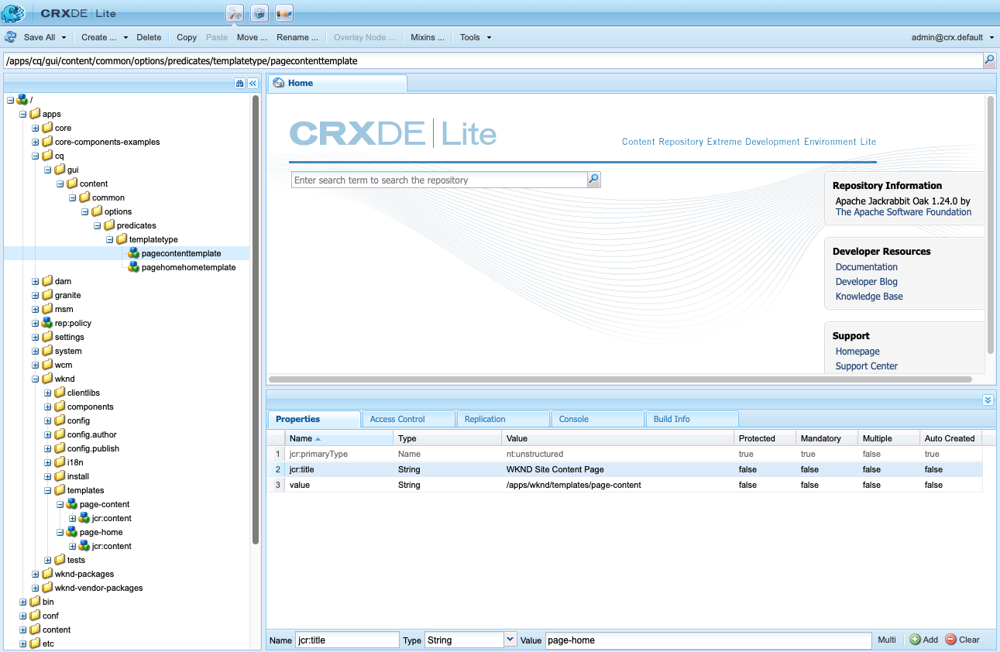

# Configurar formularios de búsqueda {#configuring-search-forms}

Adobe Experience Manager como Cloud Service viene con un potente mecanismo [de búsqueda](/help/sites-cloud/authoring/getting-started/search.md) .

En combinación con esto, también hay un conjunto de opciones predefinidas para ayudarle a filtrar el contenido. Éstas contienen facetas predefinidas como Fecha **de** modificación, Estado **de** publicación o Estado **de** Live Copy para ayudarle a explorar rápidamente los recursos que necesita.

Juntos, estos objetivos le ayudan a localizar su contenido de forma rápida y sencilla desde:

* [Buscar y filtrar](/help/sites-cloud/authoring/getting-started/search.md#search-and-filter)
* [Selector de raíl](/help/sites-cloud/authoring/getting-started/basic-handling.md#rail-selector)
* el [navegador](/help/sites-cloud/authoring/fundamentals/environment-tools.md#assets-browser) de recursos (al editar páginas)

>[!NOTE]
>
>Puede configurar el servicio de indexación [y búsqueda de](/help/operations/indexing.md) contenido subyacente.

Con **Buscar en Forms**, puede personalizar y ampliar estos paneles según sus necesidades específicas.

El Forms **de** búsqueda proporciona una selección lista para usar de [predicados](#predicates-and-their-settings) que puede combinar y definir. Se puede acceder a los [cuadros de diálogo para configurar estos formularios](#configuring-your-search-forms) mediante:

* **Herramientas**

   * **General**

      * **Formularios de búsqueda**

## Forms predeterminado {#default-forms}

Cuando accede por primera vez a la consola **Buscar en Forms** , puede ver que todas las configuraciones tienen un símbolo de cerrojo. Esto indica que la configuración correspondiente es la configuración predeterminada (lista para usar) y no se puede eliminar. Una vez que haya personalizado y guardado, desaparecerá una configuración del bloqueo. Volverá a aparecer cuando [elimine la configuración](#deleting-a-configuration-to-reinstate-the-default)personalizada, en cuyo caso se restablecerá la configuración predeterminada (y el indicador de cerrojo).

Las configuraciones predeterminadas (enumeradas alfabéticamente) disponibles son:

* **Carril de búsqueda de administración de recursos:**

* **Editor de páginas (búsqueda de documentos):**

* **Editor de página (búsqueda de fragmentos de experiencias):**

* **Editor de páginas (búsqueda de imágenes):**

* **Editor de páginas (búsqueda de manuscritos):**

* **Editor de páginas (búsqueda de páginas):**

* **Editor de páginas (búsqueda de párrafos):**

* **Editor de páginas (búsqueda de productos):**

* **Editor de páginas (búsqueda de Scene7)**:

* **Editor de páginas (búsqueda de vídeos)**:

* **Carril de búsqueda de administración de proyecto:**

* **Carril de búsqueda de traducción del proyecto:**

* **Carril de búsqueda de administración de sitios**:

* **Carril de búsqueda de administración de fragmentos de código**:

* **Carril de búsqueda de administración de Stock**:

>[!NOTE]
>
>Para obtener más información sobre los formularios de búsqueda relacionados con recursos, consulte [Recursos: Facetas de búsqueda](/help/assets/search-facets.md)

## Predicados y su configuración {#predicates-and-their-settings}

### Predicados {#predicates}

Los siguientes predicados están disponibles, según la configuración:

<table>
 <tbody>
  <tr>
   <th>Predicado</th>
   <th>Función</th>
   <th>Configuración</th>
  </tr>
  <tr>
   <td>Análisis</td>
   <td>Funciones de búsqueda/filtro en el navegador Sitios al mostrar datos con alimentación de análisis. Los filtros de búsqueda de Analytics se cargan para coincidir con las columnas de análisis personalizados asignadas.</td>
   <td>
    <ul>
     <li>Etiqueta de campo</li>
     <li>Descripción</li>
    </ul> </td>
  </tr>
  <tr>
   <td>Estado de aprobación</td>
   <td>Buscar según el estado de aprobación.</td>
   <td>
    <ul>
     <li>Etiqueta de campo</li>
     <li>Nombre de propiedad*</li>
     <li>Descripción</li>
    </ul> 
   </td>
  </tr>
  <tr>
   <td>Autor</td>
   <td>Buscar según el autor.</td>
   <td>
    <ul>
     <li>Marcador de posición</li>
     <li>Nombre de propiedad*</li>
     <li>Descripción</li>
    </ul> 
   </td>
  </tr>
  <tr>
   <td>Extraído por</td>
   <td>Buscar recursos extraídos por un usuario específico.</td>
   <td>
    <ul>
     <li>Etiqueta de campo</li>
     <li>Marcador de posición</li>
     <li>Descripción</li>
    </ul> 
   </td>
  </tr>
  <tr>
   <td>Estado de extracción</td>
   <td>Buscar recursos con un estado de cierre de compra específico.</td>
   <td>
    <ul>
     <li>Etiqueta de campo</li>
     <li>Nombre de propiedad*</li>
     <li>Descripción</li>
    </ul> 
   </td>
  </tr>
  <tr>
   <td>Componentes</td>
   <td>Permite que un autor busque o filtre páginas que tengan un componente específico. For example an image gallery.  </td>
   <td>
    <ul>
     <li>Marcador de posición</li>
     <li>Nombre de propiedad*</li>
     <li>Profundidad de la propiedad</li>
     <li>Descripción</li>
    </ul> </td>
  </tr>
  <tr>
   <td>Intervalo de fechas</td>
   <td>Busque recursos creados dentro de un intervalo especificado para una propiedad de fecha. En el panel Buscar, puede especificar las fechas de Inicio y finalización.</td>
   <td>
    <ul>
     <li>Etiqueta de campo</li>
     <li>Marcador de posición</li>
     <li>Nombre de propiedad*</li>
     <li>Texto de intervalo (desde)*</li>
     <li>Texto de intervalo (hasta)*</li>
     <li>Descripción</li>
    </ul> </td>
  </tr>
  <tr>
   <td>Estado de caducidad</td>
   <td>Buscar recursos en función del estado de caducidad.</td>
   <td>
    <ul>
     <li>Etiqueta de campo</li>
     <li>Nombre de propiedad*</li>
     <li>Descripción</li>
    </ul> </td>
  </tr>
  <tr>
   <td>Tamaño del archivo</td>
   <td>Filtre los recursos en función de su tamaño.</td>
   <td>
    <ul>
     <li>Etiqueta de campo</li>
     <li>Nombre de propiedad*</li>
     <li>Ruta de opción</li>
     <li>Descripción</li>
    </ul> </td>
  </tr>
  <tr>
   <td>Tipo de archivo</td>
   <td>Busque recursos en función del tipo de archivo o de MIME.</td>
   <td>
    <ul>
     <li>Etiqueta de campo</li> 
     <li>Nombre de propiedad*</li>
     <li>Ruta de tipo MIME</li>
     <li>Descripción</li>
    </ul> 
   </td>
  </tr>
  <tr>
   <td>Texto completo</td>
   <td>Busque predicado para búsquedas de texto completo. Se asigna con el operador 'jcr:contains'.</td>
   <td>
    <ul>
     <li>Marcador de posición</li>
     <li>Nombre de propiedad</li>
     <li>Descripción</li>
    </ul> </td>
  </tr>
  <tr>
   <td>Agrupar</td>
   <td>Predicado de búsqueda para grupo (solo se usa dentro del predicado de perspectivas).</td>
   <td>
    <ul>
     <li>Etiqueta de campo</li>
     <li>Descripción</li>
    </ul> </td>
  </tr>
  <tr>
   <td>Filtro oculto</td>
   <td>Filtro de propiedad y valor, que no es visible para el usuario.</td>
   <td>
    <ul>
     <li>Nombre de propiedad*</li>
     <li>Valor de propiedad*</li>
     <li>Descripción</li>
    </ul> </td>
  </tr>
  <tr>
   <td>Perspectivas</td>
   <td>Busque según una selección de parámetros de perspectivas.</td>
   <td>Se trata de un predicado complejo compuesto de varios predicados:
    <ul>
     <li>Agrupar</li>
     <li>Intervalo</li>
     <li>Opciones</li>
    </ul> 
   </td>
  </tr>
  <tr>
   <td>Miembro de la colección</td>
   <td>Buscar recursos que sean miembros de una colección</td>
   <td>
    <ul>
     <li>Descripción</li>
    </ul> 
   </td>
  </tr>
  <tr>
   <td>Propiedad con valores múltiples</td>
   <td>Busque varios valores de una propiedad especificada.</td>
   <td>
    <ul>
     <li>Etiqueta de campo</li>
     <li>Marcador de posición</li>
     <li>Nombre de propiedad*</li>
     <li>Compatibilidad con el delimitador</li>
     <li>Delimitadores de entrada</li>
     <li>Ignorar mayúsculas y minúsculas</li>
     <li>Descripción</li>
    </ul> 
   </td>
  </tr>
  <tr>
   <td>Opciones</td>
   <td>
Las opciones son nodos de contenido creados por el usuario.
 
Consulte <a href="#addinganoptionspredicate">Añadir un predicado</a> de opciones para obtener más información.
 </td>
   <td>
    <ul>
     <li>Etiqueta de campo</li>
     <li>Nombre de propiedad*</li>
     <li>Una sola selección</li>
     <li>Agregar opciones</li>
     <li>Manual</li>
     <li>Descripción</li>
    </ul> </td>
  </tr>
  <tr>
   <td>Options (propiedad)</td>
   <td>Busque una o varias propiedades de la opción.</td>
   <td>
    <ul>
     <li>Etiqueta de campo</li>
     <li>Nombre de propiedad*</li>
     <li>Ruta del nodo de opciones</li>
     <li>Profundidad de la propiedad</li>
     <li>Una sola selección</li>
     <li>Descripción</li>
    </ul> </td>
  </tr>
  <tr>
   <td>página Estado</td>
   <td>Filtre las páginas según su estado.</td>
   <td>
    <ul>
     <li>Etiqueta de campo</li>
     <li>Nombre de la propiedad de publicación*</li>
     <li>Nombre de la propiedad de páginas bloqueadas*</li>
     <li>Descripción</li>
    </ul> </td>
  </tr>
  <tr>
   <td>Ruta</td>
   <td>Filtre según la ruta específica. Puede especificar varias rutas como opciones.</td>
   <td>
    <ul>
     <li>Etiqueta de campo</li>
     <li>Añadir rutas de búsqueda</li>
     <li>Descripción</li>
    </ul> </td>
  </tr>
  <tr>
   <td>Navegador de rutas</td>
   <td>Proporcione un navegador de rutas para buscar en una ruta raíz predefinida.</td>
   <td>
    <ul>
     <li>Marcador de posición</li>
     <li>Ruta raíz</li>
     <li>Descripción</li>
    </ul> 
   </td>
  </tr>
  <tr>
   <td>Ruta oculta</td>
   <td>Filtro en ruta, no visible para el usuario.</td>
   <td>
    <ul>
     <li>Nombre de propiedad (`path`)</li>
     <li>Valor de propiedad (`/content/dam`)</li>
    </ul> 
   </td>
  </tr>
  <tr>
   <td>Propiedad</td>
   <td>Busque en una propiedad especificada.</td>
   <td>
    <ul>
     <li>Etiqueta de campo</li>
     <li>Marcador de posición</li>
     <li>Nombre de propiedad</li>
     <li>Búsqueda parcial</li>
     <li>Ignorar mayúsculas y minúsculas</li>
     <li>Descripción</li>
    </ul> 
   </td>
  </tr>
  <tr>
   <td>Estado de publicación</td>
   <td>Filtre los recursos en función de su estado de publicación.</td>
   <td>
    <ul>
     <li>Etiqueta de campo</li>
     <li>Nombre de propiedad*</li>
     <li>Descripción</li>
    </ul> </td>
  </tr>
  <tr>
   <td>Intervalo</td>
   <td>Buscar recursos que se encuentran dentro de un rango especificado. En el panel Buscar, puede especificar los valores mínimo y máximo para el rango.</td>
   <td>
    <ul>
     <li>Etiqueta de campo</li>
     <li>Nombre de propiedad*</li>
     <li>Descripción</li>
    </ul> </td>
  </tr>
  <tr>
   <td>Clasificación</td>
   <td>Busque recursos según su clasificación promedio.  </td>
   <td>
    <ul>
     <li>Etiqueta de campo</li>
     <li>Nombre de propiedad*</li>
     <li>Ruta de opción</li>
     <li>Descripción</li>
    </ul> </td>
  </tr>
  <tr>
   <td>Fecha relativa</td>
   <td>Filtre los recursos en función de la fecha relativa de su creación. Por ejemplo, hace una semana, hace un mes.</td>
   <td>
    <ul>
     <li>Etiqueta de campo</li>
     <li>Nombre de propiedad*</li>
     <li>Fecha relativa</li>
     <li>Descripción</li>
    </ul> </td>
  </tr>
  <tr>
   <td>Intervalo del regulador</td>
   <td>Un predicado de búsqueda común que amplía el predicado de rango con la capacidad deslizante. El valor de la propiedad en la que se busca debe estar entre los límites del deslizador.</td>
   <td>
    <ul>
     <li>Etiqueta de campo</li>
     <li>Nombre de propiedad*</li>
     <li>Ruta del nodo de opciones</li>
     <li>Descripción</li>
    </ul> </td>
  </tr>
  <tr>
   <td>Estado</td>
   <td>Busque según el estado de aprobación y cierre de compra.</td>
   <td>Se trata de un predicado complejo compuesto de varios predicados:
    <ul>
     <li>Estado de aprobación</li>
     <li>Estado de extracción</li>
    </ul> 
   </td>
  </tr>
  <tr>
   <td>Etiquetas</td>
   <td>Búsqueda basada en etiquetas.</td>
   <td>
    <ul>
     <li>Lavel de campo</li>
     <li>Marcador de posición</li>
     <li>Nombre de propiedad*</li>
     <li>Mostrar la opción de hacer coincidir todas las etiquetas</li>
     <li>Ruta de las etiquetas raíz</li>
     <li>Descripción</li>
    </ul> </td>
  </tr>
  <tr>
   <td>Plantillas</td>
   <td>Buscar según la plantilla seleccionada.</td>
   <td>
    <ul>
     <li>Marcador de posición</li>
     <li>Nombre de propiedad*</li>
     <li>Descripción</li>
    </ul> 
   </td>
  </tr>
  <tr>
   <td>Estado de traducción</td>
   <td>Busque según el estado de la traducción.</td>
   <td>
    <ul>
     <li>Etiqueta de campo</li>
    </ul> 
   </td>
  </tr>
 </tbody>
</table>

<!--
  <tr>
   <td>Date ???</td>
   <td>Slider-based search of assets based on a date property.</td>
   <td>
    <ul>
     <li>Field Label</li>
     <li>Property Name*</li>
     <li>Description</li>
    </ul> </td>
  </tr>
  <tr>
   <td>Asset Last Modified ?????</td>
   <td>Date the asset was last modified.  </td>
   <td>A customized predicate, based on the Date Predicate.</td>
  </tr>
  <tr>
   <td>Range Options ???</td>
   <td>A specific search predicate for Assets and the same as common Slider Predicate. Is still available due to backward compatibilty issues.</td>
   <td>
    <ul>
     <li>Field Label</li>
     <li>Property Name*</li>
     <li>Option Path</li>
     <li>Description</li>
    </ul> </td>
  </tr>
  <tr>
   <td>Tag </td>
   <td>Search assets based on tags. You can configure the Path property to populate various tags in the Tags list.</td>
   <td>
    <ul>
     <li>Field Label</li>
     <li>Property Name*</li>
     <li>Option Path</li>
     <li>Description</li>
    </ul> </td>
  </tr>
-->

>[!NOTE]
>
>Los predicados de búsqueda comunes se definen en:
>  `/libs/cq/gui/components/common/admin/customsearch/searchpredicates`
>
>Esta información es sólo de referencia, no debe realizar cambios en `/libs`.

<!--
>* Search predicates related only to siteadmin (classic UI) are located under:
> `/libs/cq/gui/components/siteadmin/admin/searchpanel/searchpredicates`
>   * These are deprecated and only available for backward compatibility.
>
-->

### Configuración de predicado {#predicate-settings}

Según el predicado, hay una selección de opciones disponibles para la configuración, entre las que se incluyen:

* **Etiqueta de campo**

   Etiqueta que aparecerá como encabezado contraíble o como etiqueta de campo del predicado.

* **Descripción**

   Detalles descriptivos para el usuario.

* **Marcador de posición**

   Texto vacío o marcador de posición del predicado en caso de que no se introduzca ningún texto de filtrado.

* **Nombre de propiedad**

   La propiedad en la que se buscará. Utiliza una ruta de acceso relativa y los comodines `*/*/*` especifican la profundidad de la propiedad en relación con el `jcr:content` nodo (cada asterisco representa un nivel de nodo).

   Si solo desea buscar en un nodo secundario de primer nivel del recurso que tenga la `x` propiedad en el `jcr:content` nodo, use `*/jcr:content/x`

* **Profundidad de la propiedad**

   Profundidad máxima para buscar esa propiedad dentro de los recursos. Así, se puede realizar una búsqueda en esa propiedad en un recurso y en elementos secundarios recursivos hasta que el nivel de elementos secundarios sea igual a la profundidad especificada.

* **Valor de propiedad**

   El valor de la propiedad como una cadena absoluta o como lenguaje de expresión; por ejemplo, `cq:Page` o

   `${empty requestPathInfo.suffix ? "/content" : requestPathInfo.suffix}`.

* **Texto de rango**

   Etiqueta del campo de intervalo en el predicado **Intervalo** de fechas.

* **Ruta de opción**

   El usuario puede seleccionar la ruta mediante el Explorador de rutas en la ficha de configuración del predicado. Después de seleccionar el icono **+** se utiliza para agregar la selección a la lista de opciones válidas (a continuación, el icono **-** para eliminar si es necesario).

   Las opciones son nodos de contenido creados por el usuario, con la siguiente estructura:

   `(jcr:primaryType = nt:unstructured, value (String), jcr:title (String))`

* **La ruta** del nodo de opciones es igual que la del 
**Ruta** de opciones, solo que se encuentra en el campo predicado común, mientras que el otro es específico para recursos.

* **Selección**&#x200B;única Si está activada, las opciones se procesan como casillas de verificación que solo permiten una selección. Si se selecciona por error, se puede anular la selección de una casilla de verificación.

* **Nombre(s) de la propiedad Publicar y Live Copy** Las etiquetas de las casillas de verificación de publicación y Live Copy para el predicado específico Sitios.

* &amp;ast; en las etiquetas de campo de la ficha **Configuración** , los campos son obligatorios y, si se dejan en blanco, aparecerá un mensaje de error.

## Configuración de la búsqueda en Forms {#configuring-your-search-forms}

### Creación/apertura de una configuración personalizada {#creating-opening-a-customized-configuration}

1. Vaya a **Herramientas**, **General**, **Buscar en Forms**.

1. Seleccione la configuración que desee personalizar.
1. Utilice el icono **Editar** para abrir la configuración y actualizarla.
1. Si se trata de una nueva personalización, es probable que desee [agregar nuevos campos de predicado y definir la configuración](#add-edit-a-predicate-field-and-define-field-settings) según sea necesario. Si ya existe una personalización, puede seleccionar un campo existente y [actualizar la configuración](#add-edit-a-predicate-field-and-define-field-settings).
1. Select **Done** to save the configuration. Los cambios se pueden ver la próxima vez que se utilice la configuración.

   >[!NOTE]
   >
   >Las configuraciones personalizadas se almacenan (según corresponda) en:
   >
   >* `/apps/cq/gui/content/facets/<option>`
   >* `/apps/commerce/gui/content/facets/<option>`

### Añadir/editar un campo predicado y definir la configuración de los campos {#add-edit-a-predicate-field-and-define-field-settings}

Puede agregar o editar campos y definir o actualizar su configuración:

1. [Abra la configuración](#creating-opening-a-customized-configuration) personalizada para la actualización.
1. Si desea agregar un nuevo campo, abra la ficha **Seleccionar predicado** y arrastre el predicado requerido a la ubicación requerida. Por ejemplo, el predicado **Intervalo de fechas**:

   

1. Dependiendo de si:

   * Está agregando un nuevo campo:

      Después de agregar el predicado, se abrirá la ficha **Configuración** y se mostrarán las propiedades que se pueden definir.

   * Desea actualizar un predicado existente:

      Seleccione el campo de predicado (a la derecha) y, a continuación, abra la ficha **Configuración** .
   Por ejemplo, la configuración del predicado **Intervalo de fechas**:

   

1. Realice los cambios necesarios y confirme con **Finalizado**. Los cambios se pueden ver la próxima vez que se utilice la configuración.

### Vista preliminar de la configuración de búsqueda {#previewing-the-search-configuration}

1. Seleccione el icono de Previsualización:

   

1. Esto mostrará los formularios de búsqueda tal como se mostrarán (completamente expandidos) en la columna Buscar de la consola adecuada.

   

1. **Cierre** la previsualización para volver y finalizar la configuración.

### Eliminación de un campo predicado {#deleting-a-predicate-field}

1. [Abra la configuración](#creating-opening-a-customized-configuration) personalizada para la actualización.
1. Seleccione el campo de predicado (a la derecha), abra la ficha **Configuración** y, a continuación, seleccione el icono **Eliminar** (abajo a la izquierda).

   

1. Un cuadro de diálogo solicitará la confirmación de la acción de eliminar.

1. Confirme este y cualquier otro cambio con **Finalizado**.

### Eliminación de una configuración (para restablecer el valor predeterminado) {#deleting-a-configuration-to-reinstate-the-default}

Una vez que haya personalizado una configuración, se anularán los valores predeterminados. Puede restablecer la configuración predeterminada eliminando la configuración personalizada.

>[!NOTE]
>
>No puede eliminar las configuraciones predeterminadas.

La eliminación de una configuración personalizada se realiza desde la consola:

1. Seleccione la configuración requerida (por ejemplo, Editor **de páginas (búsqueda de párrafos)**) y, a continuación, el icono **Eliminar** de la barra de herramientas:

   

1. Se eliminará la configuración personalizada y se restablecerá la configuración predeterminada (esto se indica con la reaparición del símbolo de cerrojo en la consola).

### Predicados de opciones de añada {#adding-options-predicates}

Los predicados de opciones (Opciones, Propiedad de opciones) permiten configurar un elemento que se va a buscar. Normalmente se utilizan para buscar algo directamente debajo de la página; por ejemplo, una propiedad en el nodo de página.

El siguiente ejemplo (para buscar según la plantilla utilizada para crear una página) ilustra los pasos involucrados:

1. Cree el nodo que define la propiedad en la que se buscará.

   Necesitará un nodo raíz que contenga definiciones de las opciones individuales para estar disponible para el usuario.

   Los nodos de las opciones individuales necesitan las propiedades:

   * `jcr:title` - la etiqueta de campo que se mostrará en el carril de búsqueda
   * `value` - el valor de propiedad en el que se buscará

   

   >[!NOTE]
   >
   >No ***debe*** cambiar nada en la `/libs` ruta.
   >
   >Esto se debe a que el contenido de `/libs` se sobrescribe la próxima vez que actualice la instancia (y es posible que se sobrescriba al aplicar una revisión o un paquete de funciones).
   >
   >El método recomendado para la configuración y otros cambios es:
   >
   >1. Volver a crear el elemento requerido, tal como existe en `/libs`, en `/apps`. En este caso, de:
   >1. `/libs/cq/gui/content/common/options/predicates`
   >1. Realice los cambios en `/apps.`

1. Abra la consola **Buscar en Forms** y seleccione la configuración que desee actualizar. Por ejemplo, **Sitio Administración Barra** de búsqueda. A continuación, seleccione **Editar**.

1. En función de la configuración, agregue una propiedad **Options** o **Options** a la configuración.
1. Actualice los campos, en particular:

   * **Nombre de propiedad**

      Especifique la propiedad node que se buscará en los nodos destinatario. Por ejemplo:

      `jcr:content/cq:template`

   * **Ruta del nodo de opción**

      Seleccione la ruta donde se guardan las opciones. Por ejemplo:

      `/apps/cq/gui/content/common/options/predicates/templatetype`
   

1. Select **Done** to save your configuration.
1. Vaya a la consola adecuada (en este ejemplo, **Sitios**) y abra el carril **Buscar - Filtros** . Los formularios de búsqueda recién definidos, junto con las diversas opciones, serán visibles. Seleccione la opción requerida para ver los resultados de la búsqueda.

   

## Permisos de usuario {#user-permissions}

La siguiente tabla lista los permisos necesarios para realizar acciones de edición, eliminación y previsualización en los formularios de búsqueda.

<table>
 <thead>
  <tr>
   <td><strong>Acción</strong></td>
   <td><strong>Permisos   </strong></td>
  </tr>
 </thead>
 <tbody>
  <tr>
   <td>Editar </td>
   <td>Permisos de lectura y escritura en el <code>/apps </code>nodo.</td>
  </tr>
  <tr>
   <td>Eliminar</td>
   <td>Permisos de lectura, escritura y eliminación en el <code>/apps</code> nodo</td>
  </tr>
  <tr>
   <td>Vista previa</td>
   <td>Permisos de lectura, escritura y eliminación en el <code>/var/dam/content</code> nodo.  Permisos de lectura y escritura en el <code>/apps</code> nodo.</td>
  </tr>
 </tbody>
</table>
