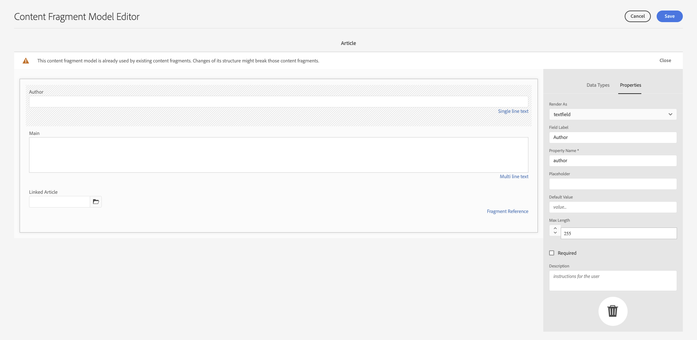

# Cómo acceder al contenido a través de las API de envío de AEM {#access-your-content}

>[!CAUTION]
>
>TRABAJO EN CURSO - La creación de este documento está en curso y no debe entenderse como completo o definitivo ni debe utilizarse con fines de producción.

En esta parte del [AEM Recorrido para desarrolladores sin encabezado,](overview.md) puede aprender a utilizar las consultas de GraphQL para acceder al contenido de sus fragmentos de contenido y alimentarlo en su aplicación (entrega sin encabezado).

## La historia hasta ahora {#story-so-far}

En el documento anterior del recorrido AEM sin encabezado, [Cómo modelar el contenido](model-your-content.md) ha aprendido los conceptos básicos del modelado de contenido en AEM, por lo que ahora debe comprender cómo modelar la estructura de contenido y, a continuación, darse cuenta de esa estructura utilizando AEM modelos de fragmentos de contenido y fragmentos de contenido:

* Reconocer los conceptos y la terminología relacionados con el modelado de contenido.
* Comprenda por qué el modelado de contenido es necesario para la entrega de contenido sin encabezado.
* Obtenga información sobre cómo llevar a cabo esta estructura mediante AEM modelos de fragmento de contenido (y cree contenido con fragmentos de contenido).
* Comprender cómo modelar el contenido; principios con muestras básicas.

Este artículo se basa en estos aspectos básicos para que pueda comprender cómo acceder al contenido sin encabezado existente en AEM mediante la API de GraphQL de AEM.

* **Audiencia**: Principiante
* **Objetivo**: Obtenga información sobre cómo acceder al contenido de los fragmentos de contenido mediante AEM consultas de GraphQL:
   * Presente GraphQL y la API de AEM GraphQL.
   * Descubra los detalles de la API de AEM GraphQL.
   * Observe algunas consultas de ejemplo para ver cómo funcionan las cosas en la práctica.

## ¿Le gustaría acceder a su contenido? {#so-youd-like-to-access-your-content}

Así que...tiene todo este contenido, bien estructurado (en fragmentos de contenido) y esperando para alimentar su nueva aplicación. La pregunta es: ¿cómo llegar allí?

Lo que necesita es una forma de segmentar contenido específico, seleccionar lo que necesita y devolverlo a su aplicación para un procesamiento posterior.

Con Adobe Experience Manager (AEM) como Cloud Service, puede acceder selectivamente a sus fragmentos de contenido mediante la API de GraphQL de AEM para devolver solo el contenido que necesita. Esto significa que puede realizar envíos sin objetivos de contenido estructurado para utilizarlo en sus aplicaciones.

>[!NOTE]
>
>AEM API de GraphQL es una implementación personalizada, basada en la especificación estándar de la API de GraphQL.

<!--
## GraphQL - An Introduction {#graphql-introduction}

GraphQL is an open-source specification that provides:

* a query language that enables you to select specific content from structured objects.
* a runtime to fulfill these queries with your structured content.

GraphQL is a *strongly* typed API. This means that *all* content must be clearly structured and organized by type, so that GraphQL *understands* what to access and how. The data fields are defined within GraphQL schemas, that define the structure of your content objects. 

GraphQL endpoints then provide the paths that respond to the GraphQL queries.

All this means that your app can accurately, reliably and efficiently select the content that it needs - just what you need when used with AEM.

>[!NOTE]
>
>See *GraphQL*.org and *GraphQL*.com.

## AEM and GraphQL {#aem-graphql}

GraphQL is used in various locations in AEM; for example:

* Content Fragments
  * A customized API has been developed for this use-case (Headless Delivery to your app).
    * This is the AEM GraphQL API.
* Commerce
  * AEM Commerce consumes data from a Commerce platform via GraphQL.
  * There are GraphQL integrations between AEM and various third-party commerce solutions, used with the extension hooks provided by the CIF Core Components.
    * This does not use the AEM GraphQL API.

>[!NOTE]
>
>This step of the Headless Journey is only concerned with the AEM GraphQL API and Content Fragments.

## AEM GraphQL API {#aem-graphql-api}

The AEM GraphQL API is a customized version based on the standard GraphQL API specification, specially configured to allow you to perform (complex) queries on your Content Fragments.

Content Fragments are used, as the content is structured according to Content Fragment Models. This fulfills a basic requirement of GraphQL.

* A Content Fragment Model is built up of one, or more, fields. 
  * Each field is defined according to a Data Type.
* Content Fragment Models are used to generate the corresponding AEM GraphQL Schemas.

To actually access GraphQL for AEM (and the content) an endpoint is used to provide the access path. 

The content returned, via the AEM GraphQL API, can then be used by your applications. 

>[!NOTE]
>
>The AEM GraphQL API implementation is based on the GraphQL Java libraries.

### Use Cases for Author and Publish Environments {#use-cases-author-publish-environments}

The use cases for the AEM GraphQL API can depend on the type of AEM as a Cloud Service environment:

* Publish environment; used to: 
  * Query content for JS application (standard use-case)

* Author environment; used to: 
  * Query content for "content management purposes":
    * GraphQL in AEM as a Cloud Service is currently a read-only API.
    * The REST API can be used for CR(u)D operations.

## Content Fragments for use with the AEM GraphQL API {#content-fragments-use-with-aem-graphql-api}

Content Fragments can be used as a basis for GraphQL for AEM schemas and queries as:

* They enable you to design, create, curate and publish page-independent content.
* They are based on a Content Fragment Model, which pre-defines the structure for the resulting fragment by means of defined data types.
* Additional layers of structure can be achieved with the Fragment Reference data type, available when defining a model.
 
### Content Fragment Models {#content-fragments-models}

These Content Fragment Models:

* Are used to generate the Schemas, once **Enabled**.

* Provide the data types and fields required for GraphQL. They ensure that your application only requests what is possible, and receives what is expected.

* The data type **Fragment References** can be used in your model to reference another Content Fragment, and so introduce additional levels of structure.

### Fragment References {#fragment-references}

The **Fragment Reference**:

* Is a specific data type available when defining a Content Fragment Model.

* References another fragment, dependent on a specific Content Fragment Model.

* Allows you to create, and then retrieve, structured data.

  * When defined as a **multifeed**, multiple sub-fragments can be referenced (retrieved) by the prime fragment.

### JSON Preview {#json-preview}

To help with designing and developing your Content Fragment Models, you can preview JSON output in the Content Fragment Editor.

## GraphQL Schema Generation from Content Fragments {#graphql-schema-generation-content-fragments}

GraphQL is a strongly typed API, which means that content must be clearly structured and organized by type. The GraphQL specification provides a series of guidelines on how to create a robust API for interrogating content on a certain instance. To do this, a client needs to fetch the Schema, which contains all the types necessary for a query. 

For Content Fragments, the GraphQL schemas (structure and types) are based on **Enabled** Content Fragment Models and their data types.

>[!CAUTION]
>
>All the GraphQL schemas (derived from Content Fragment Models that have been **Enabled**) are readable through the GraphQL endpoint.
>
>This means that you need to ensure that no sensitive content is available, to ensure that no sensitive data is exposed via GraphQL endpoints; for example, this includes information that could be present as field names in the model definition.

For example, if a user created a Content Fragment Model called `Article`, then AEM generates the object `article` that is of a type `ArticleModel`. The fields within this type correspond to the fields and data types defined in the model.

1. A Content Fragment Model:

   

1. The corresponding GraphQL schema (output from GraphiQL automatic documentation):
   

   This shows that the generated type `ArticleModel` contains several [fields](#fields). 
   
   * Three of them have been controlled by the user: `author`, `main` and `referencearticle`.

   * The other fields were added automatically by AEM, and represent helpful methods to provide information about a certain Content Fragment; in this example, `_path`, `_metadata`, `_variations`. These [helper fields](#helper-fields) are marked with a preceding `_` to distinguish between what has been defined by the user and what has been auto-generated.

1. After a user creates a Content Fragment based on the Article model, it can then be interrogated through GraphQL. For examples, see the Sample Queries.md#graphql-sample-queries) (based on a sample Content Fragment structure for use with GraphQL.

In GraphQL for AEM, the schema is flexible. This means that it is auto-generated each and every time a Content Fragment Model is created, updated or deleted. The data schema caches are also refreshed when you update a Content Fragment Model.

The Sites GraphQL service listens (in the background) for any modifications made to a Content Fragment Model. When updates are detected, only that part of the schema is regenerated. This optimization saves time and provides stability.

So for example, if you:

1. Install a package containing `Content-Fragment-Model-1` and `Content-Fragment-Model-2`:
 
   1. GraphQL types for `Model-1` and `Model-2` will be generated.

1. Then modify `Content-Fragment-Model-2`:

   1. Only the `Model-2` GraphQL type will get updated.

   1. Whereas `Model-1` will remain the same. 

>[!NOTE]
>
>This is important to note in case you want to do bulk updates on Content Fragment Models through the REST api, or otherwise.

The schema is served through the same endpoint as the GraphQL queries, with the client handling the fact that the schema is called with the extension `GQLschema`. For example, performing a simple `GET` request on `/content/cq:graphql/global/endpoint.GQLschema` will result in the output of the schema with the Content-type: `text/x-graphql-schema;charset=iso-8859-1`.

### Schema Generation - Unpublished Models {#schema-generation-unpublished-models}

When Content Fragments are nested it can happen that a parent Content Fragment Model is published, but a referenced model is not.

>[!NOTE]
>
>The AEM UI prevents this happening, but if publishing is made programmatically, or with content packages, it can occur.

When this happens, AEM generates an *incomplete* Schema for the parent Content Fragment Model. This means that the Fragment Reference, which is dependent on the unpublished model, is removed from the schema.

## AEM GraphQL Endpoints {#aem-graphql-endpoints}

An endpoint is the path used to access GraphQL for AEM. Using this path you (or your app) can:

* access the GraphQL schemas,
* send your GraphQL queries,
* receive the responses (to your GraphQL queries).

AEM allows for:

* A global endpoint - available for use by all sites.
* Endpoints for specific Sites configurations - that you can configure (in the Configuration Browser), specific to a specified site/project.

## Permissions {#permissions}

The permissions are those required for accessing Assets.

## The AEM GraphiQL Interface {#aem-graphiql-interface}

To help you directly input, and test queries, an implementation of the standard GraphiQL interface is available for use with AEM GraphQL. This can be installed with AEM.

>[!NOTE]
>
>GraphiQL is bound the global endpoint (and does not work with other endpoints for specific Sites configurations).

It provides features such as syntax-highlighting, auto-complete, auto-suggest, together with a history and online documentation.


-->

## Uso real de la API de AEM GraphQL {#actually-using-aem-graphiql}

### Configuración inicial {#initial-setup}

Antes de comenzar con consultas sobre el contenido, debe:

* Habilitar el punto final
   * Uso de herramientas -> Sitios -> GraphQL

* Instale GraphiQL (si es necesario)
   * Instalado como un paquete dedicado

### Estructura de muestra {#sample-structure}

Para utilizar la API de AEM GraphQL en una consulta, podemos utilizar las dos estructuras básicas del Modelo de fragmento de contenido:

* Empresa
   * Nombre
   * Director general (persona)
   * Empleados (personas)
* Person
   * Nombre
   * Nombre

Como puede ver, los campos CEO y Empleados hacen referencia a los fragmentos Persona .

Se utilizarán los modelos de fragmento:

* al crear el contenido en el editor de fragmentos de contenido
* para generar los esquemas de GraphQL que vaya a consultar

### Dónde probar las consultas {#where-to-test-your-queries}

Las consultas se pueden introducir en la interfaz de GraphiQL, por ejemplo en:

* `http://localhost:4502/content/graphiql.html `

### Introducción a las consultas {#getting-Started-with-queries}

Una consulta directa es devolver el nombre de todas las entradas del esquema Company. Aquí puede solicitar una lista de todos los nombres de compañía:

```xml
query {
  companyList {
    items {
      name
    }
  }
}
```

Una consulta ligeramente más compleja es seleccionar todas las personas que no tienen un nombre de &quot;Trabajos&quot;. Esto filtrará todas las personas para aquellas que no tengan el nombre Trabajos. Esto se logra con el operador EQUALS_NOT (hay muchos más):

```xml
query {
  personList(filter: {
    name: {
      _expressions: [
        {
          value: "Jobs"
          _operator: EQUALS_NOT
        }
      ]
    }
  }) {
    items {
      name
      firstName
    }
  }
}
```

También puede crear consultas más complejas. Por ejemplo, realice una consulta a todas las empresas que tengan al menos un empleado con el nombre &quot;Smith&quot;. Esta consulta ilustra el filtrado para cualquier persona de nombre &quot;Smith&quot;, que devuelve información de los fragmentos anidados:

```xml
query {
  companyList(filter: {
    employees: {
      _match: {
        name: {
          _expressions: [
            {
              value: "Smith"
            }
          ]
        }
      }
    }
  }) {
    items {
      name
      ceo {
        name
        firstName
      }
      employees {
        name
        firstName
      }
    }
  }
}
```

<!-- need code / curl / cli examples-->

Para obtener toda la información sobre el uso de la API de AEM GraphQL, junto con la configuración de los elementos necesarios, puede hacer referencia a:

* Aprender a usar GraphQL con AEM
* La estructura de fragmento de contenido de ejemplo
* Aprender a utilizar GraphQL con AEM: contenido de muestra y consultas

## Siguientes {#whats-next}

Ahora que ha aprendido a acceder y consultar el contenido sin encabezado mediante la API de AEM GraphQL, ahora puede [aprender a utilizar la API de REST para acceder y actualizar el contenido de sus fragmentos de contenido](/help/implementing/developing/headless-journey/update-your-content.md).

## Recursos adicionales {#additional-resources}

* [GraphQL.org](https://graphql.org)
   * [Esquemas](https://graphql.org/learn/schema/)
   * [Variables](https://graphql.org/learn/queries/#variables)
   * [Bibliotecas Java de GraphQL](https://graphql.org/code/#java)
* [GraphiQL](https://graphql.org/learn/serving-over-http/#graphiql)
* [Aprender a usar GraphQL con AEM](/help/assets/content-fragments/graphql-api-content-fragments.md)
   * [Activación del extremo de GraphQL](/help/assets/content-fragments/graphql-api-content-fragments.md#enabling-graphql-endpoint)
   * [Instalación de la interfaz AEM GraphiQL](/help/assets/content-fragments/graphql-api-content-fragments.md#installing-graphiql-interface)
* [La estructura de fragmento de contenido de ejemplo](/help/assets/content-fragments/content-fragments-graphql-samples.md#content-fragment-structure-graphql)
* [Aprender a utilizar GraphQL con AEM: contenido de muestra y consultas](/help/assets/content-fragments/content-fragments-graphql-samples.md)
   * [Consulta De Muestra: Un Solo Fragmento De Ciudad Específico](/help/assets/content-fragments/content-fragments-graphql-samples.md#sample-single-specific-city-fragment)
   * [Consulta de ejemplo para metadatos: enumera los metadatos de los premios titulados GB](/help/assets/content-fragments/content-fragments-graphql-samples.md#sample-metadata-awards-gb)
   * [Consulta de ejemplo: todas las ciudades con una variación con nombre](/help/assets/content-fragments/content-fragments-graphql-samples.md#sample-cities-named-variation)
* [Habilitar la funcionalidad de fragmento de contenido en el navegador de configuración](/help/assets/content-fragments/content-fragments-configuration-browser.md#enable-content-fragment-functionality-in-configuration-browser)
* [Trabajar con fragmentos de contenido](/help/assets/content-fragments/content-fragments.md)
   * [Modelos de fragmento de contenido](/help/assets/content-fragments/content-fragments-models.md)
   * [Salida JSON](/help/assets/content-fragments/content-fragments-json-preview.md)
* [Comprender el uso compartido de recursos de origen cruzado (CORS)](https://experienceleague.adobe.com/docs/experience-manager-learn/foundation/security/understand-cross-origin-resource-sharing.html?lang=en#understand-cross-origin-resource-sharing-(cors))
* [Generación de tokens de acceso para las API del servidor](/help/implementing/developing/introduction/generating-access-tokens-for-server-side-apis.md)
* [Introducción a AEM sin encabezado](https://experienceleague.adobe.com/docs/experience-manager-learn/getting-started-with-aem-headless/graphql/overview.html) : una breve serie de tutoriales de vídeo que ofrecen información general sobre el uso de AEM funciones sin encabezado, incluidos el modelado de contenido y GraphQL.
