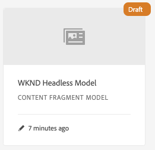

# Creación de modelos de fragmento de contenido Guía de Inicio rápido sin encabezado {#creating-content-fragment-models}

Los modelos de fragmento de contenido definen la estructura del contenido que creará y ofrecerá mediante AEM funciones sin encabezado.

## ¿Qué son los modelos de fragmento de contenido? {#what-are-content-fragment-models}

[Ahora que ha creado una configuración, ](create-configuration.md) puede utilizarla para crear modelos de fragmento de contenido.

Los modelos de fragmento de contenido definen la estructura de los datos y el contenido que creará y administrará en AEM. Sirven como un tipo de andamiaje para el contenido. Al elegir crear contenido, los autores seleccionarán entre los modelos de fragmento de contenido que defina, que los guiarán en la creación de contenido.

## Cómo crear un modelo de fragmento de contenido {#how-to-create-a-content-fragment-model}

Un arquitecto de la información realizará estas tareas sólo esporádicamente a medida que se requieran nuevos modelos. Para los fines de esta guía de introducción, sólo necesitamos crear un modelo.

1. Inicie sesión en AEM como Cloud Service y, en el menú principal, seleccione **Herramientas -> Recursos -> Modelos de fragmento de contenido**.
1. Toque o haga clic en la carpeta que se creó al crear la configuración.

   
1. Haga clic o pulse **Crear**.
1. Proporcione un **Título del modelo** y **Descripción**.

   
1. En la ventana de confirmación, toque o haga clic en **Abrir** para configurar el modelo.

   
1. Con el **Editor del modelo de fragmento de contenido**, cree el modelo de fragmento de contenido arrastrando y soltando los campos de la columna **Tipos de datos**.

   

1. Una vez colocado un campo, debe configurar sus propiedades. El editor cambiará automáticamente a la ficha **Propiedades** del campo agregado, donde puede proporcionar los campos obligatorios.

   
1. Cuando haya terminado de crear el modelo, toque o haga clic en **Guardar**. El modelo recién creado se guarda en modo **Borrador**.

   
1. El modelo debe estar activado para poder utilizarlo. Seleccione el modelo que acaba de crear y toque o haga clic en **Habilitar**.

   
1. Confirme la habilitación del modelo tocando o haciendo clic en **Habilitar** en el cuadro de diálogo de confirmación.

   
1. El modelo está ahora habilitado y listo para usarse.

   

El **Editor del modelo de fragmento de contenido** admite muchos tipos de datos diferentes, como campos de texto simples, referencias de recursos, referencias a otros modelos y datos JSON.

Puede crear varios modelos. Los modelos pueden hacer referencia a otros fragmentos de contenido. Utilice [configuraciones](create-configuration.md) para organizar los modelos.

## Próximos pasos {#next-steps}

Ahora que ha definido las estructuras de los fragmentos de contenido mediante la creación de modelos, puede pasar a la tercera parte de la guía de introducción y [crear carpetas en las que almacenará los propios fragmentos.](create-assets-folder.md)

>[!TIP]
>
>Para obtener información detallada sobre los modelos de fragmentos de contenido, consulte la documentación de [Modelos de fragmentos de contenido](/help/assets/content-fragments/content-fragments-models.md)
