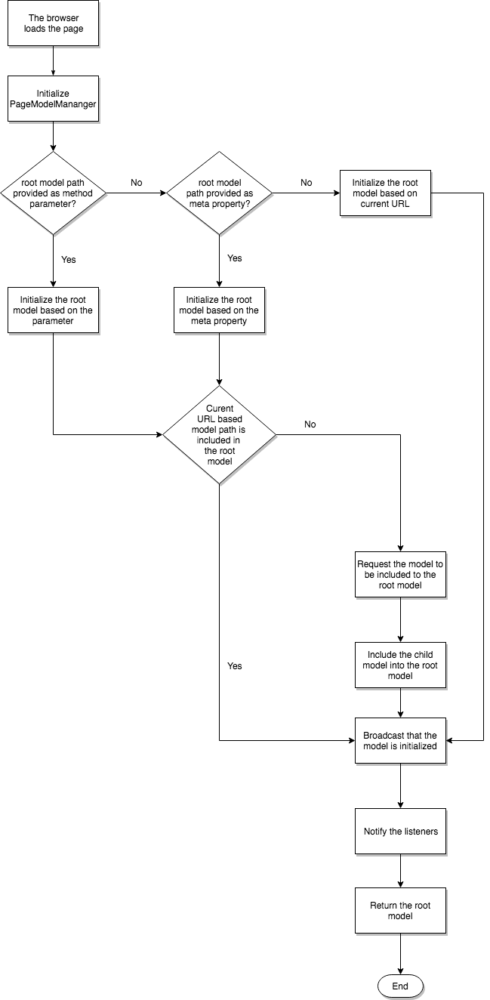

# Modelo SPA {#spa-blueprint}

Para permitir que el autor utilice el AEM SPA Editor para editar el contenido de un SPA, hay requisitos que el SPA debe cumplir.

## Introducción {#introduction}

Este documento describe el contrato general que cualquier marco de SPA debe cumplir (es decir, el tipo de capa de soporte AEM) para implementar componentes SPA editables dentro de AEM.

Para permitir que el autor utilice el Editor de páginas de AEM para editar los datos expuestos por un marco de aplicación de una sola página, un proyecto debe poder interpretar la estructura del modelo que representa la semántica de los datos almacenados para una aplicación dentro del repositorio de AEM. Para lograr este objetivo, se proporcionan dos bibliotecas independientes del marco de trabajo: el `PageModelManager` y `ComponentMapping`.

>[!NOTE]
>
>Los siguientes requisitos son independientes del marco de trabajo. Si se cumplen estos requisitos, se puede proporcionar una capa específica del marco compuesta por módulos, componentes y servicios.
>
>**Estos requisitos ya se cumplen para los marcos React y Angular de AEM.** Los requisitos de este modelo solo son relevantes si desea implementar otro marco para utilizarlo con AEM.

>[!CAUTION]
>
>Aunque las capacidades SPA de AEM son independientes del marco, actualmente solo se admiten los marcos React y Angular.

## PageModelManager {#pagemodelmanager}

La variable `PageModelManager` La biblioteca de se proporciona como un paquete NPM que un proyecto SPA utiliza. Acompaña al SPA y sirve como administrador de modelos de datos.

En nombre del SPA, abstrae la recuperación y administración de la estructura JSON que representa la estructura de contenido real. También se encarga de sincronizar con el SPA para informarle de cuándo tiene que volver a procesar sus componentes.

Consulte el paquete NPM [@adobe/aem-spa-model-manager](https://www.npmjs.com/package/@adobe/aem-spa-model-manager)

Al inicializar el `PageModelManager`, la biblioteca carga primero el modelo raíz proporcionado de la aplicación (mediante parámetro, meta propiedad o dirección URL actual). Si la biblioteca identifica que el modelo de la página actual no forma parte del modelo raíz que obtiene e incluye como modelo de una página secundaria.



### Asignación de componentes {#componentmapping}

La variable `ComponentMapping` se proporciona como paquete NPM al proyecto front-end. Almacena componentes front-end y proporciona una forma para que el SPA asigne componentes front-end a AEM tipos de recursos. Esto permite una resolución dinámica de los componentes al analizar el modelo JSON de la aplicación.

Cada elemento presente en el modelo contiene un `:type` campo que muestra un tipo de recurso AEM. Cuando se monta, el componente frontal puede procesarse utilizando el fragmento de modelo que ha recibido de las bibliotecas subyacentes.

#### Asignación de modelos dinámicos a componentes {#dynamic-model-to-component-mapping}

Para obtener más información sobre cómo se produce la asignación de modelos dinámicos a componentes en el SDK de SPA de Javascript para AEM consulte el artículo [Asignación de modelos dinámicos a componentes para SPA](model-to-component-mapping.md).

### Capa específica de marco {#framework-specific-layer}

Se debe implementar una tercera capa para cada marco front-end. Esta tercera biblioteca es responsable de interactuar con las bibliotecas subyacentes y proporciona una serie de puntos de entrada bien integrados y fáciles de usar para interactuar con el modelo de datos.

El resto de este documento describe los requisitos de esta capa específica del marco intermedio y aspira a ser independiente del marco. Respetando los siguientes requisitos, se puede proporcionar una capa específica del marco para que los componentes del proyecto interactúen con las bibliotecas subyacentes encargadas de administrar el modelo de datos.

## Conceptos generales {#general-concepts}

### Modelo de página {#page-model}

La estructura de contenido de la página se almacena en AEM. El modelo de la página se utiliza para asignar y crear instancias de SPA componentes. Los SPA desarrolladores crean SPA componentes que asignan a AEM componentes. Para ello, utilizan el tipo de recurso (o ruta al componente AEM) como clave única.

Los componentes SPA deben estar sincronizados con el modelo de página y actualizarse con los cambios correspondientes en su contenido. Se debe utilizar un patrón que aproveche los componentes dinámicos para crear instancias de los componentes sobre la marcha siguiendo la estructura del modelo de página proporcionada.

### Meta-Fields {#meta-fields}

El modelo de página aprovecha el exportador de modelo JSON, que se basa en el [Modelo de Sling](https://sling.apache.org/documentation/bundles/models.html) API. Los modelos de Sling exportables exponen la siguiente lista de campos para permitir que las bibliotecas subyacentes interpreten el modelo de datos:

* `:type`: Tipo del recurso AEM (predeterminado = tipo de recurso)
* `:children`: Secciones jerárquicas del recurso actual. Los elementos secundarios no forman parte del contenido interno del recurso actual (se pueden encontrar en elementos que representan una página)
* `:hierarchyType`: Tipo jerárquico de un recurso. La variable `PageModelManager` actualmente es compatible con el tipo de página

* `:items`: Recursos de contenido secundario del recurso actual (estructura anidada, solo presente en contenedores)
* `:itemsOrder`: Lista ordenada de los niños. El objeto de mapa JSON no garantiza el orden de sus campos. Al tener el mapa y la matriz actual, el consumidor de la API tiene las ventajas de ambas estructuras
* `:path`: Ruta de contenido de un elemento (presente en elementos que representan una página)

Consulte también [Introducción a los servicios de contenido AEM.](https://experienceleague.adobe.com/docs/experience-manager-learn/getting-started-with-aem-headless/overview.html?lang=es)

### Módulo específico de marco {#framework-specific-module}

La separación de las preocupaciones ayuda a facilitar la ejecución del proyecto. Por lo tanto, se debe proporcionar un paquete específico de npm. Este paquete es responsable de agregar y exponer los módulos base, servicios y componentes. Estos componentes deben encapsular la lógica de administración del modelo de datos y proporcionar acceso a los datos que el componente del proyecto espera. El módulo también es responsable de la exposición transitoria de puntos de entrada útiles de las bibliotecas subyacentes.

Para facilitar la interoperabilidad de las bibliotecas, el Adobe aconseja al módulo específico de la infraestructura que agrupe las siguientes bibliotecas. Si es necesario, la capa puede encapsular y adaptar las API subyacentes antes de exponerlas al proyecto.

* [@adobe/aem-spa-model-manager](https://www.npmjs.com/package/@adobe/aem-spa-model-manager)
* [@adobe/aem-spa-component-mapping](https://www.npmjs.com/package/@adobe/aem-spa-component-mapping)

#### Implementaciones {#implementations}

#### React {#react}

módulo npm: [@adobe/aem-react-editable-components](https://www.npmjs.com/package/@adobe/aem-react-editable-components)

#### Angular {#angular}

módulo npm: [@adobe/aem-angular-editable-components](https://www.npmjs.com/package/@adobe/aem-angular-editable-components)

## Servicios principales y componentes {#main-services-and-components}

Las siguientes entidades deben aplicarse de conformidad con las directrices específicas de cada marco. En función de la arquitectura del marco, la implementación puede variar ampliamente, pero se deben proporcionar las funcionalidades descritas.

### El proveedor de modelos {#the-model-provider}

Los componentes de proyecto deben delegar el acceso a los fragmentos de un modelo a un proveedor de modelos. A continuación, el proveedor de modelos se encarga de escuchar los cambios realizados en el fragmento especificado del modelo y devolver el modelo actualizado al componente delegado.

Para ello, el proveedor de modelos debe registrarse en el [`PageModelManager`](#pagemodelmanager). A continuación, cuando se produce un cambio, recibe y pasa los datos actualizados al componente de delegación. Por convención, la propiedad puesta a disposición del componente delegado que llevará el fragmento del modelo se nombra `cqModel`. La implementación puede proporcionar esta propiedad al componente, pero debe tener en cuenta aspectos como la integración con la arquitectura del marco, la capacidad de detección y la facilidad de uso.

### Decorador del HTML de componentes {#the-component-html-decorator}

El decorador de componentes es responsable de decorar el HTML exterior del elemento de cada instancia de componente con una serie de atributos de datos y nombres de clase que espera el Editor de páginas.

#### Declaración de componente {#component-declaration}

Los siguientes metadatos deben agregarse al elemento de HTML externo producido por el componente del proyecto. Permiten al Editor de páginas recuperar la configuración de edición correspondiente.

* `data-cq-data-path`: Ruta al recurso en relación con el `jcr:content`

#### Declaración de capacidad de edición y marcador de posición {#editing-capability-declaration-and-placeholder}

Los siguientes metadatos y nombres de clase deben agregarse al elemento de HTML externo producido por el componente del proyecto. Permiten que el Editor de páginas ofrezca funciones relacionadas.

* `cq-placeholder`: Nombre de clase que identifica el marcador de posición de un componente vacío
* `data-emptytext`: Etiqueta que mostrará la superposición cuando una instancia de componente esté vacía

**Marcador de posición para componentes vacíos**

Cada componente debe ampliarse con una funcionalidad que decore el elemento del HTML exterior con atributos de datos y nombres de clase específicos de los marcadores de posición y las superposiciones relacionadas cuando el componente se identifica como vacío.

**Acerca del vacío de un componente**

* ¿El componente está vacío lógicamente?
* ¿Cuál debe ser la etiqueta que muestra la superposición cuando el componente está vacío?

### Contenedor {#container}

Un contenedor es un componente diseñado para contener y procesar componentes secundarios. Para ello, el contenedor se repite sobre el `:itemsOrder`, `:items` y `:children` propiedades de su modelo.

El contenedor obtiene dinámicamente los componentes secundarios del almacén de la variable [`ComponentMapping`](#componentmapping) biblioteca. A continuación, el contenedor extiende el componente secundario con las capacidades del proveedor de modelo y, finalmente, lo crea una instancia.

### Página {#page}

La variable `Page` amplía el `Container` componente. Un contenedor es un componente diseñado para contener y procesar componentes secundarios, incluidas páginas secundarias. Para ello, el contenedor se repite sobre el `:itemsOrder`, `:items`y `:children` propiedades de su modelo. La variable `Page` obtiene dinámicamente los componentes secundarios del almacén de la variable [`ComponentMapping`](#componentmapping) biblioteca. La variable `Page` es responsable de crear instancias de componentes secundarios.

### Cuadrícula interactiva {#responsive-grid}

El componente Cuadrícula interactiva es un contenedor. Contiene una variante específica del proveedor de modelos que representa sus columnas. La cuadrícula interactiva y sus columnas son responsables de decorar el elemento de HTML exterior del componente del proyecto con los nombres de clase específicos contenidos en el modelo.

El componente Cuadrícula interactiva debe asignarse previamente a su homólogo AEM, ya que este componente es complejo y rara vez se personaliza.

#### Campos de modelo específicos {#specific-model-fields}

* `gridClassNames:` Nombres de clase proporcionados para la cuadrícula adaptable
* `columnClassNames:` Nombres de clase proporcionados para la columna adaptable

Consulte también el recurso npm [@adobe/aem-react-editable-components](https://www.npmjs.com/package/@adobe/aem-react-editable-components)

#### Marcador de posición de la cuadrícula interactiva {#placeholder-of-the-responsive-grid}

El componente SPA se asigna a un contenedor gráfico como la cuadrícula interactiva y debe agregar un marcador de posición secundario virtual cuando se crea el contenido. Cuando el Editor de páginas crea el contenido del SPA, este se incrusta en el editor mediante un iframe y la variable `data-cq-editor` se agrega al nodo de documento de ese contenido. Cuando la variable `data-cq-editor` está presente, el contenedor debe incluir un elemento HTML para representar el área con la que el autor interactúa al insertar un nuevo componente en la página.

Por ejemplo:

```html
<div data-cq-data-path={"path/to/the/responsivegrid/*"} className="new section aem-Grid-newComponent"/>
```

>[!NOTE]
>
>El editor de páginas requiere actualmente los nombres de clase utilizados en el ejemplo.
>
>* `"new section"`: Indica que el elemento actual es el marcador de posición del contenedor
>* `"aem-Grid-newComponent"`: Normaliza el componente para la creación del diseño
>


#### Asignación de componentes {#component-mapping}

El [`Component Mapping`](#componentmapping) biblioteca y su `MapTo` se puede encapsular y ampliar para proporcionar las funcionalidades relativas a la configuración de edición proporcionada junto con la clase de componente actual.

```javascript
const EditConfig = {

    emptyLabel: 'My Component',

    isEmpty: function() {
        return !this.props || !this.props.cqModel || this.props.cqModel.isEmpty;
    }
};

class MyComponent extends Component {

    render() {
        return <div className={'my-component'}></div>;
    }
}

MapTo('component/resource/path')(MyComponent, EditConfig);
```

En la implementación anterior, el componente del proyecto se amplía con la funcionalidad de vacío antes de que el [Asignación de componentes](#componentmapping) tienda. Esto se hace encapsulando y ampliando el [`ComponentMapping`](#componentmapping) biblioteca para presentar la compatibilidad de `EditConfig` objeto de configuración:

```javascript
/**
 * Configuration object in charge of providing the necessary data expected by the page editor to initiate the authoring. The provided data will be decorating the associated component
 *
 * @typedef {{}} EditConfig
 * @property {String} [dragDropName]       If defined, adds a specific class name enabling the drag and drop functionality
 * @property {String} emptyLabel           Label to be displayed by the placeholder when the component is empty. Optionally returns an empty text value
 * @property {function} isEmpty            Should the component be considered empty. The function is called using the context of the wrapper component giving you access to the component model
 */

/**
 * Map a React component with the given resource types. If an {@link EditConfig} is provided the <i>clazz</i> is wrapped to provide edition capabilities on the AEM Page Editor
 *
 * @param {string[]} resourceTypes                      - List of resource types for which to use the given <i>clazz</i>
 * @param {class} clazz                                 - Class to be instantiated for the given resource types
 * @param {EditConfig} [editConfig]                     - Configuration object for enabling the edition capabilities
 * @returns {class}                                     - The resulting decorated Class
 */
ComponentMapping.map = function map (resourceTypes, clazz, editConfig) {};
```

## Contrato con el Editor de páginas {#contract-with-the-page-editor}

Los componentes del proyecto deben generar como mínimo los siguientes atributos de datos para que el editor pueda interactuar con ellos.

* `data-cq-data-path`: Ruta relativa del componente tal como lo proporciona el `PageModel` (por ejemplo, `"root/responsivegrid/image"`). Este atributo no debe agregarse a las páginas.

En resumen, para que el editor de páginas lo interprete como editable, un componente de proyecto debe respetar el siguiente contrato:

* Proporcione los atributos esperados para asociar una instancia de componente front-end a un recurso AEM.
* Proporcione la serie esperada de atributos y nombres de clase que permitan la creación de marcadores de posición vacíos.
* Proporcione los nombres de clase esperados que permitan arrastrar y soltar recursos.

### Estructura típica del elemento HTML {#typical-html-element-structure}

El siguiente fragmento ilustra la representación de HTML típica de una estructura de contenido de página. Estos son algunos puntos importantes:

* El elemento de cuadrícula interactiva lleva los nombres de clase con el prefijo `aem-Grid--`
* El elemento de columna interactivo lleva los nombres de clase con el prefijo `aem-GridColumn--`
* Una cuadrícula adaptable que también es la columna de una cuadrícula principal está ajustada, como que los dos prefijos anteriores no aparecen en el mismo elemento
* Los elementos correspondientes a recursos editables llevan un `data-cq-data-path` propiedad. Consulte la [Contrato con el Editor de páginas](#contract-with-the-page-editor) de este documento.

```javascript
<div data-cq-data-path="/content/page">
    <div class="aem-Grid aem-Grid--12 aem-Grid--default--12">
        <div class="aem-container aem-GridColumn aem-GridColumn--default--12" data-cq-data-path="/content/page/jcr:content/root/responsivegrid">
            <div class="aem-Grid aem-Grid--12 aem-Grid--default--12">
                <div class="cmp-image cq-dd-image aem-GridColumn aem-GridColumn--default--12" data-cq-data-path="/root/responsivegrid/image">
                    
                </div>
            </div>
        </div>
    </div>
</div>
```

## Navegación y enrutamiento {#navigation-and-routing}

La aplicación es propietaria del enrutamiento. El desarrollador de front-end primero debe implementar un componente de navegación (asignado a un componente de navegación de AEM). Este componente renderizaría los vínculos URL para utilizarlos junto con una serie de rutas que mostrarán u ocultarán fragmentos de contenido.

El [`PageModelManager`](#pagemodelmanager) biblioteca y su [`ModelRouter`](routing.md) (habilitado de forma predeterminada) son responsables de la recuperación previa y de proporcionar acceso al modelo asociado a una ruta de recurso determinada.

Las dos entidades están relacionadas con la noción de enrutamiento, pero la [`ModelRouter`](routing.md) solo es responsable de cargar el [`PageModelManager`](#pagemodelmanager) con un modelo de datos estructurado de forma sincronizada con el estado de la aplicación actual.

Consulte el artículo [Enrutamiento de modelo SPA](routing.md) para obtener más información.

## SPA en acción {#spa-in-action}

Vea cómo funciona una SPA sencilla y experimente con un SPA usted mismo continuando con los siguientes documentos:

* [Introducción a SPA en AEM con React](getting-started-react.md).
* [Introducción a SPA en AEM con Angular](getting-started-angular.md).

## Lectura adicional {#further-reading}

Para obtener más información sobre SPA en AEM, consulte los siguientes documentos:

* [Información general del Editor de SPA](editor-overview.md) para obtener una descripción general del SPA en AEM y el modelo de comunicación
