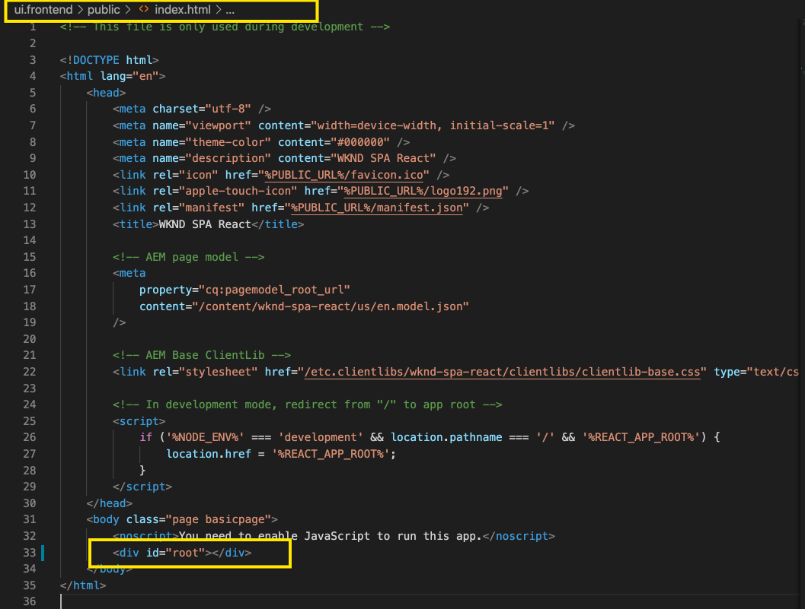

# Edición de un SPA externo dentro de AEM {#editing-external-spa-within-aem}

SPA AEM SPA AEM A la hora de decidir [qué nivel de integración](/help/implementing/developing/headful-headless.md) desea que tenga entre su externo y su, tenga en cuenta que debe poder editar y ver los elementos de la lista de elementos de la lista de elementos de la lista de elementos de la lista de elementos de la lista de elementos de la lista de elementos de la lista de elementos de la lista de elementos de la lista de elementos de la lista de elementos de la lista de elementos de la lista de elementos de la lista de elementos de la lista de elementos de la lista de elementos de la lista de elementos de la lista, con frecuencia

{{ue-over-spa}}

## Información general {#overview}

SPA AEM En este documento se describen los pasos recomendados para cargar una instancia independiente a una instancia de, agregar secciones de contenido editables y habilitar la creación de contenido.

## Requisitos previos {#prerequisites}

Los requisitos previos son simples.

* AEM Asegúrese de que una instancia de se esté ejecutando localmente.
* AEM SPA AEM Cree un proyecto de base de usando [el tipo de archivo del proyecto de](https://experienceleague.adobe.com/docs/experience-manager-core-components/using/developing/archetype/overview.html?#available-properties).
   * Forms AEM SPA es la base del proyecto de, que se actualiza para incluir la dirección de correo electrónico externa
   * Para los ejemplos de este documento, el Adobe SPA está usando el punto de partida de [el proyecto WKND](https://experienceleague.adobe.com/docs/experience-manager-learn/sites/spa-editor/spa-editor-framework-feature-video-use.html#spa-editor).
* SPA Tenga a mano el React externo de trabajo que desea integrar.

## SPA AEM Cargar el a un proyecto de {#upload-spa-to-aem-project}

SPA AEM En primer lugar, debe cargar el recurso externo en el proyecto de.

1. Reemplace `src` en la carpeta del proyecto `/ui.frontend` con la carpeta `src` de su aplicación React.
1. Incluya dependencias adicionales en `package.json` de la aplicación en el archivo `/ui.frontend/package.json`.
   * SPA Asegúrese de que las dependencias de SDK de la sean de [versiones recomendadas](/help/implementing/developing/hybrid/getting-started-react.md#dependencies).
1. Incluya cualquier personalización en la carpeta `/public`.
1. Incluya cualquier script en línea o estilo agregado en el archivo `/public/index.html`.

## SPA Configuración del servidor remoto {#configure-remote-spa}

SPA AEM AEM Ahora que la externa forma parte del proyecto de la, debe configurarse en la siguiente configuración de la interfaz de usuario de la interfaz de usuario de.

### Incluir Adobe SPA Paquetes SDK {#include-spa-sdk-packages}

AEM SPA Para aprovechar las características de la, existen dependencias en los tres paquetes siguientes.

* [`@adobe/aem-react-editable-components`](https://github.com/adobe/aem-react-editable-components)
* [`@adobe/aem-spa-component-mapping`](https://www.npmjs.com/package/@adobe/aem-spa-component-mapping)
* [`@adobe/aem-spa-page-model-manager`](https://www.npmjs.com/login?next=/package/@adobe/aem-spa-model-manager)

AEM El paquete `@adobe/aem-spa-page-model-manager` proporciona la API para inicializar un Administrador de modelos y recuperar el modelo de la instancia de la instancia de la. AEM Este modelo se puede usar para procesar componentes de la mediante las API de `@adobe/aem-react-editable-components` y `@adobe/aem-spa-component-mapping`.

#### Instalación {#installation}

Ejecute el siguiente comando `npm` para poder instalar los paquetes necesarios.

```shell
npm install --save @adobe/aem-spa-component-mapping @adobe/aem-spa-page-model-manager @adobe/aem-react-editable-components
```

### Inicialización de ModelManager {#model-manager-initialization}

AEM Antes de que la aplicación se procese, [`ModelManager`](/help/implementing/developing/hybrid/blueprint.md#pagemodelmanager) debe inicializarse para controlar la creación de la aplicación `ModelStore` de la que se ha creado la aplicación de la manera de crear la aplicación de la aplicación de la aplicación de la aplicación de la aplicación.

Esta inicialización debe realizarse en el archivo `src/index.js` de la aplicación o dondequiera que se represente la raíz de la aplicación.

Para realizar esta inicialización, puede usar la API `initializationAsync` proporcionada por `ModelManager`.

La siguiente captura de pantalla muestra cómo habilitar la inicialización de `ModelManager` en una aplicación React simple. La única restricción es que se debe llamar a `initializationAsync` antes de `ReactDOM.render()`.


En este ejemplo, `ModelManager` se inicializa y se crea un `ModelStore` vacío.

`initializationAsync` puede aceptar opcionalmente un objeto `options` como parámetro:

* `path`: en la inicialización, el modelo de la ruta definida se recupera y se almacena en `ModelStore`. Esta ruta se puede usar para recuperar `rootModel` en la inicialización, si es necesario.
* `modelClient`: permite proporcionar un cliente personalizado responsable de recuperar el modelo.
* `model` - Un objeto `model` pasado como parámetro normalmente se rellena al usar SSR.

### AEM Componentes de hoja autorizables {#authorable-leaf-components}

1. AEM Cree/identifique un componente de para el que se cree un componente React con autoridad. En este ejemplo, se utiliza el componente de texto del proyecto WKND.

   

1. SPA Cree un componente de texto React simple en la interfaz de usuario de. En este ejemplo, se creó un nuevo archivo `Text.js` con el siguiente contenido.

   

1. AEM Cree un objeto de configuración para poder especificar los atributos necesarios para habilitar la edición de la.

   

   * AEM AEM `resourceType` es obligatorio para asignar el componente React al componente de y habilitar la edición al abrir en el Editor de elementos de la aplicación de la aplicación de la aplicación de la aplicación de.

1. Usar la función de contenedor `withMappable`.

   

   AEM AEM Esta función de contenedor asigna el componente React al elemento de configuración `resourceType` especificado en la configuración y habilita las capacidades de edición cuando se abre en el Editor de la. Para los componentes independientes, también recupera el contenido del modelo para el nodo específico.

   >[!NOTE]
   >
   >AEM En este ejemplo, hay versiones independientes del componente: componentes React ajustados y no ajustados a la. La versión ajustada debe utilizarse cuando se utilice explícitamente el componente. SPA Cuando el componente forma parte de una página, puede seguir utilizando el componente predeterminado como se hace actualmente en el editor de páginas de la página de la aplicación de la página de la aplicación de la aplicación de la aplicación de la aplicación de configuración de la aplicación de configuración de la página.

1. Procesar contenido en el componente.

   AEM Las propiedades JCR del componente de texto aparecen de la siguiente manera en la.

   

   Estos valores se pasan como propiedades al componente React `AEMText` creado y se pueden usar para procesar el contenido.

   ```javascript
   import React from 'react';
   import { withMappable } from '@adobe/aem-react-editable-components';
   
   export const TextEditConfig = {
       // Empty component placeholder label
       emptyLabel:'Text', 
       isEmpty:function(props) {
          return !props || !props.text || props.text.trim().length < 1;
       },
       // resourcetype of the AEM counterpart component
       resourceType:'wknd-spa-react/components/text'
   };
   
   const Text = ({ text }) => (<div>{text}</div>);
   
   export default Text;
   
   export const AEMText = withMappable(Text, TextEditConfig);
   ```

   AEM A continuación, se muestra cómo aparece el componente cuando se completan las configuraciones de la.

   ```javascript
   const Text = ({ cqPath, richText, text }) => {
      const richTextContent = () => (
         <div className="aem_text" id={cqPath.substr(cqPath.lastIndexOf('/') + 1)} data-rte-editelement dangerouslySetInnerHTML={{__html: text}}/>
      );
      return richText ? richTextContent() : (<div className="aem_text">{text}</div>);
   };
   ```

   >[!NOTE]
   >
   >En este ejemplo, se realizaron más personalizaciones en el componente representado para que coincida con el componente de texto existente. AEM No está relacionado con la creación de contenido en la.

#### Agregar componentes con autorización a la página {#add-authorable-component-to-page}

Una vez creados los componentes React legibles, puede utilizarlos en toda la aplicación.

SPA Veamos una página de ejemplo en la que debe agregar un texto del proyecto de WKND de. Para este ejemplo, desea mostrar el texto &quot;Hello World!&quot; el `/content/wknd-spa-react/us/en/home.html`.

1. Determine la ruta del nodo que desea mostrar.

   * `pagePath`: página que contiene el nodo, en este ejemplo `/content/wknd-spa-react/us/en/home`
   * `itemPath`: ruta al nodo dentro de la página, en este ejemplo `root/responsivegrid/text`
      * Contiene los nombres de los elementos que contienen la página.

   

1. Añada un componente en la posición requerida en la página.

   

   El componente `AEMText` se puede agregar en la posición requerida dentro de la página con los valores `pagePath` y `itemPath` establecidos como propiedades. `pagePath` es una propiedad obligatoria.

#### AEM Verificar la edición del contenido del texto en las {#verify-text-edit}

AEM Ahora pruebe el componente en la instancia de ejecución de la.

1. AEM Ejecute el siguiente comando Maven desde el directorio `aem-guides-wknd-spa` para que pueda generar e implementar el proyecto en el que se va a realizar la ejecución de la aplicación de la forma que desee

```shell
mvn clean install -PautoInstallSinglePackage
```

1. AEM En su instancia de la, vaya a `http://<host>:<port>/editor.html/content/wknd-spa-react/us/en/home.html`.

SPA AEM 

AEM El componente `AEMText` ahora es legible en el momento de la creación de la.

### AEM Páginas con autorización de {#aem-authorable-pages}

1. SPA Identifique la página que desea añadir para la creación en el sitio de trabajo de. Este ejemplo utiliza `/content/wknd-spa-react/us/en/home.html`.
1. Cree un archivo (por ejemplo, `Page.js`) para el componente de página que se puede crear. use el componente Página que se proporciona en `@adobe/cq-react-editable-components`.
1. AEM Repita el paso cuatro de la sección [componentes de hoja legibles](#authorable-leaf-components). Usar la función de contenedor `withMappable` en el componente.
1. AEM Como se hizo anteriormente, aplique `MapTo` a los tipos de recursos de la para todos los componentes secundarios dentro de la página.

   ```javascript
   import { Page, MapTo, withMappable } from '@adobe/aem-react-editable-components';
   import Text, { TextEditConfig } from './Text';
   
   export default withMappable(Page);
   
   MapTo('wknd-spa-react/components/text')(Text, TextEditConfig);
   ```

   >[!NOTE]
   >
   >En este ejemplo, se utiliza el componente de texto React sin ajustar en lugar del `AEMText` ajustado creado anteriormente. El motivo es que cuando el componente forma parte de una página o contenedor y no es independiente, el contenedor se encarga de asignar el componente de forma recursiva. Además, no es necesario habilitar las capacidades de creación y el envoltorio adicional para cada niño.

1. SPA Para agregar una página con autorización en la, siga los mismos pasos en la sección [Agregar componentes con autorización a la página](#add-authorable-component-to-page). Aquí puede omitir la propiedad `itemPath`.

#### AEM Verificar el contenido de la página en la {#verify-page-content}

AEM Para comprobar que la página se puede editar, siga los mismos pasos que se describen en la sección [Verificar la edición del contenido de texto en la página de la página de la página de la página de la página de la página de la página de la página de la página ](#verify-text-edit)página de la página de la página de texto de la página de la página de la página de la página de la página de la página de la página de la página de la página de la página de la página de la página de la página de la página de la página de texto de la página de la página de la página de 1&rbrace;.

AEM 

AEM La página ahora se puede editar en el diseño con un contenedor de diseño y un componente de texto secundario.

### Componentes de hoja virtual {#virtual-leaf-components}

SPA AEM En los ejemplos anteriores, ha agregado componentes a la lista de componentes con contenido de existente. AEM Sin embargo, hay casos en los que el contenido aún no se ha creado en la, pero el autor del contenido debe añadirlo más tarde. SPA Para dar cabida a este escenario, el desarrollador front-end puede agregar componentes en las ubicaciones adecuadas dentro de la. AEM Estos componentes muestran marcadores de posición cuando se abren en el editor en la. Una vez que el autor de contenido añade el contenido dentro de estos marcadores de posición, los nodos se crean en la estructura JCR y el contenido se mantiene. El componente creado permite el mismo conjunto de operaciones que los componentes de hoja independientes.

En este ejemplo, está reutilizando el componente `AEMText` creado anteriormente. Desea que se agregue texto nuevo debajo del componente de texto existente en la página principal de WKND. La adición de componentes es la misma que para los componentes normales de la hoja. Sin embargo, `itemPath` se puede actualizar a la ruta de acceso donde se debe agregar el nuevo componente.

Dado que el nuevo componente debe agregarse debajo del texto existente en `root/responsivegrid/text`, la nueva ruta es `root/responsivegrid/{itemName}`.

```html
<AEMText
 pagePath='/content/wknd-spa-react/us/en/home'
 itemPath='root/responsivegrid/text_20' />
```

El componente `TestPage` tiene el siguiente aspecto después de agregar el componente virtual.


>[!NOTE]
>
>Asegúrese de que el componente `AEMText` tenga su `resourceType` establecido en la configuración para que pueda habilitar esta característica.

AEM AEM Ahora puede implementar los cambios para que siga los pasos de la sección [Verificar la edición del contenido de texto en el contenido de la sección ](#verify-text-edit), que se encuentra en la sección Verificación de la edición de contenido de texto en el contenido de la sección . Se muestra un marcador de posición para el nodo `text_20` actualmente no existente.


Cuando el autor del contenido actualiza este componente, se crea un nuevo nodo `text_20` en `root/responsivegrid/text_20` en `/content/wknd-spa-react/us/en/home`.


#### Requisitos y limitaciones {#limitations}

Existen varios requisitos para agregar componentes de hoja virtual y algunas limitaciones.

* La propiedad `pagePath` es obligatoria para crear un componente virtual.
* AEM El nodo de página proporcionado en la ruta de acceso de `pagePath` debe existir en el proyecto de la.
* El nombre del nodo que se va a crear debe proporcionarse en `itemPath`.
* El componente se puede crear en cualquier nivel.
   * Si proporciona un `itemPath='text_20'` en el ejemplo anterior, el nuevo nodo se crea directamente debajo de la página, es decir, `/content/wknd-spa-react/us/en/home/jcr:content/text_20`
* La ruta de acceso al nodo donde se crea un nuevo nodo debe ser válida cuando se proporcione a través de `itemPath`.
   * En este ejemplo, `root/responsivegrid` debe existir para que el nuevo nodo `text_20` pueda crearse allí.
* Solo se admite la creación de componentes de hoja. El contenedor y la página virtuales serán compatibles en versiones futuras.

### Contenedores virtuales {#virtual-containers}

AEM Se admite la capacidad de agregar contenedores, incluso si el contenedor correspondiente aún no se ha creado en el espacio de trabajo de la interfaz de usuario de la aplicación de datos de. El concepto y enfoque es similar a [componentes de hoja virtual](#virtual-leaf-components).

SPA AEM El desarrollador front-end puede agregar los componentes de contenedor en ubicaciones adecuadas dentro de la y estos componentes muestran marcadores de posición cuando se abren en el editor en la. A continuación, el autor puede agregar componentes y su contenido al contenedor que crea los nodos necesarios en la estructura JCR.

Por ejemplo, si existe un contenedor en `/root/responsivegrid` y el desarrollador desea agregar un contenedor secundario:


AEM El `newContainer` aún no existe en el.

AEM Al editar la página que contiene este componente en la página de, se muestra un marcador de posición vacío para un contenedor en el que el autor puede agregar contenido.


Una vez que el autor agrega un componente secundario al contenedor, el nuevo nodo contenedor se crea con el nombre correspondiente en la estructura JCR.


Ahora se pueden agregar más componentes y contenido al contenedor cuando el autor lo requiera y los cambios se mantengan.

#### Requisitos y limitaciones {#container-limitations}

Existen varios requisitos para agregar contenedores virtuales y algunas limitaciones.

* La directiva para determinar qué componentes se pueden agregar se hereda del contenedor principal.
* AEM El elemento principal inmediato del contenedor que se va a crear debe existir en el espacio de trabajo de la.
   * AEM Si el contenedor `root/responsivegrid` existe en el contenedor de, se puede crear un nuevo contenedor proporcionando la ruta de acceso `root/responsivegrid/newContainer`.
   * Sin embargo `root/responsivegrid/newContainer/secondNewContainer` no es posible.
* Solo se puede crear un nuevo nivel de componente a la vez.

## Personalizaciones adicionales {#additional-customizations}

SPA AEM Si ha seguido los ejemplos anteriores, el recurso externo ahora se puede editar en la. SPA Sin embargo, hay aspectos adicionales de los recursos externos que se pueden personalizar aún más.

### ID del nodo raíz {#root-node-id}

De forma predeterminada, puede suponer que la aplicación React se procesa dentro de un `div` del id. de elemento `spa-root`. Si es necesario, esta sintaxis se puede personalizar.

SPA Por ejemplo, suponga que tiene un en el que la aplicación se procesa dentro de un `div` del id. de elemento `root`. Esta sintaxis debe reflejarse en tres archivos.

1. En `index.js` de la aplicación React (o donde se llama a `ReactDOM.render()`)

   

1. En `index.html` de la aplicación React

   

1. AEM En el cuerpo del componente de página de la aplicación de, siga dos pasos:

   1. Cree un(a) `body.html` para el componente de página.

   

   1. Agregue el elemento raíz en el nuevo archivo `body.html`.

   

### SPA Edición de un React con Enrutamiento {#editing-react-spa-with-routing}

SPA Si la aplicación externa React tiene varias páginas, [puede usar el enrutamiento para determinar la página o el componente que se procesará](/help/implementing/developing/hybrid/routing.md). El caso de uso básico es hacer coincidir la dirección URL activa con la ruta proporcionada para una ruta. AEM Para habilitar la edición en este tipo de aplicaciones habilitadas para enrutamiento, la ruta con la que se debe hacer coincidir debe transformarse para dar cabida a información específica de la aplicación de enrutamiento de datos.

En el ejemplo siguiente, tiene una aplicación React simple con dos páginas. La página que se va a procesar se determina comparando la ruta proporcionada al enrutador con la dirección URL activa. Por ejemplo, si está en `mydomain.com/test`, se procesará `TestPage`.

SPA 

AEM SPA Para habilitar la edición dentro de los parámetros para este ejemplo, se requieren los siguientes pasos.

1. AEM Identifique el nivel que actuaría como raíz en la.

   * SPA Para su muestra, considere wknd-spa-react/us/en como la raíz de la. AEM Esta raíz significa que todo lo que hay antes de esa ruta es solo páginas o contenido de la página de la página de la página de la página de la página.

1. Cree una página en el nivel requerido.

   * En este ejemplo, la página que se va a editar es `mydomain.com/test`. `test` se encuentra en la ruta raíz de la aplicación. AEM Esta ruta raíz también debe conservarse al crear la página en, así como en el caso de los usuarios de la página de. Por lo tanto, puede crear una página en el nivel raíz definido en el paso anterior.
   * La nueva página creada debe tener el mismo nombre que la página que se va a editar. En este ejemplo, para `mydomain.com/test`, la nueva página creada debe ser `/path/to/aem/root/test`.

1. SPA Agregar ayudantes dentro del enrutamiento de la.

   * AEM La página creada aún no puede procesar el contenido esperado en la página de. AEM El motivo es que el enrutador espera una ruta de acceso de `/test` mientras que la ruta de acceso activa es `/wknd-spa-react/us/en/test`. AEM SPA Para dar cabida a la parte específica de la dirección URL que corresponde a la dirección URL, debe agregar algunos ayudantes en el lado de la.

   

   * Se puede usar el `toAEMPath` Helper proporcionado por `@adobe/cq-spa-page-model-manager`. AEM AEM Transforma la ruta proporcionada para el enrutamiento a fin de incluir partes específicas de la cuando la aplicación está abierta en una instancia de la aplicación Acepta tres parámetros:
      * La ruta necesaria para el enrutamiento
      * AEM SPA Dirección URL de origen de la instancia de la en la que se edita la
      * AEM La raíz del proyecto en el tiempo de ejecución, tal como se determina en el primer paso, es la siguiente:

   * Estos valores se pueden configurar como variables de entorno para una mayor flexibilidad.

1. AEM Compruebe la edición de la página en la.

   * AEM Implemente el proyecto a la página `test` creada y navegue hasta ella. AEM Ahora se procesa el contenido de la página y se pueden editar los componentes de la.

## Limitaciones del marco {#framework-limitations}

El componente RemotePage espera que la implementación proporcione un manifiesto de recurso como [webpack-manifest-plugin en GitHub](https://github.com/shellscape/webpack-manifest-plugin). Sin embargo, el componente RemotePage solo se ha probado para funcionar con el marco de React (y Next.js a través del componente remote-page-next) y, por lo tanto, no admite la carga remota de aplicaciones desde otros marcos, como Angular.

## Recursos adicionales {#additional-resources}

SPA AEM El siguiente material de referencia puede resultar útil para comprender la existencia de la en el contexto de la misma.

* [Modelos con encabezado y sin encabezado en AEM](/help/implementing/developing/headful-headless.md)
* AEM [El Arquetipo Del Proyecto De](https://experienceleague.adobe.com/docs/experience-manager-core-components/using/developing/archetype/overview.html?lang=es)
* SPA [El proyecto de WKND](https://experienceleague.adobe.com/docs/experience-manager-learn/sites/spa-editor/spa-editor-framework-feature-video-use.html?lang=es)
* [SPA AEM Introducción a la administración de la en React](/help/implementing/developing/hybrid/getting-started-react.md)
* [SPA Materiales de referencia (referencias de API)](/help/implementing/developing/hybrid/reference-materials.md)
* [SPA Modelo de página y administrador de modelos de página](/help/implementing/developing/hybrid/blueprint.md#pagemodelmanager)
* [SPA Enrutamiento de modelo de](/help/implementing/developing/hybrid/routing.md)
