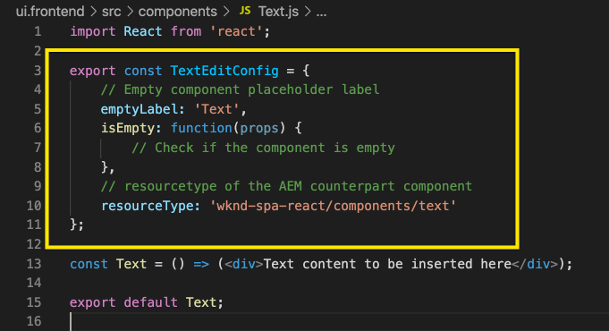
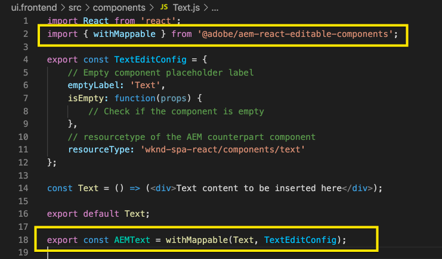
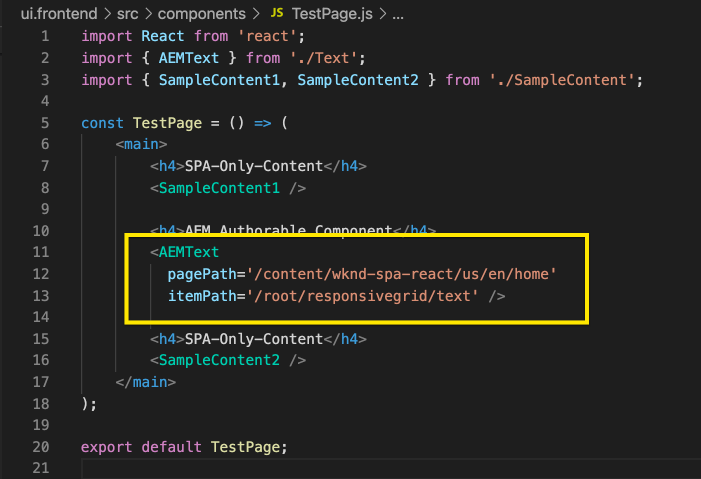
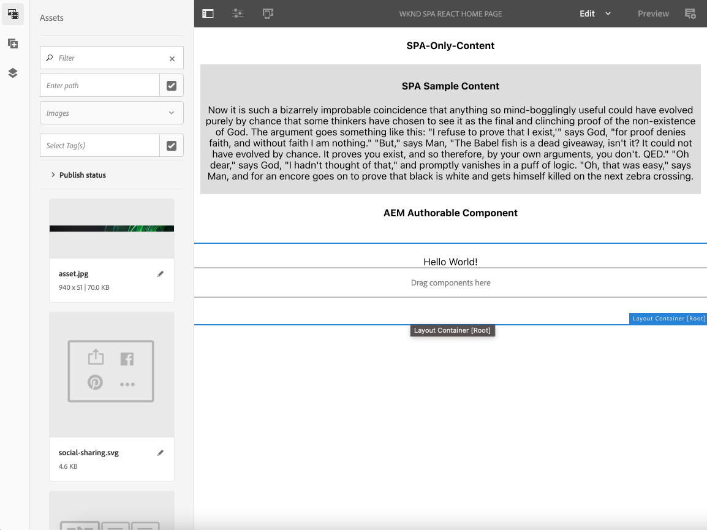
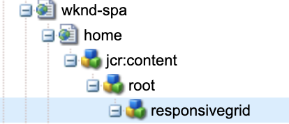
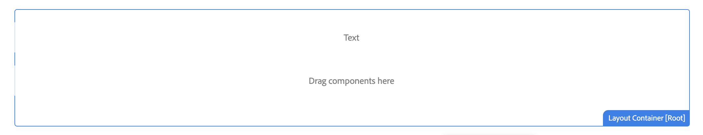
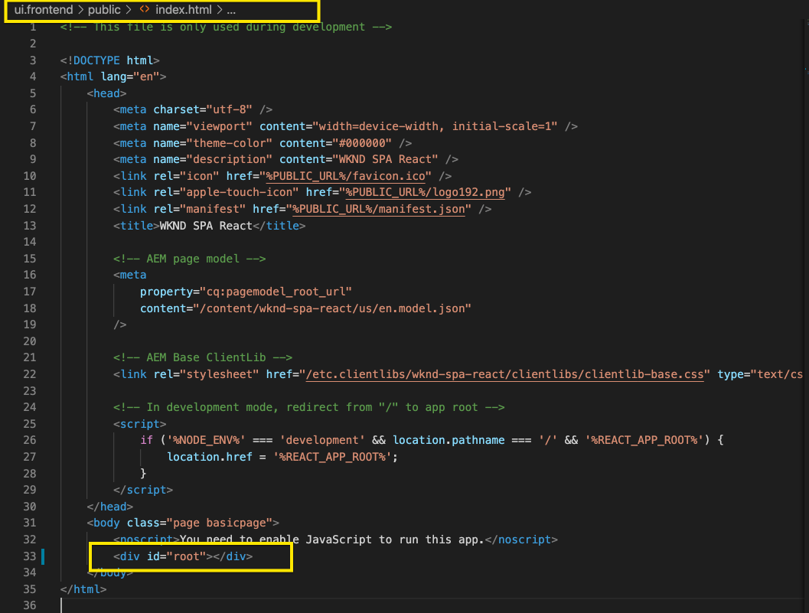
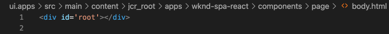

# Edición de un SPA externo dentro de AEM {#editing-external-spa-within-aem}

A la hora de decidir [qué nivel de integración](/help/implementing/developing/headful-headless.md) desea tener entre su SPA externo y AEM, tenga en cuenta que debe poder editar y ver el SPA dentro de AEM con frecuencia.

{{ue-over-spa}}

## Información general {#overview}

En este documento se describen los pasos recomendados para cargar un SPA independiente en una instancia de AEM, añadir secciones de contenido editables y habilitar la creación.

## Requisitos previos {#prerequisites}

Los requisitos previos son simples.

* Asegúrese de que una instancia de AEM se esté ejecutando localmente.
* Cree un proyecto base de la SPA de AEM con [el tipo de archivo del proyecto de AEM](https://experienceleague.adobe.com/docs/experience-manager-core-components/using/developing/archetype/overview.html?#available-properties).
   * Forms es la base del proyecto de AEM que se actualiza para incluir el SPA externo.
   * Para los ejemplos de este documento, Adobe está usando el punto de partida de [el proyecto WKND SPA](https://experienceleague.adobe.com/docs/experience-manager-learn/sites/spa-editor/spa-editor-framework-feature-video-use.html#spa-editor).
* Tenga a mano el SPA de React externo de trabajo que desea integrar.

## Cargar SPA en un proyecto de AEM {#upload-spa-to-aem-project}

En primer lugar, debe cargar el SPA externo en el proyecto de AEM.

1. Reemplace `src` en la carpeta del proyecto `/ui.frontend` con la carpeta `src` de su aplicación React.
1. Incluya dependencias adicionales en `package.json` de la aplicación en el archivo `/ui.frontend/package.json`.
   * Asegúrese de que las dependencias de SPA SDK sean de [versiones recomendadas](/help/implementing/developing/hybrid/getting-started-react.md#dependencies).
1. Incluya cualquier personalización en la carpeta `/public`.
1. Incluya cualquier script en línea o estilo agregado en el archivo `/public/index.html`.

## Configuración del SPA remoto {#configure-remote-spa}

Ahora que el SPA externo forma parte del proyecto de AEM, debe configurarse en AEM.

### Incluir paquetes de SDK de la SPA de Adobe {#include-spa-sdk-packages}

Para aprovechar las funciones de la SPA de AEM, existen dependencias en los tres paquetes siguientes.

* [`@adobe/aem-react-editable-components`](https://github.com/adobe/aem-react-editable-components)
* [`@adobe/aem-spa-component-mapping`](https://www.npmjs.com/package/@adobe/aem-spa-component-mapping)
* [`@adobe/aem-spa-page-model-manager`](https://www.npmjs.com/login?next=/package/@adobe/aem-spa-model-manager)

El paquete `@adobe/aem-spa-page-model-manager` proporciona la API para inicializar un administrador de modelos y recuperar el modelo de la instancia de AEM. Este modelo se puede usar para procesar componentes de AEM mediante las API de `@adobe/aem-react-editable-components` y `@adobe/aem-spa-component-mapping`.

#### Instalación {#installation}

Ejecute el siguiente comando `npm` para poder instalar los paquetes necesarios.

```shell
npm install --save @adobe/aem-spa-component-mapping @adobe/aem-spa-page-model-manager @adobe/aem-react-editable-components
```

### Inicialización de ModelManager {#model-manager-initialization}

Antes de que la aplicación se procese, [`ModelManager`](/help/implementing/developing/hybrid/blueprint.md#pagemodelmanager) debe inicializarse para controlar la creación de AEM `ModelStore`.

Esta inicialización debe realizarse en el archivo `src/index.js` de la aplicación o dondequiera que se represente la raíz de la aplicación.

Para realizar esta inicialización, puede usar la API `initializationAsync` proporcionada por `ModelManager`.

La siguiente captura de pantalla muestra cómo habilitar la inicialización de `ModelManager` en una aplicación React simple. La única restricción es que se debe llamar a `initializationAsync` antes de `ReactDOM.render()`.


En este ejemplo, `ModelManager` se inicializa y se crea un `ModelStore` vacío.

`initializationAsync` puede aceptar opcionalmente un objeto `options` como parámetro:

* `path`: en la inicialización, el modelo de la ruta definida se recupera y se almacena en `ModelStore`. Esta ruta se puede usar para recuperar `rootModel` en la inicialización, si es necesario.
* `modelClient`: permite proporcionar un cliente personalizado responsable de recuperar el modelo.
* `model` - Un objeto `model` pasado como parámetro normalmente se rellena al usar SSR.

### Componentes de hoja con autorización de AEM {#authorable-leaf-components}

1. Crear/identificar un componente de AEM para el que se crea un componente React con autorización. En este ejemplo, se utiliza el componente de texto del proyecto WKND.

   

1. Cree un componente de texto React simple en la SPA. En este ejemplo, se creó un nuevo archivo `Text.js` con el siguiente contenido.

   

1. Cree un objeto de configuración para poder especificar los atributos necesarios para habilitar la edición en AEM.

   

   * `resourceType` es obligatorio para asignar el componente React al componente AEM y habilitar la edición al abrir en el editor de AEM.

1. Usar la función de contenedor `withMappable`.

   

   Esta función de contenedor asigna el componente React al AEM `resourceType` especificado en la configuración y habilita las capacidades de edición cuando se abre en el editor de AEM. Para los componentes independientes, también recupera el contenido del modelo para el nodo específico.

   >[!NOTE]
   >
   >En este ejemplo, hay versiones independientes del componente: componentes React ajustados y no ajustados a AEM. La versión ajustada debe utilizarse cuando se utilice explícitamente el componente. Cuando el componente forma parte de una página, puede seguir utilizando el componente predeterminado como se hace actualmente en el editor de SPA.

1. Procesar contenido en el componente.

   Las propiedades JCR del componente de texto aparecen de la siguiente manera en AEM.

   

   Estos valores se pasan como propiedades al componente React `AEMText` creado y se pueden usar para procesar el contenido.

   ```javascript
   import React from 'react';
   import { withMappable } from '@adobe/aem-react-editable-components';
   
   export const TextEditConfig = {
       // Empty component placeholder label
       emptyLabel:'Text', 
       isEmpty:function(props) {
          return !props || !props.text || props.text.trim().length < 1;
       },
       // resourcetype of the AEM counterpart component
       resourceType:'wknd-spa-react/components/text'
   };
   
   const Text = ({ text }) => (<div>{text}</div>);
   
   export default Text;
   
   export const AEMText = withMappable(Text, TextEditConfig);
   ```

   A continuación, se muestra cómo aparece el componente cuando se completan las configuraciones de AEM.

   ```javascript
   const Text = ({ cqPath, richText, text }) => {
      const richTextContent = () => (
         <div className="aem_text" id={cqPath.substr(cqPath.lastIndexOf('/') + 1)} data-rte-editelement dangerouslySetInnerHTML={{__html: text}}/>
      );
      return richText ? richTextContent() : (<div className="aem_text">{text}</div>);
   };
   ```

   >[!NOTE]
   >
   >En este ejemplo, se realizaron más personalizaciones en el componente representado para que coincida con el componente de texto existente. No está relacionado con la creación en AEM.

#### Agregar componentes con autorización a la página {#add-authorable-component-to-page}

Una vez creados los componentes React legibles, puede utilizarlos en toda la aplicación.

Veamos una página de ejemplo en la que debe agregar un texto del proyecto de SPA de WKND. Para este ejemplo, desea mostrar el texto &quot;Hello World!&quot; el `/content/wknd-spa-react/us/en/home.html`.

1. Determine la ruta del nodo que desea mostrar.

   * `pagePath`: página que contiene el nodo, en este ejemplo `/content/wknd-spa-react/us/en/home`
   * `itemPath`: ruta al nodo dentro de la página, en este ejemplo `root/responsivegrid/text`
      * Contiene los nombres de los elementos que contienen la página.

   

1. Añada un componente en la posición requerida en la página.

   

   El componente `AEMText` se puede agregar en la posición requerida dentro de la página con los valores `pagePath` y `itemPath` establecidos como propiedades. `pagePath` es una propiedad obligatoria.

#### Verificación de la edición del contenido de texto en AEM {#verify-text-edit}

Ahora pruebe el componente en la instancia de AEM en ejecución.

1. Ejecute el siguiente comando Maven desde el directorio `aem-guides-wknd-spa` para poder generar e implementar el proyecto en AEM.

```shell
mvn clean install -PautoInstallSinglePackage
```

1. En su instancia de AEM, vaya a `http://<host>:<port>/editor.html/content/wknd-spa-react/us/en/home.html`.


El componente `AEMText` ahora se puede autorizar en AEM.

### Páginas autorizadas por AEM {#aem-authorable-pages}

1. Identifique la página que desea añadir para la creación en la SPA. Este ejemplo utiliza `/content/wknd-spa-react/us/en/home.html`.
1. Cree un archivo (por ejemplo, `Page.js`) para el componente de página que se puede crear. use el componente Página que se proporciona en `@adobe/cq-react-editable-components`.
1. Repita el paso cuatro de la sección [Componentes de hoja legibles para AEM](#authorable-leaf-components). Usar la función de contenedor `withMappable` en el componente.
1. Como se hizo anteriormente, aplique `MapTo` a los tipos de recursos de AEM para todos los componentes secundarios dentro de la página.

   ```javascript
   import { Page, MapTo, withMappable } from '@adobe/aem-react-editable-components';
   import Text, { TextEditConfig } from './Text';
   
   export default withMappable(Page);
   
   MapTo('wknd-spa-react/components/text')(Text, TextEditConfig);
   ```

   >[!NOTE]
   >
   >En este ejemplo, se utiliza el componente de texto React sin ajustar en lugar del `AEMText` ajustado creado anteriormente. El motivo es que cuando el componente forma parte de una página o contenedor y no es independiente, el contenedor se encarga de asignar el componente de forma recursiva. Además, no es necesario habilitar las capacidades de creación y el envoltorio adicional para cada niño.

1. Para agregar una página con autorización en la SPA, siga los mismos pasos en la sección [Agregar componentes con autorización a la página](#add-authorable-component-to-page). Aquí puede omitir la propiedad `itemPath`.

#### Verificación del contenido de la página en AEM {#verify-page-content}

Para comprobar que la página se puede editar, siga los mismos pasos en la sección [Verificar la edición del contenido de texto en AEM](#verify-text-edit).



La página ahora se puede editar en AEM con un contenedor de diseño y un componente de texto secundario.

### Componentes de hoja virtual {#virtual-leaf-components}

En los ejemplos anteriores, ha añadido componentes a la SPA con contenido de AEM existente. Sin embargo, hay casos en los que el contenido aún no se ha creado en AEM, pero el autor del contenido debe añadirlo más tarde. Para dar cabida a este escenario, el desarrollador front-end puede añadir componentes en las ubicaciones adecuadas dentro de la SPA. Estos componentes muestran marcadores de posición cuando se abren en el editor de AEM. Una vez que el autor de contenido añade el contenido dentro de estos marcadores de posición, los nodos se crean en la estructura JCR y el contenido se mantiene. El componente creado permite el mismo conjunto de operaciones que los componentes de hoja independientes.

En este ejemplo, está reutilizando el componente `AEMText` creado anteriormente. Desea que se agregue texto nuevo debajo del componente de texto existente en la página principal de WKND. La adición de componentes es la misma que para los componentes normales de la hoja. Sin embargo, `itemPath` se puede actualizar a la ruta de acceso donde se debe agregar el nuevo componente.

Dado que el nuevo componente debe agregarse debajo del texto existente en `root/responsivegrid/text`, la nueva ruta es `root/responsivegrid/{itemName}`.

```html
<AEMText
 pagePath='/content/wknd-spa-react/us/en/home'
 itemPath='root/responsivegrid/text_20' />
```

El componente `TestPage` tiene el siguiente aspecto después de agregar el componente virtual.


>[!NOTE]
>
>Asegúrese de que el componente `AEMText` tenga su `resourceType` establecido en la configuración para que pueda habilitar esta característica.

Ahora puede implementar los cambios en AEM siguiendo los pasos de la sección [Verificar la edición del contenido de texto en AEM](#verify-text-edit). Se muestra un marcador de posición para el nodo `text_20` actualmente no existente.


Cuando el autor del contenido actualiza este componente, se crea un nuevo nodo `text_20` en `root/responsivegrid/text_20` en `/content/wknd-spa-react/us/en/home`.


#### Requisitos y limitaciones {#limitations}

Existen varios requisitos para agregar componentes de hoja virtual y algunas limitaciones.

* La propiedad `pagePath` es obligatoria para crear un componente virtual.
* El nodo de página proporcionado en la ruta de acceso de `pagePath` debe existir en el proyecto de AEM.
* El nombre del nodo que se va a crear debe proporcionarse en `itemPath`.
* El componente se puede crear en cualquier nivel.
   * Si proporciona un `itemPath='text_20'` en el ejemplo anterior, el nuevo nodo se crea directamente debajo de la página, es decir, `/content/wknd-spa-react/us/en/home/jcr:content/text_20`
* La ruta de acceso al nodo donde se crea un nuevo nodo debe ser válida cuando se proporcione a través de `itemPath`.
   * En este ejemplo, `root/responsivegrid` debe existir para que el nuevo nodo `text_20` pueda crearse allí.
* Solo se admite la creación de componentes de hoja. El contenedor y la página virtuales serán compatibles en versiones futuras.

### Contenedores virtuales {#virtual-containers}

Se admite la capacidad de agregar contenedores, incluso si el contenedor correspondiente aún no se ha creado en AEM. El concepto y enfoque es similar a [componentes de hoja virtual](#virtual-leaf-components).

El desarrollador front-end puede agregar los componentes de contenedor en ubicaciones adecuadas dentro de la SPA y estos componentes muestran marcadores de posición cuando se abren en el editor en AEM. A continuación, el autor puede agregar componentes y su contenido al contenedor que crea los nodos necesarios en la estructura JCR.

Por ejemplo, si existe un contenedor en `/root/responsivegrid` y el desarrollador desea agregar un contenedor secundario:


`newContainer` aún no existe en AEM.

Al editar la página que contiene este componente en AEM, se muestra un marcador de posición vacío para un contenedor al que el autor puede agregar contenido.




Una vez que el autor agrega un componente secundario al contenedor, el nuevo nodo contenedor se crea con el nombre correspondiente en la estructura JCR.




Ahora se pueden agregar más componentes y contenido al contenedor cuando el autor lo requiera y los cambios se mantengan.

#### Requisitos y limitaciones {#container-limitations}

Existen varios requisitos para agregar contenedores virtuales y algunas limitaciones.

* La directiva para determinar qué componentes se pueden agregar se hereda del contenedor principal.
* El elemento principal inmediato del contenedor que se va a crear debe existir en AEM.
   * Si el contenedor `root/responsivegrid` existe en el contenedor de AEM, se puede crear un nuevo contenedor proporcionando la ruta de acceso `root/responsivegrid/newContainer`.
   * Sin embargo `root/responsivegrid/newContainer/secondNewContainer` no es posible.
* Solo se puede crear un nuevo nivel de componente a la vez.

## Personalizaciones adicionales {#additional-customizations}

Si ha seguido los ejemplos anteriores, la SPA externa ahora se puede editar dentro de AEM. Sin embargo, hay aspectos adicionales de su SPA externo que puede personalizar aún más.

### ID del nodo raíz {#root-node-id}

De forma predeterminada, puede suponer que la aplicación React se procesa dentro de un `div` del id. de elemento `spa-root`. Si es necesario, esta sintaxis se puede personalizar.

Por ejemplo, suponga que tiene un SPA en el que la aplicación se procesa dentro de un `div` del id. de elemento `root`. Esta sintaxis debe reflejarse en tres archivos.

1. En `index.js` de la aplicación React (o donde se llama a `ReactDOM.render()`)

   

1. En `index.html` de la aplicación React

   

1. En el cuerpo del componente de página de la aplicación AEM, siga dos pasos:

   1. Cree un(a) `body.html` para el componente de página.

   

   1. Agregue el elemento raíz en el nuevo archivo `body.html`.

   

### Edición de un SPA de React con enrutamiento {#editing-react-spa-with-routing}

Si la aplicación de la SPA de React externa tiene varias páginas, [puede utilizar el enrutamiento para determinar la página o el componente que se procesará](/help/implementing/developing/hybrid/routing.md). El caso de uso básico es hacer coincidir la dirección URL activa con la ruta proporcionada para una ruta. Para habilitar la edición en estas aplicaciones habilitadas para enrutamiento, la ruta con la que se debe hacer coincidir debe transformarse para dar cabida a información específica de AEM.

En el ejemplo siguiente, tiene una aplicación React simple con dos páginas. La página que se va a procesar se determina comparando la ruta proporcionada al enrutador con la dirección URL activa. Por ejemplo, si está en `mydomain.com/test`, se procesará `TestPage`.


Para habilitar la edición dentro de AEM para este SPA de ejemplo, se requieren los siguientes pasos.

1. Identifique el nivel que actuaría como raíz en AEM.

   * Para su muestra, considere wknd-spa-react/us/en como la raíz del SPA. Esta raíz significa que todo lo que hay antes de esa ruta son solo páginas o contenido de AEM.

1. Cree una página en el nivel requerido.

   * En este ejemplo, la página que se va a editar es `mydomain.com/test`. `test` se encuentra en la ruta raíz de la aplicación. Esta ruta raíz también debe conservarse al crear la página en AEM. Por lo tanto, puede crear una página en el nivel raíz definido en el paso anterior.
   * La nueva página creada debe tener el mismo nombre que la página que se va a editar. En este ejemplo, para `mydomain.com/test`, la nueva página creada debe ser `/path/to/aem/root/test`.

1. Añadir ayudantes dentro del enrutamiento SPA.

   * La página creada aún no puede procesar el contenido esperado en AEM. El motivo es que el enrutador espera una ruta de acceso de `/test` mientras que la ruta de acceso activa de AEM es `/wknd-spa-react/us/en/test`. Para dar cabida a la parte de la URL específica de AEM, debe agregar algunos ayudantes en el lado de la SPA.

   

   * Se puede usar el `toAEMPath` Helper proporcionado por `@adobe/cq-spa-page-model-manager`. Transforma la ruta proporcionada para el enrutamiento de modo que incluya partes específicas de AEM cuando la aplicación está abierta en una instancia de AEM. Acepta tres parámetros:
      * La ruta necesaria para el enrutamiento
      * URL de origen de la instancia de AEM donde se edita la SPA
      * La raíz del proyecto en AEM tal como se determinó en el primer paso

   * Estos valores se pueden configurar como variables de entorno para una mayor flexibilidad.

1. Compruebe la edición de la página en AEM.

   * Implemente el proyecto en AEM y navegue hasta la página `test` creada. El contenido de la página ahora se procesa y los componentes de AEM se pueden editar.

## Limitaciones del marco {#framework-limitations}

El componente RemotePage espera que la implementación proporcione un manifiesto de recurso como [webpack-manifest-plugin en GitHub](https://github.com/shellscape/webpack-manifest-plugin). Sin embargo, el componente RemotePage solo se ha probado para que funcione con el marco de React (y Next.js a través del componente remote-page-next) y, por lo tanto, no admite la carga remota de aplicaciones desde otros marcos, como Angular.

## Recursos adicionales {#additional-resources}

El siguiente material de referencia puede resultar útil para comprender las SPA en el contexto de AEM.

* [Modelos con y sin encabezado en AEM](/help/implementing/developing/headful-headless.md)
* [El arquetipo del proyecto AEM](https://experienceleague.adobe.com/docs/experience-manager-core-components/using/developing/archetype/overview.html?lang=es)
* [El proyecto de SPA WKND](https://experienceleague.adobe.com/docs/experience-manager-learn/sites/spa-editor/spa-editor-framework-feature-video-use.html?lang=es)
* [Introducción a SPA en AEM con React](/help/implementing/developing/hybrid/getting-started-react.md)
* [Materiales de referencia de SPA (referencias de API)](/help/implementing/developing/hybrid/reference-materials.md)
* [Modelo SPA y PageModelManager](/help/implementing/developing/hybrid/blueprint.md#pagemodelmanager)
* [Enrutamiento de modelos de SPA](/help/implementing/developing/hybrid/routing.md)
