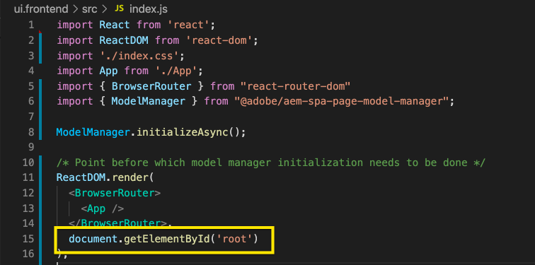

# Edición de un SPA externo dentro de AEM {#editing-external-spa-within-aem}

Al decidir [qué nivel de integración](/help/implementing/developing/headful-headless.md) SPA AEM SPA AEM Si desea tener entre su externo y el de la aplicación, con frecuencia necesita poder editar y ver el contenido de la aplicación en su propio.

## Información general {#overview}

SPA AEM En este documento se describen los pasos recomendados para cargar una instancia independiente a una instancia de, agregar secciones de contenido editables y habilitar la creación de contenido.

## Requisitos previos {#prerequisites}

Los requisitos previos son simples.

* AEM Asegúrese de que una instancia de se está ejecutando localmente.
* AEM SPA Creación de un proyecto de base mediante [AEM El arquetipo del proyecto de la.](https://experienceleague.adobe.com/docs/experience-manager-core-components/using/developing/archetype/overview.html?#available-properties)
   * Forms AEM SPA es la base del proyecto de, que se actualiza para incluir la dirección de correo electrónico externa
   * Para los ejemplos de este documento, se utiliza el punto de partida de [SPA el proyecto de WKND.](https://experienceleague.adobe.com/docs/experience-manager-learn/sites/spa-editor/spa-editor-framework-feature-video-use.html#spa-editor)
* SPA Tenga a mano el React externo de trabajo que desea integrar.

## SPA AEM Cargar el a un proyecto de {#upload-spa-to-aem-project}

SPA AEM En primer lugar, debe cargar el recurso externo de la en el proyecto de la aplicación.

1. Reemplazar `src` en el `/ui.frontend` carpeta del proyecto con la aplicación de React `src` carpeta.
1. Incluya cualquier dependencia adicional en el `package.json` en el `/ui.frontend/package.json` archivo.
   * SPA Asegúrese de que las dependencias del SDK de la sean de [versiones recomendadas.](/help/implementing/developing/hybrid/getting-started-react.md#dependencies)
1. Incluya cualquier personalización en la `/public` carpeta.
1. Incluya cualquier script en línea o estilo agregado en la `/public/index.html` archivo.

## SPA Configuración del servidor remoto {#configure-remote-spa}

SPA AEM AEM Ahora que la externa forma parte del proyecto de la, debe configurarse en la interfaz de usuario de la interfaz de usuario de la interfaz de usuario de.

### Incluir paquetes de SDK de Adobe SPA {#include-spa-sdk-packages}

AEM SPA Para aprovechar las características de la, existen dependencias en los tres paquetes siguientes.

* [`@adobe/aem-react-editable-components`](https://github.com/adobe/aem-react-editable-components)
* [`@adobe/aem-spa-component-mapping`](https://www.npmjs.com/package/@adobe/aem-spa-component-mapping)
* [`@adobe/aem-spa-page-model-manager`](https://www.npmjs.com/package/@adobe/aem-spa-model-manager)

`@adobe/aem-spa-page-model-manager` AEM proporciona la API para inicializar un Administrador de modelos y recuperar el modelo de la instancia de la instancia de la. AEM Este modelo se puede utilizar para procesar componentes de mediante API de `@adobe/aem-react-editable-components` y `@adobe/aem-spa-component-mapping`.

#### Instalación {#installation}

Ejecute el siguiente comando npm para instalar los paquetes necesarios.

```shell
npm install --save @adobe/aem-spa-component-mapping @adobe/aem-spa-page-model-manager @adobe/aem-react-editable-components
```

### Inicialización de ModelManager {#model-manager-initialization}

Antes de que la aplicación se procese, la variable [`ModelManager`](/help/implementing/developing/hybrid/blueprint.md#pagemodelmanager) AEM debe inicializarse para gestionar la creación de la `ModelStore`.

Esto debe hacerse dentro de la `src/index.js` de la aplicación o dondequiera que se represente la raíz de la aplicación.

Para ello, podemos utilizar `initializationAsync` API proporcionada por el `ModelManager`.

La siguiente captura de pantalla muestra cómo habilitar la inicialización de `ModelManager` en una aplicación React simple. La única restricción es que `initializationAsync` debe llamarse antes de `ReactDOM.render()`.


En este ejemplo, la variable `ModelManager` se ha inicializado y un espacio de `ModelStore` se ha creado.

`initializationAsync` puede aceptar opcionalmente un `options` objeto como parámetro:

* `path` : En la inicialización, el modelo en la ruta definida se recupera y se almacena en el `ModelStore`. Se puede usar para recuperar la variable `rootModel` en la inicialización si es necesario.
* `modelClient` : Permite proporcionar un cliente personalizado responsable de recuperar el modelo.
* `model` - A `model` El objeto pasado como parámetro generalmente se rellena cuando [uso de SSR.](/help/implementing/developing/hybrid/ssr.md)

### AEM Componentes de hoja autorizables {#authorable-leaf-components}

1. AEM Cree/identifique un componente de para el que se cree un componente React con autoridad. En este ejemplo, se utiliza el componente de texto del proyecto WKND.

   

1. SPA Cree un componente de texto React simple en la interfaz de usuario de. En este ejemplo, un nuevo archivo `Text.js` se ha creado con el siguiente contenido.

   

1. AEM Cree un objeto de configuración para especificar los atributos necesarios para habilitar la edición de la.

   

   * `resourceType` AEM AEM es obligatorio asignar el componente React al componente de la y habilitar la edición al abrirlo en el editor de.

1. Uso de la función envolvente `withMappable`.

   

   AEM Esta función de envoltorio asigna el componente React a la aplicación de la `resourceType` AEM se especifica en la configuración y habilita las funciones de edición cuando se abre en el editor de. Para los componentes independientes, también recupera el contenido del modelo para el nodo específico.

   >[!NOTE]
   >
   >AEM En este ejemplo, hay versiones independientes del componente: componentes React ajustados y no ajustados a la. La versión ajustada debe utilizarse cuando se utiliza explícitamente el componente. SPA Cuando el componente forma parte de una página, puede seguir utilizando el componente predeterminado como se hace actualmente en el editor de páginas de la página de la aplicación de la página de la aplicación de la aplicación de la aplicación de la aplicación de configuración de la aplicación de configuración de la página.

1. Procesar contenido en el componente.

   AEM Las propiedades JCR del componente de texto aparecen de la siguiente manera en la.

   

   Estos valores se pasan como propiedades al recién creado `AEMText` React y se puede utilizar para procesar el contenido.

   ```javascript
   import React from 'react';
   import { withMappable } from '@adobe/aem-react-editable-components';
   
   export const TextEditConfig = {
       // Empty component placeholder label
       emptyLabel:'Text', 
       isEmpty:function(props) {
          return !props || !props.text || props.text.trim().length < 1;
       },
       // resourcetype of the AEM counterpart component
       resourceType:'wknd-spa-react/components/text'
   };
   
   const Text = ({ text }) => (<div>{text}</div>);
   
   export default Text;
   
   export const AEMText = withMappable(Text, TextEditConfig);
   ```

   AEM Así es como aparecerá el componente cuando se completen las configuraciones de la.

   ```javascript
   const Text = ({ cqPath, richText, text }) => {
      const richTextContent = () => (
         <div className="aem_text" id={cqPath.substr(cqPath.lastIndexOf('/') + 1)} data-rte-editelement dangerouslySetInnerHTML={{__html: text}}/>
      );
      return richText ? richTextContent() : (<div className="aem_text">{text}</div>);
   };
   ```

   >[!NOTE]
   >
   >En este ejemplo, se han realizado más personalizaciones en el componente representado para que coincida con el componente de texto existente. AEM Sin embargo, esto no está relacionado con la creación de contenido en la.

#### Agregar componentes con autorización a la página {#add-authorable-component-to-page}

Una vez creados los componentes React legibles, podemos utilizarlos en toda la aplicación.

SPA Veamos una página de ejemplo en la que necesitamos agregar un texto del proyecto de WKND de la. Para este ejemplo, deseamos mostrar el texto &quot;Hello World!&quot; el `/content/wknd-spa-react/us/en/home.html`.

1. Determine la ruta del nodo que desea mostrar.

   * `pagePath`: La página que contiene el nodo, en nuestro ejemplo `/content/wknd-spa-react/us/en/home`
   * `itemPath`: Ruta al nodo dentro de la página, en nuestro ejemplo `root/responsivegrid/text`
      * Consta de los nombres de los elementos que contienen la página.

   

1. Añada un componente en la posición requerida en la página.

   

   El `AEMText` componente se puede añadir en la posición requerida dentro de la página con `pagePath` y `itemPath` valores establecidos como propiedades. `pagePath` es una propiedad obligatoria.

#### AEM Verificar la edición del contenido del texto en las {#verify-text-edit}

AEM Ahora podemos probar el componente en nuestra instancia de ejecución de la.

1. Ejecute el siguiente comando Maven desde el `aem-guides-wknd-spa` AEM para generar e implementar el proyecto en el que se va a realizar el.

```shell
mvn clean install -PautoInstallSinglePackage
```

1. AEM En la instancia de la, navegue hasta `http://<host>:<port>/editor.html/content/wknd-spa-react/us/en/home.html`.


El `AEMText` AEM El componente ahora se puede crear en el.

### AEM Páginas con autorización de {#aem-authorable-pages}

1. SPA Identifique la página que desea añadir para la creación en el sitio de trabajo de. Este ejemplo utiliza `/content/wknd-spa-react/us/en/home.html`.
1. Cree un nuevo archivo (por ejemplo, `Page.js`) para el componente de página legible. Aquí, podemos reutilizar el componente Página que se proporciona en `@adobe/cq-react-editable-components`.
1. Repita el cuarto paso de la sección [AEM componentes de hoja legibles por el autor.](#authorable-leaf-components) Uso de la función envolvente `withMappable` en el componente.
1. Como se hizo anteriormente, aplique `MapTo` AEM a los tipos de recurso de la para todos los componentes secundarios dentro de la página.

   ```javascript
   import { Page, MapTo, withMappable } from '@adobe/aem-react-editable-components';
   import Text, { TextEditConfig } from './Text';
   
   export default withMappable(Page);
   
   MapTo('wknd-spa-react/components/text')(Text, TextEditConfig);
   ```

   >[!NOTE]
   >
   >En este ejemplo se utiliza el componente de texto React sin ajustar en lugar del ajustado `AEMText` creado anteriormente. Esto se debe a que cuando el componente forma parte de una página o contenedor y no es independiente, el contenedor se encargará de asignar de forma recursiva el componente y de habilitar las capacidades de creación, y no se necesita el contenedor adicional para cada elemento secundario.

1. SPA Para añadir una página legible en la, siga los mismos pasos en la sección [Agregar componentes con autorización a la página.](#add-authorable-component-to-page) Aquí podemos omitir el `itemPath` propiedad, sin embargo.

#### AEM Verificar el contenido de la página en la {#verify-page-content}

Para comprobar que la página se puede editar, siga los mismos pasos en la sección [AEM Verifique la edición del contenido de texto en la.](#verify-text-edit)


AEM La página ahora se puede editar en el diseño con un contenedor de diseño y un componente de texto secundario.

### Componentes de hoja virtual {#virtual-leaf-components}

SPA AEM En los ejemplos anteriores, hemos añadido componentes a la lista de componentes con contenido de existente. AEM Sin embargo, hay casos en los que el contenido aún no se ha creado en la, pero el autor del contenido debe añadirlo más tarde. SPA Para dar cabida a esto, el desarrollador front-end puede agregar componentes en las ubicaciones adecuadas dentro de la interfaz de usuario de la aplicación de. AEM Estos componentes mostrarán los marcadores de posición cuando se abran en el editor en el que se encuentran los. Una vez que el autor de contenido agrega el contenido dentro de estos marcadores de posición, los nodos se crean en la estructura JCR y el contenido se mantiene. El componente creado permitirá el mismo conjunto de operaciones que los componentes de hoja independientes.

En este ejemplo, reutilizamos la variable `AEMText` componente creado anteriormente. Queremos que se añada texto nuevo debajo del componente de texto existente en la página principal de WKND. La adición de componentes es la misma que para los componentes normales de la hoja. Sin embargo, la variable `itemPath` se puede actualizar a la ruta en la que debe agregarse el nuevo componente.

Dado que es necesario añadir el nuevo componente debajo del texto existente en `root/responsivegrid/text`, la nueva ruta sería `root/responsivegrid/{itemName}`.

```html
<AEMText
 pagePath='/content/wknd-spa-react/us/en/home'
 itemPath='root/responsivegrid/text_20' />
```

El `TestPage` tiene el siguiente aspecto después de agregar el componente virtual.


>[!NOTE]
>
>Asegúrese de que `AEMText` el componente tiene su `resourceType` establezca en la configuración para habilitar esta función.

AEM Ahora puede implementar los cambios para que siga los pasos de la sección que se describen a continuación: [AEM Verifique la edición del contenido de texto en la.](#verify-text-edit) Se muestra un marcador de posición para el actualmente no existente `text_20` nodo.


Cuando el autor del contenido actualice este componente, se agregará un nuevo `text_20` El nodo se crea en `root/responsivegrid/text_20` in `/content/wknd-spa-react/us/en/home`.


#### Requisitos y limitaciones {#limitations}

Existen una serie de requisitos para agregar componentes de hoja virtual, así como algunas limitaciones.

* El `pagePath` La propiedad es obligatoria para crear un componente virtual.
* El nodo de página proporcionado en la ruta de `pagePath` AEM debe existir en el proyecto de.
* El nombre del nodo que se va a crear debe proporcionarse en la variable `itemPath`.
* El componente se puede crear en cualquier nivel.
   * Si proporcionamos un `itemPath='text_20'` en el ejemplo anterior, el nuevo nodo se crea directamente debajo de la página, es decir:. `/content/wknd-spa-react/us/en/home/jcr:content/text_20`
* La ruta al nodo en el que se crea un nuevo nodo debe ser válida cuando se proporciona mediante `itemPath`.
   * En este ejemplo, `root/responsivegrid` debe existir para que el nuevo nodo `text_20` se puede crear allí.
* Solo se admite la creación de componentes de hoja. El contenedor y la página virtuales serán compatibles en versiones futuras.

### Contenedores virtuales {#virtual-containers}

AEM Se admite la capacidad de agregar contenedores, incluso si el contenedor correspondiente aún no se ha creado en el espacio de trabajo de la interfaz de usuario de la aplicación de datos de. El concepto y el enfoque son similares a [componentes de hoja virtual.](#virtual-leaf-components)

SPA AEM El desarrollador front-end puede agregar los componentes de contenedor en ubicaciones adecuadas dentro de la y estos componentes mostrarán marcadores de posición cuando se abran en el editor en la. A continuación, el autor puede agregar componentes y su contenido al contenedor, que creará los nodos necesarios en la estructura JCR.

Por ejemplo, si ya existe un contenedor en `/root/responsivegrid` y el desarrollador desea agregar un nuevo contenedor secundario:


`newContainer` AEM aún no existe en el.

AEM Al editar la página que contiene este componente en la página de, se muestra un marcador de posición vacío para un contenedor en el que el autor puede agregar contenido.


Una vez que el autor agrega un componente secundario al contenedor, el nuevo nodo contenedor se crea con el nombre correspondiente en la estructura JCR.


Ahora se pueden agregar más componentes y contenido al contenedor cuando el autor lo requiera y los cambios se mantengan.

#### Requisitos y limitaciones {#container-limitations}

Existen varios requisitos para agregar contenedores virtuales, así como algunas limitaciones.

* La directiva para determinar qué componentes se pueden agregar se hereda del contenedor principal.
* AEM El elemento principal inmediato del contenedor que se va a crear ya debe existir en el espacio de trabajo de la.
   * Si el contenedor `root/responsivegrid` AEM ya existe en el contenedor de, se puede crear un nuevo contenedor proporcionando la ruta `root/responsivegrid/newContainer`.
   * Sin embargo `root/responsivegrid/newContainer/secondNewContainer` no es posible.
* Solo se puede crear virtualmente un nuevo nivel de componente a la vez.

## Personalizaciones adicionales {#additional-customizations}

SPA AEM Si ha seguido los ejemplos anteriores, el recurso externo ahora se puede editar en la. SPA Sin embargo, hay aspectos adicionales de los recursos externos que se pueden personalizar aún más.

### ID del nodo raíz {#root-node-id}

De forma predeterminada, suponemos que la aplicación React se procesa dentro de un `div` de ID de elemento `spa-root`. Si es necesario, se puede personalizar.

SPA Por ejemplo, supongamos que tenemos un en el que la aplicación se procesa dentro de un `div` de ID de elemento `root`. Esto debe reflejarse en tres archivos.

1. En el `index.js` de la aplicación React (o donde `ReactDOM.render()` se llama)

   

1. En el `index.html` de la aplicación React

   

1. AEM En el cuerpo del componente de página de la aplicación de, siga dos pasos:

   1. Crear un nuevo `body.html` para el componente de página.

   

   1. Añadir el nuevo elemento raíz en el nuevo `body.html` archivo.

   

### SPA Edición de un React con Enrutamiento {#editing-react-spa-with-routing}

SPA Si la aplicación de React externa tiene varias páginas, [puede utilizar el enrutamiento para determinar la página o el componente que se va a procesar.](/help/implementing/developing/hybrid/routing.md) El caso de uso básico es hacer coincidir la dirección URL activa con la ruta proporcionada para una ruta. AEM Para habilitar la edición en estas aplicaciones habilitadas para enrutamiento, la ruta con la que se debe hacer coincidir debe transformarse para dar cabida a información específica de la aplicación de enrutamiento de tipo de datos.

En el siguiente ejemplo tenemos una aplicación React simple con dos páginas. La página que se va a procesar se determina comparando la ruta proporcionada al enrutador con la dirección URL activa. Por ejemplo, si estamos en `mydomain.com/test`, `TestPage` se procesa.


AEM SPA Para habilitar la edición dentro de los parámetros para este ejemplo, se requieren los siguientes pasos.

1. AEM Identifique el nivel que actuaría como raíz en la.

   * SPA Para nuestra muestra, estamos considerando wknd-spa-react/us/en como la raíz de la. AEM Esto significa que todo lo anterior a esa ruta solo es contenido o páginas de la lista de contenido de la lista de distribución de contenido/página.

1. Cree una nueva página en el nivel requerido.

   * En este ejemplo, la página que se va a editar es `mydomain.com/test`. `test` se encuentra en la ruta raíz de la aplicación. AEM Esto también debe conservarse al crear la página en la. Por lo tanto, podemos crear una nueva página en el nivel raíz definido en el paso anterior.
   * La nueva página creada debe tener el mismo nombre que la página que se va a editar. En este ejemplo para `mydomain.com/test`, la nueva página creada debe ser `/path/to/aem/root/test`.

1. SPA Agregar ayudantes dentro del enrutamiento de la.

   * AEM La página recién creada aún no procesará el contenido esperado en la creación de segmentos de la página de la página de la página de la página de la página de la página de la página de la página de. Esto se debe a que el enrutador espera una ruta de `/test` AEM mientras que la ruta activa de la es `/wknd-spa-react/us/en/test`. AEM SPA Para dar cabida a la parte específica de la dirección URL que corresponde a la dirección URL, es necesario agregar algunos ayudantes en el lado de la dirección de correo electrónico

   

   * El `toAEMPath` ayudante proporcionado por `@adobe/cq-spa-page-model-manager` se puede usar para esto. AEM AEM Transforma la ruta proporcionada para el enrutamiento a fin de incluir partes específicas de la cuando la aplicación está abierta en una instancia de la aplicación Acepta tres parámetros:
      * La ruta necesaria para el enrutamiento
      * AEM SPA Dirección URL de origen de la instancia de la en la que se edita la
      * AEM La raíz del proyecto en el tiempo de ejecución, tal como se determina en el primer paso, es la siguiente:

   * Estos valores se pueden configurar como variables de entorno para una mayor flexibilidad.

1. AEM Compruebe la edición de la página en la.

   * AEM Implemente el proyecto para que se ejecute y navegue hasta el proyecto recién creado. `test` página. AEM Ahora se procesa el contenido de la página y se pueden editar los componentes de la.

## Limitaciones del marco {#framework-limitations}

El componente RemotePage espera que la implementación proporcione un manifiesto de recurso como el siguiente [encontrado aquí.](https://github.com/shellscape/webpack-manifest-plugin) Sin embargo, el componente RemotePage solo se ha probado para que funcione con el marco de React (y Next.js a través del componente remote-page-next) y, por lo tanto, no admite la carga remota de aplicaciones desde otros marcos, como Angular.

## Recursos adicionales {#additional-resources}

SPA AEM El siguiente material de referencia puede resultar útil para comprender la existencia de la en el contexto de la misma.

* [Encabezado y sin encabezado en AEM](/help/implementing/developing/headful-headless.md)
* [AEM Arquetipo del proyecto de](https://experienceleague.adobe.com/docs/experience-manager-core-components/using/developing/archetype/overview.html?lang=es)
* [SPA El proyecto de WKND](https://experienceleague.adobe.com/docs/experience-manager-learn/sites/spa-editor/spa-editor-framework-feature-video-use.html?lang=es)
* [Introducción a SPA en AEM usando React](/help/implementing/developing/hybrid/getting-started-react.md)
* [SPA Materiales de referencia (referencias de API)](/help/implementing/developing/hybrid/reference-materials.md)
* [SPA Modelo de página y administrador de modelos de página](/help/implementing/developing/hybrid/blueprint.md#pagemodelmanager)
* [SPA Enrutamiento de modelo de](/help/implementing/developing/hybrid/routing.md)
* [SPA Procesamiento del lado del servidor y de](/help/implementing/developing/hybrid/ssr.md)
