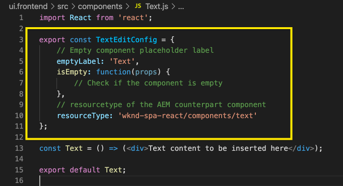

# Edición de un SPA externo dentro de AEM {#editing-external-spa-within-aem}

Al decidir [qué nivel de integración](/help/implementing/developing/headful-headless.md) le gustaría tener entre el SPA externo y el AEM, a menudo necesita poder editar y ver el SPA dentro de AEM.

## Información general {#overview}

En este documento se describen los pasos recomendados para cargar un SPA independiente en una instancia de AEM, agregar secciones de contenido editables y habilitar la creación.

## Requisitos previos {#prerequisites}

Los requisitos previos son sencillos.

* Asegúrese de que una instancia de AEM se esté ejecutando localmente.
* Cree un proyecto de AEM base SPA usando [el tipo de archivo del proyecto de AEM.](https://experienceleague.adobe.com/docs/experience-manager-core-components/using/developing/archetype/overview.html?#available-properties)
   * Esto formará la base del proyecto AEM que se actualizará para incluir el SPA externo.
   * Para los ejemplos de este documento, se utiliza el punto de partida de [el proyecto WKND SPA.](https://experienceleague.adobe.com/docs/experience-manager-learn/sites/spa-editor/spa-editor-framework-feature-video-use.html#spa-editor)
* Tenga a mano el SPA React externo que desea integrar.

## Cargar SPA a AEM proyecto {#upload-spa-to-aem-project}

En primer lugar, debe cargar la SPA externa en el proyecto de AEM.

1. Reemplazar `src` en el `/ui.frontend` carpeta del proyecto con la aplicación React `src` carpeta.
1. Incluya dependencias adicionales en el informe `package.json` en el `/ui.frontend/package.json` archivo.
   * Asegúrese de que las dependencias SPA SDK sean de [versiones recomendadas.](/help/implementing/developing/hybrid/getting-started-react.md#dependencies)
1. Incluya cualquier personalización en la variable `/public` carpeta.
1. Incluya cualquier script o estilo en línea que se agregue al `/public/index.html` archivo.

## Configuración del SPA remoto {#configure-remote-spa}

Ahora que la SPA externa forma parte del proyecto de AEM, debe configurarse dentro de AEM.

### Incluir paquetes de SDK SPA Adobe {#include-spa-sdk-packages}

Para aprovechar AEM funciones de SPA, hay dependencias en los tres paquetes siguientes.

* [`@adobe/aem-react-editable-components`](https://github.com/adobe/aem-react-editable-components)
* [`@adobe/aem-spa-component-mapping`](https://www.npmjs.com/package/@adobe/aem-spa-component-mapping)
* [`@adobe/aem-spa-page-model-manager`](https://www.npmjs.com/package/@adobe/aem-spa-model-manager)

`@adobe/aem-spa-page-model-manager` proporciona la API para inicializar un Administrador de modelos y recuperar el modelo de la instancia de AEM. Este modelo se puede utilizar para procesar componentes AEM mediante API de `@adobe/aem-react-editable-components` y `@adobe/aem-spa-component-mapping`.

#### Instalación {#installation}

Ejecute el siguiente comando npm para instalar los paquetes necesarios.

```shell
npm install --save @adobe/aem-spa-component-mapping @adobe/aem-spa-page-model-manager @adobe/aem-react-editable-components
```

### Inicialización de ModelManager {#model-manager-initialization}

Antes de que la aplicación se procese, la variable [`ModelManager`](/help/implementing/developing/hybrid/blueprint.md#pagemodelmanager) debe inicializarse para gestionar la creación de la AEM `ModelStore`.

Esto debe hacerse dentro del `src/index.js` del archivo de la aplicación o donde se represente la raíz de la aplicación.

Para esto, podemos usar `initializationAsync` API proporcionada por el `ModelManager`.

La siguiente captura de pantalla muestra cómo habilitar la inicialización de la variable `ModelManager` en una aplicación React simple. La única restricción es que `initializationAsync` debe llamarse antes de `ReactDOM.render()`.


En este ejemplo, la variable `ModelManager` se inicializa y está vacío `ModelStore` se crea.

`initializationAsync` opcionalmente, puede aceptar un `options` como parámetro:

* `path` - En la inicialización, se busca el modelo en la ruta definida y se almacena en la `ModelStore`. Esto se puede usar para recuperar la variable `rootModel` en la inicialización si es necesario.
* `modelClient` - Permite proporcionar un cliente personalizado responsable de recuperar el modelo.
* `model` - A `model` objeto pasado como parámetro normalmente se rellena cuando [uso de SSR.](/help/implementing/developing/hybrid/ssr.md)

### Componentes de hoja AEM autorizados {#authorable-leaf-components}

1. Cree/identifique un componente AEM para el que se creará un componente React legible. En este ejemplo, se utiliza el componente de texto del proyecto WKND.

   

1. Cree un componente de texto React simple en el SPA. En este ejemplo, un nuevo archivo `Text.js` se ha creado con el siguiente contenido.

   

1. Cree un objeto de configuración para especificar los atributos necesarios para activar AEM edición.

   

   * `resourceType` es obligatorio para asignar el componente React al componente AEM y habilitar la edición al abrirlo en el editor de AEM.

1. Uso de la función wrapper `withMappable`.

   

   Esta función de ajuste asigna el componente React al AEM `resourceType` especificado en la configuración y activa las capacidades de edición al abrirse en el editor de AEM. Para los componentes independientes, también recuperará el contenido del modelo para el nodo específico.

   >[!NOTE]
   >
   >En este ejemplo hay versiones independientes del componente: AEM componentes React envueltos y sin ajustar. La versión ajustada debe utilizarse cuando se utiliza explícitamente el componente. Cuando el componente forma parte de una página, puede seguir utilizando el componente predeterminado tal como se hace actualmente en el editor de SPA.

1. Representar contenido en el componente.

   Las propiedades JCR del componente de texto aparecen de la siguiente manera en AEM.

   

   Estos valores se pasan como propiedades a la `AEMText` Reaccione el componente y se puede utilizar para procesar el contenido.

   ```javascript
   import React from 'react';
   import { withMappable } from '@adobe/aem-react-editable-components';
   
   export const TextEditConfig = {
       // Empty component placeholder label
       emptyLabel:'Text', 
       isEmpty:function(props) {
          return !props || !props.text || props.text.trim().length < 1;
       },
       // resourcetype of the AEM counterpart component
       resourceType:'wknd-spa-react/components/text'
   };
   
   const Text = ({ text }) => (<div>{text}</div>);
   
   export default Text;
   
   export const AEMText = withMappable(Text, TextEditConfig);
   ```

   Así es como aparecerá el componente cuando se hayan completado las configuraciones de AEM.

   ```javascript
   const Text = ({ cqPath, richText, text }) => {
      const richTextContent = () => (
         <div className="aem_text" id={cqPath.substr(cqPath.lastIndexOf('/') + 1)} data-rte-editelement dangerouslySetInnerHTML={{__html: text}}/>
      );
      return richText ? richTextContent() : (<div className="aem_text">{text}</div>);
   };
   ```

   >[!NOTE]
   >
   >En este ejemplo, se han realizado más personalizaciones en el componente procesado para que coincida con el componente de texto existente. Sin embargo, esto no está relacionado con la creación en AEM.

#### Agregar componentes autorizados a la página {#add-authorable-component-to-page}

Una vez creados los componentes React legibles, podemos utilizarlos en toda la aplicación.

Veamos una página de ejemplo en la que necesitamos agregar un texto del proyecto de SPA WKND. Para este ejemplo, queremos mostrar el texto &quot;Hello World!&quot; en `/content/wknd-spa-react/us/en/home.html`.

1. Determine la ruta del nodo que desea mostrar.

   * `pagePath`: La página que contiene el nodo, en nuestro ejemplo `/content/wknd-spa-react/us/en/home`
   * `itemPath`: Ruta al nodo dentro de la página, en nuestro ejemplo `root/responsivegrid/text`
      * Consiste en los nombres de los elementos que contienen en la página.

   

1. Añada el componente en la posición necesaria de la página.

   

   La variable `AEMText` el componente se puede añadir en la posición necesaria dentro de la página con `pagePath` y `itemPath` valores definidos como propiedades. `pagePath` es una propiedad obligatoria.

#### Verificar la edición del contenido de texto en AEM {#verify-text-edit}

Ahora podemos probar el componente en nuestra instancia de AEM en ejecución.

1. Ejecute el siguiente comando Maven desde el `aem-guides-wknd-spa` para crear e implementar el proyecto en AEM.

```shell
mvn clean install -PautoInstallSinglePackage
```

1. En la instancia de AEM, vaya a `http://<host>:<port>/editor.html/content/wknd-spa-react/us/en/home.html`.


La variable `AEMText` ahora se puede autorizar en AEM.

### AEM páginas autorizadas {#aem-authorable-pages}

1. Identifique la página que se agregará para la creación en el SPA. Este ejemplo utiliza `/content/wknd-spa-react/us/en/home.html`.
1. Crear un nuevo archivo (por ejemplo, `Page.js`) para el componente de página legible. Aquí, podemos reutilizar el componente de página que se proporciona en `@adobe/cq-react-editable-components`.
1. Repita el paso cuatro de la sección [AEM componentes de hoja legibles.](#authorable-leaf-components) Uso de la función wrapper `withMappable` en el componente.
1. Como se hizo anteriormente, aplique `MapTo` a los tipos de recurso AEM para todos los componentes secundarios de la página.

   ```javascript
   import { Page, MapTo, withMappable } from '@adobe/aem-react-editable-components';
   import Text, { TextEditConfig } from './Text';
   
   export default withMappable(Page);
   
   MapTo('wknd-spa-react/components/text')(Text, TextEditConfig);
   ```

   >[!NOTE]
   >
   >En este ejemplo utilizamos el componente de texto React sin ajustar en lugar de la envolvente `AEMText` creado anteriormente. Esto se debe a que, cuando el componente forma parte de una página o contenedor y no es independiente, el contenedor se encargará de asignar el componente de forma recursiva y de activar las capacidades de creación, y no se necesitará el envoltorio adicional para cada elemento secundario.

1. Para agregar una página de creación en la SPA, siga los mismos pasos en la sección [Agregar componentes autorizados a la página.](#add-authorable-component-to-page) Aquí podemos omitir el `itemPath` sin embargo.

#### Comprobar el contenido de la página en AEM {#verify-page-content}

Para verificar que la página se puede editar, siga los mismos pasos en la sección [Verificar edición del contenido de texto en AEM.](#verify-text-edit)


La página ahora se puede editar en AEM con un contenedor de diseño y un componente de texto secundario.

### Componentes de hoja virtual {#virtual-leaf-components}

En los ejemplos anteriores, hemos agregado componentes a la SPA con contenido de AEM existente. Sin embargo, hay casos en los que el contenido aún no se ha creado en AEM, pero el autor del contenido debe añadirlo más adelante. Para dar cabida a esto, el desarrollador del front-end puede agregar componentes en las ubicaciones adecuadas dentro del SPA. Estos componentes mostrarán marcadores de posición cuando se abran en el editor de AEM. Una vez que el autor de contenido añade el contenido dentro de estos marcadores de posición, los nodos se crean en la estructura JCR y el contenido se mantiene. El componente creado permitirá el mismo conjunto de operaciones que los componentes independientes de hoja.

En este ejemplo, reutilizamos la variable `AEMText` componente creado anteriormente. Queremos que el texto nuevo se añada debajo del componente de texto existente en la página de inicio de WKND. La adición de componentes es la misma que para los componentes normales de hoja. Sin embargo, la variable `itemPath` se puede actualizar a la ruta en la que se debe añadir el nuevo componente.

Dado que el nuevo componente debe añadirse debajo del texto existente en `root/responsivegrid/text`, la nueva ruta sería `root/responsivegrid/{itemName}`.

```html
<AEMText
 pagePath='/content/wknd-spa-react/us/en/home'
 itemPath='root/responsivegrid/text_20' />
```

La variable `TestPage` tiene el aspecto siguiente después de añadir el componente virtual.


>[!NOTE]
>
>Asegúrese de que la variable `AEMText` el componente tiene su `resourceType` configure en la configuración para habilitar esta función.

Ahora puede implementar los cambios en AEM siguiendo los pasos de la sección [Verificar edición del contenido de texto en AEM.](#verify-text-edit) Se mostrará un marcador de posición para el no existente `text_20` nodo .


Cuando el autor de contenido actualiza este componente, se crea una `text_20` el nodo se crea en `root/responsivegrid/text_20` en `/content/wknd-spa-react/us/en/home`.


#### Requisitos y limitaciones {#limitations}

Existen varios requisitos para agregar componentes de hoja virtual, así como algunas limitaciones.

* La variable `pagePath` es obligatoria para crear un componente virtual.
* El nodo de página proporcionado en la ruta de acceso de `pagePath` debe existir en el proyecto AEM.
* El nombre del nodo que se va a crear debe proporcionarse en la variable `itemPath`.
* El componente se puede crear en cualquier nivel.
   * Si proporcionamos un `itemPath='text_20'` en el ejemplo anterior, el nuevo nodo se creará directamente en la página, es decir, `/content/wknd-spa-react/us/en/home/jcr:content/text_20`
* La ruta al nodo en el que se crea un nuevo nodo debe ser válida cuando se proporciona mediante `itemPath`.
   * En este ejemplo, `root/responsivegrid` debe existir para que el nuevo nodo `text_20` se puede crear allí.
* Solo se admite la creación de componentes de hoja. El contenedor virtual y la página serán compatibles en futuras versiones.

### Contenedores virtuales {#virtual-containers}

Se admite la capacidad de agregar contenedores, aunque el contenedor correspondiente aún no se haya creado en AEM. El concepto y el enfoque son similares a [componentes de hoja virtual.](#virtual-leaf-components)

El desarrollador de front-end puede añadir los componentes de contenedor en ubicaciones adecuadas dentro del SPA y estos componentes mostrarán marcadores de posición cuando se abran en el editor en AEM. A continuación, el autor puede añadir componentes y su contenido al contenedor que creará los nodos necesarios en la estructura JCR.

Por ejemplo, si un contenedor ya existe en `/root/responsivegrid` y el desarrollador desea agregar un nuevo contenedor secundario:


`newContainer` aún no existe en la AEM.

Al editar la página que contiene este componente en AEM, se muestra un marcador de posición vacío para un contenedor en el que el autor puede añadir contenido.


Una vez que el autor agrega un componente secundario al contenedor, el nuevo nodo contenedor se crea con el nombre correspondiente en la estructura JCR.


Ahora se pueden agregar más componentes y contenido al contenedor, según lo requiera el autor, y los cambios se mantendrán.

#### Requisitos y limitaciones {#container-limitations}

Existen varios requisitos para agregar contenedores virtuales, así como algunas limitaciones.

* La directiva para determinar qué componentes se pueden agregar se heredará del contenedor principal.
* El elemento principal inmediato del contenedor que se va a crear ya debe existir en AEM.
   * Si el contenedor `root/responsivegrid` ya existe en el contenedor de AEM, se puede crear un nuevo contenedor proporcionando la ruta `root/responsivegrid/newContainer`.
   * Sin embargo `root/responsivegrid/newContainer/secondNewContainer` no es posible.
* Sólo se puede crear virtualmente un nuevo nivel de componente a la vez.

## Personalizaciones adicionales {#additional-customizations}

Si ha seguido los ejemplos anteriores, la SPA externa ahora se puede editar en AEM. Sin embargo, hay aspectos adicionales de la SPA externa que puede personalizar aún más.

### ID de nodo raíz {#root-node-id}

De forma predeterminada, suponemos que la aplicación React se procesa dentro de un `div` de ID de elemento `spa-root`. Si es necesario, se puede personalizar.

Por ejemplo, supongamos que tenemos un SPA en el que la aplicación se procesa dentro de un `div` de ID de elemento `root`. Esto debe reflejarse en tres archivos.

1. En el `index.js` de la aplicación React (o `ReactDOM.render()` se llama )

   

1. En el `index.html` de la aplicación React

   

1. En el cuerpo del componente de página de la aplicación de AEM mediante dos pasos:

   1. Cree una nueva `body.html` para el componente de página.

   

   1. Agregue el nuevo elemento raíz en la nueva `body.html` archivo.

   

### Edición de un SPA de React con Enrutamiento {#editing-react-spa-with-routing}

Si la aplicación externa React SPA tiene varias páginas, [puede utilizar el enrutamiento para determinar la página o el componente que se va a procesar.](/help/implementing/developing/hybrid/routing.md) El caso de uso básico es comparar la dirección URL activa actual con la ruta proporcionada para una ruta. Para permitir la edición en estas aplicaciones habilitadas para enrutamiento, la ruta que se comparará con debe transformarse para dar cabida a información específica de AEM.

En el siguiente ejemplo tenemos una aplicación React simple con dos páginas. La página que se va a procesar se determina mediante la coincidencia de la ruta proporcionada al enrutador con la dirección URL activa. Por ejemplo, si estamos en `mydomain.com/test`, `TestPage` se procesará.


Para habilitar la edición en AEM para esta SPA de ejemplo, se requieren los siguientes pasos.

1. Identifique el nivel que actuaría como la raíz en AEM.

   * Para nuestra muestra, estamos considerando wknd-spa-react/us/en como la raíz del SPA. Esto significa que todo lo anterior a esa ruta es AEM solo páginas/contenido.

1. Cree una nueva página en el nivel requerido.

   * En este ejemplo, la página que se va a editar es `mydomain.com/test`. `test` se encuentra en la ruta raíz de la aplicación. Esto también debe conservarse al crear la página en AEM. Por lo tanto, podemos crear una nueva página en el nivel raíz definido en el paso anterior.
   * La nueva página creada debe tener el mismo nombre que la página que se va a editar. En este ejemplo, para `mydomain.com/test`, la nueva página creada debe ser `/path/to/aem/root/test`.

1. Añada elementos de ayuda dentro SPA enrutamiento.

   * La página recién creada aún no procesará el contenido esperado en AEM. Esto se debe a que el router espera una ruta de acceso de `/test` que la ruta activa AEM es `/wknd-spa-react/us/en/test`. Para dar cabida a la parte AEM de la URL específica, debemos añadir algunos elementos de ayuda en el lado SPA.

   

   * La variable `toAEMPath` ayuda proporcionada por `@adobe/cq-spa-page-model-manager` para esto. Transforma la ruta proporcionada para el enrutamiento para incluir partes específicas de AEM cuando la aplicación está abierta en una instancia de AEM. Acepta tres parámetros:
      * La ruta necesaria para el enrutamiento
      * La URL de origen de la instancia de AEM donde se edita la SPA
      * La raíz del proyecto en AEM como se determina en el primer paso
   * Estos valores se pueden configurar como variables de entorno para obtener más flexibilidad.


1. Compruebe que está editando la página en AEM.

   * Implemente el proyecto para AEM y navegue hasta el recién creado `test` página. El contenido de la página ahora se representa y AEM componentes son editables.

## Limitaciones del marco {#framework-limitations}

El componente RemotePage espera que la implementación proporcione un manifiesto de recurso como el [encontrado aquí.](https://github.com/shellscape/webpack-manifest-plugin) Sin embargo, el componente RemotePage solo se ha probado para funcionar con el marco React (y Next.js mediante el componente Remote-page-next) y, por lo tanto, no admite la carga remota de aplicaciones desde otros marcos, como el Angular.

## Recursos adicionales {#additional-resources}

El siguiente material de referencia puede ser útil para comprender SPA en el contexto de la AEM.

* [Encabezado y sin encabezado en AEM](/help/implementing/developing/headful-headless.md)
* [El Tipo De Archivo Del Proyecto AEM](https://experienceleague.adobe.com/docs/experience-manager-core-components/using/developing/archetype/overview.html)
* [El proyecto WKND SPA](https://experienceleague.adobe.com/docs/experience-manager-learn/sites/spa-editor/spa-editor-framework-feature-video-use.html)
* [Introducción a SPA en AEM con React](/help/implementing/developing/hybrid/getting-started-react.md)
* [Materiales de referencia de SPA (referencias de API)](/help/implementing/developing/hybrid/reference-materials.md)
* [SPA modelo y PageModelManager](/help/implementing/developing/hybrid/blueprint.md#pagemodelmanager)
* [Enrutamiento de modelo SPA](/help/implementing/developing/hybrid/routing.md)
* [SPA y procesamiento en el servidor](/help/implementing/developing/hybrid/ssr.md)
