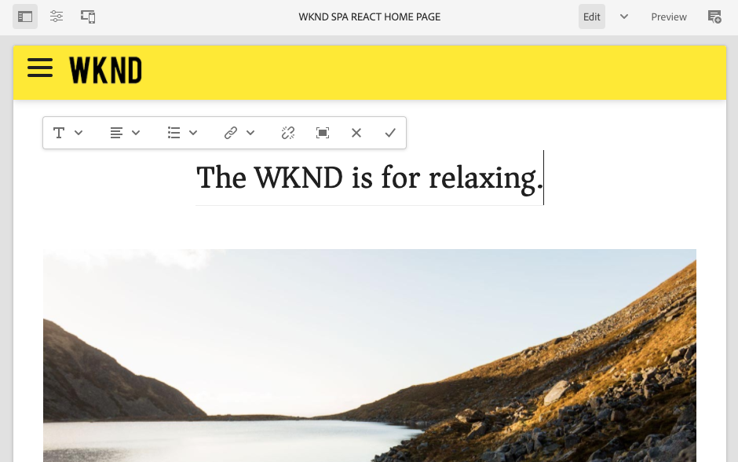

# Introducción y tutorial de SPA {#spa-introduction}

Las aplicaciones de una sola página (SPA) pueden ofrecer experiencias atractivas para los usuarios de sitios web. Los desarrolladores quieren poder generar sitios usando marcos de SPA y los autores quieren editar contenido dentro de AEM para un sitio generado usando dichos marcos.

El Editor de SPA ofrece una solución completa para admitir las SPA dentro de AEM. Este artículo presenta el uso de una aplicación SPA básica para la creación y muestra cómo se relaciona con el Editor de SPA de AEM subyacente.

{{ue-over-spa}}

## Introducción {#introduction}

### Objetivo del artículo {#article-objective}

Este artículo presenta los conceptos básicos de las SPA antes de guiar al lector a través de un tutorial del editor de SPA utilizando una sencilla aplicación de SPA para demostrar la edición básica del contenido. A continuación, se profundiza en la construcción de la página y en cómo se relaciona la aplicación SPA con el Editor de SPA de AEM y cómo interactúa con ella.

La meta de esta introducción y tutorial es demostrar a un desarrollador AEM por qué los SPA son relevantes, cómo funcionan en general, cómo el editor de SPA gestiona las SPA y cómo es diferente de una aplicación AEM estándar.

## Requisitos  {#requirements}

El tutorial se basa en la funcionalidad AEM estándar y en la aplicación de proyecto WKND SPA de ejemplo. Para seguir con este tutorial, debe tener disponible lo siguiente.

* [Último SDK de desarrollo de AEMaaCS](/help/release-notes/release-notes-cloud/release-notes-current.md)
   * Debe ejecutarse como un entorno de desarrollo local.
   * Debe tener derechos de administrador en el sistema.
* [La aplicación de proyecto WKND SPA de ejemplo está disponible en GitHub](https://github.com/adobe/aem-guides-wknd-spa)
   * Descargue la [última versión de la aplicación React](https://github.com/adobe/aem-guides-wknd-spa/releases) se denomina similar a `wknd-spa-react.all-X.Y.Z-SNAPSHOT.zip`.
   * Descargue el [últimas imágenes de ejemplo para la aplicación](https://github.com/adobe/aem-guides-wknd-spa/releases) se denomina similar a `wknd-spa-sample-images-X.Y.Z.zip`.
   * [Usar el administrador de paquetes](/help/implementing/developing/tools/package-manager.md) para instalar ambos paquetes como si se tratara de cualquier otro paquete en AEM.
   * No es necesario instalar la aplicación mediante Maven para realizar este tutorial.

>[!CAUTION]
>
>Este documento utiliza la [Aplicación de proyecto WKND SPA](https://github.com/adobe/aem-guides-wknd-spa) únicamente con fines de demostración. No lo utilice para ningún trabajo de proyecto.

>[!TIP]
>
>Cualquier proyecto AEM debería utilizar el [Tipo de archivo del proyecto AEM](https://experienceleague.adobe.com/docs/experience-manager-core-components/using/developing/archetype/overview.html?lang=es), que admite proyectos de SPA que utilizan React o Angular y aprovecha el SDK de SPA.

### ¿Qué es una SPA? {#what-is-a-spa}

Una aplicación de una sola página (SPA) difiere de una página convencional en que se procesa en el lado del cliente y principalmente está dirigida por JavaScript, y se basa en llamadas AJAX para cargar datos y actualizar la página de forma dinámica. La mayoría o todo el contenido se recupera una vez en una carga de una sola página con recursos adicionales cargados asincrónicamente según sea necesario en función de la interacción del usuario con la página.

Esto reduce la necesidad de actualizaciones de la página y presenta al usuario una experiencia que es fluida, rápida y se parece más a una experiencia nativa de la aplicación.

El Editor de SPA de AEM permite a los desarrolladores de front-end crear SPA que se pueden integrar en un sitio AEM, lo que permite a los autores de contenido editar el contenido SPA tan fácilmente como cualquier otro contenido de AEM.

### ¿Por qué una SPA? {#why-a-spa}

Al ser más rápido, fluido y más parecido a una aplicación nativa, una SPA se convierte en una experiencia muy atractiva no solo para el visitante de la página web, sino también para los especialistas en marketing y desarrolladores debido a la naturaleza de cómo funcionan las SPA.

#### Visitantes {#visitors}

* Los visitantes desean experiencias nativas cuando interactúan con el contenido.
* Hay datos claros de que cuanto más rápida sea una página, más probable será que se produzca una conversión.

#### Especialistas en marketing {#marketers}

* Los especialistas en marketing desean ofrecer experiencias ricas y nativas para atraer visitantes a fin de que participen plenamente en el contenido.
* La personalización puede hacer que estas experiencias sean aún más atractivas.

#### Desarrolladores {#developers}

* Los desarrolladores quieren una separación clara de las preocupaciones entre el contenido y la presentación.
* La separación limpia hace que el sistema sea más extensible y permite un desarrollo front-end independiente.

### ¿Cómo funciona una SPA? {#how-does-a-spa-work}

La idea principal detrás de una SPA es que las llamadas a un servidor y su dependencia se reduzcan para minimizar los retrasos causados por la latencia del servidor, de modo que la SPA se aproxime a la capacidad de respuesta de una aplicación nativa.

En una página web secuencial tradicional, solo se cargan los datos necesarios para la página inmediata. Esto significa que cuando el visitante se mueve a otra página, se llama al servidor para obtener los recursos adicionales. Es posible que sea necesario realizar llamadas adicionales, a medida que el visitante interactúa con elementos de la página. Estas llamadas múltiples pueden dar una sensación de retardo o retraso, ya que la página tiene que estar al día con las solicitudes del visitante.

Para obtener una experiencia más fluida, que se acerca a lo que un visitante espera de las aplicaciones móviles nativas, un SPA carga todos los datos necesarios para el visitante en la primera carga. Aunque esto puede tardar un poco más al principio, elimina la necesidad de realizar llamadas al servidor adicionales.

Al realizar el procesamiento en el lado del cliente, los elementos de página reaccionan más rápido y las interacciones con la página por parte del visitante son inmediatas. Cualquier dato adicional que se necesite se llama asincrónicamente para maximizar la velocidad de la página.

>[!TIP]
>
>Para obtener detalles técnicos sobre cómo funcionan las SPA en AEM, consulte los artículos:
>
>* [Introducción a SPA en AEM usando React](getting-started-react.md)
>* [Introducción a SPA en AEM usando Angular](getting-started-angular.md)
>
>Para obtener una vista más detallada del diseño, la arquitectura y el flujo de trabajo técnico del Editor de SPA, consulte el artículo:
>
>* [Información general del editor de SPA](editor-overview.md).

## Experiencia de edición de contenido con SPA {#content-editing-experience-with-spa}

Cuando se crea una SPA para usar el Editor de SPA de AEM, el autor del contenido no observa ninguna diferencia al editar y crear contenido. La funcionalidad común de AEM está disponible y no se requieren cambios en el flujo de trabajo del autor.

1. Edite la aplicación WKND SPA Project en AEM.

   `http://localhost:4502/editor.html/content/wknd-spa-react/us/en/home.html`

   

1. Seleccione un componente de texto y observe que aparece una barra de herramientas como cualquier otro componente. Seleccione **Editar**.

   

1. Edite el contenido como de costumbre dentro de AEM y note que los cambios se mantienen.

   

1. Utilice el explorador de recursos para arrastrar y soltar una nueva imagen en un componente de imagen.

   

1. El cambio se mantendrá.

   

Se admiten herramientas de creación adicionales, como arrastrar y soltar componentes adicionales en la página, reorganizar componentes y modificar el diseño, como en cualquier aplicación AEM que no sea de SPA.

>[!NOTE]
>
>El Editor de SPA no modifica el DOM de la aplicación. El propio SPA es responsable del DOM.
>
>Para ver cómo funciona esto, continúe con la siguiente sección de este artículo. [Aplicaciones de SPA y el Editor de SPA de AEM](#spa-apps-and-the-aem-spa-editor).

## Aplicaciones SPA y el Editor de SPA de AEM {#spa-apps-and-the-aem-spa-editor}

Experimentar cómo se comporta un SPA para el usuario y luego inspeccionar la página de SPA ayuda a comprender mejor cómo funciona una aplicación SAP con el Editor de SPA en AEM.

### Uso de la aplicación SPA {#using-an-spa-application}

1. Cargue la aplicación Proyecto WKND SPA en el servidor de publicación o con la opción **Ver tal y como aparece publicado** del menú **Información de la página** en el editor de páginas.

   `http://<host>:<port>/content/wknd-spa-react/us/en/home.html`

   

   Note la estructura de las páginas, incluida la navegación a páginas secundarias, menú y tarjetas de artículos.

1. Vaya a una página secundaria usando el menú y vea que la página se carga inmediatamente sin necesidad de actualizar.

   

1. Abra las herramientas de desarrollador integradas del explorador y supervise la actividad de red a medida que navega por las páginas secundarias.

   

   Hay muy poco tráfico a medida que se mueve de página en página en la aplicación. La página no se vuelve a cargar y solo se solicitan las imágenes nuevas.

   El SPA administra el contenido y el enrutamiento por completo en el lado del cliente.

Por lo tanto, si la página no se vuelve a cargar al navegar por las páginas secundarias, ¿cómo se carga?

La siguiente sección, [Carga de una aplicación SPA](#loading-a-spa-application), profundiza en la mecánica de carga del SPA y en cómo se puede cargar el contenido sincrónica y asincrónicamente.

### Carga de una aplicación SPA {#loading-a-spa-application}

1. Si aún no se ha cargado, cargue la aplicación Proyectos WKND SPA en el servidor de publicación o utilizando la opción **Ver tal y como aparece publicado** del menú **Información de la página** en el editor de páginas.

   `http://<host>:<port>/content/wknd-spa-react/us/en/home.html`

   

1. Utilice la herramienta integrada de su navegador para ver la fuente de la página.
1. El contenido del origen es limitado.
   * La página no tiene contenido dentro de su cuerpo. Se compone principalmente de hojas de estilo y una llamada a varios scripts como `clientlib-react.min.js`.
   * Estos scripts son los controladores principales de esta aplicación y son responsables de procesar todo el contenido.

1. Utilice las herramientas integradas de su explorador para inspeccionar la página. Consulte el contenido del DOM completamente cargado.

   

1. Cambie a la pestaña Red en el Inspector y vuelva a cargar la página.

   Al ignorar las solicitudes de imagen, tenga en cuenta que los recursos principales cargados para la página son la página en sí, CSS, React Javascript, sus dependencias, así como los datos JSON de la página.

   

1. Cargue el `home.model.json` en una pestaña nueva.

   `http://<host>:<port>/content/wknd-spa-react/us/en/home.model.json`

   

   El Editor de SPA de AEM utiliza los [Servicios de contenido de AEM](/help/sites-cloud/administering/content-fragments/overview.md#content-fragments-and-content-services) para entregar todo el contenido de la página como un modelo JSON.

   Al implementar interfaces específicas, los modelos Sling proporcionan la información necesaria para la SPA. El envío de los datos JSON se delega hacia abajo en cada componente (de página, a párrafo, a componente, etc).

   Cada componente elige lo que expone y cómo se procesa (lado del servidor con HTL o lado del cliente con React o Angular). Este artículo se centra en la renderización del lado del cliente con React.

1. El modelo también puede agrupar las páginas de forma que se carguen sincrónicamente, lo que reduce el número de recargas de página necesarias.

   En el ejemplo de la aplicación proyecto WKND SPA, las páginas `home`, `page-1`, `page-2` y `page-3` se cargan sincrónicamente, ya que los visitantes suelen visitar todas esas páginas.

   Este comportamiento no es obligatorio y es totalmente definible.

   

1. Para ver esta diferencia de comportamiento, vuelva a cargar la página `home` y borre la actividad de red del inspector. Vaya a `page-1` en el menú de página y vea que la única actividad de red es una solicitud de imagen de `page-1`. `page-1` no necesita cargarse.

   

### Interacción con el Editor de SPA {#interaction-with-the-spa-editor}

Con la aplicación del proyecto de SPA de WKND de ejemplo, está claro cómo se comporta la aplicación y cómo se carga cuando se publica, mediante los servicios de contenido para la entrega de contenido JSON y la carga asincrónica de recursos.

Además, para el autor del contenido, la creación de contenido mediante un editor de SPA se realiza sin problemas dentro de AEM.

En la siguiente sección analizaremos el contrato que permite al Editor de SPA relacionar componentes dentro del SPA con componentes de AEM y lograr esta experiencia de edición sin problemas.

1. Cargue la aplicación Proyecto WKND SPA en el editor y cambie a modo **Previsualización**.

   `http://<host>:<port>/editor.html/content/wknd-spa-react/us/en/home.html`

1. Con las herramientas de desarrollador integradas del explorador, inspeccione el contenido de la página. Usando la herramienta de selección, seleccione un componente editable en la página y vea los detalles del elemento.

   El componente tiene un nuevo atributo de datos `data-cq-data-path`.

   

   Por ejemplo

   `data-cq-data-path="/content/wknd-spa-react/us/en/home/jcr:content/root/responsivegrid/text`

   Esta ruta permite la recuperación y asociación del objeto de configuración de contexto de edición de cada componente.

   Este es el único atributo de marcado necesario para que el editor reconozca este componente como editable dentro del SPA. En función de este atributo, el Editor SPA determinará qué configuración editable está asociada con el componente, de modo que se cargue el marco de trabajo, la barra de herramientas, etc. correctos.

   También se agregan algunos nombres de clase específicos para marcar marcadores de posición y para la funcionalidad de arrastrar y soltar.

   >[!NOTE]
   >
   >Este comportamiento difiere de las páginas procesadas del lado del servidor en AEM, donde hay un `cq` elemento insertado para cada componente editable.
   >
   >Este método en el Editor de SPA elimina la necesidad de insertar elementos personalizados, ya que solo se basa en un atributo de datos adicional, lo que simplifica el marcado para el desarrollador de front-end.

## Encabezado y sin encabezado en AEM {#headful-headless}

Las SPA se pueden habilitar con niveles flexibles de integración dentro de AEM, incluso SPA desarrolladas y mantenidas fuera de AEM. Además, las SPA se pueden utilizar dentro de AEM y, al mismo tiempo, AEM para entregar contenido a puntos de conexión adicionales sin encabezado.

>[!TIP]
>
>Consulte el documento [Con encabezado y sin encabezado en AEM](/help/implementing/developing/headful-headless.md) para obtener más información.

## Pasos siguientes {#next-steps}

Ahora que comprende la experiencia de edición de SPA en AEM y cómo se relaciona un SPA con el Editor de SPA, profundice en la comprensión de cómo se crea una SPA.

* [Introducción a SPA en AEM usando React](getting-started-react.md) muestra cómo se crea una SPA básica para trabajar con el Editor de SPA de AEM usando React
* [Introducción a SPA en AEM usando Angular](getting-started-angular.md) muestra cómo se crea una SPA básica para trabajar con el Editor de SPA en AEM usando Angular
* La [Información general del Editor de SPA](editor-overview.md) profundiza en el modelo de comunicación entre AEM y el SPA.
* [Desarrollo de SPA para AEM](developing.md) describe cómo involucrar a los desarrolladores de front-end para que desarrollen una SPA para AEM, y cómo las SPA interactúan con la arquitectura de AEM.
