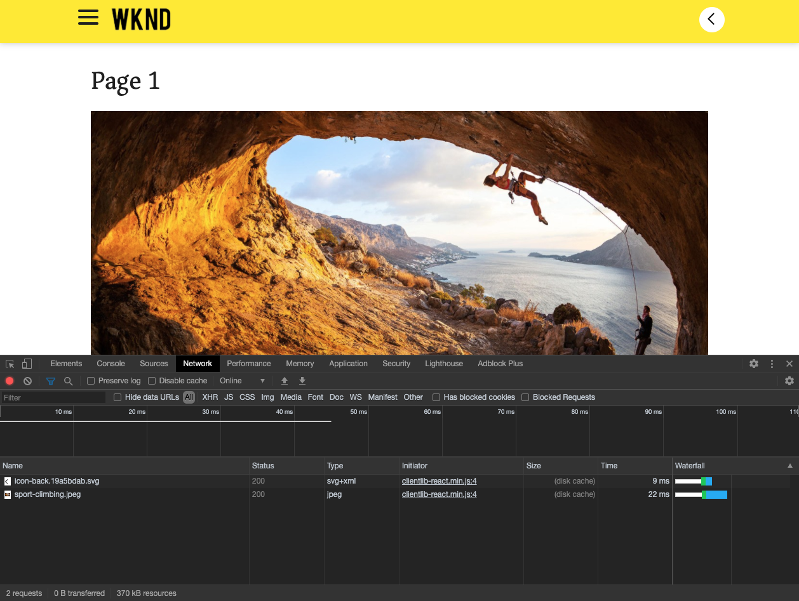

# Introducción a SPA y tutoriales {#spa-introduction}

Las aplicaciones de una sola página (SPA) pueden oferta de experiencias atractivas para los usuarios de sitios web. Los desarrolladores quieren poder crear sitios con marcos de SPA y los autores quieren editar contenido dentro de AEM sin problemas para un sitio creado con dichos marcos.

El Editor SPA oferta una solución integral para admitir SPA dentro de AEM. En este artículo se explica el uso de una aplicación de SPA básica para la creación y se muestra cómo se relaciona con el editor de SPA de AEM subyacente.

## Introducción {#introduction}

### Objetivo del artículo {#article-objective}

Este artículo presenta los conceptos básicos de SPA antes de guiar al lector a través de un tutorial del editor de SPA mediante una aplicación SPA sencilla para mostrar la edición básica del contenido. A continuación, profundiza en la construcción de la página y en cómo se relaciona la aplicación SPA con el Editor de SPA de AEM y cómo interactúa con él.

El objetivo de esta introducción y tutorial es demostrar a un desarrollador AEM por qué SPA son relevantes, cómo funcionan en general, cómo gestiona un SPA el Editor AEM y cómo es diferente de una aplicación AEM estándar.

El tutorial se basa en la funcionalidad de AEM estándar y en la aplicación de proyecto WKND SPA de muestra. Para continuar, [descargue e instale la aplicación de proyecto de SPA WKND de muestra desde GitHub aquí.](https://github.com/adobe/aem-guides-wknd-spa)

>[!CAUTION]
>
>Este documento utiliza la aplicación [WKND SPA Project](https://github.com/adobe/aem-guides-wknd-spa) únicamente con fines de demostración. No debe utilizarse para ningún trabajo de proyecto.

>[!TIP]
>
>Cualquier proyecto AEM debe aprovechar el [AEM Arquetipo de proyecto](https://docs.adobe.com/content/help/es-ES/experience-manager-core-components/using/developing/archetype/overview.html), que admite SPA proyectos usando React o Angular y aprovecha el SDK SPA.

### ¿Qué es un SPA? {#what-is-a-spa}

Una aplicación de una sola página (SPA) difiere de una página convencional en que se procesa en el lado del cliente y se dirige principalmente a JavaScript, y depende de las llamadas de Ajax para cargar datos y actualizar la página de forma dinámica. La mayor parte o la totalidad del contenido se recupera una vez en una única carga de página con recursos adicionales cargados asincrónicamente según sea necesario según la interacción del usuario con la página.

Esto reduce la necesidad de actualizar la página y presenta al usuario una experiencia que es fluida, rápida y se parece más a una experiencia nativa de la aplicación.

El Editor de SPA de AEM permite a los desarrolladores de front-end crear SPA que se pueden integrar en un sitio AEM, permitiendo a los autores de contenido editar el contenido SPA tan fácilmente como cualquier otro contenido AEM.

### ¿Por qué un SPA? {#why-a-spa}

Al ser más rápido, fluido y más parecido a una aplicación nativa, una SPA se convierte en una experiencia muy atractiva no sólo para el visitante de la página web, sino también para los especialistas en mercadotecnia y desarrolladores debido a la naturaleza de SPA trabajo.

#### Visitantes {#visitors}

* Los visitantes desean experiencias nativas cuando interactúan con el contenido.
* Hay datos claros de que cuanto más rápida sea una página, más probabilidad habrá de producirse una conversión.

#### Especialistas en mercadotecnia {#marketers}

* Los especialistas en marketing desean oferta de experiencias ricas y nativas para atraer a visitantes a fin de que se comprometan plenamente con el contenido.
* La personalización puede hacer que estas experiencias sean aún más atractivas.

#### Desarrolladores {#developers}

* Los desarrolladores quieren una clara separación de las preocupaciones entre el contenido y la presentación.
* La separación limpia hace que el sistema sea más extensible y permite el desarrollo independiente del front-end.

### ¿Cómo funciona un SPA? {#how-does-a-spa-work}

La idea principal detrás de una SPA es que las llamadas a un servidor y la dependencia de un servidor se reducen para minimizar los retrasos causados por la latencia del servidor de modo que el SPA se aproxime a la capacidad de respuesta de una aplicación nativa.

En una página web secuencial tradicional, solo se cargan los datos necesarios para la página inmediata. Esto significa que cuando el visitante se mueve a otra página, se llama al servidor para obtener los recursos adicionales. Es posible que sean necesarias llamadas adicionales a medida que el visitante interactúa con los elementos de la página. Estas llamadas múltiples pueden dar una sensación de retraso o retraso, ya que la página tiene que responder a las solicitudes del visitante.

Para una experiencia más fluida, que se aproxima a lo que espera un visitante de las aplicaciones móviles nativas, un SPA carga todos los datos necesarios para el visitante en la primera carga. Aunque esto puede tardar un poco más al principio, elimina la necesidad de realizar llamadas al servidor adicionales.

Al realizar el procesamiento en el lado del cliente, los elementos de la página reaccionan más rápidamente y las interacciones con la página por parte del visitante son inmediatas. Cualquier dato adicional que se necesite se llama de forma asíncrona para maximizar la velocidad de la página.

>[!TIP]
>
>Para obtener detalles técnicos sobre cómo SPA trabajar en AEM, consulte los artículos:
>* [Introducción a SPA en AEM con React](getting-started-react.md)
>* [Introducción a SPA en AEM con Angular](getting-started-angular.md)

>
>
Para ver más de cerca el diseño, la arquitectura y el flujo de trabajo técnico del Editor de SPA, consulte el artículo:
>* [Información general](editor-overview.md) del Editor de SPA.

## Experiencia de edición de contenido con SPA {#content-editing-experience-with-spa}

Cuando se crea un SPA para aprovechar el Editor de SPA de AEM, el autor del contenido no observa ninguna diferencia al editar y crear contenido. La funcionalidad de AEM común está disponible y no se requieren cambios en el flujo de trabajo del autor.

1. Edite la aplicación WKND SPA Project en AEM.

   `http://localhost:4502/editor.html/content/wknd-spa-react/us/en/home.html`

   

1. Seleccione un componente de texto y observe que aparece una barra de herramientas como cualquier otro componente. Seleccione **Editar**.

   

1. Edite el contenido como si fuera normal dentro de AEM y tenga en cuenta que los cambios se mantienen.

   

1. Utilice el navegador de recursos para arrastrar y soltar una imagen nueva en un componente de imagen.

   

1. El cambio se mantiene.

   

Se admiten herramientas de creación adicionales como arrastrar y soltar componentes adicionales en la página, reorganizar componentes y modificar el diseño, como en cualquier aplicación AEM que no sea SPA.

>[!NOTE]
>
>El Editor de SPA no modifica el DOM de la aplicación. El propio SPA es responsable del DOM.
>
>Para ver cómo funciona esto, continúe con la siguiente sección de este artículo [Aplicaciones de SPA y el AEM Editor SPA](#spa-apps-and-the-aem-spa-editor).

## Aplicaciones SPA y el Editor de SPA de AEM {#spa-apps-and-the-aem-spa-editor}

La experiencia de cómo se comporta un SPA para el usuario final y, a continuación, la inspección de la página de SPA ayuda a comprender mejor cómo funciona una aplicación SAP con el Editor de SPA en AEM.

### Uso de una aplicación SPA {#using-an-spa-application}

1. Cargue la aplicación WKND SPA Project en el servidor de publicación o mediante la opción **Vista tal como se publica** del menú **Información de página** del editor de páginas.

   `http://<host>:<port>/content/wknd-spa-react/us/en/home.html`

   

   Tenga en cuenta la estructura de las páginas, incluida la navegación a páginas secundarias, menús y tarjetas de artículos.

1. Navegue a una página secundaria mediante el menú y observe que la página se carga inmediatamente sin necesidad de actualizar.

   

1. Abra las herramientas de desarrollador integradas de su navegador y supervise la actividad de red a medida que navega por las páginas secundarias.

   

   Hay muy poco tráfico a medida que se mueve de una página a otra en la aplicación. La página no se vuelve a cargar y solo se solicitan las imágenes nuevas.

   El SPA administra el contenido y el enrutamiento por completo en el lado del cliente.

Por lo tanto, si la página no se recarga al navegar por las páginas secundarias, ¿cómo se carga?

La siguiente sección, [Carga de una aplicación SPA](#loading-a-spa-application), explora en mayor profundidad la mecánica de cargar la SPA y cómo se puede cargar el contenido sincrónica y asincrónicamente.

### Cargando una aplicación SPA {#loading-a-spa-application}

1. Si aún no se ha cargado, cargue la aplicación WKND SPA Project en el servidor de publicación o con la opción **Vista tal como se publica** del menú **Información de página** del editor de páginas.

   `http://<host>:<port>/content/wknd-spa-react/us/en/home.html`

   

1. Utilice la herramienta integrada de su navegador para vista del origen de la página.
1. Tenga en cuenta que el contenido de la fuente es limitado.
   * La página no tiene contenido dentro de su cuerpo. Se compone principalmente de hojas de estilo y una llamada a varias secuencias de comandos como `clientlib-react.min.js`.
   * Estos scripts son los principales controladores de esta aplicación y son responsables de procesar todo el contenido.

1. Utilice las herramientas integradas del explorador para inspeccionar la página. Consulte el contenido del DOM completamente cargado.

   

1. Cambie a la ficha Red del Inspector y vuelva a cargar la página.

   Al omitir las solicitudes de imagen, tenga en cuenta que los recursos principales cargados para la página son la propia página, CSS, React Javascript, sus dependencias y los datos JSON de la página.

   

1. Cargue `home.model.json` en una nueva ficha.

   `http://<host>:<port>/content/wknd-spa-react/us/en/home.model.json`

   

   El Editor de SPA de AEM aprovecha [Servicios de contenido de AEM](/help/assets/content-fragments/content-fragments.md) para entregar todo el contenido de la página como un modelo JSON.

   Al implementar interfaces específicas, los modelos Sling proporcionan la información necesaria para el SPA. El envío de los datos de JSON se delega hacia abajo en cada componente (de página, párrafo, componente, etc.).

   Cada componente elige lo que expone y cómo se procesa (lado del servidor con HTL o lado del cliente con React o Angular). Este artículo se centra en la representación del lado del cliente con React.

1. El modelo también puede agrupar las páginas para que se carguen sincrónicamente, reduciendo el número de recargas de página necesarias.

   En el ejemplo de la aplicación WKND SPA Project, las páginas `home`, `page-1`, `page-2` y `page-3` se cargan sincrónicamente, ya que los visitantes suelen visitar todas esas páginas.

   Este comportamiento no es obligatorio y es totalmente definible.

   

1. Para vista de esta diferencia de comportamiento, vuelva a cargar la página `home` y borre la actividad de red del inspector. Vaya a `page-1` en el menú de la página y vea que la única actividad de red es una solicitud para la imagen de `page-1`. `page-1` no necesita cargarse.

   

### Interacción con el Editor de SPA {#interaction-with-the-spa-editor}

Con la aplicación de ejemplo WKND SPA Project, queda claro cómo se comporta y se carga la aplicación cuando se publica, aprovechando los servicios de contenido para el envío de contenido JSON así como la carga asincrónica de recursos.

Además, para el autor del contenido, la creación de contenido mediante un editor de SPA es perfecta dentro de AEM.

En la siguiente sección analizaremos el contrato que permite al Editor de SPA relacionar componentes dentro del SPA con AEM componentes y lograr esta experiencia de edición sin problemas.

1. Cargue la aplicación WKND SPA Project en el editor y cambie al modo **Previsualización**.

   `http://<host>:<port>/editor.html/content/wknd-spa-react/us/en/home.html`

1. Con las herramientas de desarrollador integradas del explorador, inspeccione el contenido de la página. Con la herramienta de selección, seleccione un componente editable en la página y vista los detalles del elemento.

   Tenga en cuenta que el componente tiene un nuevo atributo de datos `data-cq-data-path`.

   

   Por ejemplo

   `data-cq-data-path="/content/wknd-spa-react/us/en/home/jcr:content/root/responsivegrid/text`

   Esta ruta permite recuperar y asociar el objeto de configuración de contexto de edición de cada componente.

   Este es el único atributo de marcado necesario para que el editor reconozca este componente como un componente editable dentro del SPA. Según este atributo, el Editor de SPA determinará qué configuración editable está asociada al componente, de modo que el marco, la barra de herramientas, etc. correctos. está cargado.

   Algunos nombres de clase específicos también se agregan para marcar marcadores de posición y para la funcionalidad de arrastrar y soltar recursos.

   >[!NOTE]
   >
   >Este comportamiento difiere de las páginas procesadas del lado del servidor en AEM, donde hay un elemento `cq` insertado para cada componente editable.
   >
   >Este método en el Editor de SPA elimina la necesidad de insertar elementos personalizados, confiando únicamente en un atributo de datos adicional, lo que simplifica el marcado para el desarrollador de front-end.

## Encabezado y sin cabeza en AEM {#headful-headless}

SPA se pueden habilitar con niveles flexibles de integración dentro de AEM, incluso SPA desarrollados y mantenidos fuera de AEM. Además, se puede aprovechar SPA dentro de AEM y también utilizar AEM para ofrecer contenido a extremos adicionales sin problemas.

>[!TIP]
>
>Consulte el documento [Encabezado y sin cabeza en AEM](/help/implementing/developing/headful-headless.md) para obtener más información.

## Próximos pasos {#next-steps}

Ahora que comprende la experiencia de edición SPA en AEM y cómo se relaciona un SPA con el Editor de SPA, indíquese más profundamente en la comprensión de cómo se crea un SPA.

* [Introducción a la SPA en AEM con ](getting-started-react.md) Reactancia muestra cómo se crea un SPA básico para trabajar con el Editor SPA en AEM con React
* [Introducción a SPA en AEM con ](getting-started-angular.md) Angularis muestra cómo se crea un SPA básico para trabajar con el Editor de SPA en AEM con Angular
* [SPA ](editor-overview.md) Información general del editor profundiza en el modelo de comunicación entre AEM y el SPA.
* [Desarrollo de SPA para ](developing.md) AEMdescribe cómo involucrar a los desarrolladores de front-end para desarrollar un SPA para AEM, así como cómo SPA interactuar con la arquitectura AEM.
