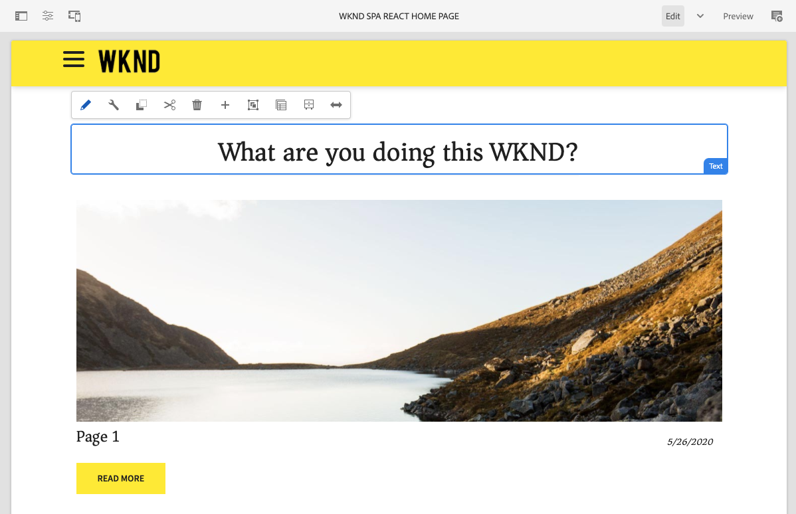

# Proyecto de SPA de WKND {#wknd-spa-project}

{{ue-over-spa}}
{{traditional-aem}}

Sumérjase en el desarrollo de SPA con este tutorial de varias partes que le guía a través de la configuración del proyecto, la asignación de componentes, las herramientas de desarrollo front-end y el enrutamiento de aplicaciones para implementar su propia SPA.

Similar al Tutorial WKND de AEM, este homólogo centrado en SPA ofrece un ejemplo completo de creación de su propia aplicación de una sola página editable con AEM a partir de la configuración del proyecto mediante el enrutamiento de aplicaciones.

* [Cree su primera SPA de Angular en AEM](https://experienceleague.adobe.com/docs/experience-manager-learn/getting-started-with-aem-headless/spa-editor/angular/overview.html)
* [Cree su primer SPA de React en AEM](https://experienceleague.adobe.com/docs/experience-manager-learn/getting-started-with-aem-headless/spa-editor/react/overview.html?lang=es)

Sin embargo, antes de comenzar su propio proyecto de SPA para AEM, quizá también quiera revisar el documento [Desarrollo de SPA para AEM](developing.md).
