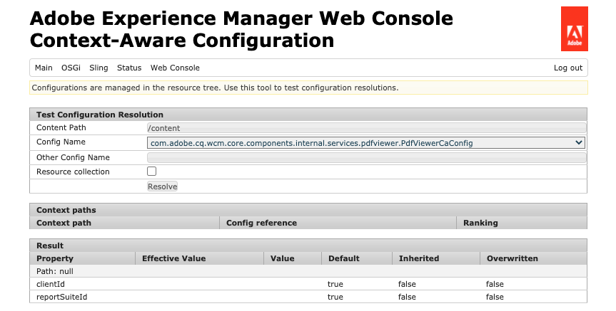

# Configuraciones y el explorador de configuración {#configuration-browser}

AEM AEM Las configuraciones de sirven para administrar la configuración en y sirven como espacios de trabajo en.

## ¿Qué es una configuración? {#what-is-a-configuration}

Una configuración se puede considerar desde dos puntos de vista diferentes.

* [Un administrador](#configurations-administrator) AEM utiliza configuraciones como espacios de trabajo dentro de los espacios de trabajo de para definir y administrar grupos de configuraciones.
* [Un desarrollador](#configurations-developer) AEM utiliza el mecanismo de configuración subyacente que implementa las configuraciones para mantener y buscar la configuración en la configuración de la configuración de la aplicación de la forma de.

AEM AEM En resumen: desde el punto de vista de un administrador, las configuraciones son la forma en que se crean espacios de trabajo para administrar la configuración en el repositorio, mientras que el desarrollador debe comprender cómo utiliza y administra estas configuraciones en el repositorio el desarrollador, de manera que los usuarios puedan utilizarlas y administrarlas de forma más eficaz, en el repositorio de.

AEM Independientemente de su perspectiva, las configuraciones sirven para dos propósitos principales en la:

* Las configuraciones habilitan determinadas funciones para determinados grupos de usuarios.
* Las configuraciones definen los derechos de acceso para esas funciones.

## Configuraciones como administrador {#configurations-administrator}

AEM Tanto el administrador de la aplicación como los autores pueden considerar las configuraciones como espacios de trabajo. Estos espacios de trabajo se pueden utilizar para recopilar grupos de configuraciones, así como su contenido asociado, con fines organizativos mediante la implementación de derechos de acceso para esas funciones.

AEM Se pueden crear configuraciones para muchas funciones diferentes dentro de los entornos de trabajo de la aplicación de la.

* [Segmentos de Context Hub](/help/sites-cloud/authoring/personalization/contexthub-segmentation.md)
* [Modelos de fragmento de contenido](/help/sites-cloud/administering/content-fragments/content-fragments-models.md)
* [Plantillas editables](/help/sites-cloud/authoring/features/templates.md)
* varias configuraciones de nube

### Ejemplos {#administrator-example}

Por ejemplo, un administrador puede crear dos configuraciones para Plantillas editables.

* WKND-General
* WKND-Magazine

A continuación, el administrador puede crear plantillas de página generales utilizando la configuración de WKND-General y, luego, plantillas específicas de la revista en WKND-Magazine.

El administrador puede asociar el WKND general con todo el contenido del sitio WKND. Sin embargo, la configuración de WKND-Magazine solo estaría asociada al sitio de la revista.

Al hacer esto:

* Cuando un autor de contenido crea una nueva página para la revista, el autor puede elegir entre plantillas generales (WKND-General) o plantillas de revista (WKND-Magazine).
* Cuando un autor de contenido crea una nueva página para otra parte del sitio que no es la revista, el autor solo puede elegir entre las plantillas generales (WKND-General).

Configuraciones similares son posibles no solo para plantillas editables, sino también para configuraciones de nube, segmentos de ContextHub y modelos de fragmentos de contenido.

### Uso del explorador de configuración {#using-configuration-browser}

AEM El Explorador de configuración permite a un administrador crear, administrar y configurar fácilmente derechos de acceso a las configuraciones en las configuraciones de los usuarios de la interfaz de usuario de la interfaz de usuario de.

>[!NOTE]
>
>Solo es posible crear configuraciones utilizando el Explorador de configuración si el usuario tiene `admin` derechos. `admin` también se requieren derechos de para asignar derechos de acceso a la configuración o modificar de otro modo una configuración.

#### Creación de una configuración {#creating-a-configuration}

AEM Es muy sencillo crear una nueva configuración en el explorador de configuración mediante el Explorador de configuración.

1. AEM Inicie sesión en el as a Cloud Service y, en el menú principal, seleccione **Herramientas** -> **General** -> **Explorador de configuración**.
1. Haga clic o pulse en **Crear**.
1. Proporcione un **Título** y **Nombre** para su configuración.

   

   * El **Título** debe ser descriptivo.
   * El **Nombre** se convertirá en el nombre de nodo en el repositorio.
      * Se generará automáticamente en función del título y se ajustará según las [convenciones de nomenclatura de AEM.](naming-conventions.md)
      * Se puede modificar si es necesario.
1. Compruebe el tipo de configuraciones que desea permitir.
   * [Segmentos de Context Hub](/help/sites-cloud/authoring/personalization/contexthub-segmentation.md)
   * [Modelos de fragmento de contenido](/help/sites-cloud/administering/content-fragments/content-fragments-models.md)
   * [Plantillas editables](/help/sites-cloud/authoring/features/templates.md)
   * varias configuraciones de nube
1. Haga clic o pulse en **Crear**.

>[!TIP]
>
>Las configuraciones pueden estar anidadas.

#### Edición de configuraciones y sus derechos de acceso {#access-rights}

Si considera las configuraciones como espacios de trabajo, se pueden definir derechos de acceso en esas configuraciones para exigir quién puede acceder a esos espacios de trabajo y quién no.

1. AEM Inicie sesión en el as a Cloud Service y, en el menú principal, seleccione **Herramientas** -> **General** -> **Explorador de configuración**.
1. Seleccione la configuración que desee modificar y, a continuación, toque o haga clic en **Propiedades** en la barra de herramientas.
1. Seleccione cualquier función adicional que desee añadir a la configuración
   >[!NOTE]
   >
   >Una vez creada la configuración, no es posible anular la selección de una función.
1. Utilice el **Permisos efectivos** para ver una matriz de funciones y los permisos que se otorgan actualmente a las configuraciones.
   
1. Para asignar nuevos permisos, introduzca el nombre de usuario o grupo en la **Seleccionar usuario o grupo** en el campo **Añadir nuevos permisos** sección.
   * El  **Seleccionar usuario o grupo** El campo ofrece finalización automática en función de los usuarios y funciones existentes.
1. Seleccione el usuario o rol apropiado en los resultados de autocompletar.
   * Puede seleccionar más de un usuario o rol.
1. Compruebe las opciones de acceso que deben tener los usuarios o roles seleccionados y haga clic en **Añadir**.
   
1. Repita los pasos para seleccionar usuarios o funciones y asigne derechos de acceso adicionales según sea necesario.
1. Haga clic o pulse **Guardar y cerrar** cuando termine.

## Configuraciones como desarrollador {#configurations-developer}

AEM Como desarrollador, es importante saber cómo funciona la configuración con las configuraciones y cómo procesa la resolución de la configuración de manera as a Cloud Service.

### Separación de configuración y contenido {#separation-of-config-and-content}

Aunque la variable [El administrador y los usuarios pueden considerar las configuraciones como lugares de trabajo](#configurations-administrator) AEM para administrar diferentes configuraciones y contenidos, es importante comprender que las configuraciones y los contenidos se almacenan y administran por separado por parte de los usuarios en el repositorio de.

* `/content` es el hogar de todo el contenido.
* `/conf` es el hogar de toda la configuración de.

El contenido hace referencia a su configuración asociada a través de una `cq:conf` propiedad. AEM una búsqueda basada en el contenido y en su contexto `cq:conf` para encontrar la configuración adecuada.

### Ejemplos {#developer-example}

Para este ejemplo, supongamos que tiene código de aplicación interesado en la configuración de DAM.

```java
Conf conf = resource.adaptTo(Conf.class);
ValueMap imageServerSettings = conf.getItem("dam/imageserver");
String bgkcolor = imageServerSettings.get("bgkcolor", "FFFFFF");
```

El punto de partida de toda la búsqueda de configuración es un recurso de contenido, normalmente en alguna parte bajo `/content`. Podría ser una página, un componente dentro de una página, un recurso o una carpeta DAM. Este es el contenido real para el que buscamos la configuración correcta que se aplica en este contexto.

Ahora, con el `Conf` objeto en mano, podemos recuperar el elemento de configuración específico que nos interesa. En este caso es `dam/imageserver`, que es una colección de configuraciones relacionadas con la variable `imageserver`. El `getItem` la llamada devuelve un `ValueMap`. Luego leemos un `bgkcolor` y proporcione un valor predeterminado de &quot;FFFFFF&quot; en caso de que la propiedad (o todo el elemento de configuración) no esté presente.

Ahora vamos a echar un vistazo al contenido JCR correspondiente:

```text
/content/dam/wknd
    + jcr:content
      - cq:conf = "/conf/wknd"
    + image.png [dam:Asset]

/conf/wknd
    + settings
      + dam
        + imageserver [cq:Page]
          + jcr:content
            - bgkcolor = "FF0000"
```

En este ejemplo, suponemos una carpeta DAM específica de WKND aquí y una configuración correspondiente. Empezando por esa carpeta `/content/dam/wknd`, veremos que hay una propiedad de cadena llamada `cq:conf` que hace referencia a la configuración que debe aplicarse al subárbol. La propiedad generalmente se establece en la variable `jcr:content` de una página o carpeta de recursos. Estos `conf` Los vínculos son explícitos, por lo que es fácil seguirlos con solo mirar el contenido en CRXDE.

Saltando dentro `/conf`, seguimos la referencia y vemos que hay un `/conf/wknd` nodo. Esta es una configuración. Tenga en cuenta que su búsqueda es completamente transparente para el código de la aplicación. El código de ejemplo nunca tiene una referencia dedicada a él, está oculto detrás del `Conf` objeto. La configuración que se aplica se controla completamente a través del contenido JCR.

Vemos que la configuración contiene un nombre fijo `settings` que contiene los elementos reales, incluido el `dam/imageserver` necesitamos en nuestro caso. Este elemento puede considerarse como un &quot;documento de configuración&quot; y suele representarse mediante una `cq:Page` incluido un `jcr:content` que contenga el contenido real.

Finalmente, vemos la propiedad `bgkcolor` que necesita nuestro código de muestra. El `ValueMap` nosotros volvemos de `getItem` se basa en el `jcr:content` nodo.

### Resolución de configuración {#configuration-resolution}

El ejemplo básico anterior mostraba una sola configuración. Pero hay muchos casos en los que desea tener diferentes configuraciones, como una configuración global predeterminada, una diferente para cada marca y tal vez una específica para sus subproyectos.

AEM Para admitir esto, la búsqueda de configuración en la configuración de tiene una herencia y un mecanismo de reserva en el siguiente orden de preferencia:

1. `/conf/<siteconfig>/<parentconfig>/<myconfig>`
   * Configuración específica a la que se hace referencia desde `cq:conf` en algún lugar de `/content`
   * La jerarquía es arbitraria y se puede diseñar igual que la estructura del sitio, no es asunto del código de la aplicación saber esto
   * Cambiable durante la ejecución por usuarios con privilegios de configuración
1. `/conf/<siteconfig>/<parentconfig>`
   * Recorrer elementos principales para configuraciones de reserva
   * Cambiable durante la ejecución por usuarios con privilegios de configuración
1. `/conf/<siteconfig>`
   * Recorrer elementos principales para configuraciones de reserva
   * Cambiable durante la ejecución por usuarios con privilegios de configuración
1. `/conf/global`
   * Configuración global del sistema
   * Normalmente, valores globales predeterminados para la instalación
   * Establecido por un `admin` función
   * Cambiable durante la ejecución por usuarios con privilegios de configuración
1. `/apps`
   * Valores predeterminados de aplicación
   * Corregido con la implementación de aplicaciones
   * Solo lectura durante la ejecución
1. `/libs`
   * AEM Valores predeterminados de producto
   * Solo se puede cambiar por Adobe; no se permite el acceso al proyecto
   * Corregido con la implementación de aplicaciones
   * Solo lectura durante la ejecución

### Uso de configuraciones {#using-configurations}

AEM Las configuraciones en las configuraciones de los segmentos de la lista se basan en Configuraciones según el contexto de Sling. Los paquetes Sling proporcionan una API de servicio que se puede utilizar para obtener configuraciones según el contexto. Las configuraciones según el contexto son configuraciones que están relacionadas con un recurso de contenido o un árbol de recursos tal como estaban [se describe en el ejemplo anterior.](#developer-example)

Para obtener más información sobre las configuraciones según el contexto, ver ejemplos y cómo utilizarlas, [consulte la documentación de Sling.](https://sling.apache.org/documentation/bundles/context-aware-configuration/context-aware-configuration.html)

### Consola web de ConfMgr {#confmgr-web-console}

Para fines de depuración y prueba, existe un **ConfMgr** consola web en `https://<host>:<port>/system/console/conf`, que puede mostrar configuraciones para una ruta/elemento determinados.


Proporcione simplemente:

* **Ruta de contenido**
* **Elemento**
* **Usuario**

Clic **Resolver** para ver qué configuraciones se resuelven y recibir código de ejemplo que resuelva esas configuraciones.

### Consola web de configuración según el contexto {#context-aware-web-console}

Para fines de depuración y prueba, existe un **Configuración según el contexto** consola web en `https://<host>:<port>/system/console/slingcaconfig`, que permite consultar las configuraciones según el contexto en el repositorio y ver sus propiedades.



Proporcione simplemente:

* **Ruta de contenido**
* **Nombre de configuración**

Clic **Resolver** para recuperar las rutas de contexto y propiedades asociadas para la configuración seleccionada.
