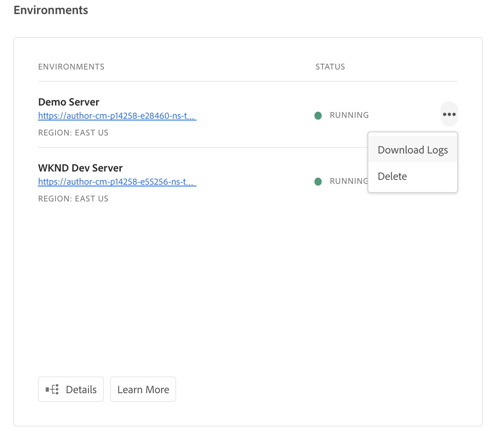
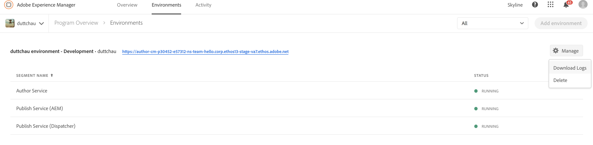
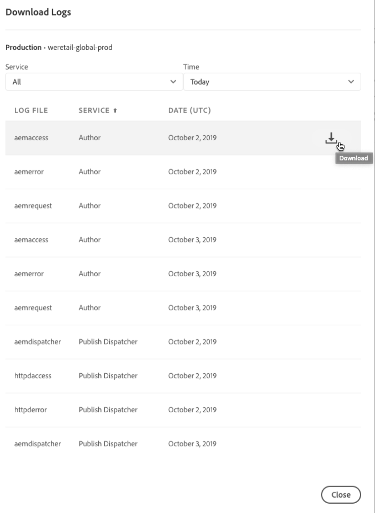

# Registro{#logging}

AEM como servicio de nube es una plataforma para que los clientes incluyan código personalizado para crear experiencias únicas para su base de clientes. Teniendo esto en cuenta, el registro es una función crítica para depurar código personalizado en entornos de nube y, más particularmente, en entornos de desarrollo locales.


<!-- ## Global Logging {#global-logging}

[Apache Sling Logging Configuration](https://sling.apache.org/documentation/development/logging.html#user-configuration---osgi-based) is used to configure the root logger. This defines the global settings for logging in AEM as a Cloud Service:

* the logging level
* the location of the central log file
* the number of versions to be kept
* version rotation; either maximum size or a time interval
* the format to be used when writing the log messages
-->

## AEM as a Cloud Service Logging {#aem-as-a-cloud-service-logging}

AEM como servicio de nube le oferta la posibilidad de configurar:

* parámetros globales para el servicio de registro central
* registro de datos de solicitud; una configuración de registro especializada para información de solicitud
* configuración específica para los servicios individuales

Para el desarrollo local, las entradas de registro se escriben en los archivos locales de la `/crx-quickstart/logs` carpeta.

En los entornos de Cloud, los desarrolladores pueden descargar registros a través de Cloud Manager o utilizar una herramienta de línea de comandos para reducir los registros.

>[!NOTE]
>
>El inicio de sesión en AEM como servicio de nube se basa en los principios de Sling. Consulte [Registro de Sling](https://sling.apache.org/site/logging.html) para obtener más información.

## AEM como servicio de nube Registro de Java {#aem-as-a-cloud-service-java-logging}

### Registradores y escritores estándar {#standard-loggers-and-writers}

> [!IMPORTANT]
> Se pueden personalizar si es necesario, aunque la configuración estándar es adecuada para la mayoría de las instalaciones. Sin embargo, si necesita personalizar las configuraciones de registro estándar, asegúrese de hacerlo solo en `dev` entornos.

Algunos registradores y escritores se incluyen en un AEM estándar como instalación de Cloud Service.

El primero es un caso especial, ya que controla tanto los registros `request` como los `access` :

* El Registrador:

   * Registrador De Datos De Solicitud Personalizable Apache Sling

      (org.apache.sling.engine.impl.log.RequestLoggerService)

   * Escriba mensajes sobre el contenido de la solicitud en `request.log`.

* Vínculos a:

   * Registrador de solicitudes Apache Sling

      (org.apache.sling.engine.impl.log.RequestLogger)

   * Escribe los mensajes en `request.log` o `access.log`.

Los otros pares siguen la configuración estándar:

* El Registrador:

   * Configuración del registrador de Apache Sling

      (org.apache.sling.commons.log.LogManager.Factory.config)

   * Escribe `Information` mensajes en `logs/error.log`.

* Vínculos al escritor:

   * Configuración del escritor de registro de Apache Sling

      (org.apache.sling.commons.log.LogManager.Factory.writer)

* El Registrador:

   * Configuración del registrador de registros Sling de Apache(org.apache.sling.commons.log.LogManager.Factory.config.649d51b7-6425-45c9-81e6-2697a03d6be7)

   * Escribe `Warning` mensajes en `../logs/error.log` para el servicio `org.apache.pdfbox`.

* No se vincula a un escritor específico, por lo que creará y utilizará un escritor implícito con la configuración predeterminada (rotación diaria del registro).

**AEM como servicio de nube Registro de solicitudes HTTP**

Todas las solicitudes de acceso a AEM WCM y al repositorio se registran aquí.

Ejemplo de salida:

**Registro de acceso de solicitudes y respuestas HTTP de AEM**

Cada solicitud de acceso se registra aquí junto con la respuesta.

Ejemplo de salida:

**Registro de Apache Web Server / Dispatcher**

Es un registro que se utiliza para depurar problemas de Dispatcher. Para obtener más información, consulte [Depuración de la configuración](https://docs.adobe.com/content/help/en/experience-manager-cloud-service/implementing/)de Apache y Dispatcher.

<!-- Besides the three types of logs present on an AEM as a Cloud Service instance (`request`, `access` and `error` logs) there is another dispatcher/overview.html#debugging-apache-and-dispatcher-configuration.

leftover text from the last breakaway chunk (re dispatcher) -->

En lo que respecta a las prácticas básicas, se recomienda que se alinee con las configuraciones que existen actualmente en AEM como arquetipo de máquina de servicio en la nube. Estos valores definen diferentes niveles y configuraciones de registro para tipos de entorno específicos:

* para `local dev` y `dev` entornos, establezca el registrador en el nivel **DEBUG** en la variable `error.log`
* para `stage`, establezca el registrador en el nivel **WARN** en la variable `error.log`
* para `prod`, establezca el registro en el nivel de **ERROR** en la variable `error.log`

A continuación encontrará ejemplos de cada configuración:

* `dev` entornos:

```
<?xml version="1.0" encoding="UTF-8"?>
<jcr:root xmlns:sling="http://sling.apache.org/jcr/sling/1.0"
    xmlns:jcr="http://www.jcp.org/jcr/1.0" jcr:primaryType="sling:OsgiConfig"
    org.apache.sling.commons.log.level="debug"
    org.apache.sling.commons.log.names="[com.mycompany.myapp]" />
```


* `stage` entornos:

```
<?xml version="1.0" encoding="UTF-8"?>
<jcr:root xmlns:sling="http://sling.apache.org/jcr/sling/1.0"
    xmlns:jcr="http://www.jcp.org/jcr/1.0" jcr:primaryType="sling:OsgiConfig"
    org.apache.sling.commons.log.level="warn"
    org.apache.sling.commons.log.names="[com.mycompany.myapp]" />
```

* `prod` entornos:

```
<?xml version="1.0" encoding="UTF-8"?>
<jcr:root xmlns:sling="http://sling.apache.org/jcr/sling/1.0"
    xmlns:jcr="http://www.jcp.org/jcr/1.0" jcr:primaryType="sling:OsgiConfig"
    org.apache.sling.commons.log.level="error"
    org.apache.sling.commons.log.names="[com.mycompany.myapp]" />
```

### Registros y escritores para servicios individuales {#loggers-and-writers-for-individual-services}

Además de la configuración de registro global, AEM como servicio de nube le permite configurar opciones específicas para un servicio individual:

* el nivel de registro específico
* el registrador (el servicio OSGi que proporciona los mensajes de registro)

Esto le permite canal los mensajes de registro de un único servicio en un archivo independiente. Esto puede resultar especialmente útil durante el desarrollo o la realización de pruebas; por ejemplo, cuando necesita un nivel de registro mayor para un servicio específico.

AEM como servicio de nube utiliza lo siguiente para escribir mensajes de registro en el archivo:

1. Un servicio **** OSGi (registrador) escribe un mensaje de registro.
1. Un **registrador** toma este mensaje y lo formatea según sus especificaciones.
1. Un **escritor** de registro escribe todos estos mensajes en el archivo físico que ha definido.

Estos elementos están vinculados por los siguientes parámetros para los elementos apropiados:

* **Registrador (registrador)**

   Defina los servicios que generan los mensajes.

<!-- * **Log File (Logging Logger)**

  Define the physical file for storing the log messages.

  This is used to link a Logging Logger with a Logging Writer. The value must be identical to the same parameter in the Logging Writer configuration for the connection to be made.

* **Log File (Logging Writer)**

  Define the physical file that the log messages will be written to.

  This must be identical to the same parameter in the Logging Writer configuration, or the match will not be made. If there is no match then an implicit Writer will be created with default configuration (daily log rotation).
-->

## Configuración del nivel de registro {#setting-the-log-level}

Para cambiar los niveles de registro de los entornos de nube, se debe modificar la configuración de OSGI de registro de Sling, seguida de una reimplementación completa. Dado que esto no es instantáneo, tenga cuidado de habilitar los registros detallados en entornos de producción que reciben mucho tráfico. En el futuro, es posible que haya mecanismos para cambiar más rápidamente el nivel de registro.

>[!NOTE]
>
> Para realizar los cambios de configuración que se indican a continuación, debe crearlos en un entorno de desarrollo local y, a continuación, colocarlos en una instancia de AEM como servicio de nube. Para obtener más información sobre cómo hacerlo, consulte [Implementación en AEM como un servicio](/help/implementing/deploying/overview.md)de nube.

### Activación del nivel de registro DEBUG {#activating-the-debug-log-level}

>[!WARNING]
>
> Al activar el nivel de registro DEBUG globalmente, se generará una gran cantidad de información que será difícil de pasar. Se recomienda habilitarlo solo para los servicios que requieren depuración. Para obtener más información, consulte [Registros y escritores de servicios](logging.md#loggers-and-writers-for-individual-services)individuales.

El nivel de registro predeterminado es INFO, es decir, los mensajes DEBUG no se registran.
Para activar el nivel de registro DEBUG, establezca la variable

``` /libs/sling/config/org.apache.sling.commons.log.LogManager/org.apache.sling.commons.log.level ```

para depurar. No deje el registro en el nivel de registro DEBUG más tiempo del necesario, ya que genera muchos registros.
Una línea en el archivo de depuración normalmente inicio con DEBUG y, a continuación, proporciona el nivel de registro, la acción del instalador y el mensaje de registro. Por ejemplo:

``` DEBUG 3 WebApp Panel: WebApp successfully deployed ```

Los niveles de registro son los siguientes:

| 0 | Error fatal | Error en la acción y el instalador no puede continuar. |
|---|---|---|
| 1 | Error | Error en la acción. La instalación continúa, pero una parte de CRX no se instaló correctamente y no funcionará. |
| 2 | Advertencia | La acción se ha realizado correctamente, pero se han encontrado problemas. CRX puede funcionar correctamente o no. |
| 3 | Información | La acción se ha realizado correctamente. |

### Creación de sus propios registradores y escritores {#creating-your-own-loggers-and-writers}

Puede definir su propio par Logger/Writer:

1. Cree una nueva instancia de la Configuración de fábrica [Apache Sling Logging Logger Configuration](https://sling.apache.org/documentation/development/logging.html#user-configuration---osgi-based).

   1. Especifique el registrador.

<!-- 1. Create a new instance of the Factory Configuration [Apache Sling Logging Writer Configuration](https://sling.apache.org/documentation/development/logging.html#user-configuration---osgi-based).

    1. Specify the Log File - this must match that specified for the Logger.
    1. Configure the other parameters as required. -->

### Configurar el registro {#configure-logging}

>[!NOTE]
>
>Al trabajar con Adobe Experience Manager, existen varios métodos para administrar la configuración de dichos servicios.

En determinadas circunstancias, es posible que desee crear un registro personalizado con un nivel de registro diferente. Puede hacerlo en el repositorio:

1. Si aún no existe, cree una nueva carpeta de configuración ( `sling:Folder`) para el proyecto `/apps/<*project-name*>/config`.
1. En `/apps/<*project-name*>/config`, cree un nodo para la nueva configuración del registrador de registros de Sling de Apache:

   * Nombre: `org.apache.sling.commons.log.LogManager.factory.config-<*identifier*>` (ya que es un Logger)

      Donde `<*identifier*>` se reemplaza por texto libre que debe introducir para identificar la instancia (no puede omitir esta información).

      Por ejemplo, `org.apache.sling.commons.log.LogManager.factory.config-MINE`

   * Tipo: `sling:OsgiConfig`
   >[!NOTE]
   >
   >Aunque no es un requisito técnico, es aconsejable hacer `<*identifier*>` único.

<!-- 1. Set the following properties on this node:

    * Name: `org.apache.sling.commons.log.file`

      Type: String

      Value: specify the Log File; for example, `logs/myLogFile.log`

    * Name: `org.apache.sling.commons.log.names`

      Type: String[] (String + Multi)

      Value: specify the OSGi services for which the Logger is to log messages; for example, all of the following:

        * `org.apache.sling`
        * `org.apache.felix`
        * `com.day`

    * Name: `org.apache.sling.commons.log.level`

      Type: String

      Value: specify the log level required ( `debug`, `info`, `warn` or `error`); for example `debug`

    * Configure the other parameters as required:

        * Name: `org.apache.sling.commons.log.pattern`

          Type: `String`

          Value: specify the pattern of the log message as required; for example,

          `{0,date,dd.MM.yyyy HH:mm:ss.SSS} *{4}* [{2}] {3} {5}`

   >[!NOTE]
   >
   >`org.apache.sling.commons.log.pattern` supports up to six arguments.

   >
   >
   >{0} The timestamp of type `java.util.Date`
   >{1} the log marker
   >{2} the name of the current thread
   >{3} the name of the logger
   >{4} the log level
   >{5} the log message

   >
   >
   >If the log call includes a `Throwable` the stacktrace is appended to the message.

   >[!CAUTION]
   >
   >org.apache.sling.commons.log.names must have a value.

   >[!NOTE]
   >
   >Log writer paths are relative to the `crx-quickstart` location.
   >
   >
   >Therefore, a log file specified as:
   >
   >
   >`logs/thelog.log`

   >
   >
   >writes to:
   >
   >
   >`` ` ` `<*cq-installation-dir*>/``crx-quickstart/logs/thelog.log`.
   >
   >
   >And a log file specified as:
   >
   >
   >`../logs/thelog.log`

   >
   >
   >writes to a directory:
   >
   >
   >` <*cq-installation-dir*>/logs/`
   >``(i.e. next to ` `<*cq-installation-dir*>/`crx-quickstart/`)
 -->

<!-- open question: see if we need to leave the above warning note in place, but adjust it so that it doesn't mention filenames -->

<!-- 1. This step is only necessary when a new Writer is required (i.e. with a configuration that is different to the default Writer).

   >[!CAUTION]
   >
   >A new Logging Writer Configuration is only required when the existing default is not suitable.

   >
   >
   >If no explicit Writer is configured the system will automatically generate an implicit Writer based on the default.

   Under `/apps/<*project-name*>/config`, create a node for the new `Apache Sling Logging Writer` Configuration:

    * Name: `org.apache.sling.commons.log.LogManager.factory.writer-<*identifier*>` (as this is a Writer)

      As with the Logger, `<*identifier*>` is replaced by free text that you (must) enter to identify the instance (you cannot omit this information). For example, `org.apache.sling.commons.log.LogManager.factory.writer-MINE`

    * Type: `sling:OsgiConfig`

   >[!NOTE]
   >
   >Although not a technical requirement, it is advisable to make `<*identifier*>` unique.

   Set the following properties on this node:

    * Name: `org.apache.sling.commons.log.file`

      Type: `String`

      Value: specify the Log File so that it matches the file specified in the Logger;

      for this example, `../logs/myLogFile.log`.

    * Configure the other parameters as required:

        * Name: `org.apache.sling.commons.log.file.number`

          Type: `Long`

          Value: specify the number of log files you want kept; for example, `5`

        * Name: `org.apache.sling.commons.log.file.size`

          Type: `String`

          Value: specify as required to control file rotation by size/date; for example, `'.'yyyy-MM-dd`

   >[!NOTE]
   >
   >`org.apache.sling.commons.log.file.size` controls the rotation of the log file by setting either:
   >
   >* a maximum file size
   >* a time/date schedule
   >
   >to indicate when a new file will be created (and the existing file renamed according to the name pattern).
   >
   >* A size limit can be specified with a number. If no size indicator is given, then this is taken as the number of bytes, or you can add one of the size indicators - `KB`, `MB`, or `GB` (case is ignored).
   >* A time/date schedule can be specified as a `java.util.SimpleDateFormat` pattern. This defines the time period after which the file will be rotated; also the suffix appended to the rotated file (for identification).
   >
   >The default is '.'yyyy-MM-dd (for daily log rotation).
   >
   >So for example, at midnight of January 20th 2010 (or when the first log message after this occurs to be precise), ../logs/error.log will be renamed to ../logs/error.log.2010-01-20. Logging for the 21st of January will be output to (a new and empty) ../logs/error.log until it is rolled over at the next change of day.
   >
   >      | `'.'yyyy-MM` |Rotation at the beginning of each month |
   >      |---|---|
   >      | `'.'yyyy-ww` |Rotation at the first day of each week (depends on the locale). |
   >      | `'.'yyyy-MM-dd` |Rotation at midnight each day. |
   >      | `'.'yyyy-MM-dd-a` |Rotation at midnight and midday of each day. |
   >      | `'.'yyyy-MM-dd-HH` |Rotation at the top of every hour. |
   >      | `'.'yyyy-MM-dd-HH-mm` |Rotation at the beginning of every minute. |
   >
   >      Note: When specifying a time/date:
   >      1. You should "escape" literal text within a pair of single quotes (' ');
   >      this is to avoid certain characters being interpreted as pattern letters.
   >      1. Only use characters allowed for a valid file name anywhere in the option.

1. Read your new log file with your chosen tool.

   The log file created by this example will be `../crx-quickstart/logs/myLogFile.log`. -->

La consola de Felix también proporciona información sobre la compatibilidad con el registro de Sling en `../system/console/slinglog`; por ejemplo `https://localhost:4502/system/console/slinglog`.draf

## Acceder y administrar registros {#manage-logs}

Los usuarios pueden acceder a una lista de los archivos de registro disponibles para el entorno seleccionado mediante la tarjeta de Entorno.  Los usuarios pueden acceder a una lista de archivos de registro disponibles para el entorno seleccionado.

Estos archivos se pueden descargar a través de la interfaz de usuario, ya sea desde la página **Información general** .



O bien, la página **Entornos** :



>[!Note]
>Independientemente de dónde se abra, aparece el mismo cuadro de diálogo y permite descargar un archivo de registro individual.




### Registros a través de API {#logs-thorugh-api}

Además de descargar registros a través de la interfaz de usuario, los registros estarán disponibles a través de la API y la interfaz de la línea de comandos.

Por ejemplo, para descargar los archivos de registro de un entorno específico, el comando sería algo más que las líneas de

```java
$ aio cloudmanager:download-logs --programId 5 1884 author aemerror
```

El siguiente comando permite el ajuste de registros:

```java
$ aio cloudmanager:tail-log --programId 5 1884 author aemerror
```

Para obtener el ID de entorno (1884 en este caso) y las opciones de nombre de registro o servicio disponibles, puede utilizar:

```java
$ aio cloudmanager:list-environments
Environment Id Name                     Type  Description                          
1884           FoundationInternal_dev   dev   Foundation Internal Dev environment  
1884           FoundationInternal_stage stage Foundation Internal STAGE environment
1884           FoundationInternal_prod  prod  Foundation Internal Prod environment
 
 
$ aio cloudmanager:list-available-log-options 1884
Environment Id Service    Name         
1884           author     aemerror     
1884           author     aemrequest   
1884           author     aemaccess    
1884           publish    aemerror     
1884           publish    aemrequest   
1884           publish    aemaccess    
1884           dispatcher httpderror   
1884           dispatcher aemdispatcher
1884           dispatcher httpdaccess
```

>[!Note]
>Mientras que las **descargas de registro** estarán disponibles a través de la interfaz de usuario y la API, el **Seguimiento de registros** es solo API/CLI.

### Recursos adicionales {#resources}

Consulte los siguientes recursos adicionales para obtener más información sobre la API de Cloud Manager y la CLI de Adobe I/O:

* [Documentación de la API de Cloud Manager](https://www.adobe.io/apis/experiencecloud/cloud-manager/docs.html)
* [CLI de Adobe I/O](https://github.com/adobe/aio-cli-plugin-cloudmanager)