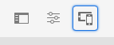

# Diseño interactivo {#responsive-design}

Con un diseño interactivo, las mismas experiencias se pueden mostrar de forma eficaz en varios dispositivos y en varias orientaciones.

>[!TIP]
>
>Este documento proporciona información general sobre el diseño interactivo para desarrolladores y cómo se aplican las funciones en AEM. Hay recursos adicionales disponibles:
>
>* Para los autores de contenido, los detalles de cómo utilizar las características de diseño adaptables en una página de contenido están disponibles en el documento [Diseño adaptable.](/help/sites-cloud/authoring/page-editor/responsive-layout.md)
>* Para los administradores del sitio, los detalles sobre cómo configurar el contenedor de diseño para sus sitios se describen en el documento [Configuración del contenedor de diseño y el modo de diseño.](/help/sites-cloud/administering/responsive-layout.md)

## Información general {#overview}

Diseñe sus experiencias para que se adapten a la ventanilla del cliente en la que se muestran. Con un diseño interactivo, las mismas páginas se pueden mostrar de forma eficaz en varios dispositivos en ambas orientaciones. La siguiente imagen muestra algunas formas en que una página puede responder a los cambios en el tamaño de la ventanilla móvil:

* Diseño: utilice diseños de una sola columna para las ventanillas más pequeñas y diseños de varias columnas para las ventanillas más grandes.
* Tamaño de texto: utilice un tamaño de texto más grande (cuando corresponda, como encabezados) en las ventanillas móviles más grandes.
* Contenido: incluya solo el contenido más importante al mostrarlo en dispositivos más pequeños.
* Navegación: se proporcionan herramientas específicas del dispositivo para acceder a otras páginas.
* Imágenes: se muestran las representaciones de imágenes apropiadas para la ventanilla del cliente según las dimensiones de la ventana.


Desarrollar aplicaciones de Adobe Experience Manager (AEM) que generen HTML5 que se adapte a múltiples tamaños y orientaciones de ventana. Por ejemplo, los siguientes intervalos de anchuras de ventanilla móvil se corresponden con varios tipos de dispositivos y orientaciones

* Anchura máxima de 480 píxeles (teléfono, vertical)
* Anchura máxima de 767 píxeles (teléfono, horizontal)
* Anchura entre 768 píxeles y 979 píxeles (tableta, vertical)
* Anchura entre 980 píxeles y 1199 píxeles (tableta, horizontal)
* Anchura de 1200 px o superior (escritorio)

Consulte los siguientes temas para obtener información sobre la implementación del comportamiento de diseño interactivo:

* [Consultas de medios](#using-media-queries)
* [Rejillas fluidas](#developing-a-fluid-grid)
* [Imágenes adaptables](#using-adaptive-images)

A medida que diseñe, use el **Emulador** de la barra de herramientas para obtener una vista previa de las páginas para diferentes tamaños de pantalla.

## Antes de desarrollar {#before-you-develop}

Antes de desarrollar la aplicación de AEM compatible con sus páginas web, se deben tomar varias decisiones de diseño. Por ejemplo, necesita tener la siguiente información:

* Los dispositivos a los que está dirigiendo
* Tamaños de las ventanillas móviles de destino
* Diseños de página para cada uno de los tamaños de ventanilla móvil de destino

### Estructura de aplicación {#application-structure}

La estructura típica de la aplicación de AEM admite todas las implementaciones de diseño adaptables:

* Los componentes de página residen debajo de `/apps/<application_name>/components`
* Las plantillas residen debajo de `/apps/<application_name>/templates`

## Uso de consultas de medios {#using-media-queries}

Las consultas de medios permiten el uso selectivo de estilos CSS para el procesamiento de páginas. Las herramientas y funciones de desarrollo de AEM le permiten implementar de forma eficaz las consultas de medios en sus aplicaciones.

El grupo W3C proporciona la recomendación [Consultas de medios](https://www.w3.org/TR/css3-mediaqueries/) que describe esta característica CSS3 y la sintaxis.

### Creación del archivo CSS {#creating-the-css-file}

En el archivo CSS, defina consultas de medios basadas en las propiedades de los dispositivos a los que está dirigiendo. La siguiente estrategia de implementación es eficaz para administrar estilos para cada consulta de medios:

* Use una [carpeta de la biblioteca de cliente](clientlibs.md) para definir el CSS que se ensamblará cuando se represente la página.
* Defina cada consulta de medios y los estilos asociados en archivos CSS independientes. Es útil utilizar nombres de archivo que representen las características del dispositivo de la consulta de medios.
* Defina estilos que sean comunes a todos los dispositivos en un archivo CSS independiente.
* En el archivo css.txt de la carpeta Biblioteca de cliente, ordene los archivos CSS de lista como se requiere en el archivo CSS ensamblado.

El [tutorial de WKND](develop-wknd-tutorial.md) utiliza esta estrategia para definir estilos en el diseño del sitio. El archivo CSS utilizado por WKND se encuentra en `/apps/wknd/clientlibs/clientlib-grid/less/grid.less`.

### Uso de consultas de medios con páginas de AEM {#using-media-queries-with-aem-pages}

[El proyecto de muestra WKND](/help/implementing/developing/introduction/develop-wknd-tutorial.md) y [Arquetipo de proyecto AEM](https://experienceleague.adobe.com/docs/experience-manager-core-components/using/developing/archetype/overview.html?lang=es) utilizan el [Componente principal de página](https://experienceleague.adobe.com/docs/experience-manager-core-components/using/wcm-components/page.html), que incluye los clientlibs a través de la directiva de página.

Si su propio componente de página no se basa en el componente principal de página, también puede incluir la carpeta de biblioteca de cliente en el script HTL o JSP del mismo. Al hacerlo, se genera y se hace referencia al archivo CSS con las consultas de medios necesarias para que funcione la cuadrícula adaptable.

#### HTL {#htl}

```html
<sly data-sly-use.clientlib="${'/libs/granite/sightly/templates/clientlib.html'}">
<sly data-sly-call="${clientlib.all @ categories='apps.weretail.all'}"/>
```

#### JSP {#jsp}

```xml
<ui:includeClientLib categories="apps.weretail.all"/>
```

El script JSP genera el siguiente código HTML que hace referencia a las hojas de estilo:

```xml
<link rel="stylesheet" href="/etc/designs/weretail/clientlibs-all.css" type="text/css">
<link href="/etc/designs/weretail.css" rel="stylesheet" type="text/css">
```

## Vista previa para dispositivos específicos {#previewing-for-specific-devices}

El emulador permite obtener una vista previa de las páginas en diferentes tamaños de ventanilla móvil para poder probar el comportamiento del diseño interactivo. Al editar una página en la consola Sites, puede tocar o hacer clic en el icono **Emulador** para mostrar el emulador.



En la barra de herramientas del emulador, puede tocar o hacer clic en el icono **Dispositivos** para mostrar un menú desplegable en el que puede seleccionar un dispositivo. Al seleccionar un dispositivo, la página cambia para adaptarse al tamaño de la ventanilla móvil.


### Especificar grupos de dispositivos {#specifying-device-groups}

Para especificar los grupos de dispositivos que aparecen en la lista **Dispositivos**, agregue una propiedad `cq:deviceGroups` al nodo `jcr:content` de la página de plantilla del sitio. El valor de la propiedad es una matriz de rutas a los nodos del grupo de dispositivos.

Por ejemplo, la página de plantilla del sitio WKND es `/conf/wknd/settings/wcm/template-types/empty-page/structure`. Y el nodo `jcr:content` que se encuentra debajo de él incluye la siguiente propiedad:

* Nombre: `cq:deviceGroups`
* Tipo: `String[]`
* Valor: `mobile/groups/responsive`

Los nodos del grupo de dispositivos se encuentran en la carpeta `/etc/mobile/groups`.

## Imágenes interactivas {#responsive-images}

Las páginas adaptables se adaptarán dinámicamente al dispositivo en el que se procesan, lo que ofrece una mejor experiencia al usuario. Sin embargo, también es importante que los recursos estén optimizados para el punto de interrupción y el dispositivo para minimizar el tiempo de carga de la página.

[El componente de imagen del componente principal](https://experienceleague.adobe.com/docs/experience-manager-core-components/using/wcm-components/image.html?lang=es) incluye características como la selección de imágenes adaptables.

* De manera predeterminada, el componente de imagen usa el [servlet de imagen adaptable](https://experienceleague.adobe.com/docs/experience-manager-core-components/using/developing/adaptive-image-servlet.html) para entregar la representación adecuada.
* [Entrega de imágenes optimizadas para la web](https://experienceleague.adobe.com/docs/experience-manager-core-components/using/developing/web-optimized-image-delivery.html?lang=es) también está disponible a través de una sencilla casilla de verificación en su directiva, que ofrece recursos de imagen de DAM en formato WebP y puede reducir el tamaño de descarga de una imagen en aproximadamente un 25 % en promedio.

## El contenedor de diseño {#layout-container}

El contenedor de diseño de AEM le permite implementar de forma eficiente y eficaz el diseño interactivo para adaptar las dimensiones de la página a la ventanilla del cliente.

>[La documentación de GitHub](https://adobe-marketing-cloud.github.io/aem-responsivegrid/) de la cuadrícula adaptable es una referencia que se puede dar a los desarrolladores de front-end para que puedan usar la cuadrícula de AEM fuera de AEM, por ejemplo, al crear maquetas de HTML estáticas para un sitio de AEM futuro.

>[!TIP]
>
>Consulte el documento [Configuración del contenedor de diseño y el modo de diseño](/help/sites-cloud/administering/responsive-layout.md) para obtener más información sobre cómo funciona el contenedor de diseño y cómo habilitar los diseños adaptables para el contenido.

## Cuadrículas adaptables anidadas {#nested-responsive-grids}

Puede haber ocasiones en que sea necesario anidar cuadrículas adaptables para satisfacer las necesidades del proyecto. Sin embargo, tenga en cuenta que la práctica recomendada de Adobe es mantener la estructura lo más plana posible.

Cuando no pueda evitar utilizar cuadrículas adaptables anidadas, asegúrese de lo siguiente:

* Todos los contenedores (contenedores, pestañas, acordeones, etc.) tienen la propiedad `layout = responsiveGrid`.
* No mezcle la propiedad `layout = simple` en la jerarquía de contenedor.

Esto incluye todos los contenedores estructurales de la plantilla de página.

El número de columna del contenedor interno nunca debe ser mayor que el del contenedor externo. El ejemplo siguiente cumple esta condición. Mientras que el número de columna del contenedor externo es 8 para la pantalla predeterminada (escritorio), el número de columna del contenedor interno es 4.

>[!BEGINTABS]

>[!TAB Ejemplo de estructura de nodos]

```text
container
  @layout = responsiveGrid
  cq:responsive
    default
      @offset = 0
      @width = 8
  container
  @layout = responsiveGrid
    cq:responsive
      default
        @offset = 0
        @width = 4
    text
      @text =" Text Column 1"
```

>[!TAB Ejemplo de HTML resultante]

```html
<div class="container responsivegrid aem-GridColumn--default--none aem-GridColumn aem-GridColumn--default--8 aem-GridColumn--offset--default--0">
  <div id="container-c9955c233c" class="cmp-container">
    <div class="aem-Grid aem-Grid--8 aem-Grid--default--8 ">
      <div class="container responsivegrid aem-GridColumn--default--none aem-GridColumn aem-GridColumn--offset--default--0 aem-GridColumn--default--4">
        <div id="container-8414e95866" class="cmp-container">
          <div class="aem-Grid aem-Grid--4 aem-Grid--default--4 ">
            <div class="text aem-GridColumn aem-GridColumn--default--4">
              <div data-cmp-data-layer="..." id="text-1234567890" class="cmp-text">
                <p>Text Column 1</p>
              </div>
            </div>
          </div>
        </div>
      </div>
    </div>
  </div>
</div>
```

>[!ENDTABS]
