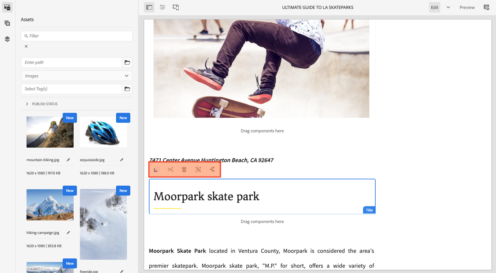

# Estructura de la IU de AEM {#structure-of-the-aem-ui}

AEM La interfaz de usuario de tiene varios principios subyacentes y consta de varios elementos clave:

## Consolas {#consoles}

### Diseño básico y cambio de tamaño {#basic-layout-and-resizing}

AEM La interfaz de usuario se adapta tanto a los dispositivos móviles como de escritorio, aunque en lugar de crear dos estilos, utiliza un estilo que funciona para todas las pantallas y dispositivos.

AEM Todos los módulos utilizan el mismo diseño básico, en el que, en la práctica, esto puede considerarse como lo siguiente:

El diseño se adhiere a un estilo de diseño interactivo y se adaptará al tamaño del dispositivo o la ventana que utilice.

Por ejemplo, cuando la resolución es inferior a 1024 px (como en un dispositivo móvil), la pantalla se ajusta en consecuencia:

### Barra de encabezado {#header-bar}

La barra de encabezado muestra elementos globales como:

* AEM El logotipo y el producto/solución específico que está utilizando; para ello, también se crea un vínculo a la navegación global. Para obtener más información, haga lo siguiente:
* Búsqueda
* Icono para acceder a los recursos de ayuda
* Icono para acceder a otras soluciones
* Un indicador de (y acceso a) cualquier alerta o elemento de la Bandeja de entrada que le esté esperando
* El icono de usuario, junto con un vínculo a la administración de perfiles

### Barra de herramientas {#toolbar}

La barra de herramientas es contextual para su ubicación y muestra las herramientas relevantes para controlar la vista o los recursos en la página siguiente. La barra de herramientas es específica del producto, pero los elementos tienen algunas características comunes.

En cualquier ubicación, la barra de herramientas muestra las acciones disponibles actualmente:

También depende de si hay un recurso seleccionado actualmente:

### Carril izquierdo {#left-rail}

El carril izquierdo se puede abrir u ocultar según sea necesario para mostrar:

* **Solo contenido**
* **Árbol de contenido**
* **Escala de cronología**
* **Referencias**
* **Filter**

El valor predeterminado es **Solo contenido** (carril oculto).

## Creación de páginas {#page-authoring}

Al crear páginas, las áreas estructurales son las siguientes.

### Marco de contenido {#content-frame}

El contenido de la página se representa en el marco de contenido. El marco de contenido es completamente independiente del editor para garantizar que no haya conflictos debidos a CSS o javascript.

El marco de contenido se encuentra en la sección derecha de la ventana, debajo de la barra de herramientas.

### Marco del editor {#editor-frame}

El marco del editor habilita las características de edición.

El marco del editor es un contenedor (abstracto) para todos los elementos de creación de páginas. Se encuentra sobre el marco de contenido e incluye:

* La barra de herramientas superior
* El panel lateral
* Todas las superposiciones
* Cualquier otro elemento de creación de página; por ejemplo, la barra de herramientas de componentes

### Panel lateral {#side-panel}

Contiene tres pestañas predeterminadas. El **Assets** y **Componentes** las pestañas permiten seleccionar estos elementos, arrastrarlos desde el panel y colocarlos en la página. El **Árbol de contenido** permite inspeccionar la jerarquía del contenido de la página.

El panel lateral está oculto de forma predeterminada. Cuando se selecciona, se muestra en el lado izquierdo o se desliza para cubrir toda la ventana cuando el tamaño de la ventana es inferior a una anchura de 1024 píxeles; como, por ejemplo, en un dispositivo móvil.

### Panel lateral: Recursos {#side-panel-assets}

En la pestaña Recursos puede seleccionar entre el rango de recursos. También puede filtrar por un término específico o seleccionar un grupo.

### Panel lateral: Grupos de recursos {#side-panel-asset-groups}

En la pestaña Recursos hay una lista desplegable que puede utilizar para seleccionar los grupos de recursos específicos.

### Panel lateral: Componentes {#side-panel-components}

En la pestaña Componentes, puede seleccionar entre el rango de componentes. También puede filtrar por un término específico o seleccionar un grupo.

### Panel lateral: árbol de contenido {#side-panel-content-tree}

En la pestaña Árbol de contenido puede ver la jerarquía del contenido de la página. Al hacer clic en una entrada en la pestaña, se salta a y se selecciona el elemento de la página dentro del editor.

### Superposiciones {#overlays}

Se superponen al marco de contenido y los utiliza el [capas](#layer) para comprender la mecánica de cómo puede interactuar (de forma completamente transparente) con los componentes y su contenido.

Las superposiciones se encuentran en el marco del editor (con todos los demás elementos de creación de páginas), aunque en realidad se superponen a los componentes adecuados en el marco de contenido.

### Capa {#layer}

Una capa es un paquete independiente de funciones que se puede activar para:

* Proporcionar una vista diferente de la página
* Le permite manipular o interactuar con una página

Las capas proporcionan una funcionalidad sofisticada para toda la página, en lugar de acciones específicas en un componente individual.

AEM La función incluye varias capas ya implementadas para la creación de páginas; por ejemplo, las capas de edición, previsualización y anotación.

>[!NOTE]
>
>Las capas son un concepto potente que afecta a la vista del usuario y a la interacción con el contenido de la página. Al desarrollar sus propias capas, debe asegurarse de que la capa se limpia cuando se sale de ella.

### Conmutador de capas {#layer-switcher}

El selector de capas le permite elegir la capa que desea utilizar. Cuando se cierra, indica la capa que se está utilizando en ese momento.

El selector de capas está disponible como una lista desplegable en la barra de herramientas (en la parte superior de la ventana, dentro del marco del editor).

### Barra de herramientas del componente {#component-toolbar}

Cada instancia de un componente mostrará su barra de herramientas cuando se haga clic (una vez o con un doble clic lento). La barra de herramientas contiene las acciones específicas (por ejemplo, copiar, pegar, abrir editor) disponibles para la instancia de componente en la página.

Según el espacio disponible, las barras de herramientas de los componentes se colocan en la esquina superior o inferior derecha del componente correspondiente.

## Información adicional {#further-information}

<!--For more details about the concepts around the touch-enabled UI, continue to the article [Concepts of the AEM Touch-Enabled UI](/help/sites-developing/touch-ui-concepts.md).-->

Para obtener más información técnica, consulte la [Conjunto de documentación JS](https://helpx.adobe.com/experience-manager/6-5/sites/developing/using/reference-materials/jsdoc/ui-touch/editor-core/index.html) para el editor de páginas.
