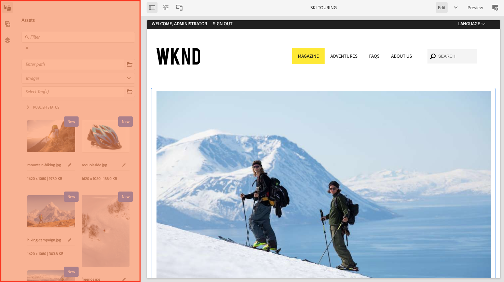

# Estructura de la IU de AEM {#structure-of-the-aem-ui}

La interfaz de usuario de AEM tiene varios principios subyacentes y consta de varios elementos clave:

## Consolas {#consoles}

### Diseño básico y cambio de tamaño {#basic-layout-and-resizing}

La interfaz de usuario se adapta tanto a los dispositivos móviles como de escritorio, aunque, en lugar de crear dos estilos, AEM utiliza un estilo que funciona para todas las pantallas y dispositivos.

Todos los módulos utilizan el mismo diseño básico:

El diseño se adhiere a un estilo de diseño interactivo y se adapta al tamaño del dispositivo, la ventana o ambos que esté utilizando.

Por ejemplo, cuando la resolución es inferior a 1024 píxeles (como en un dispositivo móvil), la pantalla se ajusta en consecuencia:

### Barra de encabezado {#header-bar}

La barra de encabezado muestra elementos globales como:

* El logotipo y el producto/solución específico que está utilizando actualmente. Para AEM, este elemento también forma un vínculo a la navegación global
* Búsqueda
* Icono para acceder a los recursos de ayuda
* Icono para acceder a otras soluciones
* Un indicador de y acceso a cualquier alerta o elemento de la Bandeja de entrada que le esté esperando
* El icono de usuario, junto con un vínculo a la administración de perfiles

### Barra de herramientas {#toolbar}

La barra de herramientas es contextual para su ubicación y muestra las herramientas relevantes para controlar la vista o los recursos en la página siguiente. La barra de herramientas es específica del producto, pero los elementos tienen algunas características comunes.

En cualquier ubicación, la barra de herramientas muestra las acciones disponibles actualmente:

También depende de si se selecciona un recurso:

### Carril izquierdo {#left-rail}

El carril izquierdo se puede abrir u ocultar según sea necesario para mostrar:

* **Solo contenido**
* **Árbol de contenido**
* **Cronología**
* **Referencias**
* **Filtro**

El valor predeterminado es **Solo contenido** (carril oculto).

## Creación de páginas {#page-authoring}

Al crear páginas, las áreas estructurales son las siguientes.

### Marco de contenido {#content-frame}

El contenido de la página se representa en el marco de contenido. El marco de contenido es independiente del editor para garantizar que no haya conflictos debido a CSS o JavaScript.

El marco de contenido se encuentra en la sección derecha de la ventana, debajo de la barra de herramientas.

### Marco del editor {#editor-frame}

El marco del editor habilita las características de edición.

El marco del editor es un contenedor (abstracto) para todos los elementos de creación de páginas. Se encuentra sobre el marco de contenido e incluye:

* La barra de herramientas superior
* El panel lateral
* Todas las superposiciones
* Cualquier otro elemento de creación de página; por ejemplo, la barra de herramientas de componentes

### Panel lateral {#side-panel}

Contiene tres pestañas predeterminadas. Las pestañas **Assets** y **Components** le permiten seleccionar estos elementos, arrastrarlos del panel y colocarlos en la página. La pestaña **Árbol de contenido** le permite inspeccionar la jerarquía de contenido de la página.

El panel lateral está oculto de forma predeterminada. Cuando se selecciona, se muestra en el lado izquierdo o, cuando el ancho de la ventana es inferior a 1024 píxeles, se desliza para cubrir toda la ventana, como en un dispositivo móvil, por ejemplo.

### Panel lateral: Assets {#side-panel-assets}

En la pestaña Assets, puede seleccionar entre el rango de recursos. Además, puede filtrar por un término específico o seleccionar un grupo.

### Panel lateral: Grupos de recursos {#side-panel-asset-groups}

En la pestaña Assets, hay una lista desplegable que puede utilizar para seleccionar los grupos de recursos específicos.

### Panel lateral: Componentes {#side-panel-components}

En la pestaña Componentes, puede seleccionar entre el rango de componentes. Además, puede filtrar por un término específico o seleccionar un grupo.

### Panel lateral: árbol de contenido {#side-panel-content-tree}

En la pestaña Árbol de contenido, puede ver la jerarquía del contenido en la página. Al hacer clic en una entrada en la pestaña, se salta a y se selecciona el elemento de la página dentro del editor.

### Superposiciones {#overlays}

Superpone el marco de contenido y lo utilizan las [capas](#layer) para comprender la mecánica de cómo puede interactuar de forma transparente con los componentes y su contenido.

Las superposiciones se encuentran en el marco del editor (con todos los demás elementos de creación de páginas), aunque en realidad se superponen a los componentes adecuados en el marco de contenido.

### Capa {#layer}

Una capa es un paquete independiente de funciones que se puede activar para:

* Proporcionar una vista diferente de la página
* Le permite manipular o interactuar con una página

Las capas proporcionan una funcionalidad sofisticada para toda la página, en lugar de acciones específicas en un componente individual.

AEM incluye varias capas ya implementadas para la creación de páginas; por ejemplo, las capas de edición, previsualización y anotación.

>[!NOTE]
>
>Las capas son un concepto potente que afecta a la vista del usuario y a la interacción con el contenido de la página. Cuando desarrolle sus propias capas, asegúrese de que la capa se limpia al salir.

### Conmutador de capas {#layer-switcher}

El selector de capas le permite elegir la capa que desea utilizar. Cuando se cierra, indica la capa que se está utilizando en ese momento.

El selector de capas está disponible como una lista desplegable en la barra de herramientas (en la parte superior de la ventana, dentro del marco del editor).

### Barra de herramientas del componente {#component-toolbar}

Cada instancia de un componente muestra su barra de herramientas cuando se hace clic (una vez o con un doble clic lento). La barra de herramientas contiene las acciones específicas (por ejemplo, copiar, pegar, abrir editor) disponibles para la instancia de componente en la página.

Según el espacio disponible, las barras de herramientas de los componentes se colocan en la esquina superior o inferior derecha del componente correspondiente.

## Información adicional {#further-information}

<!--For more details about the concepts around the touch-enabled UI, continue to the article [Concepts of the AEM Touch-Enabled UI](/help/sites-developing/touch-ui-concepts.md).-->

Para obtener más información técnica, consulte [Conjunto de documentación de JS](https://developer.adobe.com/experience-manager/reference-materials/6-5/jsdoc/ui-touch/editor-core/index.html) para el editor de páginas.

### Unified Shell {#unified-shell}

Consulte [AEM as a Cloud Service en Unified Shell](/help/overview/aem-cloud-service-on-unified-shell.md) si utiliza Unified Shell como interfaz de usuario de AEM.

Si necesita realizar o ya ha realizado personalizaciones, la opción Unificada se puede desactivar:

* [desde la interfaz de usuario](/help/overview/aem-cloud-service-on-unified-shell.md#disabling-unified-shell)

* desde el código del proyecto, por:

   * el `/conf/global/setting/unifiedshell`

      * estableciendo la propiedad `Boolean` `enable` en `false`
