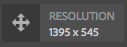

# Tipos de módulos de IU de ContextHub de muestra {#sample-contexthub-ui-module-types}

ContextHub proporciona varios módulos de IU de ejemplo que puede utilizar en sus soluciones. Se proporciona la siguiente información:

* Las principales características del módulo IU de.
* Dónde encontrar el código fuente para poder abrirlo con fines de aprendizaje.
* Cómo configurar el módulo de IU.

Para obtener información sobre cómo añadir módulos de IU a ContextHub, consulte [Adición de un módulo de IU](configuring-contexthub.md#adding-a-ui-module). Para obtener información sobre el desarrollo de módulos de IU, consulte [Creación de tipos de módulos de IU de ContextHub](extending-contexthub.md#creating-contexthub-ui-module-types).

## Tipo de módulo de IU de contexthub.base {#contexthub-base-ui-module-type}

El tipo de módulo de IU de contexthub.base es el tipo base para todos los demás tipos de módulos de IU. De este modo, proporciona funciones genéricas para procesar los datos del almacén.

Estas son las funciones disponibles:

* **Título e icono:** Especifique un título para el módulo de interfaz de usuario y un icono. Se puede hacer referencia al icono mediante una dirección URL o desde la biblioteca de iconos de la IU de Coral.
* **Almacenar datos:** Identifique uno o más almacenes de los que desee recuperar datos.
* **Contenido:** Especifique el contenido que aparece en el módulo de la interfaz de usuario como aparece en la barra de herramientas de ContextHub.
* **Contenido emergente:** Especifique el contenido que aparece en una ventana emergente cuando se hace clic o se pulsa el módulo de la interfaz de usuario.
* **Modo de pantalla completa:** Controlar si se permite el modo de pantalla completa.

El código fuente se encuentra en `/libs/granite/contexthub/code/ui/container/js/ContextHub.UI.BaseModuleRenderer.js`.

### Configuración {#configuration}

Configure el módulo de la interfaz de usuario contexthub.base mediante un objeto Javascript en formato JSON. Incluya cualquiera de las siguientes propiedades para configurar las funciones del módulo de interfaz de usuario:

* **imagen:** Dirección URL de una imagen que se mostrará como icono.
* **icono:** El nombre de un [Icono de Coral UI](https://helpx.adobe.com/experience-manager/6-4/sites/developing/using/reference-materials/coral-ui/coralui3/Coral.Icon.html) clase. Si especifica un valor para las propiedades icon e image, se utiliza la imagen.
* **título:** Título del módulo de IU de. El título aparece cuando el puntero se detiene sobre el icono del módulo de interfaz de usuario.
* **pantalla completa:** Un valor booleano que indica si el módulo de interfaz de usuario admite el modo de pantalla completa. Uso `true` para admitir pantalla completa y `false` para evitar el modo de pantalla completa.
* **plantilla:** A [Manillar](https://handlebarsjs.com/) plantilla que especifica el contenido que se procesará en la barra de herramientas de ContextHub. Usar como máximo dos `<p>` etiquetas.
* **storeMapping:** Una asignación de clave/almacén. Utilice la clave de las plantillas de Handlebar para acceder a los datos de tienda de ContextHub asociados.
* **lista:** Matriz de elementos que se muestran como una lista en una ventana emergente cuando se hace clic en el módulo de interfaz de usuario. Si incluye este elemento, no incluya popTemplate. El valor es una matriz de objetos con las siguientes claves:
   * Título: el texto que se mostrará para este elemento
   * image: (opcional) dirección URL de una imagen que se debe mostrar a la izquierda
   * icon: (opcional) una clase de icono de CUI que se debe mostrar a la izquierda; se ignora si se especifica una imagen
   * selected: (Opcional) un valor booleano que especifica si este elemento se debe mostrar como seleccionado (true=selected). De forma predeterminada, los elementos seleccionados aparecen en negrita. Utilice un `listType` para configurar otras apariencias (consulte a continuación).
* **listType:** Estilo que se va a utilizar para los elementos de la lista emergente. Utilice uno de los siguientes valores:
   * marca de verificación
   * casilla de verificación
   * radio
* **popTemplate:** Una plantilla Handlebars que especifica el contenido que se procesará en la ventana emergente cuando se haga clic en el módulo UI. Si incluye este elemento, no incluya la variable `list` elemento.

### Ejemplo {#example}

El siguiente ejemplo configura una c`ontexthub.base` Módulo de interfaz de usuario para mostrar información de un [contexthub.emulators](sample-stores.md#granite-emulators-sample-store-candidate) tienda. El `template` Este elemento muestra cómo obtener datos del almacén utilizando la clave que el `storeMapping` el artículo establece.

```javascript
{
   "icon": "coral-Icon--move",
    "title": "Screen Resolution",
    "storeMapping": {
      "emulator": "emulators"
    },
    "template": "<p>{{{ i18n \"Resolution\"}}}</p><p>{{{emulator.currentDevice.width}}} x {{{emulator.currentDevice.height}}}</p>"
}
```



## Tipo de módulo de IU de contexthub.browserinfo {#contexthub-browserinfo-ui-module-type}

El `contexthub.browserinfo` El módulo de IU muestra información sobre el explorador web y el sistema operativo del cliente. La información se obtiene del almacén surferinfo, en función de la variable [contexthub.surferinfo](sample-stores.md#contexthub-surferinfo-sample-store-candidate) candidato de tienda.


El código fuente del módulo de IU se encuentra en `/libs/granite/contexthub/components/modules/browserinfo`. Aunque `contexthub.browserinfo` amplía el `contexthub.base` El módulo de IU no anula ni proporciona funciones adicionales. La implementación proporciona una configuración predeterminada para procesar la información del explorador.

### Configuración {#configuration-1}

Las instancias del módulo de IU contexthub.browserinfo no requieren un valor para la Configuración detallada. El siguiente texto JSON representa la configuración predeterminada del módulo.

```javascript
{
   "icon":"coral-Icon--globe",
   "title":"Browser/OS Information",
   "storeMapping":{"surferinfo":"surferinfo"},
   "template":"<p>{{surferinfo.browser.family}} {{surferinfo.browser.version}}</p><p>{{surferinfo.os.name}} {{surferinfo.os.version}}</p>"
}
```

## Tipo de módulo de IU de contexthub.datetime {#contexthub-datetime-ui-module-type}

El `contexthub.datetime` El módulo de IU muestra la fecha y la hora que se almacenan en un almacén denominado datetime que se basa en la variable `contexthub.datetime` candidato de tienda.


El módulo proporciona un formulario emergente que le permite cambiar la fecha y la hora en el almacén.

El origen del `contexthub.datetime` El módulo de interfaz de usuario se encuentra en `/libs/granite/contexthub/components/modules/datetime`.

### Configuración {#configuration-2}

Las instancias del módulo de IU contexthub.datetime no requieren un valor para la Configuración detallada. El siguiente texto JSON representa la configuración predeterminada del módulo.

```javascript
{
   "icon":"coral-Icon--clock",
   "title":"DATE&TIME",
   "clickable":true,
   "storeMapping":{"d":"datetime"},
   "template":"<p class=\"contexthub-module-line1\">{{i18n \"Date&Time\"}}</p><p class=\"contexthub-module-line2\">{{d.formatted.locale.date}} {{d.formatted.locale.time}}</p>",
   "popoverTemplate":"<div class=\"datetime center\"><div class=\"coral-DatePicker-calendar\" data-init=\"datepicker\"><input class=\"coral-Textfield\" type=\"datetime\" value=\"{{d.formatted.iso}}\"><button class=\"coral-Button coral-Button--secondary coral-Button--square\" title=\"{{i18n \"Datetime picker\"}}\"><i class=\"coral-Icon coral-Icon--calendar coral-Icon--sizeS\"></i></button></div></div>"
}
```

## Tipo de módulo de IU de contexthub.location {#contexthub-location-ui-module-type}

El `contexthub.location` El módulo de IU muestra la longitud y latitud del cliente. El módulo proporciona una ventana emergente que muestra un mapa de Google en el que puede hacer clic para cambiar la ubicación actual. El módulo obtiene información de un almacén de ContextHub denominado geolocation que se basa en la variable [contexthub.geolocation](sample-stores.md#contexthub-geolocation-sample-store-candidate) candidato de tienda.


El origen del módulo de IU se encuentra en `/etc/cloudsettings/default/contexthub/geolocation`.

### Configuración {#configuration-4}

Las instancias del módulo de IU contexthub.location no requieren un valor para la Configuración detallada. El siguiente texto JSON representa la configuración predeterminada del módulo.

```javascript
{
 "icon":"coral-Icon--compass",
 "title":"Location",
 "clickable":true,
 "editable":{"key":"/geolocation","disabled":[],"hidden":["/geolocation/generatedThumbnail","/geolocation/city","/geolocation/country"]},
 "fullscreen":true,
 "storeMapping":{"g":"geolocation"},
 "template":"<p>{{i18n \"Location\"}}</p><p>{{g.address.postalCode}} {{g.address.city}}{{#if g.address.city}}{{#if g.address.region}},{{/if}}{{/if}} {{g.address.region}}</p>",
 "list":[
  {"title":"Basel, Switzerland",
  "data":{"longitude":7.58929,"latitude":47.554746,"city":"Basel","country":"Switzerland"}},
  {"title":"Melbourne, Australia",
  "data":{"longitude":144.96328,"latitude":-37.814107,"city":"Melbourne","country":"Australia"}},
  {"title":"Beijing, China",
  "data":{"longitude":116.407526,"latitude":39.90403,"city":"Beijing","country":"China"}},
  {"title":"New York, NY, USA",
  "data":{"longitude":-74.005973,"latitude":40.714353,"city":"New York","country":"United States"}},
  {"title":"Paris, France",
  "data":{"longitude":2.352222,"latitude":48.856614,"city":"Paris","country":"France"}},
  {"title":"Rio de Janeiro, Brazil",
  "data":{"longitude":-43.20071,"latitude":-22.913395,"city":"Rio","country":"Brazil"}},
  {"title":"San Jose, CA, USA",
  "data":{"longitude":-121.894955,"latitude":37.339386,"city":"San Jose","country":"United States"}},
  {"title":"Tokyo, Japan",
  "data":{"longitude":139.691706,"latitude":35.689487,"city":"Shinjuku","country":"Japan"}}
 ],
 "listType":"checkmark"
}
```

## Tipo de módulo de interfaz de usuario contexthub.screen-orientation {#contexthub-screen-orientation-ui-module-type}

El `contexthub.screen-orientation` El módulo de IU muestra la orientación de pantalla actual del cliente. Aunque está desactivado de forma predeterminada, el módulo proporciona una ventana emergente que permite seleccionar una orientación. El módulo obtiene información de un almacén de ContextHub denominado emuladores que se basa en la variable [granite.emulators](sample-stores.md#granite-emulators-sample-store-candidate) candidato de tienda.


El origen del módulo de IU se encuentra en `/libs/granite/contexthub/components/modules/screen-orientation`.

### Configuración {#configuration-5}

Instancias del `contexthub.screen-orientation` El módulo de interfaz de usuario no requiere un valor para la configuración detallada. El siguiente texto JSON representa la configuración predeterminada del módulo. Tenga en cuenta que la variable `clickable` la propiedad es `false` de forma predeterminada. Si anula la configuración predeterminada para establecer `clickable` hasta `true`, al hacer clic en el módulo, se muestra una ventana emergente en la que puede seleccionar la orientación.

```javascript
{
   "icon":"coral-Icon--rotateRight",
   "title":"Screen Orientation",
   "clickable":false,
   "storeMapping":{"emulator":"emulators"},
   "template":"<p>{{{ i18n \"Screen Orientation\" }}}</p><p>{{{ emulator.currentDevice.orientation }}}",
   "listReference":"/emulators/orientations",
   "listType":"checkmark"
}
```

## Tipo de módulo de IU de contexthub.tagcloud {#contexthub-tagcloud-ui-module-type}

El `contexthub.tagcloud` El módulo de IU muestra información sobre las etiquetas. En la barra de herramientas, el módulo de IU muestra el número de etiquetas. La ventana emergente muestra una nube de etiquetas y un cuadro de texto para añadir nuevas etiquetas. El módulo de IU obtiene información de un almacén de ContextHub denominado tagcloud que se basa en la variable `contexthub.tagcloud` candidato de tienda.


El origen del módulo de IU se encuentra en `/libs/granite/contexthub/components/modules/tagcloud`.

### Configuración {#configuration-6}

Instancias del `contexthub.tagcloud` El módulo de interfaz de usuario no requiere un valor para la configuración detallada. El siguiente texto JSON representa la configuración predeterminada del módulo.

```javascript
{
   "icon":"coral-Icon--tag",
   "title":"TagCloud",
   "clickable":true,
   "storeMapping":{"t":"tagcloud"},
   "maxTags":20,
   "template":"<p class=\"contexthub-module-line1\">{{i18n \"TagCloud\"}}</p><p class=\"contexthub-module-line2\">{{stats.total}} {{i18n \"Tags\"}}</p>",
   "popoverTemplate":"<div class=\"contexthub-popover-content center\"><p class=\"stats\">{{stats.total}} {{i18n \"Tags\"}} | {{stats.hits}} {{i18n \"Hits\"}} | {{i18n \"Last tag\"}}: {{#if stats.recent}}{{stats.recent}}{{else}}{{i18n \"Unknown\"}}{{/if}}</p><p class=\"tagcloud\">{{#each tags}}<span class=\"tag{{this.weight}}\">{{this.name}}</span> {{/each}}</p><div class=\"coral-InputGroup\"><input type=\"text\" class=\"coral-InputGroup-input coral-Textfield tag-name\" placeholder=\"{{i18n \"Add a namespace:my/tag\"}}\" pattern=\"^[A-Za-z0-9_\\-]+(:[A-Za-z0-9_\\-\\/]+)?$\" title=\"{{i18n \"namespace:my/tag\"}}\"><span class=\"coral-InputGroup-button\"><button class=\"coral-Button coral-Button--secondary coral-Button--square contexthub-new-tag\" type=\"button\" title=\"{{i18n \"increment\"}}\"><i class=\"coral-Icon coral-Icon--sizeS coral-Icon--add\"></i></button></span></div></div>"
}
```

## Tipo de módulo de IU de granite.profile {#granite-profile-ui-module-type}

El `granite.profile` El módulo de IU de ContextHub muestra el nombre para mostrar del usuario actual. La ventana emergente muestra el nombre de inicio de sesión del usuario y le permite cambiar el valor del nombre para mostrar. El módulo de interfaz de usuario obtiene información de un almacén de ContextHub denominado perfil que se basa en la variable [granite.profile](sample-stores.md#granite-profile-sample-store-candidate) candidato de tienda.


El origen del módulo de IU se encuentra en `/libs/granite/contexthub/components/modules/profile`.

### Configuración {#configuration-7}

Instancias del `granite.profile` El módulo de interfaz de usuario no requiere un valor para la configuración detallada. El siguiente texto JSON representa la configuración predeterminada del módulo.

```javascript
{
   "icon":"coral-Icon--user",
   "title":"Profile",
   "clickable":true,
   "editable":{
      "key":"/profile",
      "disabled":["/profile/authorizableId"],
      "hidden":["/profile/avatar","/profile/path"]},
   "storeMapping":{"p":"profile"},
   "template":"<p class=\"contexthub-module-line1\">{{i18n \"Persona\"}}</p><p class=\"contexthub-module-line2\">{{p.displayName}}</p>",
   "listType":"checkmark"
}
```
